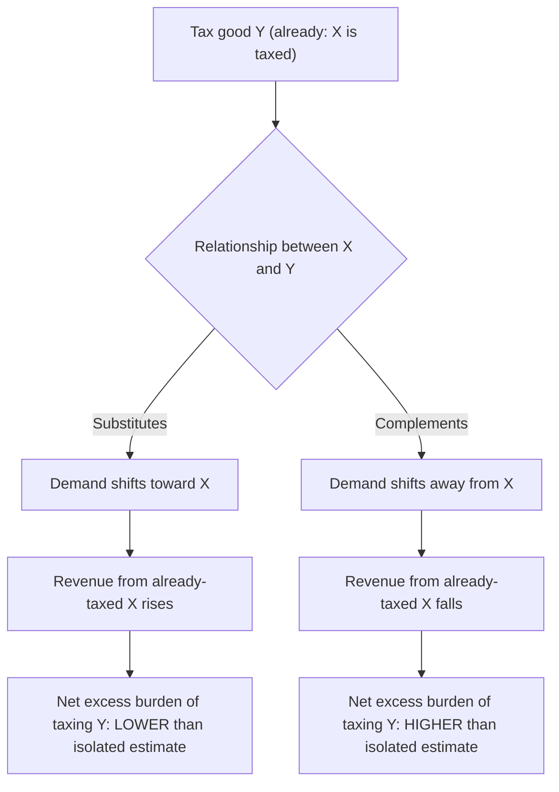

## Excess Burden with Pre-Existing Distortions

### Definition and Conceptual Overview

Excess burden with pre-existing distortions examines how the deadweight loss of a tax changes when it is imposed on a market, or an economy, that already contains another wedge between social and private marginal valuations — whether from an existing tax, a monopoly markup, an externality, a price control, or a binding regulation. This is the applied domain of the **theory of the second best**: once one distortion exists anywhere in the economy, correcting or adding distortions elsewhere no longer follows the simple first-best intuition that "more taxes always mean more deadweight loss" or "removing one distortion is always welfare-improving." The interaction between the new and existing wedge can either compound the total excess burden or partially offset it, depending on the relationship between the two markets.

### The Theory of the Second Best

**[Confirmed]** The theory of the second best (Lipsey and Lancaster, 1956) establishes that if one Pareto-efficiency condition cannot be satisfied in an economy (e.g., because a distortionary tax must exist somewhere to raise necessary revenue), it is not generally true that satisfying the remaining efficiency conditions elsewhere is second-best optimal. Applied to excess burden, this means:

- A tax imposed on a market that is **otherwise undistorted** generates excess burden calculable from the simple Harberger triangle formula.
- The **same tax rate**, imposed on a good that interacts with an **already-distorted** market (e.g., a substitute or complement that is also taxed, subsidized, or subject to a binding externality), can generate a **different** — larger or smaller — total excess burden than the isolated calculation would suggest.

This is why partial equilibrium excess burden formulas, while useful as a first approximation, can be systematically misleading in economies with multiple, interacting distortions.

### Formal Framework: Two-Good Case with an Existing Tax

**[Confirmed]** Consider two goods, $X$ and $Y$, where good $X$ already carries a tax $t_X$. The government now considers imposing or adjusting a tax $t_Y$ on good $Y$. The **total** marginal excess burden of adjusting $t_Y$ is no longer just the own-market Harberger term; it must include a cross-term capturing the effect on tax revenue and distortion in market $X$:

$$\frac{dEB}{dt_Y} \approx \underbrace{\varepsilon_{YY} \cdot p_Y q_Y \cdot t_Y}_{\text{own-market effect}} + \underbrace{t_X \cdot p_X \cdot \frac{\partial q_X}{\partial t_Y}}_{\text{cross-market revenue effect}}$$

where $\varepsilon_{YY}$ is the own-price compensated elasticity of $Y$, and $\partial q_X / \partial t_Y$ captures how a change in $Y$'s tax affects the quantity of $X$ consumed (governed by the cross-price elasticity between $X$ and $Y$).

**Interpretation of the cross-term**:

- If $X$ and $Y$ are **substitutes** ($\partial q_X/\partial t_Y > 0$: raising $t_Y$ shifts demand toward $X$), and $X$ is already taxed ($t_X > 0$), then raising $t_Y$ **increases** consumption of the already-taxed good $X$, which **raises** revenue from $X$ without additional distortion cost there — this **reduces** the net excess burden of raising $t_Y$ relative to the isolated calculation.
- If $X$ and $Y$ are **complements** ($\partial q_X/\partial t_Y < 0$: raising $t_Y$ reduces demand for $X$ too), then raising $t_Y$ **reduces** consumption of the already-taxed good $X$, **lowering** revenue there — this **increases** the net excess burden of raising $t_Y$ beyond the isolated calculation.

### Numerical Example: Substitute Goods

**Example**

Suppose good $X$ (say, restaurant meals) is already taxed at $t_X = 0.10$, with pre-tax expenditure $p_X q_X = \$50$ billion. The government considers taxing good $Y$ (say, home-delivered meal kits, a substitute) at $t_Y = 0.10$, with $p_Y q_Y = \$20$ billion, own-elasticity $\varepsilon_{YY} = 0.5$.

**Own-market (isolated) excess burden** from taxing $Y$:

$$EB_{own} \approx \frac{1}{2}(0.5)(20\text{B})(0.10)^2 = \$0.05\text{B}$$

Suppose the cross-price elasticity implies that taxing $Y$ at 10% shifts $2 billion in expenditure from $Y$ to the already-taxed good $X$. The additional tax revenue collected on this shifted expenditure (at $X$'s existing 10% rate) is:

$$\Delta R_X = t_X \times \$2\text{B} = 0.10 \times 2\text{B} = \$0.2\text{B}$$

Because this revenue is collected **without any additional distortion** in market $X$ (the tax rate on $X$ did not change — only the quantity increased, which is a *movement along* the demand curve into a segment already accounted for by the existing tax), this effectively **offsets** part of the calculated own-market excess burden of taxing $Y$. The economy-wide net efficiency cost of taxing $Y$ is therefore **lower** than the $0.05B isolated estimate would suggest, because the second-best interaction with the pre-existing tax on the substitute good works in the government's favor.

**[Inference]** This example illustrates why, in some tax reform contexts, taxing a substitute for an already-taxed good can be more efficient (lower net excess burden) than the isolated Harberger calculation implies — a result that surprises analysts who apply single-market formulas mechanically.

### The Complementary Case: Compounding Distortions

**[Inference]** Conversely, suppose good $Z$ is a **complement** to already-taxed good $X$ (e.g., $X$ is gasoline and $Z$ is automobiles). Taxing $Z$ reduces demand for automobiles, which in turn reduces gasoline consumption, **shrinking** the tax base and revenue from the already-taxed good $X$. This compounding effect means the true, general-equilibrium excess burden of taxing complements to heavily-taxed goods **exceeds** the naive partial-equilibrium (single-market) estimate. This is a standard justification in the applied second-best literature for exercising caution when taxing goods that are strong complements to an already heavily-taxed base.

### Excess Burden and Existing Non-Tax Distortions

**Key Points**

- **Monopoly markets**: If a good is supplied under monopoly (price already above marginal cost due to market power rather than taxation), imposing a tax on that good interacts with the existing monopoly wedge. **[Inference]** Depending on the specific model (e.g., specific vs. ad valorem taxation under monopoly), a modest tax on a monopolized good can sometimes generate **less** additional distortion than the same tax on a competitive market, because the starting point already reflects a restricted quantity — though the *combined* distortion (monopoly + tax) remains larger in absolute terms than either alone.
- **Externalities**: If a good's consumption generates a negative externality (e.g., pollution), the "pre-existing distortion" is the gap between private and social marginal cost. A tax on this good does not simply add standard excess burden — up to the Pigouvian rate, the tax **corrects** the pre-existing distortion and can generate a **negative** net excess burden (an efficiency gain) rather than a loss, until the tax rate reaches the point where private marginal cost plus tax equals social marginal cost.
- **Price controls and quantity restrictions**: A pre-existing price ceiling or quota creates a wedge similar to a tax. Adding an explicit tax on top of a binding price control interacts with the already-constrained quantity, and standard elasticity-based excess burden formulas must be adjusted to reflect the fact that the market is not clearing at the unconstrained equilibrium.

### Second-Best Optimal Tax Structure

**[Confirmed]** The general Ramsey-style second-best optimal tax rule, extended to account for cross-market effects, requires setting each tax rate such that the **proportional reduction in compensated demand** for each good is equalized across all taxed goods, accounting for cross-elasticities — not simply the inverse-elasticity rule for isolated goods. This is sometimes expressed as the **Corlett-Hague rule**: goods that are complements to leisure (i.e., goods whose consumption tends to accompany non-work time) should be taxed relatively more heavily than goods that are substitutes for leisure, as a second-best correction for the fact that leisure itself cannot be directly taxed.

### Policy Implications

**Key Points**

- **Piecemeal tax reform is not always safe**: Because of second-best interactions, changing a single tax rate in isolation — even one that appears inefficient by the simple Harberger formula — can have ambiguous or even counterproductive welfare effects if it interacts adversely with other distortions in the economy. **[Inference]** This underlies "piecemeal policy reform" caution advised in the applied second-best literature: reforms should ideally be evaluated using economy-wide (general equilibrium) models rather than single-market partial equilibrium formulas whenever significant pre-existing distortions are present.
- **Coordinated reform**: Removing multiple distortions **simultaneously** (e.g., broad tax reform packages) can avoid the ambiguous welfare effects of piecemeal changes, since a comprehensive reform can be designed to move the entire system toward the second-best optimum rather than adjusting one margin while leaving interacting distortions untouched.
- **Corrective tax design**: When a market has both a standard revenue-raising motive and an externality-correction motive, the "pre-existing distortion" framework clarifies that the two roles should be evaluated separately even when implemented through a single tax instrument, since the socially optimal rate balances revenue-driven excess burden against externality-correction benefits.

### Common Pitfalls in Analysis

**Key Points**

- Applying **single-market Harberger formulas** to evaluate a tax change when strong substitutes or complements are already taxed, ignoring the cross-market revenue and distortion effects.
- Assuming that "removing a distortion" is always welfare-improving without checking whether other distortions elsewhere in the economy interact with it (the core second-best caution).
- Treating monopoly markups, externalities, and price controls as irrelevant to tax excess burden calculations, when in fact they function analogously to pre-existing taxes for the purposes of second-best analysis.
- Ignoring the **sign** of the cross-price relationship (substitute vs. complement) when predicting whether a second-best interaction will raise or lower net excess burden.

### Related Topics

- Theory of the Second Best
- Determinants of Excess Burden
- Marginal Excess Burden (MEB)
- Corlett-Hague Rule and Optimal Taxation with Leisure
- Pigouvian Taxation and Externality Correction
- Ramsey Rule and Optimal Commodity Taxation
- General Equilibrium Tax Interaction Effects
- Monopoly Pricing and Deadweight Loss