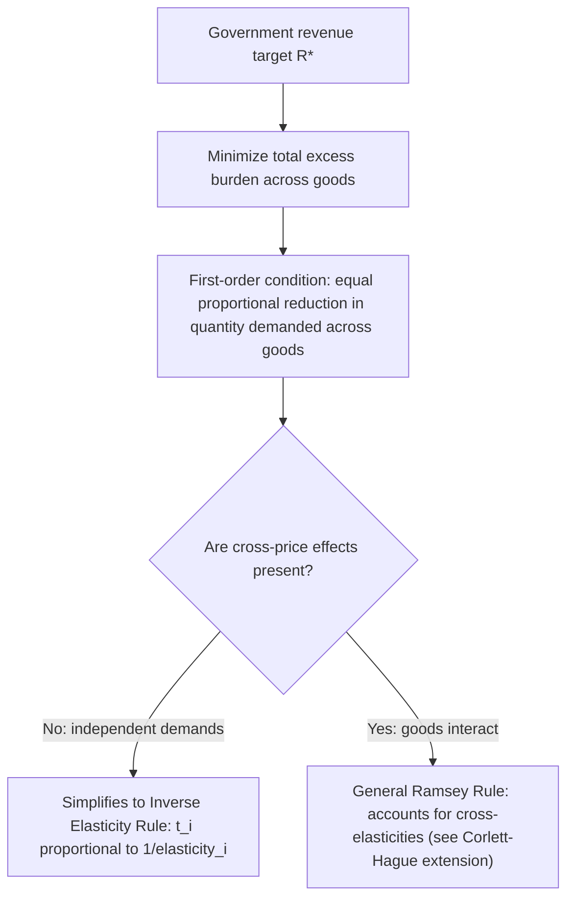

## Ramsey Rule for Optimal Commodity Taxes

### Definition and Conceptual Overview

The Ramsey Rule, originating from Frank Ramsey's 1927 paper "A Contribution to the Theory of Taxation," provides the foundational solution to the problem of raising a fixed amount of government revenue through commodity taxes while minimizing the aggregate excess burden (deadweight loss) imposed on the economy. It answers the central question of optimal commodity taxation: **given that lump-sum taxation is unavailable, how should tax rates be set across multiple goods to raise a required revenue target at the lowest possible efficiency cost?**

The rule's central insight is that efficient taxation does **not** mean taxing all goods at the same uniform rate. Instead, tax rates should be set in inverse relation to the elasticity of demand for each good, so that the *proportional reduction in quantity demanded* is equalized across all taxed goods.

### The Inverse Elasticity Rule (Single-Consumer, Independent Demands Case)

**[Confirmed]** In the simplified case where cross-price effects between taxed goods are ignored (independent demands), the Ramsey Rule reduces to the **inverse elasticity rule**:

$$\frac{t_i}{1 + t_i} = \frac{\lambda}{\eta_i}$$

or, in its more commonly cited approximate form:

$$t_i \propto \frac{1}{\eta_i}$$

where $t_i$ is the ad valorem tax rate on good $i$, $\eta_i$ is the (absolute value of the) price elasticity of demand for good $i$, and $\lambda$ is a constant of proportionality determined by the government's revenue requirement and the marginal social cost of public funds.

**Interpretation**: Goods with **low elasticity of demand** (necessities, goods with few substitutes) should be taxed at **higher rates**, while goods with **high elasticity of demand** (luxuries, goods with many substitutes) should be taxed at **lower rates** — the opposite of what many people's equity intuitions might initially suggest, since necessities are often disproportionately consumed by lower-income households.

### Formal Derivation

**[Confirmed]** The government's problem is to choose a vector of tax rates $(t_1, t_2, ..., t_n)$ on $n$ goods to minimize total excess burden subject to a revenue constraint:

$$\min_{t_1,...,t_n} \sum_i EB_i(t_i) \quad \text{subject to} \quad \sum_i t_i \cdot p_i \cdot q_i(t) = R^*$$

where $R^*$ is the required revenue target. Setting up the Lagrangian and taking first-order conditions with respect to each $t_i$ yields the general Ramsey condition:

$$\frac{\partial q_i / \partial t_i}{q_i} = \mu \quad \text{for all taxed goods } i$$

(a constant $\mu$ across all goods), which states that **the proportional reduction in compensated quantity demanded must be equal across all taxed goods** at the optimum. This is often called the **"equal proportional reduction" rule** and is the most general and robust statement of the Ramsey principle, holding even when cross-price effects between goods are present.

**[Confirmed]** In the special case of independent demands (no cross-price effects), this general condition simplifies algebraically to the inverse elasticity rule shown above, since the proportional reduction in quantity for good $i$ is approximately $\varepsilon_i \cdot t_i$, and setting this equal across goods directly implies $t_i \propto 1/\varepsilon_i$.

### Numerical Example

**Example**

Suppose the government must raise a fixed revenue target and is choosing tax rates on two goods:

- Good A (a necessity, e.g., a staple food): elasticity $\eta_A = 0.2$
- Good B (a luxury, e.g., restaurant dining): elasticity $\eta_B = 1.0$

Under the simplified inverse elasticity rule:

$$\frac{t_A}{t_B} = \frac{\eta_B}{\eta_A} = \frac{1.0}{0.2} = 5$$

This means the optimal tax rate on the necessity (Good A) should be **five times** the tax rate on the luxury (Good B) to minimize aggregate excess burden for a given revenue target. If $t_B = 4\%$, then $t_A = 20\%$.

**Efficiency logic check**: At these differentiated rates, the proportional reduction in quantity demanded for each good is approximately equal:

$$\%\Delta q_A \approx \eta_A \cdot t_A = 0.2 \times 0.20 = 0.04 \;(4\%)$$

$$\%\Delta q_B \approx \eta_B \cdot t_B = 1.0 \times 0.04 = 0.04 \;(4\%)$$

Both goods experience the same 4% proportional quantity reduction, confirming the equal-proportional-reduction condition is satisfied at these rates.

### Relationship to Marginal Excess Burden and MCPF

**[Confirmed]** The Ramsey Rule can be restated in terms of the marginal excess burden concept: **the optimal tax structure equalizes the Marginal Excess Burden (MEB) per dollar of revenue raised across all taxed goods.** If one good has a higher MEB per dollar than another at current rates, welfare can be improved by shifting the tax burden — raising the rate on the low-MEB good and lowering it on the high-MEB good — until MEB is equalized everywhere. At that point, no further reallocation of the tax burden across goods can reduce aggregate excess burden without violating the revenue constraint.

This equalization principle directly parallels the Marginal Cost of Public Funds (MCPF) framework: since $MCPF = 1 + MEB$, equalizing MEB across goods is equivalent to equalizing MCPF across goods, meaning that at the Ramsey optimum, raising revenue through any of the taxed goods carries the **same** marginal social cost.

### The Corlett-Hague Extension (Cross-Price Effects and Leisure)

**[Confirmed]** Corlett and Hague (1953) extended the Ramsey framework to a setting with three goods, where two are taxable market goods and the third is untaxable leisure. Because leisure cannot be directly taxed (labor income taxes are typically the closest available substitute, but pure leisure consumption itself escapes direct taxation), the second-best optimal structure requires taxing goods that are **complements to leisure** more heavily than goods that are **substitutes for leisure**, as an indirect way of taxing leisure consumption through its complementary goods.

**[Inference]** For example, goods consumed disproportionately during leisure time (recreational equipment, entertainment, vacation-related goods) would, under the Corlett-Hague logic, warrant relatively higher taxation than goods that substitute for leisure time (e.g., time-saving household services), holding elasticities otherwise constant — though this prescription is often in tension with the simple inverse elasticity rule and requires the more general equal-proportional-reduction formulation to reconcile.

### Equity Critique and the Efficiency-Equity Tradeoff

**Key Points**

- The Ramsey Rule is a **purely efficiency-based** framework — it says nothing about the **distributional** consequences of taxing necessities more heavily than luxuries.
- Because necessities often constitute a larger budget share for lower-income households, a strict application of the inverse elasticity rule can produce a **regressive** tax structure, taxing the poor proportionally more heavily than the rich.
- **[Inference]** This tension is the primary motivation for extending the basic Ramsey model to incorporate **social welfare weights** that value a dollar of revenue collected from (or a dollar of deadweight loss imposed on) different income groups differently — this extension is generally associated with the **Diamond-Mirrlees framework** and optimal taxation models that explicitly incorporate distributional concerns alongside efficiency.
- In practice, most real-world tax systems do **not** follow the strict inverse elasticity rule for this reason, instead favoring more uniform commodity tax rates (e.g., broad-based VATs) combined with separate redistributive instruments (progressive income taxation, targeted transfers) to address equity concerns without sacrificing commodity tax efficiency.

### Assumptions and Limitations

**Key Points**

- **Single consumer / representative agent**: The basic Ramsey model assumes a single consumer or identical consumers, abstracting from distributional issues entirely — a significant simplification relaxed in later optimal taxation literature.
- **Fixed revenue requirement**: The model takes the government's revenue target as exogenously fixed, not derived from an underlying optimal expenditure decision.
- **No administrative or compliance cost differences**: The basic model assumes all goods are equally easy to tax administratively; in practice, some goods (e.g., informally traded goods) may be more costly to tax regardless of their elasticity, a consideration absent from the pure Ramsey framework.
- **Competitive markets assumed**: The standard derivation assumes competitive supply; extensions are needed to handle monopoly or imperfectly competitive markets (interacting with the pre-existing distortions discussed in optimal taxation with market power).

### Policy Applications

**Key Points**

- **Differentiated VAT/sales tax rates**: Some countries apply reduced VAT rates to necessities (food, medicine) and standard or higher rates to luxuries — though this is typically justified on **equity** grounds rather than the Ramsey efficiency logic, which would prescribe the opposite pattern for inelastic necessities.
- **Excise taxation on inelastic goods**: Taxes on goods with genuinely inelastic demand due to addiction or necessity (e.g., certain excise taxes) are sometimes rationalized partly on Ramsey efficiency grounds, though corrective (Pigouvian) motives often dominate the policy rationale for such goods in practice.
- **Uniform commodity taxation as a practical compromise**: **[Inference]** Given the equity concerns raised by strict Ramsey pricing, many public finance economists advocate uniform commodity tax rates (e.g., a single-rate VAT) as a reasonable second-best compromise, reserving redistribution for the income tax and transfer system — this is sometimes referred to as the "uniform taxation" result under specific conditions (e.g., weakly separable preferences between goods and leisure).

### Common Pitfalls in Analysis

**Key Points**

- Confusing the **inverse elasticity rule** (a special case) with the **general Ramsey Rule** (equal proportional reduction in quantity), which holds even when the inverse elasticity rule does not (i.e., when cross-price effects are significant).
- Applying the Ramsey Rule as a **distributionally neutral** prescription without acknowledging its potentially regressive implications when applied literally to necessities versus luxuries.
- Ignoring the **Corlett-Hague** leisure-complementarity consideration when evaluating optimal rates in a labor-supply-relevant context.
- Treating the Ramsey framework as directly **applicable to income taxation** — the Ramsey Rule specifically addresses commodity (indirect) taxation; optimal income taxation is a related but distinct literature (associated with Mirrlees) with its own framework and results.

### Related Topics

- Marginal Excess Burden (MEB)
- Marginal Cost of Public Funds (MCPF)
- Corlett-Hague Rule and Taxation of Leisure Complements
- Diamond-Mirrlees Optimal Taxation Framework
- Uniform Commodity Taxation Theorem
- Optimal Income Taxation (Mirrlees Model)
- Excess Burden with Pre-Existing Distortions
- Equity-Efficiency Tradeoffs in Tax Design