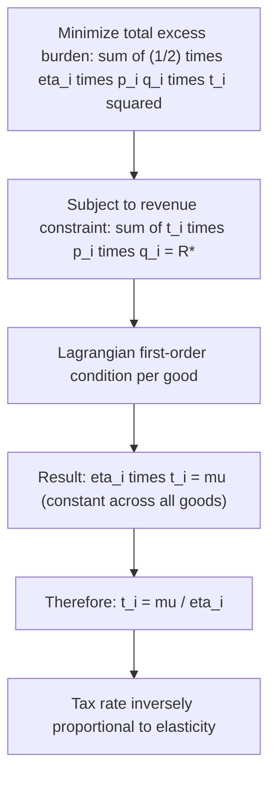

## Inverse Elasticity Rule

### Definition and Conceptual Overview

The Inverse Elasticity Rule (IER) is the simplified, special-case formulation of the Ramsey Rule for optimal commodity taxation that applies when the demands for different taxed goods are **independent** — that is, when cross-price elasticities between the taxed goods are zero or negligible. It states that, to minimize aggregate excess burden while raising a fixed amount of revenue, **the ad valorem tax rate on each good should be set inversely proportional to that good's price elasticity of demand.**

The rule is the most frequently cited and most intuitive expression of Ramsey-optimal taxation, and it is often what students and policymakers refer to when they invoke "the Ramsey Rule" in casual usage, even though it is technically a special case of the more general equal-proportional-reduction principle.

### Formal Statement

**[Confirmed]** For $n$ independently-demanded goods, each taxed at rate $t_i$, the optimal tax structure that minimizes total excess burden subject to a revenue constraint satisfies:

$$t_i = \frac{k}{\eta_i}$$

or equivalently, in ratio form for any two goods $i$ and $j$:

$$\frac{t_i}{t_j} = \frac{\eta_j}{\eta_i}$$

where $\eta_i$ is the absolute value of the compensated own-price elasticity of demand for good $i$, and $k$ is a constant of proportionality determined by the overall revenue requirement.

**[Confirmed]** A more precise version of the rule, derived directly from the first-order conditions of the Ramsey optimization problem, expresses the *effective* tax rate (accounting for the tax-inclusive price) as:

$$\frac{t_i}{1+t_i} = \frac{1}{\eta_i}\left(\frac{1}{\theta} - 1\right)$$

where $\theta$ is a parameter reflecting the marginal cost of public funds at the optimum. For small tax rates, this reduces to the simpler proportionality $t_i \propto 1/\eta_i$ used in most applied discussions.

### Derivation from the Excess Burden Minimization Problem

**[Confirmed]** Starting from the Harberger approximation for excess burden on good $i$:

$$EB_i \approx \frac{1}{2}\eta_i \cdot p_i q_i \cdot t_i^2$$

and the government's revenue from good $i$:

$$R_i = t_i \cdot p_i \cdot q_i$$

The government minimizes $\sum_i EB_i$ subject to $\sum_i R_i = R^*$. Setting up the Lagrangian:

$$\mathcal{L} = \sum_i \frac{1}{2}\eta_i p_i q_i t_i^2 - \mu\left(\sum_i t_i p_i q_i - R^*\right)$$

Taking the first-order condition with respect to $t_i$:

$$\eta_i p_i q_i t_i - \mu \cdot p_i q_i = 0$$

$$\Rightarrow \eta_i t_i = \mu \quad \text{for all } i$$

$$\Rightarrow t_i = \frac{\mu}{\eta_i}$$

**[Confirmed]** This confirms that the optimal tax rate on each good is inversely proportional to its own elasticity, with the *same* proportionality constant $\mu$ applying across all goods — this constant is effectively the shadow price of the government's revenue constraint (closely related to the Marginal Cost of Public Funds at the optimum).

### Numerical Example

**Example**

Suppose the government taxes three independent goods to raise revenue, with the following elasticities:

| Good | Elasticity $\eta_i$ | Relative tax rate ($k/\eta_i$, $k=1$) |
| --- | --- | --- |
| Bread (necessity) | 0.1 | 10.0 |
| Clothing | 0.5 | 2.0 |
| Restaurant meals (luxury) | 1.0 | 1.0 |

Normalizing the restaurant meal tax rate to $t = 5\%$ (since $\eta = 1.0$ gives the baseline ratio of 1.0), the inverse elasticity rule prescribes:

$$t_{bread} = 5\% \times \frac{1.0}{0.1} = 50\%$$

$$t_{clothing} = 5\% \times \frac{1.0}{0.5} = 10\%$$

$$t_{meals} = 5\%$$

**[Inference]** This stark result — a 50% tax on bread versus a 5% tax on restaurant meals — starkly illustrates why the pure efficiency-based inverse elasticity rule is rarely implemented literally in real-world tax systems: it directly conflicts with vertical equity objectives, since necessities like bread constitute a much larger share of low-income household budgets than restaurant dining.

### Verification: Equal Proportional Quantity Reduction

**[Confirmed]** The defining efficiency property of the inverse elasticity rule can be verified by checking that the proportional reduction in quantity demanded is equal across all three goods:

$$\%\Delta q_{bread} \approx \eta_{bread} \times t_{bread} = 0.1 \times 0.50 = 0.05$$

$$\%\Delta q_{clothing} \approx \eta_{clothing} \times t_{clothing} = 0.5 \times 0.10 = 0.05$$

$$\%\Delta q_{meals} \approx \eta_{meals} \times t_{meals} = 1.0 \times 0.05 = 0.05$$

All three goods experience an identical 5% proportional reduction in quantity demanded — this equalization is precisely what minimizes aggregate excess burden for the given revenue target, and is the underlying principle from which the inverse elasticity formula is derived.

### Relationship to the General Ramsey Rule

**Key Points**

- The inverse elasticity rule is a **special case** of the general Ramsey Rule (equal proportional reduction in compensated quantity demanded), valid only when **cross-price elasticities between taxed goods are zero** (independent demands).
- When goods have significant substitution or complementarity relationships, the general Ramsey formula must be used instead, which can produce tax rate rankings that differ from — and sometimes contradict — the simple inverse elasticity ranking (see the Corlett-Hague extension for the leisure-complementarity case).
- **[Inference]** In practice, most goods have some degree of cross-price interaction with others in the economy, meaning the pure inverse elasticity rule is best understood as a **pedagogical simplification and first-approximation heuristic** rather than a literal policy prescription for complex, interconnected consumption baskets.

### Why Inelastic Goods Bear Higher Optimal Rates: Intuition

**Key Points**

- **Deadweight loss depends on behavioral response, not tax burden per se.** A tax on a perfectly inelastic good ($\eta = 0$) generates **zero** excess burden — consumers cannot adjust quantity, so the tax functions as a pure, non-distortionary transfer analogous to a lump-sum tax on that specific good.
- **Elastic goods "leak" revenue through behavioral change.** A high tax on a highly elastic good causes consumers to substitute away sharply, meaning much of the potential tax base evaporates — generating large deadweight loss relative to the revenue actually collected.
- **The efficient strategy exploits this asymmetry**: by taxing inelastic goods more and elastic goods less, the government captures revenue where consumers "can't escape" the tax (minimal distortion) and avoids taxing heavily where consumers "would escape" (high potential distortion) if taxed at the same rate.

### Real-World Deviations and Practical Critiques

**Key Points**

- **Equity concerns dominate practical policy**: As shown in the numerical example, the literal inverse elasticity rule is regressive when applied to necessities, which is why most tax systems reject it in favor of more uniform rates on broad consumption, paired with progressive income taxation and targeted transfers for redistribution.
- **Administrative and compliance costs**: The IER ignores differences in the cost of administering and enforcing taxes across different goods; a good with low elasticity but very high administrative/compliance costs to tax (e.g., informally traded goods) may not be a good candidate for high rates in practice, regardless of its efficiency-optimal rate.
- **Political economy constraints**: Extremely high rates on necessities (as the IER can prescribe) are typically politically infeasible regardless of their theoretical efficiency properties.
- **Externality-driven exceptions**: Goods with negative externalities (e.g., tobacco, alcohol, carbon-intensive goods) are often taxed heavily **regardless of their elasticity**, since the Pigouvian corrective rationale operates independently of, and can dominate, the pure Ramsey efficiency logic.
- **[Unverified]** Some empirical public finance research has examined how closely real-world differentiated commodity tax rates (e.g., varying excise and VAT rates across goods) align with inverse-elasticity predictions; findings vary by country and time period, and the literature generally concludes that political and equity considerations explain observed rate structures better than pure Ramsey efficiency logic.

### Common Pitfalls in Analysis

**Key Points**

- Treating the inverse elasticity rule as **universally applicable**, ignoring that it requires the independent-demands assumption to hold.
- Confusing the **ranking implication** (tax inelastic goods more) with a **normative endorsement** — the rule is a positive efficiency result, not necessarily a recommendation once equity is considered.
- Applying **uncompensated (Marshallian)** elasticities rather than **compensated (Hicksian)** elasticities, which technically should be used in the excess-burden-minimization derivation.
- Ignoring **externality considerations** when using the IER to explain or justify why certain goods (like tobacco or alcohol) are taxed at high rates — such rates are typically driven primarily by corrective (Pigouvian) motives, not elasticity-based Ramsey efficiency alone.

### Related Topics

- Ramsey Rule for Optimal Commodity Taxes
- Marginal Excess Burden (MEB)
- Marginal Cost of Public Funds (MCPF)
- Corlett-Hague Rule and Taxation of Leisure Complements
- Uniform Commodity Taxation Theorem
- Pigouvian Taxation and Externality Correction
- Equity-Efficiency Tradeoffs in Tax Design
- Diamond-Mirrlees Optimal Taxation Framework