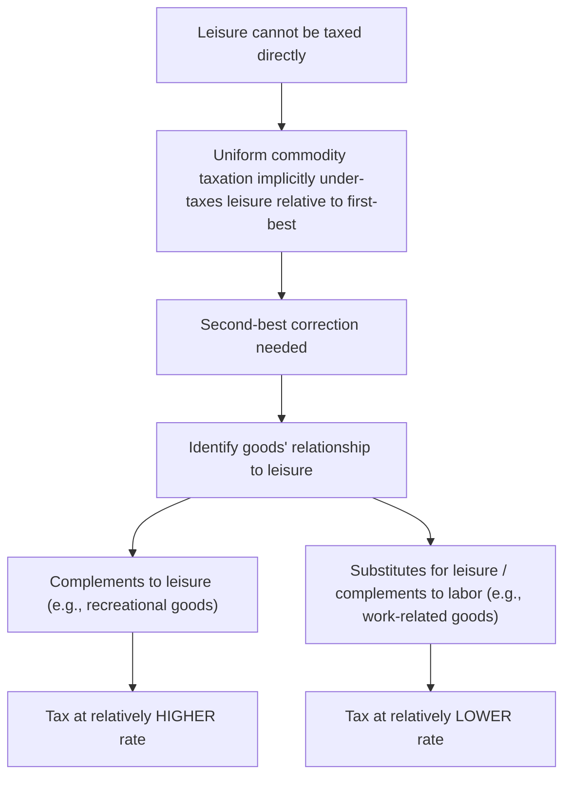

## Corlett-Hague Rule

### Definition and Conceptual Overview

The Corlett-Hague Rule, established by W.J. Corlett and D.C. Hague in their 1953 paper "Complementarity and the Excess Burden of Taxation," extends the Ramsey framework for optimal commodity taxation to explicitly account for the fact that **leisure cannot be directly taxed**. Since a comprehensive, non-distortionary lump-sum tax is unavailable and pure leisure consumption escapes the tax net, the rule shows that an efficient second-best tax structure should tax goods **according to their relationship with leisure**: goods that are complements to leisure should bear relatively higher taxes, and goods that are substitutes for leisure (or more precisely, complements to labor/work) should bear relatively lower taxes, as an indirect way of taxing the untaxable leisure margin.

This result is a landmark application of the theory of the second best to commodity taxation: because one "good" (leisure) is exogenously excluded from the tax base, the optimal rates on all *other* goods must be adjusted away from the simple inverse elasticity rule to compensate.

### The Three-Good Framework

**[Confirmed]** The Corlett-Hague model considers a simplified economy with three goods:

1. **Good X** — a market good
2. **Good Y** — a second market good
3. **Leisure (L)** — untaxable, since the government cannot directly observe or tax hours of leisure consumed (only labor income, through the income tax, can be taxed as an imperfect proxy)

The consumer allocates a fixed time endowment between labor (which finances consumption of $X$ and $Y$) and leisure. The government can tax $X$ and $Y$ but not $L$ directly.

### Formal Statement of the Rule

**[Confirmed]** The Corlett-Hague result states that, holding revenue and the government's ability to tax leisure fixed at zero, the optimal (second-best) tax structure sets:

$$\frac{t_X}{t_Y} \text{ depends on } \frac{\varepsilon_{XL}}{\varepsilon_{YL}}$$

where $\varepsilon_{XL}$ and $\varepsilon_{YL}$ are the cross-price (or cross-elasticity) relationships between each good and leisure. Specifically:

- If Good $X$ is a **stronger complement to leisure** than Good $Y$ (i.e., $X$ is consumed disproportionately during leisure time, so $\varepsilon_{XL} < 0$ and large in magnitude), then **$X$ should be taxed at a higher rate than $Y$.**
- If Good $Y$ is a **substitute for leisure** (more precisely, a complement to labor — a good whose consumption facilitates work, such as commuting-related goods or time-saving household services), then **$Y$ should be taxed at a lower rate**, since taxing it would further discourage labor supply on top of the existing income tax distortion.

**[Confirmed]** The intuitive logic: since leisure cannot be taxed directly, the government uses differential commodity taxation on goods that are correlated with leisure consumption as an **indirect instrument** to approximate taxing leisure itself, thereby reducing the total distortion to the labor-leisure choice relative to what a uniform commodity tax rate would produce.

### Derivation Sketch

**[Confirmed]** Starting from the general Ramsey condition (equal proportional reduction in compensated demand across all goods, including implicitly leisure), and imposing the constraint that leisure's "tax rate" is fixed at zero (since it cannot be taxed), the first-order conditions for goods $X$ and $Y$ must adjust to account for their cross-substitution effects with leisure. The Slutsky decomposition of demand responses shows that a uniform tax on all market goods is equivalent, from the consumer's perspective, to **effectively taxing leisure at a zero rate while taxing market goods** — creating an implicit subsidy to leisure relative to the first-best optimum (where leisure would also be taxed if that were feasible).

To offset this implicit "leisure is untaxed" distortion, the second-best optimal structure **shifts the tax burden toward goods that are complementary to leisure**, since taxing these goods raises the effective cost of leisure indirectly (you can't enjoy your beach vacation without buying the sunscreen and plane ticket, so taxing vacation-related goods makes leisure itself more expensive at the margin).

### Illustrative Example

**Example**

Consider two goods with identical own-price elasticities of demand ($\eta_X = \eta_Y = 0.5$), so the simple inverse elasticity rule alone would prescribe **identical** tax rates on both.

- **Good X**: recreational boating equipment — strongly complementary to leisure time (you use it primarily on vacations and days off)
- **Good Y**: professional business attire — complementary to labor/work time (you buy and wear it primarily for work)

Despite identical elasticities, the Corlett-Hague logic implies:

$$t_X > t_Y$$

because taxing recreational boating equipment indirectly raises the cost of leisure consumption (since boating is a leisure-time activity), partially compensating for the fact that leisure hours themselves cannot be taxed. Taxing business attire, by contrast, would raise the cost of *working*, compounding the existing labor income tax distortion on the labor-leisure margin rather than offsetting it.

**[Inference]** This example shows why the Corlett-Hague rule can generate tax rate prescriptions that **diverge from** the pure inverse elasticity rule when goods have differing degrees of leisure-complementarity, even holding elasticities constant — the two rules coincide only when cross-elasticities with leisure are proportional across goods (an assumption implicit in the simplified independent-demands case).

### Relationship to the General Ramsey Rule

**Key Points**

- The Corlett-Hague rule is not a contradiction of the Ramsey Rule but rather an **application of the general (equal-proportional-reduction) Ramsey Rule** to the specific three-good case where one good (leisure) is constrained to a zero tax rate.
- It demonstrates concretely why the **simple inverse elasticity rule** (which assumes independent demands with no cross-effects) can be misleading whenever a good's relationship with the **untaxable good (leisure)** is significant — which, given that virtually all consumption requires time, is arguably a pervasive feature of real economies rather than a special case.
- The rule is one of the earliest and most cited illustrations of how the **theory of the second best** modifies naive efficiency prescriptions once an "ideal" tax instrument (a direct tax on leisure, or equivalently a true lump-sum tax) is unavailable.

### Connection to Labor Income Taxation

**[Inference]** The Corlett-Hague rule provides an efficiency rationale for **differentiated consumption taxation as a complement to labor income taxation**: since income taxes distort the labor-leisure margin (by taxing the fruits of labor but not leisure itself), a well-designed *system* of commodity taxes can partially correct this distortion by taxing leisure-complementary goods more heavily, thereby indirectly taxing leisure and reducing the overall labor-leisure margin distortion caused by income taxation alone.

This has been invoked in debates over specific policy questions such as:

- Whether goods and services primarily consumed during leisure time (entertainment, travel, recreational equipment) merit different VAT/sales tax treatment than work-related goods and services.
- Whether tax-favored treatment of certain work-facilitating expenses (e.g., childcare, commuting costs, work attire) can be justified on Corlett-Hague grounds as reducing the labor-leisure distortion, independent of any equity rationale.

### Practical Limitations and Critiques

**Key Points**

- **Measurement difficulty**: Empirically identifying which goods are genuinely "complements to leisure" versus "complements to labor" is far from straightforward — many goods have mixed or ambiguous relationships to the labor-leisure margin (e.g., a smartphone is used both for work and leisure).
- **Administrative complexity**: Implementing finely differentiated tax rates based on estimated leisure-complementarity would impose substantial administrative and compliance costs, likely exceeding the efficiency gains from the theoretically optimal structure — a classic tension between second-best theoretical optimality and practical implementability.
- **Uniform taxation counter-result**: **[Confirmed]** Subsequent theoretical work (associated with the Atkinson-Stiglitz theorem and related results) shows that under certain conditions — notably, **weak separability** between consumption goods and leisure in preferences, combined with an optimally-designed nonlinear income tax — uniform commodity taxation can be optimal, effectively **neutralizing** the Corlett-Hague rationale for differentiated rates. This result significantly narrows the practical applicability of the Corlett-Hague prescription in modern optimal tax theory, since it implies the labor-leisure distortion is better corrected through income tax design than through differentiated commodity taxes, when that separability condition holds.
- **[Unverified]** The empirical relevance of the Corlett-Hague rule versus the Atkinson-Stiglitz uniform-taxation counter-result depends heavily on whether real-world preferences satisfy the required separability conditions, which is difficult to test conclusively and remains a subject of ongoing debate in the public finance literature.

### Policy Applications

**Key Points**

- **Historical rationale for luxury/leisure-good excise taxes**: Corlett-Hague logic has been cited (among other rationales) to justify higher tax rates on goods associated with leisure consumption, such as entertainment, alcohol, and recreational travel, independent of any Pigouvian externality argument.
- **Work-expense tax deductions**: The efficiency logic of taxing labor-complementary goods less heavily provides a theoretical (efficiency-based, non-equity) rationale for tax deductions or reduced rates on goods that facilitate labor force participation, such as childcare or commuting expenses.
- **Caveat given later theory**: Given the Atkinson-Stiglitz uniform-taxation result, most modern optimal tax theorists treat Corlett-Hague as a historically important and pedagogically valuable second-best result, but place greater practical weight on optimal nonlinear income taxation as the primary tool for correcting labor-leisure distortions, reserving commodity tax differentiation primarily for corrective (Pigouvian) rather than labor-supply-efficiency purposes.

### Common Pitfalls in Analysis

**Key Points**

- Treating the Corlett-Hague rule as **independent of** the Ramsey framework, rather than recognizing it as a specific application of the general equal-proportional-reduction Ramsey condition.
- Assuming the rule provides an **unambiguous, universally applicable** prescription, without accounting for the significant qualification introduced by the Atkinson-Stiglitz uniform-taxation result under separability.
- Confusing "leisure complement" with simple luxury goods — the relevant criterion is the good's relationship to **time use**, not its income elasticity or its position in a conventional necessity-luxury spectrum.
- Overstating the **practical/administrative feasibility** of implementing Corlett-Hague-differentiated rates given the difficulty of empirically classifying goods by their leisure-complementarity.

### Related Topics

- Ramsey Rule for Optimal Commodity Taxes
- Inverse Elasticity Rule
- Atkinson-Stiglitz Theorem and Uniform Commodity Taxation
- Optimal Income Taxation (Mirrlees Model)
- Theory of the Second Best
- Labor Supply and the Labor-Leisure Tradeoff
- Diamond-Mirrlees Optimal Taxation Framework
- Excess Burden with Pre-Existing Distortions