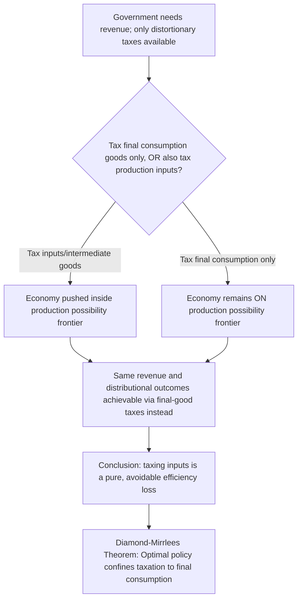

## Diamond-Mirrlees Production Efficiency Theorem

### Definition and Conceptual Overview

The Diamond-Mirrlees Production Efficiency Theorem, established by Peter Diamond and James Mirrlees in their 1971 two-part paper "Optimal Taxation and Public Production," is one of the most influential results in the theory of optimal taxation. It establishes that **even when the government must rely on distortionary commodity taxes to raise revenue** (because lump-sum taxation is unavailable), the economy's **production sector should still be organized efficiently** — meaning it should operate on its production possibility frontier, with all distortionary taxation confined to the consumer side of the economy (final consumption goods) rather than intermediate goods or factors of production.

This result is remarkable precisely because it runs counter to the intuition suggested by the theory of the second best: one might expect that once distortionary taxes are unavoidable somewhere, efficiency in production should also be sacrificed to some degree to optimally balance distortions across the whole economy. The Diamond-Mirrlees theorem shows this intuition is **wrong** under a specific but economically important set of conditions.

### Formal Statement

**[Confirmed]** Under the conditions that:

1. The government can impose taxes on all **final consumer goods** at potentially different rates (i.e., it has access to a sufficiently rich set of commodity tax instruments), and
2. There exists **constant returns to scale** in production (or, more generally, profits can be fully taxed away, e.g., through 100% profit taxation in the presence of pure profits), and
3. Production is carried out by competitive, profit-maximizing firms,

then the second-best optimal tax system involves **no distortion of production efficiency** — intermediate goods and inputs to production (including trade between firms, and importantly, international trade) should remain **untaxed**, and all taxes should fall exclusively on final consumption.

$$\text{Optimal policy: } t_{intermediate} = 0 \text{ for all inputs; taxation confined to final consumption goods}$$

### Intuition Behind the Result

**[Confirmed]** The core intuition is that **any tax on an intermediate good or production input necessarily pushes the economy inside its production possibility frontier**, creating a "pure" efficiency loss with **no offsetting benefit** — since the government could always achieve the exact same set of final consumption outcomes, and the exact same revenue, by instead taxing the final consumption goods directly at appropriately adjusted rates, while leaving production undistorted.

**Key mechanism**: because production efficiency and the distribution of the tax burden (via final goods taxes) are **separable** decisions when the conditions above hold, distorting production can never help achieve distributional or revenue objectives that could not be achieved equally well (or better) through final-goods taxation alone. Production distortions are therefore a **pure, avoidable waste** — they generate deadweight loss without buying the government any degree of freedom it did not already have through final consumption taxes.

### Formal Derivation Sketch

**[Confirmed]** Diamond and Mirrlees model an economy with competitive production and a government seeking to raise revenue $R^*$ while maximizing social welfare, subject to the economy remaining on its production frontier (technological feasibility). They show that the optimal tax problem can be decomposed into two separable sub-problems:

1. **Production decision**: Given any target vector of net outputs (what is produced and consumed in the economy), competitive firms facing **undistorted** producer prices will choose input combinations that are technologically efficient (on the frontier), since producer price ratios then correctly reflect true marginal rates of technical substitution.
2. **Consumption/taxation decision**: The government then only needs to choose the **wedge between producer and consumer prices** for **final goods** to achieve its revenue and distributional objectives (this is exactly the standard Ramsey commodity taxation problem, layered on top of an efficient production sector).

**[Confirmed]** Because these two sub-problems can be solved independently — the government does not need to distort input prices to achieve any consumption-side objective — the jointly optimal solution involves undistorted production. This separability is the technical heart of the proof.

### Practical Policy Implications

**Key Points**

- **Value-Added Tax (VAT) design**: The Diamond-Mirrlees theorem is a primary theoretical justification for the standard VAT design used in most countries, in which businesses receive **input tax credits** for VAT paid on intermediate purchases, so the tax effectively falls only on **final** consumer value-added, never cascading onto business-to-business transactions or accumulating through the production chain.
- **Avoidance of "cascading" turnover/sales taxes**: The theorem explains why economists generally view old-style **cascading turnover taxes** (which tax sales at every stage of production without input credits) as inefficient relative to a properly-credited VAT — cascading taxes directly violate production efficiency by taxing intermediate transactions.
- **International trade and tariffs**: The theorem provides a strong efficiency-based argument **against tariffs and taxes on intermediate imports/exports** used in domestic production, since these directly distort production efficiency; optimal tax design under Diamond-Mirrlees logic would instead tax only final consumption of imported (or domestically produced) goods, leaving trade in intermediate inputs undistorted.
- **Corporate/capital taxation on intermediate investment**: **[Inference]** The theorem has been invoked in debates over whether taxes on business inputs (e.g., certain capital taxes that fall on productive investment rather than final consumption of capital services) violate production efficiency and should be redesigned to fall on final consumption instead — though the practical application to complex capital taxation is more nuanced than the stylized model.

### Key Assumptions and Their Importance

**Key Points**

- **Constant returns to scale / no pure profits**: The theorem's cleanest form requires either constant returns to scale in production or the ability to fully tax away any pure profits arising from decreasing returns or market power. **[Inference]** If firms earn pure economic profits that **cannot** be fully taxed away (e.g., due to political or administrative constraints on profit taxation), the case for undistorted production efficiency weakens, since taxing certain inputs might become a second-best way of capturing otherwise untaxable profits.
- **Full generality of the final-goods tax instrument**: The result requires that the government can set **different tax rates on different final consumption goods** without restriction. If the government is constrained to a limited set of tax instruments (e.g., a single uniform tax rate, or an inability to tax certain final goods at all — such as informal-sector consumption), production efficiency may no longer be second-best optimal, since taxing certain inputs could become a substitute instrument for taxing final goods the government cannot directly reach.
- **Competitive markets in production**: The theorem assumes firms are price-taking and profit-maximizing; production efficiency results require modification in the presence of significant market power in intermediate goods markets.
- **No informational constraints beyond the standard commodity tax setting**: The theorem does not address informational asymmetries of the sort relevant to optimal income taxation (Mirrlees' separate 1971 contribution) — it specifically concerns the choice between taxing final versus intermediate goods, taking the government's ability to observe and tax transactions as given.

### Numerical Illustration of the Logic

**Example**

Consider an economy producing a final good using two inputs, capital and an intermediate manufactured component. Suppose the government needs revenue and is choosing between:

**Option A**: A 10% tax on the intermediate component (an input tax)

**Option B**: An equivalent-revenue tax placed instead on the final good, calibrated to raise the same total revenue

Under Option A, firms face a distorted relative price between the intermediate component and other inputs, causing them to substitute away from the now-more-expensive component **even though the true technological cost of using it has not changed** — production shifts inside the possibility frontier, and this substitution effect generates a pure efficiency loss with no benefit to the government (the government does not care, from a welfare-maximization standpoint, which combination of inputs firms use to produce the final good, only about the final consumption outcome).

Under Option B, the same government revenue is raised while firms continue to choose the technologically efficient (cost-minimizing) input combination, since producer prices for inputs remain undistorted. **[Confirmed]** For any revenue level achievable under Option A, the Diamond-Mirrlees theorem guarantees that Option B (or some appropriately designed final-goods tax structure) can achieve at least as much social welfare, since it avoids the pure production distortion while preserving the government's ability to extract the needed revenue from final consumers.

### Relationship to Other Optimal Taxation Results

**Key Points**

- **Complements the Ramsey Rule**: The Diamond-Mirrlees framework can be understood as establishing *where* distortionary taxation should be applied (final consumption goods only), while the Ramsey Rule (and its Corlett-Hague and Atkinson-Stiglitz refinements) addresses *how* those final-good tax rates should be differentiated across goods.
- **Interacts with the theory of the second best**: The theorem is a striking **exception** to the general second-best intuition that "once one distortion exists, correcting related distortions elsewhere is not automatically beneficial." Diamond-Mirrlees shows that, under its stated conditions, production efficiency remains a valid first-best-style prescription even in a fundamentally second-best (distortionary taxation required) environment — making it one of the few "first-best results that survive into the second-best world."
- **Foundational for tax design textbooks**: The theorem underlies the standard economic recommendation, found across public finance and tax policy literature, that **taxes should be designed to fall on final consumption or final factor income, never on intermediate business transactions**, a principle embedded in modern VAT design and in critiques of gross-receipts or turnover-style taxes.

### Common Pitfalls in Analysis

**Key Points**

- Assuming the theorem implies government should **never tax any input** under any circumstances — the result is conditional on the specific assumptions (rich final-goods tax instruments, full profit taxation or constant returns), and can fail when those conditions are violated.
- Confusing production efficiency (a statement about **how goods are produced**) with the separate question of **how the tax burden should be distributed** across final goods or households — the theorem says nothing about the latter, which remains governed by Ramsey/Corlett-Hague/equity considerations layered on top of an efficient production sector.
- Overextending the theorem to justify **zero taxation of capital income** in all contexts — while related in spirit to some capital taxation debates, the Diamond-Mirrlees result specifically concerns production/intermediate goods efficiency, and the broader question of optimal capital income taxation involves additional considerations (e.g., life-cycle savings behavior, dynamic efficiency) beyond the static production efficiency result.
- Ignoring the **profit-taxation precondition** — if pure profits exist and cannot be fully taxed, the clean production-efficiency prescription requires modification.

### Related Topics

- Ramsey Rule for Optimal Commodity Taxes
- Corlett-Hague Rule
- Value-Added Tax (VAT) Design and Input Tax Credits
- Theory of the Second Best
- Atkinson-Stiglitz Theorem and Uniform Commodity Taxation
- Tariffs and International Trade Taxation
- Optimal Income Taxation (Mirrlees Model)
- Excess Burden with Pre-Existing Distortions