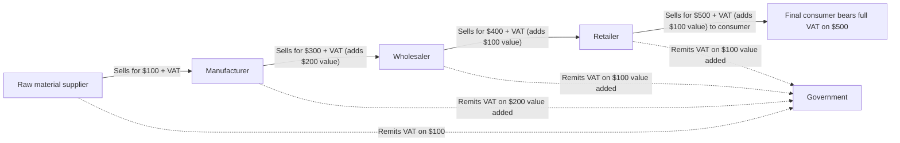

## Design of Value-Added and Sales Taxes

### Definition and Conceptual Overview

The design of value-added taxes (VAT) and retail sales taxes (RST) concerns the structural choices governments make when implementing broad-based consumption taxation: which transactions to tax, at what point in the production-distribution chain, how to handle intermediate goods, how many rates to apply, and how to treat exports, exemptions, and administrative compliance. Both instruments aim to tax final consumption, but they differ fundamentally in mechanism, and these mechanical differences have significant implications for economic efficiency (particularly production efficiency, per the Diamond-Mirrlees theorem), administrative feasibility, and revenue robustness.

### VAT vs. Retail Sales Tax: Core Mechanical Difference

**Key Points**

- **Retail Sales Tax (RST)**: Tax is collected **once**, at the final point of sale to the end consumer. Businesses purchasing intermediate goods for resale or further production are (in principle) exempt from the tax via resale certificates; only the final retail transaction is taxed.
- **Value-Added Tax (VAT)**: Tax is collected **at every stage** of the production-distribution chain, but each business only remits tax on the **value it adds** — achieved mechanically through the **credit-invoice method**, where businesses charge VAT on their sales (output tax) and deduct VAT they paid on their own purchases (input tax), remitting only the net difference to the government.

$$\text{VAT remitted by firm} = \text{Output VAT collected} - \text{Input VAT paid}$$

**[Confirmed]** Under both systems, if implemented perfectly with no exemptions, evasion, or errors, the **total tax collected on a good equals the same amount**: the tax rate multiplied by the final retail price. The economic incidence and revenue outcome are equivalent in the idealized case — the difference lies in **implementation mechanics** and their consequences for compliance and efficiency.

### Why VAT Is Generally Preferred: Self-Enforcement

**[Confirmed]** The credit-invoice VAT mechanism creates a **self-enforcing paper trail**: each business in the chain has an incentive to obtain and report proper invoices from its suppliers, because doing so allows it to claim input tax credits and reduce its own net tax liability. This creates a natural **audit trail** across the production chain, since a buyer's claimed input credit must match a seller's reported output tax, making certain forms of evasion more difficult to sustain undetected relative to a single-point-of-collection RST, where the entire tax liability rests on the final retailer's honest self-reporting with no cross-checking mechanism from earlier stages.

### Production Efficiency and the Diamond-Mirrlees Connection

**[Confirmed]** A properly designed credit-invoice VAT achieves **production efficiency** in the sense required by the Diamond-Mirrlees theorem: because businesses recover all VAT paid on intermediate inputs through credits, the tax never distorts input choices or falls on business-to-business transactions — the full economic burden lands only on final consumption. This is a central reason VAT is widely regarded by public finance economists as structurally superior to older **cascading turnover taxes**, which tax every transaction in the chain without credits, causing tax to compound ("cascade") through the production process and creating strong incentives for vertical integration purely to avoid the cascading tax burden — a pure efficiency loss unrelated to any genuine production advantage of integration.

### Zero-Rating vs. Exemption

**Key Points**

- **Zero-rating**: A good is taxed at a 0% rate, but the seller can still claim input tax credits for VAT paid on their own purchases. This is the standard treatment for **exports** under the **destination principle** (see below), ensuring exported goods leave the country entirely free of domestic VAT, preserving international competitiveness.
- **Exemption**: A good is entirely outside the VAT system — sellers do not charge output VAT, but critically, they **also cannot claim input tax credits** on their purchases. This means VAT paid on inputs becomes an embedded, unrecoverable cost baked into the exempt good's price, which can partially undermine the goal of avoiding cascading effects.
- **[Inference]** This distinction matters significantly in practice: exemptions (commonly applied to financial services, healthcare, education, and small businesses below a registration threshold in many VAT systems) create a partial "mini-cascading" effect at that stage of the chain, whereas zero-rating (typically reserved for exports) fully removes the tax burden without introducing this distortion.

### Destination Principle vs. Origin Principle

**[Confirmed]** Most VAT systems worldwide are designed under the **destination principle**: goods and services are taxed in the **country where they are consumed**, not where they are produced. This is implemented by:

- **Zero-rating exports**: no VAT charged on goods leaving the country, with full input credit refunds to exporters.
- **Taxing imports**: imported goods are subject to VAT at the border (or point of sale) at the same rate as domestically produced equivalents.

**[Confirmed]** The alternative **origin principle** would tax goods based on where they are **produced**, regardless of where consumed. The destination principle is strongly preferred in practice because it maintains a level playing field between domestic and imported goods in the consuming country and avoids distorting the location of production based on tax rate differences across countries — a good produced in a low-VAT country and consumed in a high-VAT country pays the high country's rate either way under destination-based taxation.

### Single-Rate vs. Multi-Rate VAT Design

**Key Points**

- **Single (uniform) rate**: Applies one VAT rate to all (non-exempt) goods and services. **[Inference]** This design is generally favored by public finance economists on efficiency and administrative-simplicity grounds — it minimizes the compliance burden of classifying goods into different rate categories, reduces opportunities for tax avoidance through misclassification, and (under the Atkinson-Stiglitz separability conditions discussed in optimal taxation theory) can be close to optimal when combined with a well-designed income tax for redistribution.
- **Multi-rate structures**: Many real-world VAT systems apply **reduced rates** to necessities (food, medicine) and sometimes **higher rates** to luxury goods, primarily for **equity** reasons — a design that runs counter to the pure Ramsey inverse-elasticity efficiency logic (which would, if applied literally, suggest higher rates on inelastic necessities) but is intended to offset VAT's inherently regressive tendency as a consumption tax.
- **[Unverified]** The tradeoff between rate uniformity (administrative simplicity, efficiency) and rate differentiation (equity, political acceptability) is empirically studied across many countries' VAT systems; specific revenue and compliance-cost estimates vary substantially by country design and enforcement capacity, so general claims about the magnitude of these tradeoffs should be treated as illustrative rather than universal.

### Registration Thresholds and the Informal Sector

**[Inference]** Most VAT systems exempt small businesses below a specified annual turnover threshold from VAT registration, to reduce compliance costs for very small firms and limit administrative burden on the tax authority for high-volume, low-revenue-yield taxpayers. This threshold design interacts with production efficiency concerns: businesses just below the threshold may face incentives to remain small (to avoid crossing into mandatory registration), and firms straddling the threshold experience a discontinuous change in effective tax treatment, which some empirical literature identifies as creating "bunching" behavior in firm size distributions just below common VAT thresholds.

### Numerical Example: VAT vs. Cascading Turnover Tax

**Example**

Consider a three-stage production chain (manufacturer → wholesaler → retailer) with a final retail price of $500, and value added at each stage of $200 (manufacturer), $150 (wholesaler), and $150 (retailer), starting from $0 raw material cost for simplicity. Assume a 10% rate.

**Under credit-invoice VAT (10%)**:

- Manufacturer sells for $220 ($200 + $20 VAT), remits $20
- Wholesaler sells for $385 ($350 + $35 VAT), remits $35 − $20 credit = $15
- Retailer sells for $550 ($500 + $50 VAT), remits $50 − $35 credit = $15
- **Total tax collected**: $20 + $15 + $15 = $50 (exactly 10% of the $500 final value added, correctly)

**Under a cascading turnover tax (10%, no credits)**:

- Manufacturer sells for $220 (10% on $200), no credit
- Wholesaler's cost basis is now $220 (embedded tax); sells at $220 + $150 = $370, plus 10% tax = $407 (tax = $37 on a base that already includes embedded tax from stage 1)
- Retailer's cost basis is $407; sells at $407 + $150 = $557, plus 10% tax = $612.70

**[Confirmed]** The cascading tax results in a final consumer price of **$612.70** versus **$550** under VAT for the *same* nominal 10% rate and identical underlying value added — the cascading system embeds "tax on tax" at each stage, inflating the effective burden well beyond the nominal rate and creating exactly the kind of production-stage distortion the Diamond-Mirrlees framework identifies as inefficient.

### Practical Administrative Design Choices

**Key Points**

- **Invoice-credit method vs. subtraction method**: Most countries use the invoice-credit method described above; a less common **subtraction method** calculates value added directly (sales minus purchases) without requiring transaction-level invoice matching — used in a small number of jurisdictions and in some sub-national US-style gross receipts variants, though it sacrifices some of the self-enforcement benefit of invoice matching.
- **Treatment of capital goods**: Well-designed VAT systems allow **immediate full input credit** for VAT paid on capital equipment purchases (rather than spreading the credit over the asset's depreciable life), which avoids distorting the timing and level of business investment.
- **Refund mechanisms for exporters**: Because exporters are zero-rated but still accumulate input tax credits, an efficient VAT system requires a **timely refund mechanism** for exporters' excess input credits; refund delays or restrictions are a commonly cited practical weakness in VAT administration in some jurisdictions, effectively reintroducing a production/export distortion the theoretical design is meant to avoid.
- **[Unverified]** Refund administration quality varies substantially across countries and has been a subject of technical assistance work by international bodies such as the IMF; specific performance figures for particular countries should be verified against current official or institutional reporting rather than assumed.

### Common Pitfalls in Analysis

**Key Points**

- Confusing **VAT** and **retail sales tax** as fundamentally different in their final economic incidence — under idealized conditions (no exemptions, no evasion), they raise the same revenue from the same final consumption base; the practical differences lie in enforcement and compliance robustness.
- Treating **exemption** and **zero-rating** as equivalent — exemption blocks input credit recovery and can cause cascading, while zero-rating fully removes the tax burden while preserving credit recovery.
- Assuming multi-rate VAT structures are purely about efficiency — in practice, differentiated rates are overwhelmingly motivated by **equity** considerations and often run counter to pure efficiency (Ramsey/inverse-elasticity) logic.
- Ignoring how **registration thresholds** and exemptions for small firms can create competitive distortions and compliance-driven firm-size effects that are not captured in idealized VAT models.

### Related Topics

- Diamond-Mirrlees Production Efficiency Theorem
- Ramsey Rule for Optimal Commodity Taxes
- Tax Incidence of Consumption Taxes
- Destination vs. Origin Principle in International Taxation
- Cascading (Turnover) Taxes and Historical Sales Tax Design
- Tax Compliance, Evasion, and Enforcement
- Equity-Efficiency Tradeoffs in Tax Design
- Uniform Commodity Taxation Theorem