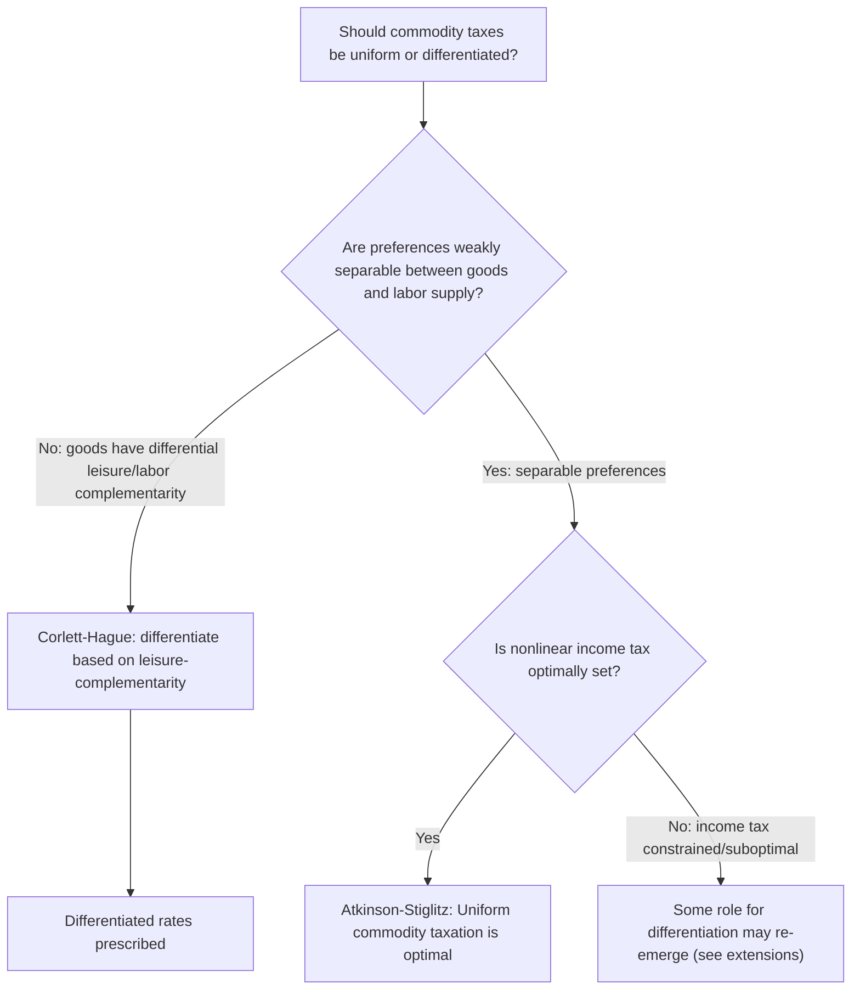

## Uniform versus Differentiated Commodity Taxation

### Definition and Conceptual Overview

The uniform-versus-differentiated commodity taxation debate concerns whether an optimal tax system should apply a **single tax rate to all consumption goods** or **different rates across goods** based on their elasticities, distributional incidence, or relationship to leisure and labor supply. This question sits at the intersection of several major results in public economics: the Ramsey Rule (which prescribes differentiation based on elasticity), the Corlett-Hague rule (differentiation based on leisure-complementarity), and the Atkinson-Stiglitz theorem (which under specific conditions restores the case for **uniformity**). Resolving this tension is central to real-world VAT and sales tax design.

### The Case for Differentiation: Ramsey and Corlett-Hague

**[Confirmed]** As established by the Ramsey Rule, minimizing aggregate excess burden for a fixed revenue target generally requires **differentiated** tax rates set inversely proportional to each good's elasticity of demand (the inverse elasticity rule), or more generally, rates that equalize the proportional reduction in compensated demand across goods. The Corlett-Hague extension further argues for differentiating rates based on each good's complementarity with untaxable leisure — taxing leisure-complements more heavily than labor-complements — as a second-best correction for the fact that leisure itself escapes direct taxation.

**Key Points**

- Pure efficiency logic (Ramsey) says: tax inelastic goods more, elastic goods less.
- Pure leisure-correction logic (Corlett-Hague) says: tax leisure-complementary goods more, labor-complementary goods less.
- Both of these are **differentiation** arguments, since goods rarely have identical elasticities or identical leisure-complementarity.

### The Case for Uniformity: The Atkinson-Stiglitz Theorem

**[Confirmed]** Atkinson and Stiglitz (1976), in "The Design of Tax Structure: Direct versus Indirect Taxation," established a landmark counter-result: if (1) individuals differ only in their **innate earning ability** (not in preferences), and (2) preferences are **weakly separable** between consumption goods and labor supply (meaning the marginal utility ratios between any two consumption goods do not depend on hours worked), then in the presence of an **optimally designed nonlinear income tax**, there is **no additional welfare gain from differentiating commodity tax rates** — a uniform commodity tax (or equivalently, no commodity taxation at all layered on top of the optimal income tax) is second-best optimal.

$$\text{Under separability: } U(x_1, x_2, ..., x_n, l) = V\big(f(x_1,...,x_n), l\big)$$

where $l$ is labor supply and $f(\cdot)$ is a subutility function over consumption goods independent of labor supply — this separable structure is the key condition driving the result.

**[Confirmed]** The intuition: if the **relative** valuation of consumption goods to each other does not depend on how much a person works, then differentiated commodity taxes cannot help the government **screen** high-ability from low-ability individuals any better than the income tax already does — since consumption good choices carry no additional information about ability/type beyond what labor income (and hence the income tax) already reveals. Differentiating commodity taxes in this setting only adds distortion (via the standard Ramsey excess burden channels) without buying any additional redistributive leverage.

### Reconciling Ramsey/Corlett-Hague with Atkinson-Stiglitz

**Key Points**

- The **Ramsey Rule** and **Corlett-Hague rule** are derived in settings **without** an optimal nonlinear income tax available as a redistributive instrument (or where the income tax is fixed/linear and not co-optimized with commodity taxes).
- The **Atkinson-Stiglitz theorem** explicitly assumes an **optimally chosen nonlinear income tax operating alongside** commodity taxes, and shows that under separability, this income tax alone captures all the redistributive and efficiency leverage the government needs, rendering differentiated commodity taxes redundant for **both** efficiency (Ramsey) and equity purposes.
- **[Inference]** This means the "correct" answer to "uniform or differentiated?" depends critically on the **assumed policy environment**: if income taxation is unavailable, poorly designed, or administratively/politically constrained (a common real-world condition, especially in economies with large informal sectors where income is hard to observe and tax), the Ramsey/Corlett-Hague differentiation logic regains practical relevance as a second-best tool. If a rich, well-targeted income tax is available and preferences are separable, uniformity becomes the theoretically preferred benchmark.

### When Does Differentiation Survive Atkinson-Stiglitz?

**[Confirmed]** The Atkinson-Stiglitz uniformity result is **conditional**, and several realistic departures from its assumptions restore a role for differentiated commodity taxation even alongside an optimal income tax:

- **Non-separable preferences**: If the marginal utility ratio between goods genuinely depends on labor supply (violating weak separability) — for example, if child care services are complementary to labor supply while home entertainment goods are complementary to leisure — then differentiation based on this complementarity (essentially a Corlett-Hague-style correction) survives even with an optimal income tax present.
- **Externalities (Pigouvian motives)**: Goods generating negative externalities (tobacco, alcohol, carbon-intensive goods) warrant differentiated (typically higher) taxation for corrective reasons entirely independent of the Atkinson-Stiglitz efficiency/equity argument — this rationale is unaffected by the theorem.
- **Heterogeneous preferences across individuals**: **[Inference]** If people differ not just in earning ability but also in **preferences** for particular goods in ways correlated with ability or need (e.g., health-related consumption needs that vary independently of income), differentiated commodity taxes may help target transfers more precisely than the income tax alone can achieve — a departure from the single-dimension-of-heterogeneity assumption underlying the base Atkinson-Stiglitz result.
- **Administrative/political constraints on the income tax**: If the income tax is constrained to be **linear** (a single marginal rate) rather than fully nonlinear, or cannot be adjusted at all, commodity tax differentiation can partially substitute for the missing progressivity or efficiency instrument.

### Numerical Illustration: Efficiency Cost of Uniformity When Separability Fails

**Example**

Suppose two goods have elasticities $\eta_A = 0.2$ (a good strongly complementary to labor, e.g., professional work software) and $\eta_B = 1.0$ (a good strongly complementary to leisure, e.g., streaming entertainment subscriptions), and preferences are **not** separable — the marginal utility of entertainment relative to work software genuinely depends on hours worked.

Under a **uniform** tax rate of, say, $t = 10\%$ applied to both:

- Excess burden on Good A: $EB_A \approx \frac{1}{2}(0.2)(p_Aq_A)(0.10)^2$
- Excess burden on Good B: $EB_B \approx \frac{1}{2}(1.0)(p_Bq_B)(0.10)^2$

Under the **Ramsey/Corlett-Hague differentiated** structure (taxing the leisure-complement B more, the labor-complement A less), the *combined* excess burden for the same total revenue is lower, because the differentiated structure both (a) exploits the elasticity difference per the standard Ramsey logic and (b) indirectly taxes the otherwise-untaxable leisure margin more effectively per Corlett-Hague. **[Inference]** The magnitude of this efficiency gain from differentiation depends on the specific degree of non-separability and the elasticity gap between the goods; it vanishes entirely (down to zero net gain) as preferences approach the separable case where Atkinson-Stiglitz applies.

### Practical Policy Design Considerations

**Key Points**

- **Most VAT systems are uniform or near-uniform** with limited differentiation (typically reduced rates for necessities on equity grounds, higher rates for a narrow set of luxuries or "sin" goods), reflecting a practical compromise rather than either pure theoretical extreme.
- **Corrective (Pigouvian) differentiation is largely uncontroversial** in the literature and survives essentially all the theoretical debates above — taxing negative externalities more heavily is justified by the externality-correction logic regardless of one's view on the Ramsey-vs-Atkinson-Stiglitz debate.
- **Administrative simplicity favors uniformity** independent of the theoretical debate: differentiated rate structures increase compliance costs, create classification disputes (e.g., is a product a "food" taxed at a reduced rate or a "snack" taxed at the standard rate — a genuine recurring issue in VAT administration in multiple countries), and open avenues for tax avoidance through reclassification or bundling.
- **Developing-economy context**: **[Inference]** In economies where income tax administration is weak (large informal sectors, limited third-party income reporting), the practical case for differentiated commodity taxation as a second-best redistributive and efficiency tool is generally considered stronger than in economies with robust income tax administration, since the Atkinson-Stiglitz "optimal income tax is available" precondition is less realistic in such contexts.

### Common Pitfalls in Analysis

**Key Points**

- Treating **Atkinson-Stiglitz** as a universal, unconditional endorsement of uniform taxation — the result is conditional on separability and the availability of an optimal nonlinear income tax, both of which can fail in practice.
- Treating **Ramsey/Corlett-Hague** as always dominant — these results assume the income tax is fixed, unavailable, or not co-optimized with commodity taxes, an assumption that does not hold in economies with sophisticated income tax systems.
- Conflating the **efficiency** case for differentiation (Ramsey/Corlett-Hague) with the **equity/regressivity** motivation for reduced rates on necessities seen in real-world VAT systems — these are different rationales that happen to sometimes point toward similar-looking policy (differentiated rates) but for entirely different reasons, and sometimes point in **opposite** directions (Ramsey favors higher rates on inelastic necessities; equity favors lower rates on necessities).
- Ignoring **corrective (Pigouvian) taxation** as a separate, largely undisputed rationale for differentiation that operates independently of the uniform-vs-differentiated efficiency/equity debate.

### Related Topics

- Ramsey Rule for Optimal Commodity Taxes
- Corlett-Hague Rule
- Atkinson-Stiglitz Theorem and Uniform Commodity Taxation
- Diamond-Mirrlees Production Efficiency Theorem
- Optimal Income Taxation (Mirrlees Model)
- Design of Value-Added and Sales Taxes
- Pigouvian Taxation and Externality Correction
- Equity-Efficiency Tradeoffs in Tax Design