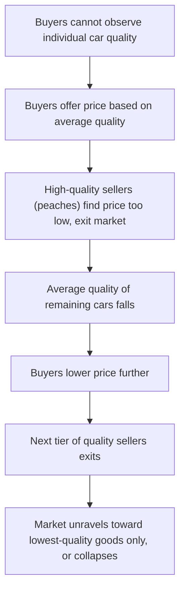
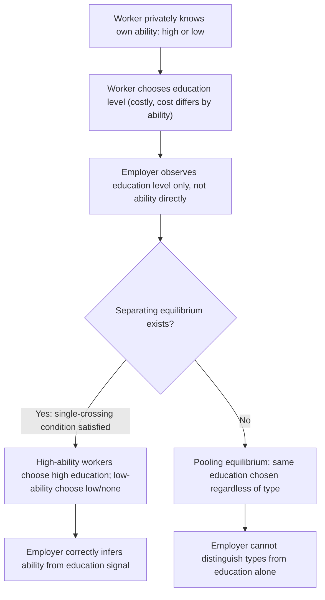

## Adverse Selection and Signaling

### Definition and Conceptual Overview

Adverse selection describes a market failure arising from **asymmetric information**, where one party to a transaction (typically the seller or the informed party) possesses private information about quality, risk, or type that the other party (typically the buyer or uninformed party) cannot directly observe. This information asymmetry, if left unaddressed, causes markets to unravel or produce inefficiently low-quality outcomes, because uninformed parties rationally adjust their offers downward to reflect the *average* quality they expect, driving out higher-quality participants who are unwilling to transact at that average price.

Signaling is one of the primary market-based mechanisms through which informed parties can **credibly communicate** their private information to uninformed parties, potentially resolving or mitigating the adverse selection problem — though signaling itself carries costs and does not always fully restore efficiency.

### The Classic Model: Akerlof's "Market for Lemons"

**[Confirmed]** George Akerlof's 1970 paper "The Market for 'Lemons': Quality Uncertainty and the Market Mechanism" is the foundational formalization of adverse selection, using the used-car market as its illustrative example.

- Sellers know the true quality of their car (a "peach" — good quality, or a "lemon" — poor quality); buyers cannot distinguish quality before purchase.
- Buyers are only willing to pay a price reflecting the **average** quality of cars in the market, since they cannot identify individual quality.
- At this average price, owners of high-quality cars ("peaches") find the price too low relative to their car's true value and **withdraw** from the market.
- As peaches exit, the average quality of remaining cars falls, causing buyers to further lower their willingness to pay, triggering another round of withdrawal by the now-relatively-higher-quality sellers remaining.
- In the extreme case, this **unraveling** process can continue until only the very lowest-quality goods remain in the market, or the market **collapses entirely** — even though mutually beneficial trades of high-quality goods at fair prices would have existed absent the information asymmetry.

### Formal Setup

**[Confirmed]** Consider a market with sellers of type $\theta \in [\theta_L, \theta_H]$, representing quality, uniformly distributed. A seller of type $\theta$ values their good at $\theta$ (their reservation value), and a buyer values a good of type $\theta$ at $v(\theta) > \theta$ (there are gains from trade at every quality level). If buyers cannot observe $\theta$, they will only pay the expected value:

$$p = E[v(\theta) \mid \theta \text{ traded}]$$

**[Confirmed]** If only sellers with $\theta \leq p$ are willing to sell at price $p$ (since selling requires $\theta \leq p$, otherwise the seller's reservation value exceeds the offered price), then the expected quality of goods actually offered for sale, conditional on the price, is **truncated from above** — and if buyers correctly anticipate this pattern, the resulting equilibrium can involve significant or complete market unraveling depending on the specific distributional and valuation assumptions.

### Adverse Selection in Insurance Markets

**[Confirmed]** Insurance markets are a canonical application of adverse selection, distinct from but structurally related to the used-car example: here, the **buyer** (the insured individual) typically has private information about their own risk type, while the **seller** (the insurer) is the uninformed party.

- High-risk individuals value insurance more than low-risk individuals (since they expect to file claims more often), and are willing to pay more for a given coverage level.
- If an insurer offers a single policy at a price based on the **average** risk in the population, low-risk individuals may find the price unattractive relative to their true (lower) expected claims cost, and may decline coverage or purchase less than the efficient amount.
- As lower-risk individuals exit or reduce coverage, the average risk of the remaining insured pool rises, potentially forcing premiums up further — a dynamic structurally analogous to the used-car unraveling process, sometimes called a **"death spiral"** in extreme cases.

**[Inference]** This dynamic is central to debates over health insurance market design, including the rationale for policies such as **mandatory universal coverage** (which prevents low-risk individuals from selectively exiting the pool) as a mechanism to counteract adverse-selection-driven unraveling.

### Signaling: Spence's Job Market Model

**[Confirmed]** Michael Spence's 1973 paper "Job Market Signaling" introduced the canonical signaling model, in which education serves as a signal of otherwise unobservable worker productivity, even if education itself does not causally raise productivity.

**Key setup**:

- Workers have privately known ability/productivity type $\theta \in \{\theta_L, \theta_H\}$ (low or high).
- Employers cannot directly observe $\theta$ but can observe education level $e$ chosen by the worker.
- **Critical assumption (single-crossing property)**: the **cost** of acquiring education is **lower for high-ability workers** than for low-ability workers (a high-ability worker finds it relatively easier/cheaper to obtain a given level of education).

**[Confirmed]** Under this single-crossing condition, a **separating equilibrium** can exist in which high-ability workers choose a level of education $e^*$ sufficiently high that low-ability workers find it **not worth mimicking** (because the cost of achieving $e^*$ for a low-ability worker exceeds the wage premium it would secure), while high-ability workers find $e^*$ worthwhile given their lower cost of achieving it. Employers, observing education levels in equilibrium, can then correctly infer worker type from the education signal alone.

$$\text{Separating condition: } w(e^*) - w(0) \leq c_L(e^*) \quad \text{(low type won't mimic)}$$

$$\text{Separating condition: } w(e^*) - w(0) \geq c_H(e^*) \quad \text{(high type finds it worthwhile)}$$

where $c_L(\cdot) > c_H(\cdot)$ reflects the differential cost of education by type.

### The Purely Signaling (Non-Productive) Nature of Education in Spence's Model

**[Confirmed]** A striking and often-emphasized feature of the pure Spence signaling model is that education in the model plays **no direct productive role** — it does not causally raise a worker's output. Its entire value to the worker lies in its function as a **credible signal** that separates high- from low-ability types, because it is differentially costly to acquire across types. This is a purely informational/screening function, distinct from the human-capital view of education (in which education directly raises productivity). **[Unverified]** The relative empirical importance of the pure signaling channel versus the human-capital channel in explaining the real-world return to education remains a long-standing and actively debated question in labor economics, with different empirical strategies (e.g., studies exploiting compulsory schooling law changes, sheepskin effects at degree-completion thresholds) offering suggestive but not fully conclusive evidence on the relative magnitudes.

### Separating vs. Pooling Equilibria

**Key Points**

- **Separating equilibrium**: Different types choose **different** actions (e.g., different education levels), fully revealing type to the uninformed party. Requires the single-crossing property to hold and requires the signal to be sufficiently costly to deter mimicry by the low type.
- **Pooling equilibrium**: All types choose the **same** action, and the uninformed party cannot distinguish type from the observed signal — the market outcome then reflects only the average/expected type, similar to the adverse selection outcome without any signaling mechanism.
- **[Inference]** Which equilibrium (or which of potentially multiple separating/pooling equilibria) emerges depends on the specific parameters, out-of-equilibrium beliefs assumed, and refinement criteria (e.g., the Cho-Kreps intuitive criterion) used to select among multiple possible equilibria in these games — a well-known feature of signaling games is that they often admit multiple equilibria, requiring additional equilibrium refinement concepts to narrow predictions.

### Screening as the Mirror-Image Mechanism

**[Confirmed]** While signaling involves the **informed** party taking a costly action to reveal type, **screening** involves the **uninformed** party designing a menu of contracts or options such that different types **self-select** into different choices, revealing their type indirectly through their selection. The classic example is an insurer offering a **menu of contracts** with different premium-deductible combinations, designed so that high-risk individuals self-select into low-deductible/high-premium contracts and low-risk individuals self-select into high-deductible/low-premium contracts — achieving a form of separation without the insurer ever directly observing individual risk type. This is the **Rothschild-Stiglitz** model of competitive screening in insurance markets, a close conceptual cousin of the Spence signaling framework, with the key difference being **who** designs the separating mechanism (informed party for signaling, uninformed party for screening).

### Numerical Example: Basic Signaling Cost Comparison

**Example**

Suppose employers pay $w = \$80,000$ to workers signaled as high-ability (education $e \geq e^*$) and $w = \$40,000$ to those without the signal. The cost of acquiring education level $e^*$ is $c_H(e^*) = \$20,000$ for high-ability workers and $c_L(e^*) = \$50,000$ for low-ability workers (reflecting, for instance, that high-ability workers complete a degree faster or with less effort/tuition cost per unit of ability).

- **High-ability worker's payoff from signaling**: $80{,}000 - 20{,}000 = \$60{,}000$, versus $40{,}000$ without signaling → **signals** (chooses $e^*$).
- **Low-ability worker's payoff from mimicking**: $80{,}000 - 50{,}000 = \$30{,}000$, versus $40{,}000$ without signaling → **does not mimic** (the cost of acquiring the signal exceeds the wage gain).

This confirms a valid separating equilibrium exists at these parameter values: the wage premium is large enough to motivate the high type but not large enough to overcome the low type's higher signaling cost.

### Welfare Implications of Signaling

**Key Points**

- Signaling can **improve** allocative outcomes relative to a pure pooling/adverse-selection scenario by allowing types to be distinguished and matched to more appropriate prices, wages, or contracts.
- However, signaling is **not costless** — resources are expended purely to achieve separation (e.g., the private cost of education acquired solely for its signaling value, beyond any genuine productivity benefit), representing a **social waste** relative to a hypothetical world with full information where no such costly signal would be needed.
- **[Inference]** This tension means signaling equilibria, while an improvement over complete pooling in terms of allocative accuracy, are **not first-best efficient** — the socially optimal outcome would achieve the same information revelation without the deadweight cost of the signal itself, which is generally unattainable given the fundamental information asymmetry.

### Policy and Market Design Applications

**Key Points**

- **Mandatory insurance mandates**: Addressing adverse selection in insurance markets (e.g., health insurance) by requiring broad participation, preventing low-risk individuals from selectively opting out and triggering unraveling.
- **Warranties and guarantees as signals**: Sellers of high-quality durable goods can use costly warranties as a signaling device, since offering a generous warranty is more costly (in expected claims terms) for a seller of low-quality goods than high-quality goods, creating a natural single-crossing structure.
- **Credentialing and licensing requirements**: Professional licensing and credentialing (in medicine, law, skilled trades) can be understood partly through a signaling/screening lens, as a costly-to-acquire credential that separates qualified from unqualified practitioners when quality is not directly observable to consumers.
- **Government-provided information or certification schemes**: Public policy responses to adverse selection sometimes involve the government providing standardized quality information (e.g., mandatory disclosure requirements, safety ratings, certification labels) as a lower-cost substitute for costly private signaling, aiming to achieve separation with less social waste than market-generated signals would require.

### Common Pitfalls in Analysis

**Key Points**

- Confusing **adverse selection** (a pre-contractual information problem about hidden **type**) with **moral hazard** (a post-contractual information problem about hidden **action** or behavior) — these are related but analytically distinct information asymmetry problems within information economics.
- Assuming signaling **always** restores full efficiency — signaling equilibria typically involve real resource costs and are second-best relative to a hypothetical full-information benchmark.
- Treating the **single-crossing property** as automatically satisfied — the existence of a separating equilibrium in signaling models depends critically on this condition holding, and its failure can lead to pooling outcomes instead.
- Overstating the empirical case for a **pure** signaling interpretation of education (or other credentials) without acknowledging the genuine ongoing debate over the relative contribution of human-capital (productivity-enhancing) effects.

### Related Topics

- Moral Hazard and Principal-Agent Problems
- Rothschild-Stiglitz Screening Model in Insurance Markets
- Mechanism Design and the Revelation Principle
- Market Unraveling and the Lemons Problem
- Health Insurance Market Design and Mandates
- Human Capital Theory vs. Signaling Theory of Education
- Equilibrium Refinement Concepts (Cho-Kreps Intuitive Criterion)
- Optimal Income Taxation (Mirrlees Model)