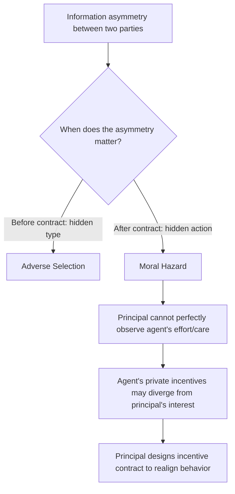
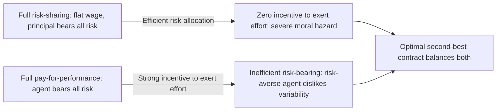

## Moral Hazard and Principal-Agent Problems

### Definition and Conceptual Overview

Moral hazard describes a **post-contractual** information problem arising when one party (the **agent**) can take **hidden actions** — actions unobservable or costly for the other party (the **principal**) to monitor — after a contract or transaction has been established, and where the agent's incentives to exert effort, take care, or behave prudently diverge from the principal's interests once risk-bearing or payment has been arranged. This distinguishes moral hazard from adverse selection, which concerns **hidden information about type** that exists **before** a contract is signed. The principal-agent problem is the general contracting framework used to analyze how principals can design incentive structures — compensation, monitoring, contract terms — to align an agent's behavior with the principal's objectives despite this hidden-action problem.

### Formal Distinction: Moral Hazard vs. Adverse Selection

**Key Points**

- **Adverse selection**: Hidden **information/type**, present **before** the contract (e.g., a used-car seller's private knowledge of quality, or an insurance applicant's private knowledge of their own risk level).
- **Moral hazard**: Hidden **action/behavior**, occurring **after** the contract (e.g., an insured individual's reduced care once covered, or an employee's effort level once hired).
- **[Inference]** Some real-world settings combine both: an insurance applicant may have private information about baseline risk (adverse selection) **and** may adjust their care-taking behavior after obtaining coverage (moral hazard), requiring contract designs that address both problems simultaneously.

### Classic Examples of Moral Hazard

**Key Points**

- **Insurance markets**: Once insured, an individual may take **less care** to prevent the insured-against event (e.g., driving less cautiously with full auto insurance, or under-investing in preventive health measures with comprehensive health coverage) than they would without coverage, since the financial consequences of the bad outcome are now partially or fully borne by the insurer.
- **Employment relationships**: An employee (agent) whose effort cannot be perfectly monitored by an employer (principal) may exert **less effort** than the employer desires if compensation is not tied to observable performance, since effort is personally costly to the employee but its benefits (output, profit) accrue substantially to the employer.
- **Corporate governance**: Shareholders (principals) cannot perfectly monitor the actions of corporate managers (agents), who may pursue personal objectives (empire-building, excessive perquisites, risk-avoidance to protect their own job security) that diverge from shareholder value maximization.
- **Banking and financial risk-taking**: Deposit insurance or "too big to fail" expectations can create moral hazard by insulating banks (or their creditors) from the full consequences of excessive risk-taking, since losses beyond a certain point may be borne by a deposit insurer or the government rather than the bank's own stakeholders.

### The Principal-Agent Model: Formal Setup

**[Confirmed]** The standard principal-agent (hidden action) model involves:

- An **agent** who chooses an effort level $e$, which is **costly** to the agent, $c(e)$, with $c'(e) > 0$ and $c''(e) > 0$ (increasing marginal cost of effort).
- Effort stochastically affects an observable **outcome** $x$ (e.g., output, profit, or a performance measure), typically through a probability distribution $f(x \mid e)$, where higher effort shifts the distribution toward better outcomes in a first-order-stochastic-dominance or likelihood-ratio sense.
- The **principal** observes only the outcome $x$, **not** the effort $e$ directly, and must design a compensation contract $w(x)$ that depends only on the observable outcome.
- The agent chooses effort to maximize their own expected utility: $\max_e E[u(w(x)) \mid e] - c(e)$.
- The principal chooses the contract $w(x)$ to maximize expected profit, $E[x - w(x)]$, subject to the agent's **participation constraint** (the agent must get at least their reservation utility) and **incentive compatibility constraint** (the agent must find it optimal to choose the effort level the principal wants, given the contract).

$$\max_{w(\cdot), e} \; E[x - w(x)] \quad \text{s.t.} \quad E[u(w(x)) \mid e] - c(e) \geq \bar{u} \;\text{(participation)}$$

$$e \in \arg\max_{e'} E[u(w(x)) \mid e'] - c(e') \;\text{(incentive compatibility)}$$

### The Fundamental Tradeoff: Risk-Sharing vs. Incentives

**[Confirmed]** The central tension in the principal-agent model arises because:

- If the agent is **risk-averse** and the principal is **risk-neutral** (a common assumption, e.g., a diversified shareholder base versus an individual employee), **full risk-sharing** (efficient in the absence of moral hazard) would have the principal bear **all** the risk, paying the agent a **fixed wage** regardless of outcome.
- But a **fixed wage** provides **zero incentive** for the agent to exert costly effort, since the agent's pay does not depend on outcomes at all — this is the moral hazard problem in its starkest form.
- The principal must therefore trade off **optimal risk-sharing** (favoring flatter, more insurance-like compensation) against **incentive provision** (favoring compensation that varies strongly with outcomes, exposing the agent to risk they would rather avoid) — this tradeoff is the defining feature that distinguishes second-best contracts (under moral hazard) from first-best contracts (achievable if effort were directly observable and contractible).

### First-Best vs. Second-Best Contracts

**[Confirmed]** If effort $e$ were **directly observable and contractible** (the first-best benchmark), the principal could simply specify a required effort level and pay a fixed wage conditional on that effort being verified, achieving efficient risk-sharing (agent fully insured against outcome risk) **and** the principal's desired effort level simultaneously — no tradeoff would exist. Because effort is **not** observable in the moral hazard setting, the principal is constrained to a **second-best** contract that ties pay to the observable outcome $x$ (an imperfect proxy for effort), which necessarily exposes the risk-averse agent to some outcome risk they would not bear under the first-best contract. **[Confirmed]** This gap between first-best and second-best outcomes is a direct measure of the efficiency cost of moral hazard/hidden action, analogous in spirit to the deadweight loss concept in other areas of public economics — a cost imposed purely by the informational friction, not by any change in the underlying technology or preferences.

### Numerical Example: Optimal Incentive Contract Tradeoff

**Example**

Suppose an agent can choose "high effort" ($e_H$, cost $= \$10,000$ to the agent) or "low effort" ($e_L$, cost $= \$0$). High effort produces output of $100,000 with probability 0.8 and $40,000 with probability 0.2 (expected output = $88,000). Low effort produces $100,000 with probability 0.2 and $40,000 with probability 0.8 (expected output = $52,000).

**First-best (effort observable)**: the principal simply pays a fixed wage of, say, $50,000 whenever high effort is verified directly, achieving expected profit of $88{,}000 - 50{,}000 = \$38{,}000$, with the agent fully insured against output risk.

**Second-best (effort unobservable)**: the principal must instead condition pay on the *observed output*, e.g., paying $60,000 if output is $100,000 and $20,000 if output is $40,000, such that the agent's **expected utility from choosing high effort** (net of the $10,000 effort cost) exceeds their expected utility from choosing low effort and collecting the same contingent pay schedule. **[Inference]** Because this contract now exposes the risk-averse agent to income variability they did not face in the first-best case, the agent requires a **risk premium** to accept the contract at all (to meet their participation constraint), which is a pure additional cost to the principal beyond the pure incentive cost — this combined cost (incentive cost plus risk premium) is the efficiency loss attributable to moral hazard in this example, and its exact magnitude depends on the specific degree of the agent's risk aversion assumed.

### The Informativeness Principle

**[Confirmed]** A key theoretical result, associated with the work of Holmström (1979) and others, is the **informativeness principle**: an optimal incentive contract should condition pay on **any signal that provides additional information about the agent's effort**, beyond the primary observable outcome, **as long as that signal is not already fully captured** by the existing contract terms. This means, for instance, that if a secondary, correlated signal (e.g., a co-worker's performance in a shared task, or an independent monitoring report) provides information about the agent's likely effort level beyond what the primary outcome measure reveals, an optimal contract should incorporate this additional signal (a principle underlying, for example, the use of **relative performance evaluation** — paying agents partly based on their performance relative to peers facing similar external/common shocks, which filters out the effect of common noise not attributable to individual effort).

### Applications: Efficiency Wages

**[Confirmed]** The **efficiency wage** theory is a direct application of moral hazard/principal-agent logic to labor markets: firms may pay wages **above** the market-clearing level specifically to raise the cost to workers of being caught shirking and fired (since a higher wage means a larger loss if terminated), thereby inducing greater effort without needing to perfectly monitor each worker's actions. **[Inference]** This theory has been used to help explain persistent involuntary unemployment in some labor market models, since above-market-clearing wages set for incentive reasons do not adjust downward to clear the labor market even in the presence of willing unemployed workers.

### Policy Applications in Public Economics

**Key Points**

- **Health insurance design (deductibles, copayments, coinsurance)**: Cost-sharing provisions in health insurance are a direct policy response to moral hazard — by making the insured party bear some fraction of costs at the point of care, insurers induce more cost-conscious behavior, trading off some risk-protection (the core purpose of insurance) against reduced moral-hazard-driven overconsumption of care.
- **Unemployment insurance design**: Unemployment benefits create a moral hazard problem in job search effort — overly generous or indefinite benefits may reduce the recipient's incentive to search intensively for new work, motivating policy design features such as benefit time limits, job-search verification requirements, or declining benefit schedules over the unemployment spell.
- **Public sector employee/contractor incentive design**: Government contracts with private providers (e.g., in procurement, or performance-based contracts for public services) face the same fundamental risk-sharing-versus-incentives tradeoff as private-sector principal-agent relationships, motivating performance-based payment structures, though the appropriate degree of high-powered incentives in public contracting is a subject of ongoing debate given complexities around measuring public-sector outcomes.
- **Bailout and deposit insurance design**: Policy design of financial safety nets (deposit insurance limits, capital requirements, resolution regimes) reflects an explicit attempt to balance the benefits of financial stability (which safety nets provide) against the moral hazard risk-taking incentives such safety nets can create for financial institutions.

### Common Pitfalls in Analysis

**Key Points**

- Confusing moral hazard (hidden **action**, post-contractual) with adverse selection (hidden **type**, pre-contractual) — a very common terminological error, even though the two problems often coexist in the same real-world market (e.g., insurance).
- Assuming the **first-best** (fully efficient) outcome is achievable once a moral hazard problem is identified — the second-best contract is constrained by the fundamental unobservability of effort, and some efficiency loss (via the risk-incentive tradeoff) is generally unavoidable.
- Treating **all** performance-based pay as automatically welfare-improving — high-powered incentive contracts impose real risk-bearing costs on risk-averse agents, and the optimal degree of incentive intensity depends on the specific tradeoff parameters (agent's risk aversion, the informativeness of the outcome measure about effort, and the cost of effort).
- Ignoring the **informativeness principle** when evaluating whether additional signals (beyond a primary outcome measure) should be incorporated into an incentive contract.

### Related Topics

- Adverse Selection and Signaling
- Rothschild-Stiglitz Screening Model in Insurance Markets
- Efficiency Wage Theory
- Mechanism Design and the Revelation Principle
- Optimal Insurance Design and Cost-Sharing
- Unemployment Insurance Program Design
- Corporate Governance and Agency Costs
- Optimal Income Taxation (Mirrlees Model)