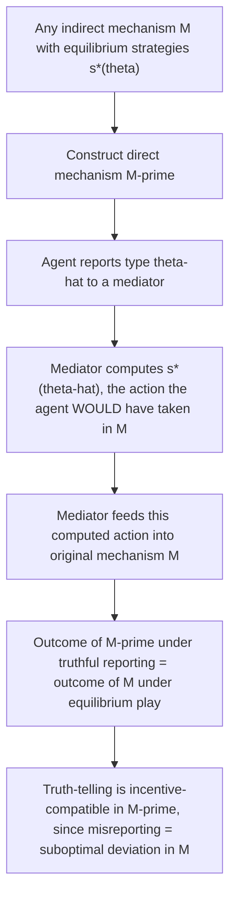

## Revelation Principle

### Definition and Conceptual Overview

The Revelation Principle is a foundational result in mechanism design theory establishing that, for **any** mechanism (game form) implementing a particular social choice outcome as an equilibrium — regardless of how complex, indirect, or strategic that mechanism is — there exists an **equivalent direct mechanism** in which each agent is asked to simply and truthfully report their private information (their "type"), and truth-telling constitutes an equilibrium that achieves the **same outcome**. This result dramatically simplifies the theoretical analysis of mechanism design: instead of searching over the vast space of all conceivable indirect mechanisms and strategies, a mechanism designer can restrict attention, **without loss of generality**, to the much smaller and more tractable class of **direct, incentive-compatible mechanisms**.

### Formal Statement

**[Confirmed]** Let there be $n$ agents, each with a privately known type $\theta_i \in \Theta_i$. Suppose an arbitrary mechanism $M$ (which may involve agents choosing actions from some abstract strategy space, submitting bids, participating in multi-round protocols, etc.) implements a social choice function $f(\theta_1, ..., \theta_n)$ as a **Bayesian Nash equilibrium** (or as a dominant-strategy equilibrium, depending on the version of the principle invoked) via some equilibrium strategy profile $s^*(\theta) = (s_1^*(\theta_1), ..., s_n^*(\theta_n))$.

**The Revelation Principle states**: there exists a **direct mechanism** $M'$ — in which each agent simply reports a type $\hat{\theta}_i \in \Theta_i$ — such that:

$$f(\theta_1, ..., \theta_n) = g\big(s_1^*(\theta_1), ..., s_n^*(\theta_n)\big) = g'(\theta_1, ..., \theta_n)$$

and **truthful reporting** ($\hat{\theta}_i = \theta_i$ for all $i$) is itself an equilibrium of the direct mechanism $M'$, yielding the exact same outcome as the original equilibrium of $M$.

### Intuition Behind the Proof

**[Confirmed]** The proof is essentially a **"delegation" or "simulation" argument**: given any indirect mechanism $M$ and its equilibrium strategies $s_i^*(\cdot)$, construct the direct mechanism $M'$ by having a "mediator" ask each agent for their type $\hat{\theta}_i$, and then have the mediator **compute** what the agent's equilibrium action would have been in the original mechanism — namely $s_i^*(\hat{\theta}_i)$ — and feed that computed action into the original mechanism $M$ on the agent's behalf.

- If an agent were to lie in the direct mechanism (report $\hat{\theta}_i \neq \theta_i$), this is **exactly equivalent** to the agent deviating from their equilibrium strategy in the original mechanism $M$ (playing $s_i^*(\hat{\theta}_i)$ instead of $s_i^*(\theta_i)$).
- Since $s_i^*(\theta_i)$ was **optimal** for the agent of true type $\theta_i$ in the original equilibrium (by the definition of equilibrium in $M$), any such deviation cannot make the agent better off.
- Therefore, **truth-telling** in the direct mechanism $M'$ is incentive-compatible — no agent benefits from misreporting, since misreporting is payoff-equivalent to a suboptimal deviation in the original game.

### Direct Mechanisms and Incentive Compatibility

**Key Points**

- A **direct mechanism** is one in which the strategy space for each agent is exactly their own type space $\Theta_i$ — agents simply "announce" their type.
- A direct mechanism is **incentive compatible (IC)** if truthful reporting constitutes an equilibrium — no agent has an incentive to misreport their type given that other agents report truthfully (or, in the dominant-strategy version, regardless of what others report).
- Two common strengths of incentive compatibility are distinguished:
  - **Dominant-strategy incentive compatibility (DSIC)**: truth-telling is optimal for each agent **regardless** of other agents' reports/types — the strongest and most robust form.
  - **Bayesian incentive compatibility (BIC)**: truth-telling is optimal for each agent **given** that other agents are also truthfully reporting, and given the agent's beliefs about others' types — a weaker, equilibrium-dependent form.
- **[Confirmed]** The Revelation Principle has versions corresponding to both solution concepts: if the original mechanism implements the social choice function in dominant strategies, the resulting direct mechanism is DSIC; if implemented in Bayesian Nash equilibrium, the resulting direct mechanism is BIC.

### Why the Revelation Principle Matters: Practical Implications for Mechanism Design

**[Confirmed]** The Revelation Principle's primary practical value is that it **collapses the mechanism design search problem**. Without it, a designer seeking the "best" mechanism (e.g., the revenue-maximizing auction, or the most efficient public-goods provision mechanism) would need to consider an essentially unbounded universe of possible indirect mechanisms — multi-stage games, ascending-bid formats, complex signaling protocols, and so on — each with potentially different equilibria. The Revelation Principle guarantees that **any implementable outcome can be replicated by some direct, incentive-compatible mechanism**, so the designer can restrict the search entirely to the tractable class of direct mechanisms satisfying an incentive compatibility constraint, without any loss of generality in terms of which **outcomes** are achievable.

**This is the theoretical foundation underlying**:

- The derivation of the **optimal (revenue-maximizing) auction** (Myerson, 1981), which is derived by optimizing directly over incentive-compatible direct mechanisms rather than over specific auction formats.
- The characterization of **efficient public goods provision mechanisms** under private information (e.g., the Vickrey-Clarke-Groves mechanism), derived as a direct mechanism satisfying dominant-strategy incentive compatibility.
- The general theory of **optimal taxation under private information** (the Mirrlees model of optimal income taxation), which is formally structured as a direct mechanism design problem where individuals "report" their type (ability) indirectly through their labor supply and income choices, subject to incentive compatibility constraints ensuring that high-ability individuals do not wish to mimic low-ability individuals to reduce their tax burden.

### Numerical/Conceptual Example: Auction Design

**Example**

Consider a seller trying to design a mechanism to sell an item to one of several bidders, each with privately known valuation $v_i$. Rather than analyzing every conceivable auction format (English ascending auction, Dutch descending auction, sealed-bid first-price, sealed-bid second-price, complex multi-round formats, etc.) separately and solving for each format's equilibrium bidding strategy, the Revelation Principle allows the designer to instead consider the simplified **direct mechanism**: each bidder simply reports their valuation $\hat{v}_i$, and the mechanism specifies an allocation rule (who gets the item, as a function of reported valuations) and a payment rule (how much each bidder pays), subject to the constraint that truthful reporting is optimal for each bidder.

**[Confirmed]** This direct-mechanism approach is exactly how Myerson (1981) derives the revenue-maximizing auction: by first characterizing the full set of incentive-compatible direct mechanisms (which, by the Revelation Principle, replicates the full set of implementable auction outcomes across *all* possible auction formats), and then optimizing the seller's expected revenue over this well-characterized, tractable set — a search that would be far less tractable if conducted directly over the space of all conceivable indirect auction formats.

### The Revelation Principle and the Application to Optimal Income Taxation

**[Confirmed]** In the Mirrlees optimal income tax framework, the Revelation Principle underlies the standard technique of modeling the tax problem as if each individual **directly reports their ability type** to the government, subject to an incentive compatibility constraint ensuring that a high-ability individual does not want to report as low-ability (to face a lower tax burden) and a low-ability individual does not want to (or cannot feasibly) report as high-ability. In reality, individuals do not literally report their ability to the tax authority — ability is inferred indirectly from the labor supply and income choices individuals make under the tax schedule. The Revelation Principle justifies analyzing the problem **as if** direct ability reporting occurred, because the set of outcomes achievable through the actual indirect mechanism (income-contingent taxation, where individuals choose their income level) is equivalent to the set of outcomes achievable through the direct mechanism, given appropriately designed incentive compatibility constraints.

### Important Caveats and Limitations

**Key Points**

- **The Revelation Principle addresses "implementability," not "practicality."** It shows that the outcome achievable by *any* mechanism can also be achieved by *some* direct, incentive-compatible mechanism, but it says nothing about whether that direct mechanism is administratively simple, computationally tractable, robust to collusion, or politically/practically feasible to implement — many real-world mechanisms remain indirect for good practical reasons (e.g., ascending auctions can have lower cognitive/strategic burden on bidders than direct valuation reporting, even though they are theoretically equivalent under the principle).
- **Multiple equilibria and equilibrium selection**: The Revelation Principle applies to a *specific* equilibrium of the original mechanism; if the original mechanism has multiple equilibria, each may correspond to a different (though each internally valid) direct mechanism — the principle does not resolve equilibrium selection problems, only equivalence at the level of a given equilibrium.
- **Does not guarantee "nice" properties beyond incentive compatibility**: While the constructed direct mechanism is incentive compatible by construction, it does not automatically inherit other desirable properties (e.g., budget balance, individual rationality/participation constraints, or robustness to collusion among agents) unless these are separately verified or imposed as additional constraints in the mechanism design problem.
- **[Inference]** Because of these practical limitations, the Revelation Principle is best understood as a **powerful analytical/theoretical simplification tool** for *characterizing the set of achievable outcomes* in mechanism design problems, rather than as a direct blueprint for designing real-world institutions, which often retain indirect, strategically-mediated forms for practical implementation reasons even when a theoretically equivalent direct mechanism exists.

### Common Pitfalls in Analysis

**Key Points**

- Interpreting the Revelation Principle as implying that **real-world mechanisms should always be direct** (i.e., that governments or auctioneers should always simply ask agents to report their private information) — the principle is a tool for theoretical characterization of achievable outcomes, not a practical design recommendation that ignores implementation costs and complexity.
- Confusing **incentive compatibility** (truth-telling is optimal) with **individual rationality/participation** (the agent prefers to participate at all rather than opt out) — these are separate constraints in mechanism design, both often required for a mechanism to be genuinely implementable in practice.
- Assuming the direct mechanism constructed via the Revelation Principle is unique — it is derived from a **specific** equilibrium of the original mechanism, and different equilibria (if multiple exist) can yield different, though each individually valid, direct-mechanism representations.
- Overlooking that the Revelation Principle guarantees **existence** of an equivalent direct mechanism, not that the resulting incentive compatibility constraints are **easy to satisfy** or that the optimization problem over the direct-mechanism space is simple to solve in all applications.

### Related Topics

- Mechanism Design and Social Choice Theory
- Myerson's Optimal Auction Design
- Vickrey-Clarke-Groves (VCG) Mechanism
- Optimal Income Taxation (Mirrlees Model)
- Adverse Selection and Signaling
- Incentive Compatibility and Individual Rationality Constraints
- Dominant-Strategy vs. Bayesian Nash Implementation
- Public Goods Provision Under Private Information