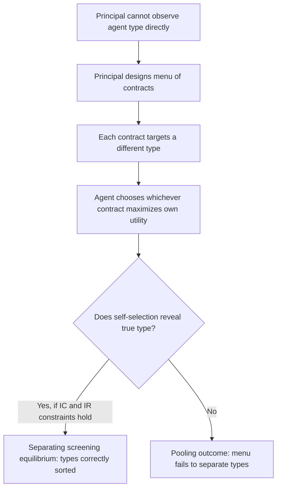

## Screening and Self-Selection Mechanisms

### Definition and Conceptual Overview

Screening refers to mechanism design in which the **uninformed** party (the principal) designs a menu of contracts, prices, or options such that agents with different privately known types **voluntarily self-select** into different choices, thereby revealing their type indirectly through their own optimizing behavior — without the principal ever needing to directly observe or verify each agent's true type. This is the structural mirror image of signaling (in which the **informed** party takes a costly action to reveal type): in screening, the uninformed party takes the initiative by designing the menu, and separation is achieved through the agents' own incentive-compatible choices among the offered options.

### The Core Mechanism: Menus and Self-Selection

**[Confirmed]** A screening mechanism typically consists of a **menu of contracts** $\{(x_1, t_1), (x_2, t_2), ..., (x_n, t_n)\}$, where each pair specifies some allocation or quantity $x_i$ and an associated payment or price $t_i$. The principal designs this menu so that, given their own preferences, each type of agent finds it **individually optimal** to select the contract intended for their type, rather than a contract intended for a different type. This self-selection is enforced through two families of constraints:

- **Incentive compatibility (IC) constraints**: each type must (weakly) prefer their own designated contract to any other contract on the menu.
- **Individual rationality (IR) / participation constraints**: each type must receive at least their reservation utility (outside option) from their designated contract, or they will decline to participate at all.

$$U_i(x_i, t_i) \geq U_i(x_j, t_j) \quad \forall i, j \quad \text{(IC)}$$

$$U_i(x_i, t_i) \geq \bar{U}_i \quad \forall i \quad \text{(IR)}$$

### Canonical Example: Rothschild-Stiglitz Insurance Screening

**[Confirmed]** Rothschild and Stiglitz (1976), in "Equilibrium in Competitive Insurance Markets: An Essay on the Economics of Imperfect Information," developed the canonical screening model applied to competitive insurance markets with adverse selection.

- Individuals are privately either **high-risk** or **low-risk**, with insurers unable to observe type directly.
- Insurers offer a **menu of insurance contracts**, each specifying a **premium** and a **coverage/deductible level**.
- The menu is designed so that **high-risk individuals self-select into full (or high) coverage contracts at a correspondingly high premium**, while **low-risk individuals self-select into partial coverage contracts (with a deductible) at a lower premium** — because low-risk individuals, who expect to file claims less often, find the lower premium worth accepting the reduced coverage, while high-risk individuals value full coverage highly enough to accept the higher premium.

**[Confirmed]** The key screening device here is the **deductible/coverage level**, which functions analogously to Spence's education signal: it creates a **single-crossing property** where low-risk types find high coverage relatively less attractive (since they're less likely to benefit from full coverage) than high-risk types do, allowing a menu to be designed such that each type self-selects appropriately.

### Existence Problems in Competitive Screening Equilibria

**[Confirmed]** A distinctive and much-discussed feature of the Rothschild-Stiglitz model is that a **pooling equilibrium** (where both types accept the same contract) can **never** be a stable competitive equilibrium under their assumptions, because a rival insurer could always profitably "cream-skim" by offering a slightly different contract that attracts only the low-risk types away from the pooling contract, leaving the original insurer with an unprofitable high-risk-only pool. However, a **separating equilibrium** (the one described above) may also **fail to exist** in some parameter ranges — specifically when the proportion of low-risk individuals in the population is sufficiently high, because in that case, a rival insurer could profitably offer a **pooling contract** that attracts *both* types away from the separating menu, since the potential pooling contract's average risk becomes attractive enough to disrupt separation.

**[Confirmed]** This existence problem — that a pure-strategy competitive equilibrium may fail to exist at all under certain parameter configurations — is a well-known and significant technical feature of the original Rothschild-Stiglitz framework, and has motivated substantial subsequent theoretical work (e.g., allowing for reactive pricing, alternative equilibrium concepts such as Wilson's "anticipatory" equilibrium, or relaxing the pure competitive assumption) to address the non-existence problem in various ways.

### Efficiency Properties of Screening Equilibria

**Key Points**

- **Separating screening equilibria are generally second-best inefficient**, even when they exist and are stable: **[Confirmed]** low-risk individuals in the Rothschild-Stiglitz separating equilibrium receive **less than full insurance** (a positive deductible), even though, absent the adverse selection problem, they would prefer (and it would be efficient to offer them) full coverage at an actuarially fair premium reflecting their own true (low) risk.
- This under-insurance of the low-risk type is the **cost of screening**: the reduced coverage is specifically designed to be *unattractive* to high-risk types (preventing them from mimicking low-risk individuals to obtain the cheaper premium), and this distortion is the mechanism by which separation is achieved — but it comes at the cost of the low-risk type's own allocative efficiency.
- **[Inference]** This result parallels the broader theme across information economics that self-selection/signaling/screening mechanisms, while an improvement over complete pooling or market collapse, generally do **not** replicate the full-information efficient outcome — some distortion or cost is typically necessary to sustain the separation of types.

### Numerical Example: Screening Menu Design

**Example**

Suppose an insurer faces two types: low-risk (probability of loss = 0.1) and high-risk (probability of loss = 0.5), with a potential loss of $10,000 if the insured event occurs.

**Full-information (first-best) benchmark**: each type would be offered actuarially fair full coverage at a premium equal to their expected loss — $1,000 for low-risk, $5,000 for high-risk.

**Under screening (unobservable type)**: the insurer instead offers a menu such as:

- **Contract A** (targeted at high-risk): full coverage ($10,000 payout if loss occurs) at premium $5,000 — actuarially fair for the high-risk type.
- **Contract B** (targeted at low-risk): partial coverage (e.g., $7,000 payout, requiring the insured to bear a $3,000 deductible) at a reduced premium of, say, $700 — actuarially fair for the low-risk type's *reduced* coverage level.

**[Inference]** For this menu to constitute a valid separating screening equilibrium, Contract B's reduced coverage must be **unattractive enough** to high-risk individuals that they prefer Contract A despite its higher premium (since a high-risk individual, facing a 0.5 loss probability, values the additional $3,000 of coverage in Contract A highly enough to justify the extra premium), while low-risk individuals prefer Contract B's lower premium given their own lower loss probability (0.1) makes the "insurance" on the last $3,000 of coverage not worth the additional premium Contract A would require. The specific numbers here are illustrative; the exact incentive-compatible menu satisfying both IC and IR constraints simultaneously requires solving the constrained optimization explicitly for given underlying parameters.

### Screening in Other Applied Contexts

**Key Points**

- **Nonlinear pricing / second-degree price discrimination**: A monopolist unable to observe individual consumers' willingness to pay can offer a **menu of quantity-price bundles** (e.g., bulk discounts), designed so that high-demand consumers self-select into large-quantity bundles at a lower per-unit price, while low-demand consumers self-select into small-quantity bundles at a higher per-unit price — a direct commercial application of screening logic, distinct from but structurally related to public-sector applications.
- **Optimal income taxation (Mirrlees model)**: The government, unable to directly observe individual ability, effectively designs a "menu" via the tax schedule (different combinations of pre-tax income and after-tax consumption) such that individuals of different ability levels self-select into different labor supply and income choices, revealing information about their type indirectly — this is precisely a screening problem, formally connected to the Revelation Principle's direct-mechanism representation of the tax problem.
- **Public housing and means-tested benefit design**: Governments sometimes use screening-based mechanisms (e.g., requiring work hours, imposing administrative burdens, or offering in-kind rather than cash benefits) as **self-selection devices** intended to target benefits toward genuinely needy recipients, exploiting the idea that certain burdens or conditions are more costly (in utility terms) for higher-income or lower-need individuals to accept than for the intended target population — though this application of screening logic is more contested, since imposed burdens can also exclude eligible needy individuals due to genuine hardship rather than screening out ineligible ones.
- **Price discrimination in monopolistic and regulated industries**: Utility regulators and monopolists alike use screening-based menu design (e.g., time-of-use electricity pricing, tiered service plans) to sort customers by underlying demand characteristics without directly observing those characteristics.

### Screening vs. Signaling: A Direct Comparison

**Key Points**

- **Screening**: the **uninformed** party (principal) moves first by designing the menu; informed agents (types) self-select by choosing among the offered options.
- **Signaling**: the **informed** party (agent) moves first by choosing a costly action (e.g., education level) prior to any contract offer; the uninformed party (principal) then responds based on the observed signal.
- **[Inference]** In many applied settings, real-world institutions can be understood through either lens depending on which party is modeled as moving first and having the initiative to design the interaction — for instance, education can be analyzed as agent-driven signaling (workers choose education before observing job offers) or, in some formulations, embedded within an employer-designed screening menu (firms offer different wage-education combinations and let workers self-select) — the two frameworks are closely related and sometimes yield similar qualitative predictions despite the different formal structure.

### Common Pitfalls in Analysis

**Key Points**

- Assuming screening equilibria always **exist** — the Rothschild-Stiglitz framework demonstrates a genuine non-existence problem for pure-strategy separating equilibria under certain population composition parameters, a feature students often overlook when first encountering the model.
- Assuming screening **replicates full-information efficiency** — in general, separating screening equilibria involve real allocative distortions (e.g., under-insurance of low-risk types) that are the necessary cost of achieving self-selection.
- Confusing **screening** (uninformed party designs the menu) with **signaling** (informed party takes the initiative) — while related, they are formally distinct mechanisms with different timing structures.
- Treating administrative burdens or eligibility conditions in benefit programs as a costless, perfectly targeted screening device, without acknowledging that such mechanisms can also erroneously exclude eligible individuals who face genuine (not merely informational) barriers to compliance.

### Related Topics

- Adverse Selection and Signaling
- Rothschild-Stiglitz Screening Model in Insurance Markets
- Revelation Principle
- Optimal Income Taxation (Mirrlees Model)
- Second-Degree Price Discrimination and Nonlinear Pricing
- Moral Hazard and Principal-Agent Problems
- Means-Tested Benefit Design and Program Targeting
- Mechanism Design and Incentive Compatibility Constraints