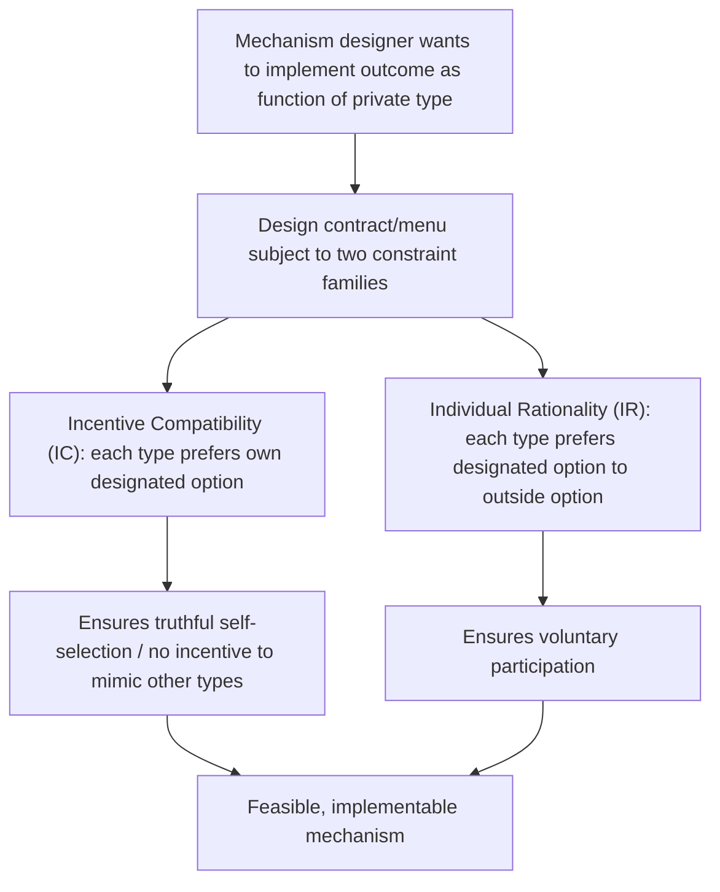

## Incentive Compatibility and Participation Constraints

### Definition and Conceptual Overview

Incentive compatibility (IC) and participation constraints (also called individual rationality, IR, constraints) are the two foundational constraint families that define whether a mechanism — a contract, tax schedule, auction rule, or menu of options — is actually **implementable** given that agents possess private information and act to maximize their own welfare. Together, they form the constraint set within which a principal or designer must optimize when private information prevents directly observing or contracting on an agent's true type or action. Virtually every result covered elsewhere in mechanism design and information economics — the Revelation Principle, screening menus, optimal auctions, optimal income taxation — is derived by explicitly solving a constrained optimization problem in which IC and IR constraints appear as the binding limits on what the designer can achieve.

### Participation (Individual Rationality) Constraints

**[Confirmed]** A participation constraint (IR constraint) requires that each agent, given the contract or mechanism offered, receives **at least as much utility as their outside option** (reservation utility) — otherwise, the agent will simply decline to participate at all, rendering the contract's terms for that agent moot.

$$U_i(\text{contract offered to type } \theta_i) \geq \bar{U}_i(\theta_i)$$

where $\bar{U}_i(\theta_i)$ is agent $i$'s reservation utility, which may itself depend on their type (e.g., a high-ability worker's outside option in the labor market is typically better than a low-ability worker's outside option).

**Key Points**

- IR constraints ensure a mechanism is **voluntary** — no agent can be forced into a worse outcome than simply walking away.
- In many models, only the **"binding" type's** IR constraint matters at the optimum — typically the type with the **worst** outside option or the type the designer is *least* eager to serve is the one whose participation constraint holds with equality, while other types enjoy **information rents** in excess of their reservation utility (see below).

### Incentive Compatibility Constraints

**[Confirmed]** An incentive compatibility constraint requires that each type of agent, faced with the full menu of options intended for all types, **prefers their own designated option** to any other option on the menu (or, in a direct mechanism, prefers to report their true type rather than any other type).

$$U_i(\theta_i \mid \text{own contract}) \geq U_i(\theta_i \mid \text{contract meant for type } \theta_j) \quad \forall j \neq i$$

**Key Points**

- IC constraints are what make **self-selection** work in screening mechanisms, and what makes **truth-telling** an equilibrium in direct mechanisms under the Revelation Principle.
- **Local vs. global IC**: in continuous-type models, it is often sufficient (given regularity conditions, notably the **single-crossing property**) to check only "local" incentive constraints — that a type does not want to deviate to an *adjacent* type — because the single-crossing structure ensures that if no local deviation is profitable, no global deviation is profitable either. This significantly simplifies the mathematics of continuous-type mechanism design problems.
- **Downward vs. upward IC constraints**: in models with an ordered type space (e.g., ability level, willingness to pay), it is common for **only the "downward" constraint** (a high type not wanting to mimic a lower type) to bind at the optimum, while the "upward" constraint (a low type wanting to mimic a higher type) is typically slack — this is a recurring structural feature across many mechanism design applications, including Mirrlees optimal taxation, where the standard concern is that high-ability individuals might understate their ability, not that low-ability individuals overstate it.

### The Single-Crossing Property (Sorting Condition)

**[Confirmed]** The single-crossing property (also called the Spence-Mirrlees sorting condition) is the key technical assumption that makes IC constraints tractable in models with a continuum or ordered set of types. It requires that the **marginal rate of substitution** between the two dimensions of the contract (e.g., quantity and payment, or income and consumption) is **monotonic in type** — meaning indifference curves for different types cross **at most once**, and always in the same direction.

**[Confirmed]** This property is what guarantees that:

- Higher types have a **systematically different** willingness to pay for higher levels of the allocation variable (e.g., quality, quantity, coverage) than lower types.
- A menu of contracts can be constructed such that agents naturally sort themselves by type along a single monotonic ordering, rather than requiring the designer to rule out an intractably large number of potential type-pair deviations.
- Without single-crossing, IC constraints become dramatically more complex, since many pairwise deviations must be checked individually and monotonic implementation (see below) may not characterize the solution.

### Envelope Theorem and Information Rents

**[Confirmed]** A central technique in solving mechanism design problems with a continuum of types is applying the **envelope theorem** to the agent's IC constraints, which yields a direct expression for how an agent's equilibrium utility must vary with their type along the truth-telling path:

$$\frac{dU_i(\theta_i)}{d\theta_i} = \frac{\partial U_i(\theta_i \mid \text{contract}(\theta_i))}{\partial \theta_i}$$

**[Confirmed]** Integrating this expression from the lowest type up to any given type $\theta$ reveals that **higher types generally must be left with strictly higher utility** than the binding IR constraint would require in isolation — a phenomenon known as **information rent**. This rent exists precisely because higher types could otherwise mimic lower types with less cost/effort than truly low types would incur, so the designer must "pay" higher types a surplus above their reservation utility specifically to keep them from finding it worthwhile to mimic a lower type and capture that lower type's more favorable terms.

$$U_i(\theta) = U_i(\theta_{min}) + \int_{\theta_{min}}^{\theta} \frac{\partial U_i(\tilde\theta \mid \text{contract}(\tilde\theta))}{\partial \tilde\theta} \, d\tilde\theta$$

**Key Points**

- Information rents are the **direct cost to the principal** of operating under asymmetric information — they represent surplus the principal must concede to higher types purely to satisfy incentive compatibility, over and above what would be needed if type were directly observable.
- This is the formal mechanism underlying the classic Mirrlees optimal taxation result that **high-ability individuals retain some surplus (information rent) rather than having 100% of their productivity advantage taxed away**, since taxing away the full surplus would eliminate their incentive to work at their true (higher) productivity level rather than mimicking a lower-ability type's reported income.

### Numerical Example: IC and IR in a Two-Type Screening Problem

**Example**

Consider a monopolist selling to two consumer types: low-value ($\theta_L$, reservation value per unit = $5) and high-value ($\theta_H$, reservation value per unit = $10), each with an outside option (no purchase) yielding zero utility. The monopolist offers a menu of quantity-price bundles $(q_L, T_L)$ and $(q_H, T_H)$.

**IR constraints**:

$$\theta_L \cdot q_L - T_L \geq 0 \quad \text{(low type participates)}$$

$$\theta_H \cdot q_H - T_H \geq 0 \quad \text{(high type participates)}$$

**IC constraints**:

$$\theta_L \cdot q_L - T_L \geq \theta_L \cdot q_H - T_H \quad \text{(low type doesn't prefer high bundle)}$$

$$\theta_H \cdot q_H - T_H \geq \theta_H \cdot q_L - T_L \quad \text{(high type doesn't prefer low bundle)}$$

**[Confirmed]** At the optimal (profit-maximizing) menu solving this problem, the standard result is that: (1) the **low type's IR constraint binds exactly** (low type receives exactly zero surplus above their outside option), (2) the **high type's "downward" IC constraint binds exactly** (high type is made just indifferent between their own bundle and mimicking the low type's bundle), while (3) the high type's IR constraint and the low type's "upward" IC constraint are both **slack** (not binding) at the optimum — leaving the high type with a strictly positive **information rent**, calculated as exactly the surplus they would obtain by mimicking the low type's bundle: $(\theta_H - \theta_L) \cdot q_L$.

### The "No Distortion at the Top" Result

**[Confirmed]** A recurring and important qualitative result across many mechanism design applications with an ordered type space is that the **highest type receives the efficient (first-best) allocation** — no distortion is imposed on the top type, since there is no higher type above them whose mimicking incentive needs to be deterred through a distorted allocation. **Distortion is instead concentrated on lower/intermediate types**, whose allocations are typically reduced below the first-best level specifically to reduce the information rent that would otherwise need to be conceded to higher types (since a lower type's allocation level directly determines how attractive mimicking that type would be to a higher type, per the mimicking-surplus expression above).

**[Inference]** This is precisely the theoretical logic behind the general Mirrlees optimal income tax finding that the **marginal tax rate at the very top of the ability/income distribution should be zero** (in the standard finite-population, bounded-support version of the model) — the same "no distortion at the top" principle that first emerges in the simpler discrete-type screening framework illustrated above.

### Applications Across Public Economics

**Key Points**

- **Optimal income taxation**: IC constraints ensure high-ability individuals do not wish to reduce their reported income to mimic lower-ability types and reduce their tax burden; IR constraints (in some formulations) relate to individuals' decision of whether to participate in the labor force at all versus relying on non-labor income or transfers.
- **Optimal auction design**: IC constraints ensure bidders truthfully reveal their valuations (in a direct-mechanism formulation, per the Revelation Principle); IR constraints ensure bidders are willing to participate in the auction rather than abstaining.
- **Regulation of natural monopolies**: Regulators designing incentive contracts for privately informed monopolists (e.g., regarding their true cost structure) must satisfy IC constraints (the firm doesn't want to misreport costs to extract a more favorable regulatory contract) and IR constraints (the firm is willing to operate under the regulatory contract rather than exiting).
- **Optimal insurance/screening menus**: As in the Rothschild-Stiglitz framework, insurers designing menus of coverage-premium combinations must satisfy IC constraints (each risk type prefers their own designated contract) and IR constraints (each type prefers their contract to remaining uninsured).

### Common Pitfalls in Analysis

**Key Points**

- Assuming **all** IC and IR constraints bind simultaneously at the optimum — in most well-behaved mechanism design problems, only a specific subset (often just the "downward" IC constraints and the lowest type's IR constraint) bind, while others are slack; correctly identifying which constraints bind is often the key technical step in solving these problems.
- Ignoring the **single-crossing property** as a precondition for the standard "check only local/adjacent IC constraints" simplification — without single-crossing, this shortcut is invalid and a fuller set of pairwise constraints must be checked.
- Treating **information rents** as an avoidable inefficiency the designer failed to eliminate — information rents are, in fact, the **necessary cost** of maintaining incentive compatibility under private information; eliminating them entirely would generally require abandoning the designer's ability to differentiate the mechanism across types altogether.
- Confusing the **"no distortion at the top"** result with a claim that no type receives an efficient allocation — the result specifically concerns the boundary (top) type in models with an ordered, bounded type space; other types generically receive distorted (non-first-best) allocations at the optimum.

### Related Topics

- Revelation Principle
- Screening and Self-Selection Mechanisms
- Adverse Selection and Signaling
- Optimal Income Taxation (Mirrlees Model)
- Myerson's Optimal Auction Design
- Information Rents in Mechanism Design
- Single-Crossing Property and Sorting Conditions
- Moral Hazard and Principal-Agent Problems