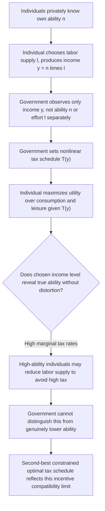

## Mirrlees Model of Optimal Nonlinear Income Taxation

### Definition and Conceptual Overview

The Mirrlees model, introduced by James Mirrlees in his 1971 paper "An Exploration in the Theory of Optimum Income Taxation," is the foundational framework for analyzing how a government should design a nonlinear income tax schedule when individuals differ in **innate earning ability**, which is **privately known to each individual** and unobservable to the government. The government can only observe **income** (the product of ability and labor effort), not ability itself, creating a fundamental information asymmetry that constrains what redistributive tax policy can achieve. This is formally a **screening/mechanism design problem** (governed by the Revelation Principle, incentive compatibility, and information rent logic covered elsewhere): the government designs a tax schedule such that individuals of different ability levels self-select into different labor supply and income choices, revealing information about their type indirectly through their economic behavior.

### The Core Trade-off: Equity vs. Efficiency

**[Confirmed]** The Mirrlees framework formalizes the classic **equity-efficiency tradeoff** in taxation:

- The government wants to **redistribute** income from high-ability to low-ability individuals to increase social welfare (assuming a social welfare function that values equality, such as a utilitarian or Rawlsian objective).
- Redistribution requires **taxing income**, but because income is a function of both ability and **labor effort** (a choice variable), taxing income distorts the labor-leisure decision — high-ability individuals facing high marginal tax rates may reduce their labor supply, and the government cannot distinguish "high ability choosing to work less due to taxation" from "genuinely lower ability."
- This creates an unavoidable **incentive compatibility constraint**: the tax schedule must be designed so that high-ability individuals do not find it advantageous to **mimic** lower-ability individuals (by working less and earning less) purely to reduce their tax burden.

### Formal Model Setup

**[Confirmed]** Individuals have ability (or "type") $n$, drawn from a distribution $F(n)$ on $[n_{min}, n_{max}]$, privately known to each individual. An individual of ability $n$ choosing labor supply $l$ produces income $y = nl$. Utility is defined over consumption $c$ and labor supply $l$ (or equivalently leisure):

$$U(c, l) \quad \text{with} \quad U_c > 0, \; U_l < 0$$

The government observes only $y$ (income), not $n$ or $l$ separately, and sets a tax schedule $T(y)$, so after-tax consumption is:

$$c = y - T(y)$$

The government's problem is to choose $T(\cdot)$ to maximize a social welfare function (typically a weighted sum or a concave transformation of individual utilities, reflecting some concern for equality) subject to:

1. A government **budget/revenue constraint** (aggregate tax revenue must at least cover required expenditure).
2. **Incentive compatibility**: each individual, given the schedule $T(\cdot)$, chooses the labor supply/income level that a person of their true ability would actually choose — equivalently (via the Revelation Principle), no individual wants to "mimic" the income choice of a different ability type.

### Key Qualitative Results

**[Confirmed]** The Mirrlees model, despite its mathematical complexity, yields several well-established and widely cited qualitative results that have deeply influenced modern tax policy analysis:

**1. Marginal tax rate on the highest-ability individual should be zero ("no distortion at the top")**

**[Confirmed]** In the standard finite-population (bounded ability distribution) version of the model, the theoretically optimal marginal tax rate on the **very top** earner is **zero**. This follows directly from the general "no distortion at the top" mechanism design principle: since there is no higher ability type above the top earner whose mimicking incentive needs to be deterred, distorting the top earner's labor supply serves no incentive-compatibility purpose and only creates unnecessary deadweight loss. **[Inference]** This result is frequently misunderstood as implying "the top tax rate should be zero" as a practical policy prescription — but the result applies literally only to the single highest-ability individual in a bounded distribution, and does not directly imply that marginal rates should be low or zero across the broader upper part of the income distribution; extensions to unbounded (Pareto-tailed) ability distributions produce different and more nuanced top-rate formulas (see the Saez-style optimal top tax rate literature).

**2. Marginal tax rate on the lowest-ability individual is often (but not always) zero at the bottom under certain formulations**

**[Confirmed]** A related but distinct result concerns the bottom of the ability distribution: under certain standard assumptions, the marginal tax rate at the very **bottom** of the distribution is also zero in some formulations of the model — though this result is less universally robust across model variants than the top-rate result, and depends on specific assumptions about the shape of the ability distribution and whether a "bunching" region exists at the bottom (e.g., due to extensive-margin labor force participation decisions).

**3. Optimal marginal tax rates are generally strictly between 0% and 100% throughout the interior of the distribution**

**[Confirmed]** Except at the boundary points discussed above, the optimal marginal tax rate schedule is generally **U-shaped or follows a more complex non-monotonic pattern** across the income distribution, depending on the shape of the ability distribution, the social welfare weights placed on different income groups, and the elasticity of labor supply — there is no general theoretical result implying marginal rates should be uniformly increasing (fully progressive) or uniformly decreasing throughout the distribution; the optimal shape is an empirical and parameter-dependent question rather than a universal qualitative law.

### The Optimal Tax Formula (ABC Formula)

**[Confirmed]** Modern presentations of the Mirrlees model (particularly following Diamond, 1998, and Saez, 2001) express the optimal marginal tax rate at income level $y$ using a tractable "sufficient statistics" formula often summarized as depending on three components — commonly referred to informally as the "ABC" of optimal taxation:

$$T'(y) = \frac{1 - G(y)}{1 - G(y) + \alpha(y) \cdot \varepsilon(y) \cdot \frac{y \cdot h(y)}{1 - H(y)}}$$

**[Inference]** (Exact formulations vary somewhat across papers in this literature in notation and precise derivation.) The three key components are:

- **(A) The social marginal welfare weight** on individuals earning above $y$ — reflecting how much the government values redistributing away from high earners (related to $G(y)$, capturing the government's valuation of the marginal utility of income accruing to those taxed at the margin).
- **(B) The elasticity of taxable income (ETI)**, $\varepsilon(y)$ — capturing how responsive labor supply/reported income is to the marginal tax rate at that income level; higher elasticity implies **lower** optimal marginal rates at that point, since taxation is more distortionary where behavioral responses are larger.
- **(C) The shape of the income distribution** at that point, captured by the hazard rate $h(y)/(1-H(y))$ — reflecting how "thick" or "thin" the income distribution is at that income level and above, which affects how much revenue can be raised from a marginal rate change at that point relative to the distortion it creates.

**[Confirmed]** This "sufficient statistics" approach, pioneered substantially by Saez (2001) building on Mirrlees's original framework, reformulates the abstract mechanism design problem into an expression using **empirically estimable** parameters (the elasticity of taxable income and the shape of the observed income distribution), making the Mirrlees framework directly applicable to real-world calibration exercises rather than remaining a purely theoretical construct.

### Numerical Example: Optimal Rate Sensitivity to Elasticity

**Example**

Using a simplified version of the optimal top tax rate formula (relevant for a Pareto-tailed upper income distribution, following Saez's extension):

$$\tau^* = \frac{1}{1 + a \cdot \varepsilon}$$

where $a$ is the Pareto parameter of the income distribution's upper tail (**[Unverified]** commonly estimated in the empirical literature to be in a range often cited around 1.5 to 3 for many developed-country income distributions, though specific estimates vary by country, time period, and data source and should be verified against current empirical work rather than treated as a fixed universal constant) and $\varepsilon$ is the elasticity of taxable income at the top.

If $a = 2$ and $\varepsilon = 0.25$: $\tau^* = \frac{1}{1 + 2(0.25)} = \frac{1}{1.5} \approx 0.67$ (a 67% revenue-maximizing top marginal rate).

If $\varepsilon$ rises to $0.5$ (greater behavioral responsiveness): $\tau^* = \frac{1}{1 + 2(0.5)} = \frac{1}{2} = 0.50$ (a 50% top rate).

**[Inference]** This example illustrates the formula's central qualitative implication: **the optimal top tax rate is highly sensitive to the assumed elasticity of taxable income**, which is precisely why empirical estimation of the ETI is such a central and often contentious focus of applied optimal-taxation research — small differences in the assumed or estimated elasticity translate into materially different top-rate prescriptions.

### Information Rents and the Distortion Mechanism

**[Confirmed]** As in the general screening/mechanism-design framework, the Mirrlees model's core distortion mechanism operates through **information rents**: to prevent high-ability individuals from mimicking lower-ability individuals' reported income (and thereby facing a lower tax burden), the tax schedule must leave high-ability individuals with **higher utility** than the minimum needed to satisfy their own participation constraint — this surplus is the information rent, directly analogous to the information rent concept in general mechanism design (see Incentive Compatibility and Participation Constraints), and it is precisely what limits how aggressively the government can redistribute even when it has a strong social preference for equality.

### Relationship to Other Optimal Tax Frameworks

**Key Points**

- **Contrast with the Ramsey commodity tax model**: The Ramsey framework (and its Corlett-Hague extension) addresses **commodity** taxation given a **fixed** (often linear or exogenously constrained) income tax; the Mirrlees model directly addresses the **design of the income tax itself** as a fully nonlinear instrument, and is the framework within which the Atkinson-Stiglitz uniform-commodity-taxation result is proven (Atkinson-Stiglitz explicitly assumes an **optimally chosen nonlinear (Mirrlees-style) income tax** operates alongside commodity taxes).
- **Connection to the Diamond-Mirrlees production efficiency result**: Mirrlees's 1971 optimal income tax paper and the Diamond-Mirrlees production efficiency papers (also 1971) are separate but closely related contributions from the same broader research program on optimal taxation under second-best (informationally or instrumentally constrained) conditions.
- **Extensive vs. intensive margin responses**: **[Inference]** The original Mirrlees model primarily emphasizes the **intensive margin** (how much someone who is already working adjusts their hours/effort); substantial subsequent literature (e.g., work by Saez incorporating labor force **participation** decisions) has extended the framework to jointly consider the **extensive margin** (whether to work at all), which can produce materially different optimal tax and transfer prescriptions, particularly at the bottom of the income distribution (relevant to the design of features like the Earned Income Tax Credit).

### Practical and Empirical Applications

**Key Points**

- **Calibrating optimal top marginal tax rates**: The Saez-style sufficient-statistics formula derived from the Mirrlees framework is widely used in applied public finance to calibrate revenue-maximizing or welfare-maximizing top tax rates using empirically estimated elasticities of taxable income and Pareto parameters of the income distribution.
- **Designing the shape of tax-and-transfer schedules**: The framework informs debates over the appropriate progressivity of tax schedules, phase-out rates for means-tested benefits, and the design of features like the Earned Income Tax Credit, particularly once extensive-margin labor supply responses are incorporated.
- **Evaluating tax reform proposals**: Modern optimal-tax analysis frequently uses Mirrlees-derived formulas as a benchmark against which to evaluate whether proposed changes to marginal tax rates at specific income levels move the system closer to or further from the theoretically implied optimum, given estimated behavioral elasticities.

### Common Pitfalls in Analysis

**Key Points**

- Misinterpreting the **"no distortion at the top"** result as a general policy prescription that top tax rates should be low or zero — the result applies strictly to the single highest earner in a bounded ability distribution and does not directly generalize to the broader upper-income population under more realistic (unbounded, Pareto-tailed) distributional assumptions.
- Assuming the Mirrlees model implies a specific, universal **shape** (e.g., strictly increasing, U-shaped) for optimal marginal tax rates across the whole income distribution — the actual optimal shape is highly sensitive to the assumed social welfare function, ability distribution, and elasticity parameters, and does not follow a single universal qualitative law.
- Treating the **elasticity of taxable income** as a fixed, universally agreed-upon parameter — ETI estimates vary substantially across studies, populations, income levels, and time periods, and the optimal tax formulas are highly sensitive to which elasticity value is assumed.
- Confusing the Mirrlees **income tax** framework with the Ramsey **commodity tax** framework — they address different tax instruments and are governed by different (though related) theoretical results.

### Related Topics

- Elasticity of Taxable Income
- Incentive Compatibility and Participation Constraints
- Revelation Principle
- Screening and Self-Selection Mechanisms
- Atkinson-Stiglitz Theorem and Uniform Commodity Taxation
- Diamond-Mirrlees Production Efficiency Theorem
- Optimal Top Marginal Tax Rate Formulas (Saez)
- Earned Income Tax Credit and Extensive-Margin Labor Supply