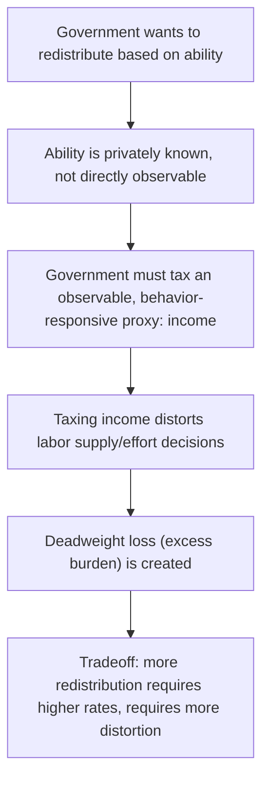

## Equity-Efficiency Tradeoff in Tax Design

### Definition and Conceptual Overview

The equity-efficiency tradeoff is the central organizing tension in the design of tax and transfer policy: raising revenue to fund redistribution and public goods requires distortionary taxation, which imposes an efficiency cost (excess burden), while achieving greater equality of outcomes generally requires more aggressive redistribution, which in turn requires higher marginal tax rates and larger behavioral distortions. No tax system can simultaneously achieve **zero deadweight loss** and **arbitrary redistribution**, except in the theoretical special case of costless (lump-sum) taxation, which is unavailable whenever taxable characteristics (income, consumption, ability) are the only observable basis for taxation and those characteristics respond to incentives. This tradeoff underlies essentially every major result covered elsewhere in optimal taxation theory — the Ramsey Rule, the Mirrlees model, the choice of marginal tax rate schedules — and provides the conceptual bridge connecting positive tax theory (how taxes distort behavior) to normative policy design (how much redistribution is worth how much distortion).

### The Fundamental Impossibility: Why Lump-Sum Taxation Fails

**[Confirmed]** In a first-best world, the government could levy a **lump-sum tax** — a fixed liability unrelated to any economic choice the individual makes — achieving any desired redistribution with **zero excess burden**, since a lump-sum tax does not change relative prices or incentives at the margin. The equity-efficiency tradeoff arises specifically because a **non-uniform** lump-sum tax (one that differs across individuals based on their true underlying characteristics, such as ability) would require the government to **observe** those characteristics directly. Since ability, in particular, is not directly observable — only its market manifestation, income, is observable, and income is a **choice variable** responsive to incentives — any attempt to redistribute based on an unobservable characteristic must instead operate through a **base that responds to behavior** (income, consumption), introducing exactly the kind of distortion a true lump-sum tax would avoid.

### Formalizing the Tradeoff: The Social Welfare Function Approach

**[Confirmed]** The standard formalization of the equity-efficiency tradeoff embeds a **social welfare function (SWF)** that aggregates individual utilities with explicit **weights reflecting a normative preference for equality**:

$$W = \int G(U_i) \, dF(i)$$

where $G(\cdot)$ is typically assumed **concave**, meaning the SWF places relatively more weight on utility gains for lower-utility individuals than for higher-utility individuals. The degree of concavity of $G(\cdot)$ directly parameterizes the government's **inequality aversion**:

- **Utilitarian SWF** ($G(U) = U$, linear): the government cares only about the **sum** of utilities, with no explicit preference for equality beyond what utility's own diminishing marginal value already implies.
- **Rawlsian (maximin) SWF** ($G(\cdot)$ approaching an extreme form that weights only the worst-off individual): the government cares **only** about maximizing the utility of the least-well-off person, implying the highest degree of inequality aversion and, correspondingly, the most aggressive redistribution consistent with not shrinking the total resources available to redistribute.
- **Intermediate SWFs**: most applied optimal-tax analysis uses SWFs with an intermediate degree of concavity, calibrated to reflect a specific, debatable, but analytically tractable degree of inequality aversion.

**[Inference]** The choice of $G(\cdot)$ is a **value judgment**, not a fact derivable from economic theory alone — different reasonable people can hold different views about the appropriate degree of inequality aversion, and optimal tax formulas (such as the Mirrlees ABC formula) are explicitly parameterized by this normative choice, meaning "the" optimal tax rate is not a single number independent of ethical premises but a function of which SWF is adopted.

### The Okun "Leaky Bucket" Metaphor

**[Confirmed]** Arthur Okun's influential 1975 metaphor, from his book "Equality and Efficiency: The Big Tradeoff," describes redistribution as carrying water (resources) in a **leaky bucket** from the rich to the poor: some water is inevitably lost in transit due to the **administrative costs and behavioral distortions** created by the tax-and-transfer system. The central policy question the metaphor poses is: **how much leakage (efficiency loss) is society willing to accept for a given amount of redistribution successfully delivered?**

**[Inference]** This metaphor captures the intuitive core of the equity-efficiency tradeoff without requiring the full mathematical apparatus of the Mirrlees model, and remains widely used in public economics teaching and policy discourse as an accessible framing device for the underlying formal tradeoff.

### Marginal Cost of Redistribution: Formal Connection to Excess Burden

**[Confirmed]** The equity-efficiency tradeoff can be expressed precisely using the Marginal Excess Burden (MEB) and Marginal Cost of Public Funds (MCPF) concepts developed elsewhere: each additional dollar of tax revenue extracted from higher-income individuals to fund redistribution costs society $MCPF = 1 + MEB$ dollars in real resources, where $MEB$ rises with the marginal tax rate. The **socially optimal** degree of redistribution, under this framework, occurs where the **social marginal benefit** of transferring another dollar to lower-income individuals (weighted by the SWF's concavity) **just equals** the marginal social cost, $MCPF$, of raising that dollar through distortionary taxation.

$$\text{Optimal redistribution: } \quad G'(U_{low}) = MCPF \times G'(U_{high})$$

**[Inference]** As the tax rate on higher earners rises to fund more redistribution, $MEB$ (and hence $MCPF$) rises (recall $MEB$ scales with the square of the tax rate in the standard Harberger approximation), meaning the **marginal cost of each additional dollar redistributed rises** as redistribution increases — this is the formal mechanism generating a genuine tradeoff (an interior optimum) rather than a corner solution of either zero or complete redistribution.

### The Role of the Elasticity of Taxable Income

**Key Points**

- The **elasticity of taxable income (ETI)** is the single most important empirical parameter determining where the equity-efficiency tradeoff bites, since it directly determines how much deadweight loss (and hence how much "leakage" in Okun's metaphor) results from any given increase in marginal tax rates.
- **Higher ETI** implies a **steeper** equity-efficiency tradeoff: any given amount of additional redistribution requires accepting a **larger** efficiency cost, since behavioral responses to taxation are stronger.
- **Lower ETI** implies a **flatter** tradeoff: more redistribution can be achieved per unit of efficiency cost, since taxpayers respond less to the higher rates.
- **[Unverified]** Empirical estimates of the ETI vary considerably by income level, country, time period, and the specific margin of response being measured (labor supply hours versus tax avoidance/income-shifting versus reported taxable income more broadly), and this variation is itself a major source of ongoing disagreement in applied optimal-tax policy debates about where the efficient point on the tradeoff actually lies.

### Numerical Illustration: The Tradeoff Curve

**Example**

Consider a stylized economy where a marginal tax rate $t$ on high earners funds a per-capita transfer to low earners. Suppose the revenue raised (net of behavioral response) as a function of $t$ follows a Laffer-curve-like pattern, and the "efficiency loss" per dollar of revenue is $MEB(t) \approx \varepsilon \cdot t$ for elasticity $\varepsilon = 0.4$.

| Tax rate $t$ | MEB per dollar (deadweight loss) | Interpretation |
| --- | --- | --- |
| 20% | 0.08 | Modest leakage: $1.08 cost per $1 redistributed |
| 40% | 0.16 | Rising leakage: $1.16 cost per $1 redistributed |
| 60% | 0.24 | Substantial leakage: $1.24 cost per $1 redistributed |
| 80% | 0.32 | Severe leakage: $1.32 cost per $1 redistributed, and revenue itself may be falling if approaching the Laffer peak |

**[Inference]** This table illustrates why the equity-efficiency tradeoff generally does not support driving redistributive tax rates to their revenue-maximizing (Laffer peak) limit purely for redistributive purposes — the marginal cost of the last few percentage points of rate increase (in terms of efficiency loss per dollar successfully transferred) rises sharply, meaning the socially optimal rate under most reasonable social welfare functions falls **below** the pure revenue-maximizing rate, since the SWF must weigh this rising marginal cost against the (typically diminishing, under concave $G(\cdot)$) marginal social benefit of additional redistribution.

### Instruments Beyond the Marginal Tax Rate

**Key Points**

- **Broadening the tax base** (per the base-broadening logic covered under Determinants of Excess Burden) allows a given amount of revenue/redistribution to be achieved with a **lower** required marginal rate on any given margin, partially easing the tradeoff without requiring any change in society's underlying inequality aversion.
- **Well-designed refundable tax credits (e.g., Earned Income Tax Credit-style instruments)** can achieve redistribution toward low-income working households while, in some ranges, **increasing** rather than decreasing labor supply incentives at the extensive margin (encouraging labor force participation), partially decoupling the redistribution-efficiency tradeoff at the bottom of the income distribution from the standard "higher marginal rate implies more distortion" logic that dominates at higher income levels.
- **In-kind versus cash transfers**: **[Inference]** The choice between cash and in-kind redistribution (e.g., housing assistance, food assistance, healthcare provision) carries its own distinct efficiency implications, since in-kind transfers can reduce certain behavioral distortions (e.g., by targeting specific goods with lower elasticity or with paternalistic/externality-based rationales) but may also reduce recipient welfare relative to an equivalent cash transfer if recipients would have preferred to allocate the resources differently — a separate but related consideration to the pure marginal-rate tradeoff.
- **Corrective (Pigouvian) elements**: Taxes justified by externality correction (e.g., carbon taxes) can, in principle, **simultaneously** raise revenue for redistribution **and** improve efficiency (by correcting the externality), representing one of the few cases where the equity-efficiency tradeoff can be **eased rather than worsened** by a specific tax design choice — often referred to as part of the "double dividend" discussion connected to the Marginal Cost of Public Funds framework.

### Political Economy and Measurement Considerations

**Key Points**

- **The tradeoff's steepness is contested empirically**, not just normatively: economists broadly agree on the *qualitative* existence of an equity-efficiency tradeoff but frequently disagree substantially on its *quantitative* steepness, largely due to disagreement over key parameters like the elasticity of taxable income and the appropriate treatment of general equilibrium and long-run behavioral responses.
- **The normative weighting is inherently a value judgment**: unlike the elasticity parameters, which are in principle empirically estimable (even if contested), the choice of social welfare function concavity (how much society should value equality relative to aggregate output) is a fundamentally **ethical** choice not resolvable by economic analysis alone — economists can characterize the tradeoff and its steepness, but cannot by themselves determine where on that tradeoff a society "should" locate.
- **[Inference]** This dual source of disagreement — contested empirical parameters plus genuinely differing value judgments — helps explain why the equity-efficiency tradeoff remains one of the most persistently debated topics in public economics and tax policy, despite broad technical agreement on the underlying formal framework (the Mirrlees model and its sufficient-statistics extensions) used to characterize it.

### Common Pitfalls in Analysis

**Key Points**

- Treating the equity-efficiency tradeoff as implying **any** redistribution is necessarily "inefficient" in a normatively loaded sense — the tradeoff describes a real resource cost, but whether that cost is "worth it" depends entirely on the social welfare weights applied, which is a value judgment, not a technical error to be avoided.
- Assuming the tradeoff is **linear or constant** across the range of possible tax rates — because MEB scales with the square of the tax rate, the marginal cost of redistribution rises with the tax rate, meaning the tradeoff steepens progressively rather than remaining constant.
- Ignoring **corrective (Pigouvian) exceptions** where well-designed taxes can improve efficiency and fund redistribution simultaneously, incorrectly assuming all redistributive taxation necessarily involves a pure efficiency cost.
- Conflating **disagreement over elasticity estimates** (an empirical question) with **disagreement over the social welfare function** (an ethical question) — both contribute to disagreement over "optimal" tax policy, but they are analytically distinct sources of disagreement requiring different types of evidence or argument to resolve.

### Related Topics

- Mirrlees Model of Optimal Nonlinear Income Taxation
- Marginal Excess Burden (MEB)
- Marginal Cost of Public Funds (MCPF)
- Elasticity of Taxable Income
- Social Welfare Functions and Inequality Aversion
- Earned Income Tax Credit and Extensive-Margin Labor Supply
- Pigouvian Taxation and the Double Dividend Hypothesis
- Optimal Top Marginal Tax Rate Formulas (Saez)