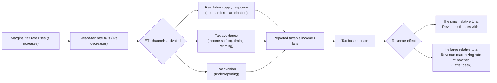

## Elasticity of Taxable Income

### Definition and Conceptual Foundation

The Elasticity of Taxable Income (ETI) measures the responsiveness of an individual's reported taxable income to changes in the net-of-tax rate (one minus the marginal tax rate). Formally, it captures the percentage change in taxable income resulting from a one percent change in the net-of-tax rate, holding other factors constant.

$$e = \frac{\partial \ln z}{\partial \ln (1-\tau)}$$

where $z$ denotes taxable income and $\tau$ denotes the marginal tax rate, so $(1-\tau)$ is the net-of-tax rate (the fraction of an additional dollar of income the taxpayer keeps).

ETI generalizes the older concept of the labor supply elasticity. Rather than measuring only how hours worked respond to taxes, ETI captures the full set of behavioral margins through which taxpayers adjust reported income in response to taxation. This makes it the central sufficient statistic in modern optimal income tax theory, since it aggregates diverse behavioral responses into a single parameter usable for welfare and revenue analysis.

### Behavioral Margins Captured by ETI

**Key Points**

- **Real labor supply responses**: hours worked, labor force participation, effort, and career choices.
- **Tax avoidance**: shifting income across time periods, across income categories (e.g., wage versus capital income), or across family members.
- **Tax evasion**: underreporting income illegally.
- **Income shifting between tax bases**: for business owners, reclassifying compensation between wages, dividends, and retained earnings depending on relative tax treatment.
- **Human capital investment**: changes in education, training, or occupational choice induced by after-tax returns to skill.
- **Fringe benefits substitution**: converting taxable cash compensation into non-taxable benefits.

Because ETI nets out all of these channels, it does not distinguish real economic responses (which have first-order welfare implications through changes in labor effort) from avoidance and evasion responses (which mainly reflect fiscal externalities and transfers rather than changes in real output). This distinction matters greatly for welfare interpretation, discussed further below.

### The Feldstein Framework

Martin Feldstein's 1995 and 1999 contributions established ETI as the key sufficient statistic for tax policy analysis, building on the insight that under certain conditions, a single elasticity parameter can summarize the deadweight loss from income taxation without needing to model each specific behavioral channel separately.

**Envelope theorem argument**: Consider an individual maximizing utility over consumption and taxable income $z$, subject to a budget constraint $c = (1-\tau)z + R$, where $R$ is virtual (non-labor) income. At the optimum, since the individual has already chosen $z$ to maximize utility given $(1-\tau)$, a small change in $\tau$ has only a second-order effect on utility through the direct behavioral response (envelope theorem), while the government's revenue loss from the same behavioral response is first-order. This asymmetry is what allows deadweight loss to be expressed purely in terms of the elasticity $e$ and the tax rate, without needing to separately identify which margin generated the response.

**Formula for marginal excess burden**: For a small tax increase $d\tau$ at income level $z$, the marginal deadweight loss (per dollar of mechanical revenue) can be approximated as:

$$\frac{dDWL}{dR} \approx \frac{\tau}{1-\tau} \cdot e$$

This shows that deadweight loss rises with both the elasticity and the level of the tax rate, and rises more than proportionally at high tax rates due to the $\tau/(1-\tau)$ term.

### The Feldstein-Saez Formula for Optimal Top Tax Rates

The most widely cited application of ETI is the formula for the revenue-maximizing (Laffer-consistent) top marginal tax rate, derived by Saez (2001) building on Feldstein's framework:

$$\tau^* = \frac{1}{1 + a \cdot e}$$

where:

- $\tau^*$ is the revenue-maximizing top marginal tax rate
- $a$ is the Pareto parameter describing the thinness of the income distribution's upper tail (higher $a$ means a thinner tail, i.e., income is less concentrated at the very top)
- $e$ is the elasticity of taxable income

**Interpretation**: A higher ETI implies a lower revenue-maximizing tax rate, because taxpayers shrink their reported income more aggressively in response to higher rates, eroding the tax base. A thinner top tail (higher $a$) also implies a lower optimal rate, because a small number of very high earners contribute disproportionately to revenue and their behavioral response is more consequential.

If the social planner also places positive social welfare weight $g$ on the marginal utility of top earners (rather than purely maximizing revenue), the formula generalizes to:

$$\tau^* = \frac{1 - g}{1 - g + a \cdot e}$$

where $g \in [0,1]$ reflects the government's redistributive preference for the marginal dollar accruing to top earners; $g = 0$ recovers the pure revenue-maximizing case.

### Empirical Estimation Methods

**Standard difference-in-differences / instrumental variables approach**: Because tax reforms change marginal rates differentially across income groups, researchers typically use a "grouping" or "synthetic instrument" strategy:

1. Compute each individual's counterfactual net-of-tax rate under the old tax schedule and the new tax schedule applied to their pre-reform income.
2. Use the log change in the counterfactual net-of-tax rate (holding income fixed at pre-reform levels) as an instrument for the actual log change in the net-of-tax rate, since the actual net-of-tax rate is endogenous to the income response itself.
3. Regress the log change in income on the instrumented log change in the net-of-tax rate, typically with controls for mean reversion and secular income trends across the income distribution.

The canonical regression specification (Gruber and Saez, 2002) takes the form:

$$\ln\left(\frac{z_{i,t+3}}{z_{i,t}}\right) = \beta \ln\left(\frac{1-\tau_{i,t+3}}{1-\tau_{i,t}}\right) + X_i \gamma + \varepsilon_i$$

where $\beta$ is the estimated ETI, and $X_i$ typically includes a spline or polynomial in log income (to control for mean reversion) and other demographic controls.

**Bunching estimator (Saez, 2010)**: A separate, widely used non-parametric method exploits the fact that individuals near a kink point in the tax schedule (where the marginal rate discretely jumps) will "bunch" their reported income just below the kink if their ETI is nonzero. The excess mass in the income density around the kink, relative to a smoothly interpolated counterfactual density, identifies the elasticity:

$$e = \frac{\Delta z / z^*}{\Delta \ln(1-\tau)}$$

where $\Delta z/z^*$ is the normalized excess bunching mass and $\Delta \ln(1-\tau)$ is the log change in the net-of-tax rate at the kink. This method is attractive because it requires only cross-sectional data on the income distribution near a known kink and does not require panel data or an external control group, though it is sensitive to frictions (e.g., inattention, adjustment costs) that dampen observable bunching even when the "structural" elasticity is nonzero.

### Empirical Estimates and Consensus Ranges

**Key Points**

- Early Feldstein (1995) estimates using the U.S. Tax Reform Act of 1986 found ETI values as high as 1.0–3.0, now considered substantially upward-biased.
- Subsequent work correcting for mean reversion and pre-existing income trends (Auten and Carroll, 1999; Gruber and Saez, 2002) produced lower estimates, typically in the range of 0.12 to 0.4 for overall taxable income.
- Gruber and Saez (2002) found a broad income elasticity around 0.12 and a taxable income elasticity (net of deductions) around 0.4, with the difference attributable to the elasticity of deductions themselves.
- Chetty (2012) proposed reconciling the wide range of estimates across studies by distinguishing between "small" and "large" elasticities depending on the presence of adjustment frictions and the size of the tax change studied, arguing that observed micro-elasticities understate the long-run macro-relevant elasticity when frictions are present.
- Elasticities are found to be substantially higher for self-employed individuals and business owners than for wage earners, since the self-employed have greater latitude to shift income timing and characterization. [Inference: exact magnitudes vary by country and time period and should not be treated as universal constants]
- The elasticity is generally found to be much higher at the top of the income distribution than in the middle, which matters directly for the Feldstein-Saez top-rate formula.

### Decomposing ETI: Real Responses versus Tax Avoidance

A central concern in the literature (Slemrod, 1995; Chetty, 2009; Saez, Slemrod, and Giertz, 2012) is that a high estimated ETI may substantially reflect tax avoidance and income shifting rather than reductions in real economic activity (labor supply, effort, entrepreneurship). This distinction has first-order implications for welfare analysis:

- If the elasticity reflects **real responses**, higher taxes reduce actual output and generate genuine deadweight loss from reduced labor supply.
- If the elasticity reflects **avoidance/shifting** into a base that is not fully captured elsewhere in the tax system (e.g., legal tax planning, income retiming, fringe benefit substitution), the welfare cost is still real but stems from the “fiscal externality” of eroding the tax base rather than from a loss in real output.
- If the elasticity reflects shifting into a **different but still-taxed base** (e.g., from wage income to dividend income, both taxed, just at different rates), then the true revenue and welfare consequences are smaller than the raw estimated ETI on the narrow base would suggest, since revenue collected elsewhere partially offsets the apparent loss.

This has led to a distinction between the **narrow ETI** (response of taxable income under a specific tax base) and the broader concept of the **elasticity of economic income** or the need to adjust the sufficient-statistic formula using an estimate of the fraction of the response that constitutes genuine income shifting versus real behavioral change. Saez, Slemrod, and Giertz (2012) propose incorporating an explicit "fiscal externality" adjustment term into the optimal tax formula when part of the elasticity reflects shifting into other taxed bases.

### Illustration: Deadweight Loss and the Laffer Curve Relationship

### Worked Numerical Example

**Example**

Suppose policymakers are evaluating the top marginal tax rate for the highest income bracket. Empirical estimates suggest:

- Pareto parameter $a = 1.5$ (moderately thin upper tail, consistent with many advanced-economy income distributions)
- Elasticity of taxable income $e = 0.25$ (a commonly cited "consensus" estimate for the overall U.S. population, Chetty 2012 range)

Applying the pure revenue-maximizing formula:

$$\tau^* = \frac{1}{1 + a \cdot e} = \frac{1}{1 + (1.5)(0.25)} = \frac{1}{1.375} \approx 0.727$$

This implies a revenue-maximizing top marginal rate of approximately 72.7%. If instead the ETI were higher, say $e = 0.5$ (consistent with estimates that include substantial avoidance responses among high earners), the formula gives:

$$\tau^* = \frac{1}{1 + (1.5)(0.5)} = \frac{1}{1.75} \approx 0.571$$

This example illustrates the formula's high sensitivity to the assumed elasticity, which is precisely why ETI estimation has been such a contentious and consequential empirical literature: the policy-relevant optimal rate can shift by 15 percentage points or more depending on which elasticity estimate is used. [Inference: the specific numerical outputs above are illustrative computations from the formula, not point estimates from any single published study]

### Diagram: ETI and the Revenue-Maximizing Rate (svg_diagram)

<svg xmlns="http://www.w3.org/2000/svg" viewBox="0 0 640 420">
<text x="320" y="28" text-anchor="middle" font-size="16" font-weight="bold" fill="#1a1a1a">Tax Revenue as a Function of the Top Rate (svg_diagram)</text>
<line x1="70" y1="360" x2="600" y2="360" stroke="#333" stroke-width="2" />
<line x1="70" y1="360" x2="70" y2="50" stroke="#333" stroke-width="2" />
<text x="335" y="400" text-anchor="middle" font-size="13" fill="#333">Marginal Tax Rate (τ)</text>
<text x="30" y="205" text-anchor="middle" font-size="13" fill="#333" transform="rotate(-90 30 205)">Tax Revenue</text>
<path d="M 70 360 Q 250 60 400 150 T 600 340" fill="none" stroke="#2563eb" stroke-width="3" />
<line x1="400" y1="360" x2="400" y2="150" stroke="#dc2626" stroke-width="1.5" stroke-dasharray="5,4" />
<circle cx="400" cy="150" r="5" fill="#dc2626" />
<text x="400" y="135" text-anchor="middle" font-size="12" fill="#dc2626" font-weight="bold">τ* (peak, low e)</text>
<path d="M 70 360 Q 180 90 280 170 T 480 355" fill="none" stroke="#16a34a" stroke-width="3" stroke-dasharray="8,4" />
<line x1="280" y1="360" x2="280" y2="170" stroke="#15803d" stroke-width="1.5" stroke-dasharray="5,4" />
<circle cx="280" cy="170" r="5" fill="#15803d" />
<text x="220" y="155" text-anchor="middle" font-size="12" fill="#15803d" font-weight="bold">τ* (peak, high e)</text>
<text x="600" y="378" text-anchor="end" font-size="11" fill="#555">100%</text>
<text x="75" y="378" font-size="11" fill="#555">0%</text>
<rect x="440" y="55" width="14" height="14" fill="#2563eb" />
<text x="460" y="66" font-size="12" fill="#333">Low ETI (e small)</text>
<rect x="440" y="78" width="14" height="14" fill="#16a34a" />
<text x="460" y="89" font-size="12" fill="#333">High ETI (e large)</text>
</svg>

### Policy Applications

**Key Points**

- **Top marginal rate setting**: direct input into the Feldstein-Saez formula used by many governments and international organizations (e.g., IMF, OECD analyses) when evaluating top-bracket reform proposals.
- **Base-broadening versus rate-cutting tradeoffs**: since much of the estimated ETI response operates through deductions and exemptions rather than pure labor supply, broadening the tax base while lowering statutory rates can reduce the effective ETI on the narrower, broadened base — a rationale behind many "broad base, low rate" tax reforms.
- **VAT and consumption tax design**: analogous elasticity concepts inform optimal commodity taxation, though ETI in the strict sense pertains to income taxation.
- **Cross-country comparisons**: ETI estimates vary substantially with the strength of a country's third-party income reporting, withholding systems, and enforcement, since these institutional features constrain the scope for evasion and avoidance. Countries with strong information reporting tend to show lower ETI values, consistent with the interpretation that a meaningful share of estimated elasticities reflects avoidance rather than real responses.

### Limitations and Ongoing Debates

- **Mean reversion bias**: high-income taxpayers' incomes are often transitorily high (e.g., due to one-time capital gains realizations or bonuses), causing naive before-after comparisons to overstate the behavioral response to a tax change; modern estimation techniques attempt to control for this using splines in lagged income, but full correction is difficult. [Inference: the degree of remaining bias after controls varies across studies and datasets]
- **Anticipation and retiming effects**: taxpayers who anticipate a future tax change may shift income into the current period (if a rate increase is expected) or defer it (if a rate cut is expected), producing large short-run "elasticity" estimates that do not reflect the long-run, steady-state response.
- **Heterogeneity across the income distribution**: a single economy-wide ETI parameter may mask substantial heterogeneity between wage earners, business owners, and top-percentile taxpayers, limiting the applicability of a single elasticity to income-specific tax design.
- **Frictions and adjustment costs**: search, information, and contractual frictions (e.g., inability to freely adjust hours) can suppress observed short-run elasticities relative to the "structural" long-run elasticity, a concern central to the Chetty (2012) synthesis.
- **Non-separability between substitution and income effects**: the standard ETI formula focuses on the compensated (substitution) response relevant for efficiency analysis, but empirical studies often estimate an uncompensated elasticity, requiring an income-effect correction for precise welfare interpretation. [Inference: the practical magnitude of this correction is typically treated as second-order in the literature, though this is a modeling simplification rather than an empirical certainty]

### Related Topics

- Optimal Linear Income Taxation
- Mirrlees Model of Nonlinear Optimal Taxation
- Bunching Estimators and Kinked Budget Sets
- Fiscal Externalities and Tax Base Interdependence
- Laffer Curve and Revenue-Maximizing Tax Rates
- Tax Avoidance versus Tax Evasion
- Sufficient Statistics Approach in Public Finance
- Pareto Distribution and Top Income Inequality