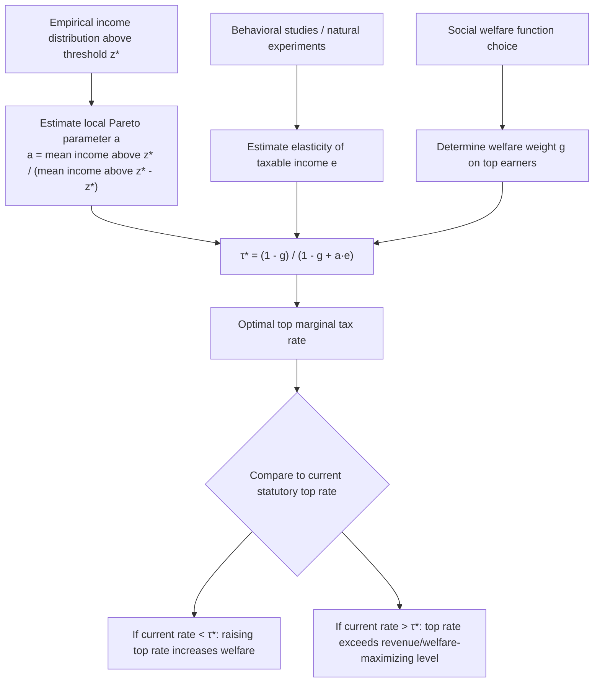

## Optimal Marginal Tax Rates at the Top

### Conceptual Framework

The theory of optimal marginal tax rates at the top of the income distribution addresses a specific question within the broader Mirrleesian optimal income tax problem: given that a small number of very high earners contribute a disproportionate share of taxable income, what marginal tax rate should apply to income above a high threshold $z^*$, and does the standard Mirrlees result (that the marginal tax rate approaches zero at the very top) hold under realistic distributional assumptions?

This question is treated somewhat separately from the general nonlinear tax problem because the shape of the top of the income distribution — empirically well-approximated by a Pareto distribution — generates a specific, tractable formula for the asymptotic top tax rate, distinct from the pointwise Mirrlees first-order conditions used elsewhere in the distribution.

### The Zero Top Rate Result and Its Reversal

**Sadka (1976) and Seade (1977) zero-top-rate result**: In the original Mirrlees framework, if the skill distribution has a bounded upper support (i.e., there exists a highest possible skill/income type), the optimal marginal tax rate on the very highest earner is zero. The intuition is that taxing the top earner's marginal dollar distorts their labor supply without generating any offsetting revenue gain from inframarginal earners above them, since by definition there is no one above them.

**Why this result is not policy-relevant in practice**: The zero-top-rate result applies only to a single point at the absolute top of a bounded distribution, and even proponents of the result acknowledge it does not extend to an interval of high incomes. In practice, tax schedules must specify a rate for an entire top bracket (e.g., all income above $500,000), not a single infinitesimal point, and empirical income distributions are far better described as unbounded with a Pareto (power-law) tail rather than bounded. Under an unbounded Pareto tail, the optimal marginal tax rate on the top bracket converges to a strictly positive constant as income goes to infinity, rather than zero. This reversal is the basis of the modern Diamond (1998) and Saez (2001) top-rate formulas.

### The Diamond-Saez Formula

Building on Diamond (1998), Saez (2001) derived the standard formula for the optimal marginal tax rate on a top bracket, expressed as a function of three sufficient statistics:

$$\tau^* = \frac{1 - g}{1 - g + a \cdot e}$$

**Parameter definitions**:

- $\tau^*$: optimal marginal tax rate applied to income above the top bracket threshold
- $g$: the social marginal welfare weight on top-bracket taxpayers, normalized relative to the marginal value of public funds, $g \in [0,1]$ (or potentially negative under some social welfare functions)
- $a$: the local Pareto parameter of the income distribution at the top, defined as $a = \dfrac{z \cdot h(z)}{1 - H(z)}$, where $H$ is the cumulative distribution function of income and $h$ is the density
- $e$: the elasticity of taxable income with respect to the net-of-tax rate

**Derivation logic**: The formula balances two forces at the margin:

1. **Mechanical revenue effect**: raising $\tau$ by $d\tau$ on the top bracket mechanically raises revenue from all taxpayers in the bracket, proportional to $(1 - H(z^*))$, the mass of taxpayers above the threshold.
2. **Behavioral (efficiency) effect**: the same rate increase induces taxpayers to reduce reported income according to the elasticity $e$, which erodes the tax base and reduces revenue, an effect that scales with $\tau/(1-\tau)$ and the local density of taxpayers near the threshold.
3. **Welfare effect**: the mechanical revenue increase has a redistributive benefit if the government values a marginal dollar transferred away from top earners more than it values a marginal dollar left with top earners, captured by $(1-g)$.

Setting the marginal welfare gain equal to the marginal efficiency cost and solving yields the formula above. When $g = 0$ (the government places no direct welfare weight on top-earner utility, i.e., pure revenue maximization for redistribution to everyone else), this collapses to the Feldstein-Saez revenue-maximizing formula $\tau^* = 1/(1 + a \cdot e)$.

### Role of the Pareto Parameter

**Key Points**

- The Pareto parameter $a$ measures the thinness of the income distribution's upper tail: a higher $a$ corresponds to a *thinner* tail (income less concentrated among the very richest), while a lower $a$ corresponds to a *fatter* tail (income highly concentrated at the top).
- Empirically, $a$ is estimated using the formula $a = \dfrac{\bar{z}(z^*)}{\bar{z}(z^*) - z^*}$, where $\bar{z}(z^*)$ is the mean income of all taxpayers earning above threshold $z^*$.
- U.S. estimates of $a$ for the very top of the income distribution (e.g., top 0.1%) have historically ranged around 1.5 to 3, with the tail becoming somewhat fatter (lower $a$) as top income shares rose over recent decades.
- A striking implication: since $a$ is estimated empirically from the actual shape of the income distribution, rising income concentration at the top (a fatter tail, lower $a$) mechanically implies a *higher* optimal top tax rate, holding $e$ and $g$ fixed, because each percentage point rate increase raises more revenue from a fatter tail relative to the efficiency cost.

### Illustration: Constructing the Optimal Top Rate

### Worked Numerical Example

**Example**

Consider a policymaker calibrating the optimal top marginal tax rate using standard empirical inputs:

- Pareto parameter: $a = 1.5$
- Elasticity of taxable income: $e = 0.25$
- Social marginal welfare weight on top earners: $g = 0.2$ (reflecting a modestly redistributive social preference, meaning the planner values a marginal dollar to a top earner at 20% of a marginal dollar to an average citizen)

$$\tau^* = \frac{1 - 0.2}{1 - 0.2 + (1.5)(0.25)} = \frac{0.8}{0.8 + 0.375} = \frac{0.8}{1.175} \approx 0.681$$

This gives an optimal top marginal rate of approximately 68.1%, below the pure revenue-maximizing rate of 72.7% computed at $g=0$ with the same $a$ and $e$ (see the Elasticity of Taxable Income reference), since positive weight on top-earner welfare pulls the optimal rate down from the revenue-maximizing peak. If the government places zero weight on top-earner welfare ($g=0$), the formula collapses exactly to the Feldstein-Saez revenue-maximizing case. [Inference: the specific numerical outputs are illustrative computations from the stated formula and parameter values, not estimates from a specific published study]

### Extensions Beyond the Static Top-Bracket Model

**Migration and international mobility**: Some models extend the framework to allow top earners to migrate in response to tax rates, which effectively raises the elasticity relevant for domestic tax-setting beyond the pure labor-supply/avoidance elasticity, since emigration constitutes a full loss of the tax base rather than a partial behavioral adjustment. [Inference: the magnitude of migration elasticities is empirically contested and highly sensitive to context, e.g., sub-national versus international mobility]

**Bargaining and rent-seeking models (Piketty, Saez, and Stantcheva, 2014)**: This extension decomposes the taxable income elasticity into three components: (1) a standard labor supply/real response, (2) a tax avoidance/income-shifting response, and (3) a compensation-bargaining response, in which lower top tax rates increase executives' incentive to bargain aggressively for higher pre-tax pay (rent extraction) without a corresponding increase in productivity. When the bargaining channel is significant, the socially optimal top tax rate is *higher* than the standard formula suggests, because part of the "efficiency cost" captured by a conventionally measured ETI is actually a zero-sum redistribution from other stakeholders (shareholders, other employees) to the top earner, not a loss of real output.

$$\tau^*_{\text{bargaining}} = \frac{1 - g + a \cdot e \cdot (\text{rent-seeking share adjustment})}{1 - g + a \cdot e}$$

[Inference: the precise functional form of the bargaining-adjusted formula varies across papers in this literature; the qualitative implication (bargaining raises the optimal top rate relative to the pure-elasticity benchmark) is the robust finding, not any single parametrized formula]

**Dynamic/lifecycle considerations**: Static optimal tax models compute $\tau^*$ treating income as a single-period draw, but lifecycle models incorporate the fact that current top earners may face mobility in and out of the top bracket over time (e.g., due to variable business income), which affects the appropriate long-run elasticity and the redistributive value of taxing transitory versus permanent top income differently.

### Diagram: Optimal Top Rate as a Function of Elasticity and Pareto Parameter (svg_diagram)

<svg xmlns="http://www.w3.org/2000/svg" viewBox="0 0 640 440">
<text x="320" y="28" text-anchor="middle" font-size="16" font-weight="bold" fill="#1a1a1a">Optimal Top Rate τ* vs. Elasticity e (svg_diagram)</text>
<line x1="70" y1="380" x2="600" y2="380" stroke="#333" stroke-width="2" />
<line x1="70" y1="380" x2="70" y2="60" stroke="#333" stroke-width="2" />
<text x="335" y="415" text-anchor="middle" font-size="13" fill="#333">Elasticity of Taxable Income (e)</text>
<text x="30" y="220" text-anchor="middle" font-size="13" fill="#333" transform="rotate(-90 30 220)">Optimal Top Rate τ*</text>
<text x="60" y="384" text-anchor="end" font-size="11" fill="#555">0</text>
<text x="600" y="398" text-anchor="middle" font-size="11" fill="#555">1.0</text>
<text x="55" y="65" text-anchor="end" font-size="11" fill="#555">100%</text>
<path d="M 70 100 C 200 150, 350 260, 600 350" fill="none" stroke="#2563eb" stroke-width="3" />
<text x="420" y="270" font-size="12" fill="#2563eb" font-weight="bold">a = 1.5 (fatter tail)</text>
<path d="M 70 130 C 200 220, 350 320, 600 368" fill="none" stroke="#dc2626" stroke-width="3" stroke-dasharray="7,4" />
<text x="380" y="335" font-size="12" fill="#dc2626" font-weight="bold">a = 3.0 (thinner tail)</text>
<line x1="70" y1="60" x2="600" y2="60" stroke="#999" stroke-width="1" stroke-dasharray="3,3" />
<text x="605" y="64" font-size="11" fill="#999">τ = 100%</text>
</svg>

### Empirical and Institutional Considerations

**Key Points**

- Countries with strong third-party income reporting and withholding tend to exhibit lower elasticities on labor income specifically, supporting somewhat higher feasible top rates on wage income relative to unincorporated business income.
- The formula is typically applied to the *combined* effect of federal, state/regional, and payroll taxes, since taxpayers respond to their total marginal tax burden, not just the top statutory federal bracket rate.
- Historical top marginal rates in the U.S. (over 90% in the 1950s-1960s, falling to around 28% after the Tax Reform Act of 1986, and fluctuating in the 35–40% range subsequently) are frequently cited as revealed evidence relevant to bounding plausible taxable income elasticities, though the interpretation of this historical variation remains contested given confounding policy and economic changes over the same periods. [Unverified: precise causal attribution of income share changes over these historical episodes to top rate changes alone remains an active empirical debate]
- The formula assumes a fixed threshold $z^*$ for the top bracket; in practice, bracket thresholds are also policy choices that interact with the optimal rate calculation, and models incorporating multiple brackets analyze the entire nonlinear schedule jointly rather than the top rate in isolation.

### Limitations of the Framework

- **Single-dimension of heterogeneity**: like the broader Mirrlees framework, this model typically assumes individuals differ only in a single-dimensional skill/ability parameter, abstracting from multidimensional heterogeneity (e.g., differing preferences for leisure versus income, or differing capital versus labor income composition) that could alter optimal rate structure at the top.
- **Perfect information about $a$, $e$, and $g$**: the formula treats these three parameters as known constants, whereas in practice each is estimated with substantial uncertainty and is potentially time-varying, meaning point estimates of $\tau^*$ should be interpreted as illustrative ranges rather than precise policy targets.
- **Static, closed-economy assumption**: excludes general equilibrium effects (e.g., how top tax rates affect wages of other workers through changes in the allocation of managerial talent) unless explicitly extended, as in the rent-seeking literature above.
- **Abstracts from capital income and wealth taxation interactions**: the formula is derived for labor/ordinary income; top earners' overall tax liability often depends jointly on labor income taxation and capital gains/wealth taxation, which are analyzed under separate optimal tax frameworks and can interact with the labor income margin (e.g., through the choice between wage and capital compensation for business owners).

### Related Topics

- Elasticity of Taxable Income
- Mirrlees Model of Nonlinear Optimal Taxation
- Pareto Distribution and Top Income Inequality
- Social Welfare Weights and the Marginal Value of Public Funds
- Rent-Seeking and Bargaining Models of Executive Compensation
- Optimal Taxation of Capital Income
- Laffer Curve and Revenue-Maximizing Tax Rates
- Tax Base Broadening versus Rate Reduction