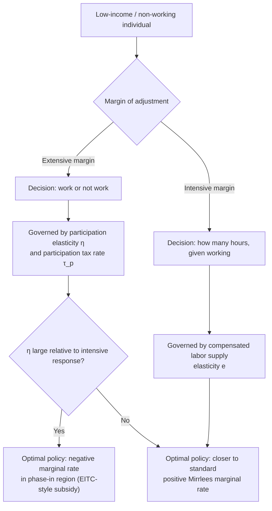

## Optimal Marginal Tax Rates at the Bottom

### Conceptual Framework

The theory of optimal marginal tax rates at the bottom of the income distribution addresses how the tax-and-transfer system should treat low-income and non-working individuals, and in particular whether marginal tax rates in this region should be high, low, negative, or zero. This region of the tax schedule is distinctive because it must simultaneously address two objectives: (1) providing adequate income support to those with low or zero earnings, and (2) preserving work incentives for the extensive margin (the decision whether to work at all) and the intensive margin (how many hours to work, conditional on working).

Unlike the top of the distribution, where the Mirrlees/Diamond-Saez framework focuses primarily on intensive-margin elasticities, the bottom of the distribution is where **extensive-margin (participation) responses** are empirically most important, fundamentally reshaping the structure of the optimal formula.

### The Zero Marginal Rate at the Very Bottom Result

**Seade (1977) result**: Under the classic Mirrlees framework with a bounded-below skill distribution (i.e., a lowest-ability type who earns strictly positive income), the marginal tax rate on the very lowest earner is also zero, by the same envelope-theorem logic that produces the zero-top-rate result: taxing the lowest earner's marginal dollar distorts their labor supply without collecting revenue from anyone below them, since there is no one below.

**Limited applicability**: As with the top-rate analog, this result applies to a single point at the bottom of a bounded distribution and does not extend to a bracket or interval of low incomes, nor does it address the empirically central question of how to treat individuals who do not work at all (zero earnings), since those individuals are, by construction, off the intensive-margin skill ladder addressed by the classic Mirrlees model.

### Extensive Margin and the Diamond (1980) / Saez (2002) Framework

Peter Diamond's 1980 paper, later extended by Saez (2002), showed that once labor force participation (the extensive margin) is modeled explicitly alongside hours of work (the intensive margin), the shape of the optimal tax-and-transfer schedule at the bottom changes substantially, and can rationalize **negative marginal tax rates** or an **Earned Income Tax Credit (EITC)-style structure** in which after-tax income rises faster than one-for-one with pre-tax earnings over some range.

**Intuition**: If labor supply responses are concentrated at the extensive margin (people deciding whether to work versus not work, rather than adjusting hours continuously), then subsidizing low levels of earned income (i.e., a negative marginal tax rate or wage subsidy in the phase-in region) can increase social welfare by inducing people to move from non-work (zero earnings, receiving a transfer) into low-wage work, without much intensive-margin distortion cost, because these workers' hours choices are relatively inelastic once they are in the labor force.

This result is a significant departure from earlier "negative income tax" (NIT) proposals (Friedman, 1962) and from the naive intuition that the poorest workers should always face the lowest marginal tax rates on the intensive margin; the Diamond-Saez extensive-margin logic instead can justify phase-*in* regions with negative effective marginal rates, followed by phase-*out* regions with high (sometimes very high) effective marginal rates as transfers are withdrawn.

### The Saez (2002) Optimal Formula with Extensive and Intensive Margins

Saez (2002) formalizes the optimal tax/transfer schedule using both an intensive-margin elasticity ($e$, the standard compensated labor supply elasticity conditional on working) and an extensive-margin elasticity ($\eta$, called the participation elasticity, measuring how the extensive-margin employment decision responds to the *participation tax rate*).

The **participation tax rate** at income level $z$ is defined as:

$$\tau_p(z) = \frac{z - c(z) + b}{z}$$

where $c(z)$ is disposable (after-tax-and-transfer) income when earning $z$, and $b$ is the transfer/benefit received when not working (earning zero). This measures the fraction of gross earnings effectively "taxed away" through the combined loss of benefits and payment of taxes when moving from non-work into work at income $z$.

The optimal marginal tax rate formula in the presence of extensive-margin responses (simplified discrete version) shows that the marginal tax rate at a given income level depends on:

$$T'(z) \propto \frac{1}{e \cdot h(z)}\left[1 - H(z)\right]\left[1 - g(z)\right] - \frac{\eta(z) \cdot \tau_p(z)}{1 - \tau_p(z)} \cdot h(z) \cdot z$$

**Key Points**

- The first term is the standard intensive-margin Mirrlees term, pushing toward positive marginal rates to redistribute from higher to lower earners.
- The second term is the extensive-margin correction: when the participation elasticity $\eta(z)$ is large at a given income level, this term pushes the optimal marginal tax rate *downward* (potentially negative) at that income level, because a high marginal rate there would discourage entry into work from non-employment.
- Where extensive-margin responses dominate (typically at the bottom of the distribution, among potential low-wage workers deciding whether to work), the formula can generate negative optimal marginal rates, i.e., an earnings subsidy.
- Where intensive-margin responses dominate (typically higher up the distribution, among people already working and choosing hours/effort), the formula reverts closer to the standard positive Mirrlees marginal rate.

### Illustration: Extensive vs. Intensive Margin Tradeoff

### Practical Tax Schedule Structure at the Bottom

Real-world tax-and-transfer systems informed by this literature (e.g., the U.S. EITC, the UK Working Tax Credit, various European in-work benefit systems) typically feature a three-region structure at the bottom of the earnings distribution:

1. **Phase-in region**: earnings from $0 up to some threshold $z_1$, where the credit/subsidy increases with earnings, producing a *negative* effective marginal tax rate (each additional dollar earned increases disposable income by more than a dollar, once the subsidy is included).
2. **Plateau region**: earnings from $z_1$ to $z_2$, where the credit is held constant at its maximum value, so the effective marginal tax rate in this region reflects only ordinary payroll and income taxes (typically positive but often modest).
3. **Phase-out region**: earnings from $z_2$ upward, where the credit is withdrawn as income rises, producing a relatively *high* effective marginal tax rate (often 20–40% just from the credit clawback, stacked on top of ordinary taxes) as the subsidy is clawed back.

**Example**

Consider a simplified EITC-style schedule with:

- Phase-in rate: −40% (a $0.40 credit for each $1 earned) up to $10,000 in earnings
- Plateau: constant maximum credit of $4,000 from $10,000 to $15,000 in earnings
- Phase-out rate: 21% clawback from $15,000 until the credit reaches zero

For a worker earning $8,000: disposable income from the credit alone is $8{,}000 \times 0.40 = \$3{,}200$, so total resources (ignoring other taxes) are $11,200 — the effective marginal tax rate on the next dollar earned is −40%, an earnings *subsidy*.

For a worker earning $18,000 (in the phase-out region): the credit has been reduced by $(18{,}000 - 15{,}000) \times 0.21 = \$630$ from its $4,000 maximum, leaving a $3,370 credit. The effective marginal tax rate on the next dollar earned in this region is 21% from the credit clawback alone, before adding ordinary income and payroll taxes, which can push the *combined* effective marginal rate considerably higher. [Inference: precise combined marginal rates depend on the specific ordinary tax schedule and payroll tax treatment in a given jurisdiction and year, and are not derived from any single universal formula]

### Interaction with Means-Tested Transfer Programs: The "Welfare Trap"

**Key Points**

- When multiple means-tested transfer programs (e.g., cash welfare, food assistance, housing subsidies, healthcare subsidies) phase out simultaneously over overlapping income ranges, their combined phase-out rates can **stack**, producing very high cumulative effective marginal tax rates — in some documented cases exceeding 80–100% over certain income ranges, a phenomenon often called the "welfare trap" or "benefit cliff."
- This stacking effect is a primary real-world policy concern distinct from the pure theoretical optimal tax formula, since it often arises from uncoordinated program design (each program independently choosing its own phase-out rate) rather than from a jointly optimized schedule.
- Policy responses include aligning phase-out ranges across programs, converting cliff-edge eligibility thresholds into smooth phase-outs, and coordinating credit design (as in the EITC's deliberately gradual phase-out) specifically to avoid these compounding effects.
- The empirical magnitude of behavioral responses to benefit cliffs is an active area of research, since bunching around cliff-edge thresholds provides a testable prediction analogous to bunching at tax-schedule kinks. [Unverified: the degree of observed real-world bunching at benefit cliffs, as opposed to at tax kinks, varies by program and has produced mixed empirical findings regarding the extent of optimization frictions]

### Guaranteed Minimum Income vs. Earnings-Conditional Transfers

The bottom-of-distribution optimal tax literature is also the basis for the long-standing policy debate between:

- **Unconditional/guaranteed minimum income (negative income tax, universal basic income)**: transfers do not depend on employment status, implying a relatively high (though not necessarily maximal) marginal tax rate on the first dollars earned as the guarantee phases out, since the extensive-margin subsidy logic (rewarding entry into work specifically) is absent by design.
- **Earnings-conditional transfers (EITC-style)**: transfers require positive earnings, directly implementing the negative-marginal-rate/phase-in logic derived from the extensive-margin optimal tax model, but at the cost of providing no support to those unable to work at all (e.g., due to disability, caregiving responsibilities, or lack of available jobs).

Saez (2002) and subsequent work frame the choice between these approaches as depending critically on the *relative* magnitude of extensive- versus intensive-margin elasticities in a given population: populations with large extensive-margin responses (commonly estimated for single mothers and secondary earners in some contexts) favor earnings-conditional designs, while populations with small extensive-margin responses favor unconditional transfers with less concern about work-incentive costs. [Inference: which population subgroups exhibit large versus small extensive-margin elasticities is an empirical question with results that vary by country, time period, and demographic group, and should not be treated as a fixed universal ranking]

### Diagram: Effective Marginal Tax Rate Across the Bottom of the Distribution (svg_diagram)

<svg xmlns="http://www.w3.org/2000/svg" viewBox="0 0 640 400">
<text x="320" y="26" text-anchor="middle" font-size="16" font-weight="bold" fill="#1a1a1a">Effective Marginal Tax Rate by Earnings Level (svg_diagram)</text>
<line x1="70" y1="200" x2="600" y2="200" stroke="#999" stroke-width="1" stroke-dasharray="3,3" />
<text x="605" y="204" font-size="11" fill="#999">0%</text>
<line x1="70" y1="340" x2="600" y2="340" stroke="#333" stroke-width="2" />
<line x1="70" y1="340" x2="70" y2="60" stroke="#333" stroke-width="2" />
<text x="335" y="375" text-anchor="middle" font-size="13" fill="#333">Earnings (z)</text>
<text x="30" y="200" text-anchor="middle" font-size="13" fill="#333" transform="rotate(-90 30 200)">Effective MTR</text>
<path d="M 70 200 L 220 260 L 220 200 L 360 200 L 360 200 L 500 130 L 600 100" fill="none" stroke="#2563eb" stroke-width="3" />
<text x="130" y="285" font-size="11" fill="#2563eb" font-weight="bold">Phase-in (negative MTR)</text>
<text x="270" y="190" font-size="11" fill="#2563eb" font-weight="bold">Plateau</text>
<text x="440" y="120" font-size="11" fill="#2563eb" font-weight="bold">Phase-out (positive MTR)</text>
<line x1="220" y1="340" x2="220" y2="60" stroke="#ccc" stroke-width="1" stroke-dasharray="2,2" />
<line x1="360" y1="340" x2="360" y2="60" stroke="#ccc" stroke-width="1" stroke-dasharray="2,2" />
<text x="220" y="355" text-anchor="middle" font-size="10" fill="#666">z₁</text>
<text x="360" y="355" text-anchor="middle" font-size="10" fill="#666">z₂</text>
</svg>

### Empirical Evidence on EITC-Style Reforms

**Key Points**

- Eissa and Liebman (1996) and subsequent studies of U.S. EITC expansions found significant positive effects on labor force participation among single mothers, consistent with a meaningful extensive-margin elasticity for this group.
- Evidence on intensive-margin (hours) responses to the EITC phase-out region has generally found smaller effects than the extensive-margin participation effects, consistent with the theoretical prioritization of extensive-margin considerations at the bottom of the distribution.
- Chetty, Friedman, and Saez (2013) documented substantial geographic variation in EITC take-up and knowledge of the credit's structure across U.S. regions, finding that local information/knowledge about the EITC schedule affects the degree to which the credit's incentive structure translates into observed bunching and behavioral response, an important caveat to how cleanly theoretical predictions map onto observed outcomes.
- Cross-country evidence on in-work benefit programs (e.g., UK Working Families' Tax Credit, various Nordic in-work benefit schemes) has generally supported the extensive-margin employment effects predicted by the theory, though effect sizes vary by program design and population studied. [Unverified: specific effect-size comparisons across countries are sensitive to methodology and should not be treated as directly comparable across studies without examining each paper's identification strategy]

### Limitations of the Framework

- **Static, single-period model**: the standard Diamond-Saez extensive/intensive margin framework does not incorporate dynamic considerations such as human capital accumulation from work experience, which could justify even larger work subsidies at the bottom than the static model implies if early labor market attachment has long-run positive effects on future earnings.
- **Household versus individual unit of analysis**: many transfer programs are administered at the household/family level, whereas the labor supply elasticity framework is often estimated at the individual level; secondary-earner labor supply decisions within a household interact with primary-earner income in ways that complicate the simple single-agent optimal tax formula.
- **Behavioral and informational frictions**: as documented in the Chetty-Friedman-Saez EITC findings, imperfect information about complex phase-in/phase-out schedules can mean that real-world responses to the *statutory* marginal tax rate structure diverge from the *theoretically predicted* responses under full information and optimization, complicating direct application of the sufficient-statistic formulas.
- **Interaction with in-kind and categorical benefits**: many low-income support programs are in-kind (e.g., housing, food, healthcare subsidies) or categorically conditioned (e.g., disability, number of dependents) rather than purely cash-and-earnings-conditioned, and the basic Saez (2002) model does not fully characterize the jointly optimal design of a multi-program transfer system.

### Related Topics

- Elasticity of Taxable Income
- Optimal Marginal Tax Rates at the Top
- Extensive vs. Intensive Margin Labor Supply Responses
- Earned Income Tax Credit: Design and Evidence
- Negative Income Tax and Universal Basic Income Proposals
- Mirrlees Model of Nonlinear Optimal Taxation
- Means-Tested Transfer Program Design and Benefit Cliffs
- Bunching Estimators and Kinked Budget Sets