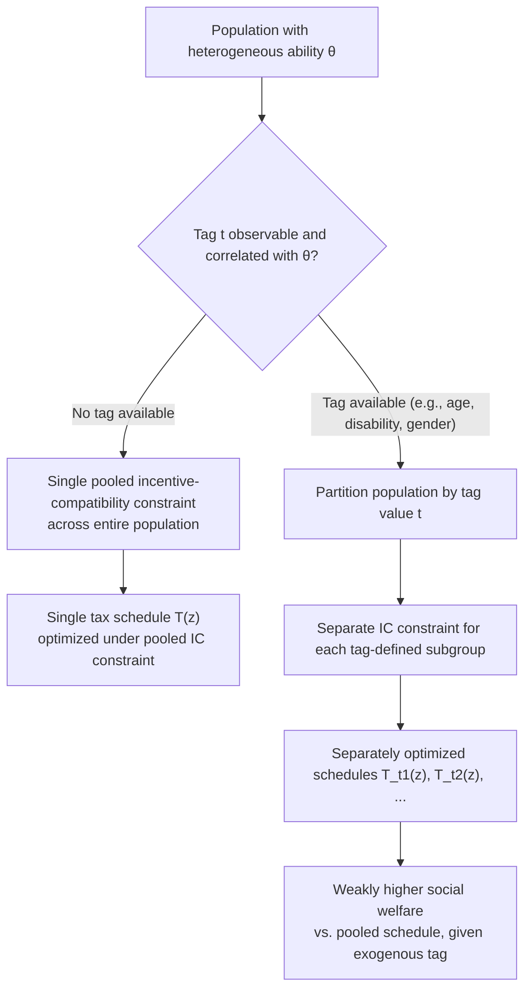

## Tagging and the Use of Observable Characteristics

### Conceptual Foundation

Tagging refers to the practice of conditioning tax and transfer schedules on observable characteristics of individuals that are correlated with earning ability or need, but are not themselves choice variables subject to behavioral distortion. The term originates from Akerlof (1978), who argued that if the social planner can costlessly and reliably observe a "tag" correlated with need (e.g., disability status), welfare can be improved by targeting transfers specifically toward tagged groups rather than relying solely on income-based means testing, which is inevitably distorted by the recipients' behavioral response to the tax/transfer schedule itself.

The central insight is that **income is an endogenous signal** of ability (people choose how much to work in response to incentives), whereas a well-chosen tag can be an **exogenous signal** of ability or need — one that individuals cannot manipulate through their labor supply choice. If such a tag exists and is correlated with earning capacity, conditioning taxes on it allows the government to achieve better targeting without introducing additional distortion on the tagged characteristic itself, since by definition the individual cannot alter the tag to change their tax treatment.

### Formal Framework

In the standard Mirrlees setup, the government cannot observe an individual's skill/ability type $\theta$ directly and must infer it indirectly from observed income $z$, which creates the fundamental incentive compatibility constraint responsible for the equity-efficiency tradeoff in income taxation. Tagging relaxes this constraint by introducing an additional observable variable $t$ (the tag), correlated with $\theta$, that can be directly incorporated into the tax function:

$$T = T(z, t)$$

rather than the standard single-argument tax function $T(z)$.

**Akerlof's efficiency argument**: If tag $t$ is exogenous (not a choice variable) and correlated with ability, then partitioning the population by $t$ and applying a separately optimized nonlinear tax schedule $T_t(z)$ to each tag-defined subgroup weakly improves social welfare relative to a single pooled schedule $T(z)$, because it relaxes the single incentive-compatibility constraint that otherwise binds the pooled population, without introducing any new distortion (since $t$ cannot be manipulated).

**Key Points**

- Tagging is a form of statistical discrimination for a redistributive rather than a pricing purpose: the tax authority uses group-level correlations between the tag and ability to set differential schedules.
- The efficiency gain from tagging is strictly increasing in the correlation between the tag and underlying ability/earning capacity: a perfectly correlated tag (equivalent to directly observing $\theta$) would allow the first-best (lump-sum tax) outcome; an uncorrelated tag provides no efficiency gain and simply adds administrative complexity.
- Tagging does not, by itself, resolve the equity-efficiency tradeoff *within* each tag-defined group — the standard Mirrlees intensive/extensive margin analysis still applies separately within each group.

### Illustration: How Tagging Relaxes the Incentive Compatibility Constraint

### Criteria for a Valid and Desirable Tag

**Key Points**

- **Exogeneity / non-manipulability**: the tag must not be a variable the individual can strategically alter in response to its tax treatment (e.g., age and biological sex satisfy this criterion much more cleanly than, say, marital status or self-reported disability, which can in principle be influenced by behavior or subject to strategic misreporting).
- **Correlation with ability or need**: the tag must carry genuine informational content about earning capacity or deservingness of support; a tag uncorrelated with the underlying welfare-relevant characteristic provides no efficiency benefit.
- **Observability and verifiability at low cost**: the tag must be verifiable by the tax authority without excessive administrative or compliance cost, and ideally without high potential for fraud or misclassification.
- **Absence of adverse behavioral responses through indirect channels**: even a technically non-manipulable tag can generate indirect distortions if individuals can affect *related* choices to influence classification (e.g., if disability screening is imperfect and its stringency affects labor supply decisions near the eligibility margin).

### Empirical and Policy Examples of Tags

**Age-based tagging**: Age is among the most commonly cited "ideal" tags in the theoretical literature, since it is essentially impossible to manipulate and is correlated with life-cycle earning capacity and needs. Real-world examples include age-differentiated tax credits, retirement-linked benefit eligibility, and age-conditioned components of in-work tax credits (e.g., some EITC-like schedules pay lower maximum credits to childless workers under a certain age, partly reflecting age-earnings profile considerations).

**Disability status**: Disability-contingent benefits (e.g., Social Security Disability Insurance in the U.S., disability pensions in many OECD countries) represent a widely implemented tagging system, since disability is strongly correlated with reduced earning capacity. However, disability status is imperfectly verifiable, creating a classic screening problem: overly generous or loosely verified disability programs risk attracting individuals whose earning capacity is not genuinely impaired (a form of indirect manipulability through the application/appeals process), while overly strict verification risks excluding genuinely disabled individuals or imposing high compliance/proof burdens. [Inference: the empirically optimal stringency of disability screening depends on the elasticity of program applications with respect to screening strictness, which varies substantially by country and administrative design]

**Family structure and number of dependents**: Number of children and marital status are widely used tags in transfer programs (e.g., EITC credit amounts scale with number of qualifying children; many welfare programs condition benefit levels on household composition). These are partially, but not perfectly, exogenous: family size and marital status can in principle respond to tax incentives (e.g., marriage penalties/bonuses affecting marriage decisions, fertility responses to child-contingent benefits), representing a departure from the pure Akerlof tagging ideal. [Inference: the empirical magnitude of fertility or marriage responses to tax-linked family benefits is a genuinely contested area, with estimated elasticities varying substantially across studies and contexts]

**Gender**: Gender has been studied theoretically as a potential tag (given historically documented gender gaps in earnings and labor supply elasticities), most notably in work by Alesina, Ichino, and Karabarbounis (2011), who argue for gender-based taxation given differential labor supply elasticities across men and women. This application remains largely confined to theoretical and normative discussion rather than direct policy implementation in most jurisdictions, given legal, constitutional, and normative objections to gender-differentiated taxation independent of its efficiency properties. [Inference: whether any jurisdiction has directly implemented gender-differentiated income tax schedules on efficiency grounds, versus indirectly gender-differentiated policy through other tagged characteristics, is not something this reference asserts as settled without direct verification]

**Geographic location / regional tagging**: Some tax and transfer systems vary parameters by region (e.g., regional cost-of-living adjustments to benefits, or region-specific minimum wage and tax thresholds), using location as a tag correlated with the local cost of living and local labor market conditions, though location can be partially endogenous through migration responses over longer time horizons.

**Occupation-based tagging**: Occupation is a much weaker candidate tag under the pure theoretical criterion since it is highly endogenous to labor supply and career choices, but is a common component of tax base determination in variants of income taxation applied to specific complex sectors (e.g., self-employed versus wage-earner tax treatment), primarily justified by administrative and enforcement considerations rather than pure ability-tagging logic.

### Diagram: Spectrum of Tag Exogeneity (svg_diagram)

<svg xmlns="http://www.w3.org/2000/svg" viewBox="0 0 640 300">
<text x="320" y="26" text-anchor="middle" font-size="16" font-weight="bold" fill="#1a1a1a">Spectrum of Tag Manipulability (svg_diagram)</text>
<line x1="60" y1="150" x2="580" y2="150" stroke="#333" stroke-width="3" />
<polygon points="580,150 568,144 568,156" fill="#333" />
<text x="60" y="180" text-anchor="middle" font-size="12" fill="#16a34a" font-weight="bold">Fully Exogenous</text>
<text x="580" y="180" text-anchor="middle" font-size="12" fill="#dc2626" font-weight="bold">Highly Endogenous</text>
<circle cx="110" cy="150" r="7" fill="#16a34a" />
<text x="110" y="120" text-anchor="middle" font-size="11" fill="#333">Age</text>
<circle cx="200" cy="150" r="7" fill="#16a34a" />
<text x="200" y="120" text-anchor="middle" font-size="11" fill="#333">Biological sex</text>
<circle cx="300" cy="150" r="7" fill="#ca8a04" />
<text x="300" y="120" text-anchor="middle" font-size="11" fill="#333">Verified disability</text>
<circle cx="390" cy="150" r="7" fill="#ca8a04" />
<text x="390" y="120" text-anchor="middle" font-size="11" fill="#333">Number of children</text>
<circle cx="470" cy="150" r="7" fill="#ea580c" />
<text x="470" y="120" text-anchor="middle" font-size="11" fill="#333">Marital status</text>
<circle cx="550" cy="150" r="7" fill="#dc2626" />
<text x="550" y="120" text-anchor="middle" font-size="11" fill="#333">Occupation</text>
</svg>

### Worked Illustration: Efficiency Gain from Tagging

**Example**

Consider a simplified population evenly split between two exogenously tagged groups, A and B, where group A has a Pareto parameter and elasticity profile implying (using the Diamond-Saez top-rate logic applied illustratively at a stylized "average" rate for each group) an optimal average tax rate of 35%, while group B's profile implies an optimal average rate of 20%, due to differing income distributions and elasticities across the two groups.

Under a **pooled schedule** (no tagging), the government must apply a single schedule optimized for the combined population, which — given the standard result that pooling generally implies an intermediate rate closer to the more elastic group's requirements — might yield an average rate of roughly 27%, worse for both groups' specific welfare-maximizing conditions than group-specific schedules would be.

Under **tag-conditioned schedules**, group A faces its separately optimized ~35% average schedule and group B faces its separately optimized ~20% average schedule, and social welfare under this tagged regime is weakly higher than under the single pooled schedule, precisely because the additional degree of freedom (conditioning on the tag) relaxes the single pooled incentive-compatibility constraint into two separate, less binding constraints. [Inference: the specific percentage figures in this example are illustrative constructs to convey the qualitative mechanism, not estimates drawn from a specific empirical study]

### Normative and Legal Objections to Tagging

**Key Points**

- **Horizontal equity concerns**: tagging by definition treats individuals with the same income differently based on group membership, which can conflict with horizontal equity norms (equal treatment of individuals with equal ability to pay), even when it improves aggregate social welfare under a utilitarian or Rawlsian social welfare function.
- **Legal and constitutional constraints**: many jurisdictions have anti-discrimination laws or constitutional equal-protection provisions that restrict or prohibit tax differentiation based on characteristics such as gender, race, ethnicity, or religion, regardless of any demonstrated efficiency gain from such tagging, meaning the theoretical optimum is frequently infeasible as a matter of law.
- **Stigma effects**: benefits explicitly conditioned on tags such as disability or unemployment status may carry social stigma that reduces take-up among eligible individuals, partially offsetting the intended targeting benefit — a concern raised extensively in the take-up literature on means-tested and tag-conditioned programs.
- **Mankiw and Weinzierl (2010) critique**: this paper highlights that the logic of optimal tagging, taken to its extreme, would recommend taxing individuals based on any observable correlate of ability — including characteristics like height (empirically correlated with wages) — a conclusion widely viewed as normatively repugnant, illustrating that pure efficiency-based tagging logic requires additional ethical constraints beyond the formal Akerlof framework to yield policy recommendations consistent with widely shared social values.
- **Political economy and social cohesion considerations**: extensive use of tagging can fragment public support for the tax-and-transfer system if voters perceive the system as treating similar people differently based on immutable characteristics, potentially affecting the sustainability of the broader welfare state through distinct mechanisms from the pure efficiency calculation.

### Interaction with Statistical Tagging Errors

Real-world tags are rarely perfectly observed; verification systems for tags such as disability or family composition involve classification error (false positives and false negatives). This introduces:

- **Type I/Type II error tradeoffs in eligibility screening**: stricter verification reduces false claims (individuals wrongly tagged as eligible) but increases false rejections (genuinely eligible individuals wrongly denied), a tradeoff extensively studied in the disability insurance screening literature (e.g., work examining optimal screening stringency and appeals processes).
- **Induced behavioral responses near the screening margin**: even with a nominally non-manipulable tag, individuals near an ambiguous classification boundary (e.g., borderline disability cases) may adjust behavior (e.g., reduce work effort, gather more medical documentation, engage administrative/legal appeals processes) in ways that constitute a real behavioral distortion despite the tag's theoretical non-manipulability, partially undermining the pure Akerlof efficiency argument in practice.

### Limitations of the Tagging Framework

- **Rarity of perfectly exogenous, highly ability-correlated tags**: in practice, few observable characteristics satisfy both the strict exogeneity criterion and a strong correlation with earning capacity, limiting the practical scope of pure Akerlof-style tagging relative to its theoretical appeal.
- **Static analysis**: most formal tagging models are static, single-period frameworks and do not fully address how tag-conditioned policy interacts with lifecycle dynamics (e.g., age-based tagging interacting with lifecycle earnings trajectories in ways that require dynamic rather than static optimal tax analysis).
- **General equilibrium and behavioral responses beyond the tagged margin**: models typically hold constant other margins of adjustment (e.g., family formation, migration, occupational choice) that could respond to a tagging regime over longer horizons, even if the tag itself is not directly manipulable period-by-period.
- **Normative underdetermination**: the framework identifies efficiency gains from tagging but does not, by itself, resolve which tags are ethically or politically acceptable to use — this requires normative input external to the formal welfare-economics model, as highlighted by the Mankiw-Weinzierl critique.

### Related Topics

- Optimal Marginal Tax Rates at the Bottom
- Optimal Marginal Tax Rates at the Top
- Mirrlees Model of Nonlinear Optimal Taxation
- Horizontal versus Vertical Equity in Taxation
- Means-Tested Transfer Program Design and Take-Up
- Disability Insurance Screening and Optimal Stringency
- Family Taxation and Marriage Neutrality
- Social Welfare Functions and Redistributive Preferences