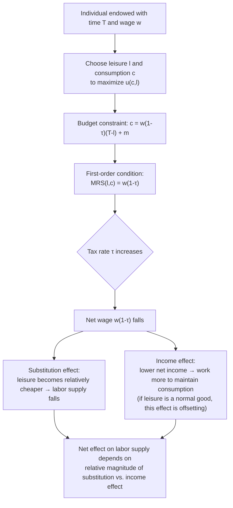

## Static Labor Supply Model

### Conceptual Foundation

The static labor supply model is the foundational microeconomic framework for analyzing how individuals choose how much to work given wages, non-labor income, and preferences, within a single time period (hence "static," abstracting from intertemporal considerations such as savings, human capital investment, or life-cycle planning). It is the workhorse model underlying nearly all subsequent analysis of taxation and labor supply, including the elasticity concepts used in optimal income tax theory.

The model treats the individual as choosing between **consumption** $c$ and **leisure** $l$ (equivalently, hours of work $L = T - l$, where $T$ is total available time) to maximize utility subject to a budget constraint linking earnings, non-labor income, and consumption.

### Basic Setup

**Utility maximization problem**:

$$\max_{c, l} \, u(c, l) \quad \text{subject to} \quad c = w(T - l) + m$$

where:

- $u(c,l)$ is a utility function, increasing in both consumption and leisure, typically assumed quasiconcave
- $w$ is the wage rate per hour
- $T$ is total time endowment (e.g., 24 hours per day or a normalized period)
- $l$ is leisure hours chosen, so $L = T - l$ is labor supply (hours worked)
- $m$ is non-labor (virtual) income, which may include capital income, transfers, or other unearned income

Substituting $L = T-l$, the budget constraint can be rewritten directly in terms of hours worked:

$$c = wL + m$$

**First-order condition**: At an interior optimum (positive hours worked, not at a corner solution), the marginal rate of substitution between leisure and consumption equals the wage rate:

$$\frac{u_l(c,l)}{u_c(c,l)} = w$$

This condition states that the individual works until the point where the value they place on an additional hour of leisure (in consumption-equivalent terms) exactly equals what they could earn by working that hour instead.

### Introducing Taxation into the Static Model

With a proportional (linear) tax at rate $\tau$ on labor earnings, the budget constraint becomes:

$$c = w(1-\tau)L + m + \tau \cdot 0 \quad \Rightarrow \quad c = w(1-\tau)L + m$$

(assuming no tax on non-labor income $m$ for simplicity; more general specifications tax $m$ as well). The term $w(1-\tau)$ is the **net wage**, and the first-order condition becomes:

$$\frac{u_l}{u_c} = w(1-\tau)$$

This shows directly how taxation distorts the labor-leisure margin: since the individual only receives $(1-\tau)$ of each additional dollar of gross earnings, the effective price of leisure (in terms of foregone consumption) falls as $\tau$ rises, inducing substitution toward leisure and away from labor supply — the mechanism underlying the labor supply elasticity central to optimal tax analysis.

With a **nonlinear tax schedule** $T(z)$ where $z = wL$ is gross earnings, the budget constraint is $c = z - T(z) = wL - T(wL)$, and the first-order condition involves the local marginal tax rate $T'(z)$ evaluated at the chosen income level:

$$\frac{u_l}{u_c} = w[1 - T'(z)]$$

This is the standard setup underlying the labor supply first-order conditions used throughout Mirrleesian optimal tax theory.

### Illustration: The Labor-Leisure Choice

### Diagram: Budget Constraint and Optimal Choice (svg_diagram)

<svg xmlns="http://www.w3.org/2000/svg" viewBox="0 0 620 420">
<text x="310" y="26" text-anchor="middle" font-size="16" font-weight="bold" fill="#1a1a1a">Labor-Leisure Budget Constraint (svg_diagram)</text>
<line x1="70" y1="360" x2="580" y2="360" stroke="#333" stroke-width="2" />
<line x1="70" y1="360" x2="70" y2="60" stroke="#333" stroke-width="2" />
<text x="325" y="395" text-anchor="middle" font-size="13" fill="#333">Leisure (l)</text>
<text x="30" y="210" text-anchor="middle" font-size="13" fill="#333" transform="rotate(-90 30 210)">Consumption (c)</text>
<text x="580" y="380" text-anchor="middle" font-size="11" fill="#555">T</text>
<text x="60" y="364" text-anchor="end" font-size="11" fill="#555">0</text>
<line x1="70" y1="90" x2="580" y2="360" stroke="#2563eb" stroke-width="3" />
<text x="150" y="150" font-size="12" fill="#2563eb" font-weight="bold">Pre-tax budget line (slope = -w)</text>
<line x1="70" y1="150" x2="580" y2="360" stroke="#dc2626" stroke-width="3" stroke-dasharray="6,3" />
<text x="150" y="330" font-size="12" fill="#dc2626" font-weight="bold">After-tax budget line (slope = -w(1-τ))</text>
<circle cx="330" cy="255" r="6" fill="#16a34a" />
<text x="345" y="250" font-size="12" fill="#16a34a" font-weight="bold">Optimal choice (c*, l*)</text>
<path d="M 250 200 Q 330 230 420 320" fill="none" stroke="#7c3aed" stroke-width="2" />
<text x="380" y="300" font-size="11" fill="#7c3aed">Indifference curve</text>
</svg>

### Decomposing the Wage Response: Slutsky Equation

The total effect of a wage (or net-wage) change on labor supply decomposes into a substitution effect and an income effect via the Slutsky equation:

$$\frac{\partial L}{\partial w}\bigg|_{\text{total}} = \underbrace{\frac{\partial L}{\partial w}\bigg|_{u = \bar{u}}}_{\text{substitution effect (compensated)}} - \underbrace{L \cdot \frac{\partial L}{\partial m}}_{\text{income effect}}$$

**Key Points**

- The **substitution effect** (compensated response, holding utility constant) is always positive for a wage increase: a higher wage makes leisure relatively more expensive, inducing substitution toward labor. This is the effect isolated by the *compensated* (Hicksian) labor supply elasticity, which is the theoretically relevant elasticity for efficiency/deadweight-loss calculations in optimal tax theory.
- The **income effect** works in the opposite direction for a wage increase (assuming leisure is a normal good): a higher wage raises effective income at any given hours choice, which — for a normal good — leads the individual to consume more leisure, reducing hours worked, all else equal.
- Because a marginal tax rate *increase* simultaneously (a) reduces the net wage (inducing the leisure-favoring substitution effect) and (b) reduces after-tax income at any given hours worked (inducing the work-favoring income effect via the desire to maintain consumption), the **net effect of a tax increase on labor supply is theoretically ambiguous** in the general static model — a classic result frequently emphasized in labor supply theory.
- The **compensated** elasticity is unambiguously the correct concept for computing deadweight loss / excess burden, since it isolates the pure substitution/distortion effect, netting out the income effect, which is a transfer rather than an efficiency loss.

### Uncompensated vs. Compensated Elasticities

Two labor supply elasticities are commonly distinguished in the literature:

$$e^u = \frac{\partial L}{\partial w} \cdot \frac{w}{L} \quad \text{(uncompensated / Marshallian elasticity)}$$

$$e^c = \frac{\partial L}{\partial w}\bigg|_{u=\bar{u}} \cdot \frac{w}{L} \quad \text{(compensated / Hicksian elasticity)}$$

related via the Slutsky equation as:

$$e^c = e^u + s \cdot \eta$$

where $s = wL/(wL+m)$ is the share of labor income in total income, and $\eta = \partial L / \partial m \cdot m/L$ is the income elasticity of labor supply (typically negative, since leisure is usually assumed normal, i.e., higher unearned income reduces desired hours worked).

**Practical implication for tax analysis**: standard deadweight-loss and optimal-tax formulas (including the ETI-based formulas discussed elsewhere in this chapter) are properly expressed in terms of the compensated elasticity $e^c$. Estimating this directly requires either exploiting variation that holds utility approximately constant, or estimating the uncompensated elasticity and the income elasticity separately and combining them via the Slutsky relationship.

### Extensive vs. Intensive Margin in the Static Model

**Key Points**

- The basic model above describes the **intensive margin**: given that an individual works, how many hours do they choose to supply.
- A separate and empirically important margin is the **extensive margin**: the discrete decision of whether to work at all (participate in the labor force) versus not work, often modeled via a **reservation wage** $w^*$ — the wage at which the individual is indifferent between working (at some optimal positive hours level) and not working at all (consuming only non-labor income $m$).
- An individual participates in the labor force if and only if $w(1-\tau) \geq w^*$, i.e., the after-tax wage exceeds their reservation wage.
- Empirical labor supply research has generally found that **extensive-margin elasticities are larger than intensive-margin elasticities** for several demographic groups historically studied (e.g., secondary earners, single parents, older workers near retirement), which is a key motivation for the extensive-margin-focused optimal tax analysis discussed under Optimal Marginal Tax Rates at the Bottom in this chapter. [Inference: the relative magnitude of extensive versus intensive elasticities varies by demographic group and time period and should not be treated as a universal fixed ranking across all populations]

### Worked Numerical Example

**Example**

Suppose an individual has a Cobb-Douglas-style utility function $u(c,l) = c^{\alpha} l^{1-\alpha}$ with $\alpha = 0.6$, wage $w = \$20$/hour, non-labor income $m = \$50$, total time endowment $T = 80$ hours (a two-week reference period), and a proportional tax rate $\tau = 0.25$.

For Cobb-Douglas preferences, the closed-form optimal leisure choice is:

$$l^* = (1-\alpha)\left(T + \frac{m}{w(1-\tau)}\right)$$

Plugging in values:

$$l^* = (0.4)\left(80 + \frac{50}{20 \times 0.75}\right) = (0.4)\left(80 + 3.33\right) = (0.4)(83.33) \approx 33.33 \text{ hours}$$

So labor supply is $L^* = T - l^* = 80 - 33.33 = 46.67$ hours over the two-week period, and consumption is $c^* = w(1-\tau)L^* + m = 20 \times 0.75 \times 46.67 + 50 = 700 + 50 = \$750$.

If the tax rate rises to $\tau = 0.40$: $l^* = (0.4)(80 + 50/(20 \times 0.6)) = (0.4)(80 + 4.167) = (0.4)(84.167) \approx 33.67$ hours, so $L^* \approx 46.33$ hours — labor supply falls only modestly, illustrating the well-known property of Cobb-Douglas preferences that income and substitution effects on labor supply from a wage change (though not from a pure tax-driven net-wage change combined with the income effect from non-labor income specifically) can substantially offset each other, producing a relatively flat, but not perfectly inelastic, labor supply response. [Inference: this specific numerical sensitivity is a property of the assumed Cobb-Douglas functional form and parameter values, not a general empirical claim about real-world labor supply responses]

### Empirical Estimates of Static Labor Supply Elasticities

**Key Points**

- Historically, estimated **uncompensated wage elasticities of hours worked for prime-age men** have been found to be small and sometimes even slightly negative, reflecting near-offsetting substitution and income effects.
- Estimated **compensated elasticities for prime-age men** are generally found to be modestly positive but still relatively small in most studies.
- **Married women's labor supply** has historically been estimated to be substantially more elastic than prime-age men's, particularly at the extensive margin (participation decision), reflecting historically greater flexibility/marginal attachment to the labor force for this group, though this gap has been found to narrow over recent decades in some studies as female labor force attachment patterns have converged toward male patterns. [Inference: the degree of convergence and current relative elasticity magnitudes vary across studies, time periods, and countries]
- Modern quasi-experimental and structural estimates (surveyed extensively in Blundell and MaCurdy, 1999, and subsequent updates) generally find smaller labor supply elasticities than older studies using simpler cross-sectional variation, a pattern attributed partly to better handling of the endogeneity of wages and taxes with respect to unobserved individual characteristics and labor supply itself.

### Limitations of the Static Model

- **No intertemporal substitution**: the static model does not allow individuals to shift labor supply across time periods in response to transitory versus permanent wage or tax changes, a margin addressed by the separate life-cycle/intertemporal labor supply model (relevant e.g., for interpreting short-run responses to temporary tax changes as potentially reflecting retiming rather than a permanent labor supply response).
- **Single continuous choice variable**: the basic model treats hours as a continuously adjustable choice, whereas in practice many workers face constraints on hours flexibility (fixed full-time/part-time job structures), meaning some empirically observed "inelasticity" may reflect labor market frictions and contractual constraints rather than a low underlying structural preference-based elasticity — a concern central to reconciling micro and macro labor supply elasticity estimates (Chetty et al., 2011).
- **Abstracts from household/family joint decision-making**: the basic model is typically presented as a single-agent framework, whereas real-world labor supply decisions, especially for the extensive margin, are frequently made jointly within households (e.g., a household model of the labor supply decisions of both spouses), which the simple static single-agent model does not directly capture without extension.
- **Excludes home production and non-market time use distinctions**: the model treats all non-work time uniformly as "leisure," whereas non-work time may be allocated to home production (e.g., childcare, household labor) with its own economic value not directly captured by a generic leisure argument in the utility function, a distinction elaborated in household production models of labor supply.
- **Assumes wage is exogenous to hours choice**: the basic model assumes a constant wage rate $w$ regardless of hours worked, abstracting from potential nonlinearities in the actual wage-hours relationship (e.g., overtime premiums, fixed costs of working, or wage penalties for part-time work) that can be empirically important. [Inference: the empirical relevance of these nonlinearities varies substantially by labor market institution and country]

### Related Topics

- Elasticity of Taxable Income
- Optimal Marginal Tax Rates at the Bottom
- Extensive vs. Intensive Margin Labor Supply Responses
- Dynamic/Life-Cycle Labor Supply Models
- Household Labor Supply and Intra-Family Bargaining
- Slutsky Equation and Consumer Theory Foundations
- Compensated vs. Uncompensated Elasticities in Welfare Analysis
- Deadweight Loss of Taxation