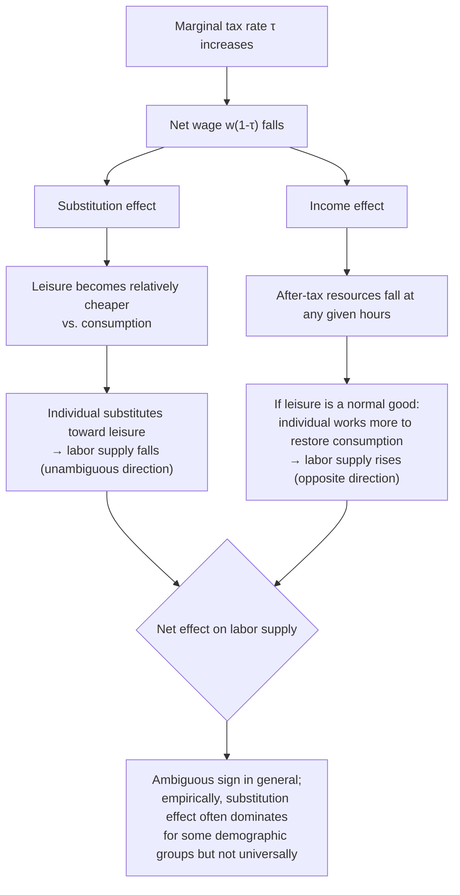

## Income and Substitution Effects of Taxation

### Conceptual Foundation

The distinction between income and substitution effects is the central analytical tool for understanding how taxation influences behavior, and for separating the *distortionary* (efficiency-relevant) component of a behavioral response from the *purely redistributive* (transfer-relevant) component. This distinction, rooted in classical consumer theory (Slutsky, Hicks), is what allows economists to identify deadweight loss as a genuinely separate concept from the mere fact that a tax changes behavior — behavior change alone does not necessarily imply inefficiency, since the income effect from a tax is precisely analogous to a lump-sum transfer of resources from the taxpayer to the government.

**Core distinction**:

- The **substitution effect** captures how a taxpayer reallocates behavior toward the now relatively cheaper option and away from the now relatively more expensive (taxed) option, holding real utility (welfare) fixed. This is the sole source of deadweight loss/excess burden.
- The **income effect** captures how a taxpayer adjusts behavior simply because the tax has reduced their effective resources, analogous to how they would respond to becoming poorer for any reason (e.g., a lump-sum tax). This component is a transfer of resources, not a loss of them, and does not by itself generate deadweight loss.

### Formal Decomposition: The Slutsky Equation

For a general taxed good or activity $x$ with price $p$ (or, in the labor supply case, the net wage $w(1-\tau)$), the total behavioral response to a price/tax change decomposes as:

$$\frac{\partial x}{\partial p}\bigg|_{\text{uncompensated}} = \frac{\partial x^c}{\partial p}\bigg|_{\text{compensated (substitution)}} - x \cdot \frac{\partial x}{\partial m}\bigg|_{\text{income effect}}$$

where $x^c$ denotes the Hicksian (compensated) demand, obtained by simultaneously adjusting income $m$ to hold utility constant as price changes.

**Applied to labor supply under taxation**: with net wage $w_n = w(1-\tau)$, and letting $L$ denote labor supply,

$$\frac{\partial L}{\partial \tau}\bigg|_{\text{total}} = \underbrace{\frac{\partial L}{\partial \tau}\bigg|_{u = \bar u}}_{\text{substitution effect}} + \underbrace{wL \cdot \frac{\partial L}{\partial m}}_{\text{income effect}}$$

A tax rate increase reduces $w_n$, which:

1. Makes leisure relatively cheaper relative to consumption (substitution effect), inducing more leisure and less labor supply — this component is unambiguously *negative* for labor supply from a tax increase.
2. Reduces the taxpayer's effective resources for any given hours worked, which — if leisure is a normal good — induces the taxpayer to work *more* to partially restore consumption (income effect), a component that is *positive* for labor supply from a tax increase (opposite sign to the substitution effect).

This is why the **net effect of an income tax rate increase on labor supply is theoretically ambiguous**, even though the *compensated* response is unambiguously negative (less labor supply as net wage falls, holding utility fixed).

### Illustration: Decomposing the Total Effect of a Tax Increase

### Why Only the Substitution Effect Generates Deadweight Loss

The key welfare-theoretic result is that the excess burden (deadweight loss) of a distortionary tax depends solely on the **compensated** elasticity, not the uncompensated one. The intuition follows from the **envelope theorem** and the definition of the compensating variation:

- A lump-sum tax that removes the same amount of revenue from the taxpayer produces *only* an income effect (no relative price distortion), and by construction generates zero excess burden — the taxpayer loses exactly what the government gains, with no additional loss.
- A distortionary tax (e.g., a wage tax) produces *both* an income effect (identical in principle to what the lump-sum tax would cause) and a substitution effect (the additional distortion from the relative price change between labor and leisure, or between taxed and untaxed goods).
- The excess burden is precisely the *additional* welfare loss from the distortionary tax *beyond* what an equal-revenue lump-sum tax would cause — and this additional loss is generated entirely by the substitution effect, since the income effect component is common to both tax instruments.

This is formalized in the classic Harberger triangle measure of deadweight loss, and is the reason the sufficient-statistic formulas in optimal tax theory (e.g., the Feldstein-Saez top-rate formula) are properly expressed using the **compensated** elasticity of taxable income, not the raw observed (uncompensated) behavioral response.

### Diagram: Compensated vs. Uncompensated Response and Deadweight Loss (svg_diagram)

<svg xmlns="http://www.w3.org/2000/svg" viewBox="0 0 640 420">
<text x="320" y="26" text-anchor="middle" font-size="16" font-weight="bold" fill="#1a1a1a">Compensated vs. Uncompensated Labor Supply Response (svg_diagram)</text>
<line x1="70" y1="360" x2="580" y2="360" stroke="#333" stroke-width="2" />
<line x1="70" y1="360" x2="70" y2="60" stroke="#333" stroke-width="2" />
<text x="325" y="395" text-anchor="middle" font-size="13" fill="#333">Leisure (l)</text>
<text x="30" y="210" text-anchor="middle" font-size="13" fill="#333" transform="rotate(-90 30 210)">Consumption (c)</text>
<line x1="90" y1="100" x2="560" y2="340" stroke="#2563eb" stroke-width="2.5" />
<text x="130" y="130" font-size="11" fill="#2563eb" font-weight="bold">Original budget line</text>
<line x1="90" y1="180" x2="560" y2="340" stroke="#dc2626" stroke-width="2.5" stroke-dasharray="6,3" />
<text x="130" y="320" font-size="11" fill="#dc2626" font-weight="bold">After-tax budget line</text>
<line x1="200" y1="60" x2="620" y2="330" stroke="#16a34a" stroke-width="2" stroke-dasharray="3,3" />
<text x="500" y="180" font-size="11" fill="#16a34a" font-weight="bold">Compensated budget line (parallel to after-tax, income restored)</text>
<circle cx="290" cy="230" r="6" fill="#1a1a1a" />
<text x="230" y="220" font-size="11" fill="#1a1a1a">Original choice A</text>
<circle cx="350" cy="290" r="6" fill="#dc2626" />
<text x="360" y="310" font-size="11" fill="#dc2626">Uncompensated choice B</text>
<circle cx="410" cy="220" r="6" fill="#16a34a" />
<text x="420" y="205" font-size="11" fill="#16a34a">Compensated choice C</text>
<text x="90" y="380" font-size="11" fill="#7c3aed">A→C: pure substitution effect</text>
<text x="330" y="380" font-size="11" fill="#ca8a04">C→B: pure income effect</text>
</svg>

### Application Beyond Labor Supply: Commodity and Capital Taxation

The income/substitution decomposition applies identically across all domains of taxation, not only labor income tax:

**Commodity taxation**: A tax on a specific good (e.g., a sales tax on restaurant meals) induces substitution toward untaxed or less-taxed substitutes (e.g., home-cooked food), generating deadweight loss via this substitution, in addition to a pure income effect from reduced purchasing power that would occur even under an equivalent lump-sum tax.

**Capital income taxation**: A tax on the return to savings similarly decomposes into (a) a substitution effect, whereby the after-tax return to saving falls, making current consumption relatively more attractive relative to future consumption (inducing lower saving), and (b) an income effect, whereby lower after-tax wealth for any given saving level may induce *more* saving to reach a target future consumption level (a mechanism closely related to the classic ambiguity of the interest-rate elasticity of savings).

**Key Points**

- In each domain, only the compensated/substitution response is relevant for computing the efficiency cost (deadweight loss) of the tax.
- The presence of an ambiguous *net* (uncompensated) response is a general feature across labor, consumption, and capital taxation, not unique to the labor supply case.
- Empirical identification strategies in each domain (labor, commodities, capital) generally attempt to isolate variation that approximates the compensated response, or separately estimate income elasticities to allow Slutsky-based decomposition.

### Empirical Estimation Strategies for Compensated Elasticities

**Key Points**

- **Cross-sectional/panel variation holding income roughly constant**: comparing individuals facing different net-of-tax rates but similar income levels (e.g., via kinks or notches in a nonlinear tax schedule) approximates the compensated response, since income effects are muted when the comparison groups have similar income levels.
- **Difference-in-differences using tax reforms**: as in the standard ETI estimation literature (Gruber and Saez, 2002), reforms that change marginal tax rates differentially across the income distribution while holding pre-reform income fixed in the instrument construction help isolate variation closer to the price/substitution effect, though pure decomposition into income versus substitution requires additional structure (e.g., estimating a virtual income term separately).
- **Structural life-cycle/family labor supply models**: explicitly model both a wage (substitution-relevant) parameter and a virtual/non-labor income (income-effect-relevant) parameter jointly, allowing direct estimation of both effects and their Slutsky-consistent combination (see Blundell and MaCurdy, 1999, for a comprehensive methodological survey).
- **Bunching at convex kinks**: the bunching estimator (Saez, 2010) is generally interpreted as identifying primarily the compensated elasticity in the region local to the kink, since the relevant comparison is a small, local change in the marginal net-of-tax rate rather than a large average-rate change with substantial income effects. [Inference: the degree to which bunching estimates are "purely" compensated, as opposed to reflecting some blend with income effects from the associated average tax rate change (via the "notch" component of certain kinks), is a technical point addressed differently across specific empirical bunching studies]

### Worked Numerical Example

**Example**

Suppose a worker has an estimated **uncompensated** labor supply elasticity of $e^u = 0.05$ (small, reflecting the well-documented near-offsetting of income and substitution effects for many workers), a labor income share of total income $s = 0.9$, and an income elasticity of labor supply $\eta = -0.10$ (a 10% increase in non-labor income reduces hours by 1%, consistent with leisure being a normal good).

Using the Slutsky decomposition:

$$e^c = e^u - s \cdot \eta = 0.05 - (0.9)(-0.10) = 0.05 + 0.09 = 0.14$$

This shows that the compensated elasticity (0.14) is substantially larger than the uncompensated elasticity (0.05) — the small observed net response to wage/tax changes masks a considerably larger underlying substitution effect that is being significantly offset by the income effect. Using the correct compensated elasticity of 0.14 (rather than the naively observed uncompensated 0.05) in a deadweight-loss calculation would yield a meaningfully larger estimate of the efficiency cost of taxation for this worker. [Inference: the specific parameter values used here are illustrative for demonstrating the decomposition mechanism, not empirical point estimates for any specific population]

### Policy Implications of the Decomposition

**Key Points**

- **Deadweight loss calculations must use compensated elasticities**: applying the uncompensated (raw observed) elasticity directly into formulas such as the Feldstein-Saez top-rate formula, without correcting for the income effect, will generally understate the true efficiency cost of taxation whenever leisure is a normal good and the income effect works to increase labor supply (offsetting some of the observed net response).
- **Revenue projections should use uncompensated (behavioral) elasticities**: for forecasting how much revenue an actual tax change will raise given real-world behavioral responses, the *uncompensated* elasticity is the relevant parameter, since actual revenue depends on the taxpayer's genuine total behavioral response, not a hypothetical compensated response.
- **This creates a subtle but important distinction in applied policy analysis**: the same empirical elasticity estimate cannot always be used interchangeably for both efficiency (deadweight loss) analysis and revenue-forecasting purposes without being careful about which concept (compensated vs. uncompensated) is appropriate for the specific question being asked.
- **Optimal tax formulas incorporating income effects explicitly**: more general versions of the Diamond-Saez and Mirrlees optimal tax formulas incorporate income effects directly (e.g., through terms capturing how the marginal utility of consumption/virtual income responds to the tax schedule), rather than assuming a simplified world with no income effects (quasilinear preferences), which is a common simplifying assumption in introductory derivations of these formulas. [Inference: the quantitative importance of explicitly modeling income effects, versus using the quasilinear simplification, varies by application and calibration]

### Limitations and Caveats

- **Compensated elasticities are not directly observable**: unlike uncompensated (Marshallian) elasticities, which can in principle be estimated directly from observed behavior, compensated (Hicksian) elasticities require either theoretical restrictions (Slutsky decomposition using a separately estimated income elasticity) or specific quasi-experimental designs that approximately hold utility constant — meaning compensated elasticity estimates always carry some degree of model-dependence.
- **Assumes stable, well-behaved preferences**: the entire decomposition rests on standard consumer theory assumptions (rational, utility-maximizing behavior with stable preferences), which may not hold precisely if behavioral biases, inattention, or salience effects (e.g., failing to fully perceive complex marginal tax rates) affect real-world responses to taxation.
- **General equilibrium considerations excluded**: the partial-equilibrium income/substitution framework holds wages and prices fixed; general equilibrium tax incidence analysis (e.g., how a capital income tax affects wages through capital-labor substitution in production) requires additional machinery beyond the basic consumer-theory decomposition presented here.
- **Aggregation across heterogeneous individuals**: population-level compensated elasticity estimates aggregate potentially quite different individual-level income and substitution effects, and the aggregate Slutsky relationship does not necessarily hold exactly at the individual level for every person in a heterogeneous population, only in expectation/aggregate under standard assumptions.

### Related Topics

- Static Labor Supply Model
- Elasticity of Taxable Income
- Deadweight Loss of Taxation and the Harberger Triangle
- Optimal Marginal Tax Rates at the Top
- Ramsey Optimal Commodity Taxation
- Life-Cycle Models of Savings and Capital Income Taxation
- Bunching Estimators and Kinked Budget Sets
- Tax Salience and Behavioral Responses to Taxation