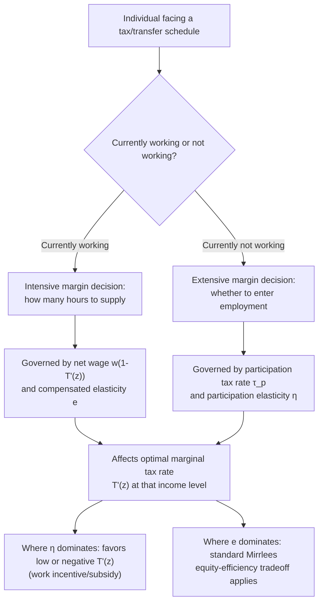

## Intensive and Extensive Margin Responses

### Conceptual Foundation

Labor supply responses to taxation and transfers can be decomposed into two distinct margins of adjustment, each governed by different economic mechanisms, different elasticity concepts, and different implications for optimal tax design.

- The **intensive margin** refers to adjustments in hours worked, effort, or intensity of work, *conditional on already being employed*. An individual on the intensive margin remains in the labor force but works more or fewer hours in response to a change in the net wage.
- The **extensive margin** refers to the discrete decision of *whether to participate in the labor force at all* — the binary choice between working (at some positive hours level) and not working (earning zero labor income).

This distinction is central to the taxation and labor supply literature because empirical evidence has generally found these two margins to differ substantially in their responsiveness to taxation across different populations, with direct implications for how progressive the tax-and-transfer schedule should be at different points in the income distribution (as developed in the Optimal Marginal Tax Rates at the Bottom material in the previous chapter).

### Formal Definitions

**Intensive margin elasticity**: the standard compensated wage elasticity of hours worked, conditional on positive hours:

$$e_{\text{intensive}} = \frac{\partial \ln L}{\partial \ln[w(1-\tau)]}\bigg|_{L > 0}$$

**Extensive margin (participation) elasticity**: measures how the *probability of working* responds to the net financial gain from working versus not working, typically expressed in terms of the **participation tax rate** $\tau_p$:

$$\tau_p = \frac{z - c(z) + b}{z}$$

where $z$ is potential earnings from working, $c(z)$ is disposable income while working, and $b$ is the transfer/benefit level received while not working. The participation elasticity is:

$$\eta = \frac{1 - \tau_p}{P} \cdot \frac{\partial P}{\partial (1-\tau_p)}$$

where $P$ is the participation rate (fraction of the relevant population choosing to work).

### Illustration: Two Distinct Margins of Response

### Why the Distinction Matters for Optimal Tax Design

The Saez (2002) framework, discussed in the Optimal Marginal Tax Rates at the Bottom material, shows that the two margins pull the optimal marginal tax rate schedule in different directions depending on where in the income distribution each margin is empirically most active:

**Key Points**

- At the very bottom of the distribution (the non-work/low-work margin), the extensive-margin response is typically the empirically dominant behavioral channel, since low-wage or marginally attached workers are deciding primarily whether to enter employment at all, not fine-tuning hours.
- A high marginal tax rate specifically in the phase-in region of a transfer program discourages entry into work (harms the extensive margin) without necessarily much affecting the hours choice of someone who has already decided to work.
- Conversely, a *negative* marginal tax rate (earnings subsidy) in this region encourages labor force entry, which — if the extensive-margin elasticity is large relative to the intensive-margin elasticity in this population — can be welfare-improving even though it appears to sacrifice some *intensive*-margin redistributive "bite" for those already working in this range.
- Higher up the income distribution, where individuals are essentially all already working and adjusting primarily along the intensive margin, the standard Mirrlees intensive-margin equity-efficiency tradeoff dominates, and the extensive-margin considerations become largely irrelevant.

This is the theoretical foundation for the empirically observed and policy-implemented pattern of **negative effective marginal tax rates in phase-in regions of in-work benefit programs** (e.g., the EITC), combined with **standard positive marginal rates** further up the distribution.

### Diagram: Elasticity Magnitude Across the Income Distribution (svg_diagram)

<svg xmlns="http://www.w3.org/2000/svg" viewBox="0 0 640 400">
<text x="320" y="26" text-anchor="middle" font-size="16" font-weight="bold" fill="#1a1a1a">Relative Elasticity Magnitude by Margin (svg_diagram)</text>
<line x1="70" y1="340" x2="580" y2="340" stroke="#333" stroke-width="2" />
<line x1="70" y1="340" x2="70" y2="60" stroke="#333" stroke-width="2" />
<text x="325" y="375" text-anchor="middle" font-size="13" fill="#333">Income Level (z)</text>
<text x="30" y="200" text-anchor="middle" font-size="13" fill="#333" transform="rotate(-90 30 200)">Relative Elasticity</text>
<path d="M 70 100 Q 200 130 300 260 T 580 320" fill="none" stroke="#dc2626" stroke-width="3" />
<text x="100" y="90" font-size="12" fill="#dc2626" font-weight="bold">Extensive margin (η)</text>
<path d="M 70 320 Q 200 300 300 220 T 580 130" fill="none" stroke="#2563eb" stroke-width="3" />
<text x="420" y="120" font-size="12" fill="#2563eb" font-weight="bold">Intensive margin (e)</text>
<line x1="230" y1="340" x2="230" y2="60" stroke="#ccc" stroke-width="1" stroke-dasharray="3,3" />
<text x="150" y="358" font-size="10" fill="#666">Bottom of distribution: extensive dominates</text>
<text x="420" y="358" font-size="10" fill="#666">Higher up: intensive dominates</text>
</svg>

### Empirical Evidence on Relative Magnitudes

**Key Points**

- Studies of U.S. EITC expansions in the 1990s (Eissa and Liebman, 1996; Meyer and Rosenbaum, 2001) found substantial positive effects on labor force participation among single mothers, consistent with a large extensive-margin elasticity for this specific demographic group, while corresponding intensive-margin (hours) effects among those already working were found to be considerably smaller.
- Historically, **married women's labor supply** (particularly the participation decision) has been found to be considerably more elastic than prime-age men's, both at the extensive and intensive margins, though this gap has narrowed in some more recent studies as female labor force attachment patterns have shifted. [Inference: the degree and pace of this convergence varies across countries and datasets and is not a settled universal magnitude]
- **Prime-age men** have generally been found to exhibit very low elasticities on both margins in developed-country contexts, reflecting near-universal labor force attachment and relatively fixed full-time work norms for this demographic group in many settings.
- **Older workers near retirement age** have been found in several studies to exhibit a notably elastic extensive margin, since the retirement decision itself is effectively a discrete extensive-margin choice highly sensitive to the net financial return to continued work (interacting with pension/social security rules), distinguishing this group's elasticity profile from prime-age workers.
- Chetty, Guren, Manoli, and Weber (2011) proposed reconciling small "micro" labor supply elasticities (typically estimated from individual-level variation) with larger "macro" elasticities (needed to match observed aggregate business-cycle fluctuations in hours) partly by emphasizing that macro elasticities reflect a mix of extensive-margin (e.g., layoffs, retirement timing) and intensive-margin responses, and that frictions dampen the *micro*, short-run intensive-margin response relative to the *long-run, macro-relevant* combined elasticity. [Inference: this reconciliation remains an area of ongoing methodological discussion rather than fully settled consensus regarding the precise decomposition]

### Worked Numerical Example

**Example**

Consider a stylized low-wage labor market segment where the government is evaluating a proposed increase in the phase-out clawback rate of an in-work benefit, from 20% to 30%, affecting workers earning between $15,000 and $25,000.

Suppose the population in this earnings range has:

- Intensive-margin compensated elasticity: $e = 0.15$ (modest hours response among those already working in this range)
- Extensive-margin participation elasticity relevant to entering this earnings range from non-work: $\eta = 0.4$ (larger, reflecting the substantial share of workers in this range who are marginally attached)

If the higher clawback rate primarily affects the intensive-margin hours choice of those *already* in this earnings bracket (since it is a phase-out affecting the marginal tax rate for those already earning in the range) rather than the initial entry decision, the direct efficiency cost is governed mainly by $e = 0.15$, a relatively modest distortion. However, if part of the affected population is on the margin of exiting employment altogether in response to a less generous *overall* program value (a composite effect combining higher phase-out rates with lower plateau benefits under some program redesigns), the larger extensive-margin elasticity $\eta = 0.4$ becomes relevant and the true behavioral and revenue consequences of the reform could be substantially larger than an intensive-margin-only analysis would suggest. [Inference: this example is a stylized illustration of the analytical distinction; the specific elasticity values and the precise decomposition of any real program's effects require empirical estimation specific to that program and population]

### Extensive Margin and the Household Context

**Key Points**

- Extensive-margin analysis is particularly important for **secondary earners** within a household (historically often women), whose participation decision has frequently been found to be substantially more responsive to the household's overall net financial return to a second earner working than the primary earner's participation decision is to their own net wage.
- Joint household taxation systems (as opposed to individual taxation) can generate especially high effective marginal/participation tax rates on secondary earners, since their earnings are taxed starting from the household's already-established marginal tax bracket (from the primary earner's income) rather than starting from a zero base — a phenomenon extensively discussed in the literature on family taxation and gender-based extensive-margin responses.
- This household-level extensive-margin consideration has been cited as a rationale, in some of the theoretical tagging/gender-taxation literature (e.g., Alesina, Ichino, and Karabarbounis, 2011, discussed under Tagging and the Use of Observable Characteristics), for differentially lower marginal tax treatment of secondary earners, given their documented higher elasticity relative to primary earners.

### Extensive Margin and Retirement/Disability Program Design

Beyond standard income tax and in-work benefit design, the intensive/extensive distinction is central to the design of:

- **Social security and pension systems**: the decision of when to claim retirement benefits and exit the labor force is a canonical extensive-margin choice, heavily studied for its responsiveness to the implicit tax/subsidy embedded in benefit accrual rules (e.g., actuarially unfair or favorable adjustments for delayed claiming).
- **Disability insurance programs**: application and award decisions represent an extensive-margin labor force exit decision, with extensively studied responsiveness to the relative generosity of disability benefits versus continued work, and to the screening stringency of the disability determination process (connecting to the Tagging material's discussion of disability screening).

### Measurement Challenges

**Key Points**

- The extensive margin is inherently harder to identify cleanly than the intensive margin because the relevant "no work" counterfactual involves comparing across different individuals or different states of the same individual over time, rather than observing a continuous marginal adjustment for the same working individual.
- Participation decisions are also affected by a wider set of confounding factors (job availability, health, caregiving responsibilities, social norms) that are less directly relevant to intensive-margin hours adjustments, complicating causal identification of the pure tax/benefit-driven extensive-margin elasticity.
- Bunching estimators, well-suited to intensive-margin kink analysis, require adaptation (e.g., analyzing "notches" — discrete jumps in the budget set, common in eligibility-threshold-based benefit programs) to study extensive-margin-adjacent behavior, since a pure kink (a change in slope) is conceptually different from the discrete participation choice itself. [Inference: the specific econometric adaptations used across studies of extensive-margin notches vary in their identifying assumptions and are not fully standardized across the literature]

### Limitations of the Intensive/Extensive Dichotomy

- **Not a fully clean binary in practice**: real-world labor market adjustments include intermediate margins not perfectly captured by either category, such as part-time versus full-time work status, informal/gig work arrangements, or job search intensity, which may not map cleanly onto either the pure "hours conditional on working" or "work versus not work" framework.
- **Interdependence across margins over time**: an individual's extensive-margin participation history can affect their future intensive-margin productivity and wage (e.g., through human capital depreciation during non-employment spells), meaning the two margins are not fully separable in a genuinely dynamic setting, unlike in the static single-period models where the distinction is typically formalized.
- **Population elasticity heterogeneity may be time-varying**: the specific elasticity magnitudes found for demographic groups (e.g., married women's historically elastic extensive margin) can shift over time with changing social norms, childcare availability, and labor market structure, meaning empirical estimates from a given period may not directly generalize to current policy design without updated estimation. [Inference: the pace and direction of such shifts is inherently an empirical matter subject to ongoing research rather than a fixed theoretical prediction]

### Related Topics

- Optimal Marginal Tax Rates at the Bottom
- Static Labor Supply Model
- Income and Substitution Effects of Taxation
- Earned Income Tax Credit: Design and Evidence
- Household Labor Supply and Family Taxation
- Retirement and Social Security Claiming Decisions
- Disability Insurance Screening and Optimal Stringency
- Bunching and Notches in Kinked/Discontinuous Budget Sets