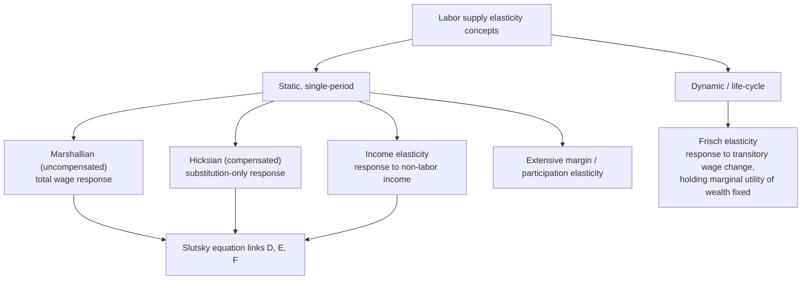

## Empirical Estimates of Labor Supply Elasticities

### Overview of the Empirical Landscape

The empirical labor supply elasticity literature spans several decades and methodological generations, moving from early cross-sectional regressions, through structural life-cycle models, to modern quasi-experimental and administrative-data-based designs. Estimates vary substantially depending on: (1) the demographic group studied, (2) the margin examined (intensive versus extensive), (3) whether the estimate is compensated or uncompensated, (4) the identification strategy used, and (5) whether the estimate is a "micro" (individual-level, often short-run) or "macro" (aggregate, often longer-run) elasticity. A central theme of this literature is reconciling why these different approaches and populations often yield strikingly different magnitudes.

### Key Elasticity Concepts Being Estimated

**Key Points**

- **Marshallian (uncompensated) elasticity**: the total observed response of hours/participation to a net wage change, combining substitution and income effects.
- **Hicksian (compensated) elasticity**: the pure substitution response, holding utility fixed; the theoretically correct concept for deadweight-loss calculations.
- **Income elasticity of labor supply**: the response of hours to a change in non-labor (virtual) income, holding the wage fixed; used to convert between Marshallian and Hicksian elasticities via the Slutsky equation.
- **Extensive-margin (participation) elasticity**: responsiveness of the binary employment decision to the net financial return to working.
- **Frisch elasticity**: the elasticity of labor supply with respect to a *transitory*, anticipated wage change, holding the marginal utility of wealth constant; the relevant concept for life-cycle labor supply models and macro business-cycle analysis, distinct from both Marshallian and Hicksian elasticities in a static one-period sense.
- **Elasticity of taxable income (ETI)**: the broader concept (introduced earlier in this course) capturing all margins of response to taxation (hours, effort, avoidance, evasion), not solely labor supply in the narrow hours/participation sense.

### Illustration: The Elasticity Concept Landscape

### Classic Estimates: Prime-Age Men

**Key Points**

- Early cross-sectional studies from the 1970s–1980s (surveyed in Pencavel, 1986) generally found small, often slightly *negative*, uncompensated wage elasticities of hours worked for prime-age men, reflecting near-complete offsetting of income and substitution effects.
- Estimated compensated elasticities for prime-age men in this literature were typically found to be modestly positive but small in magnitude, generally well under 0.2.
- This near-inelastic finding for prime-age men has been broadly durable across subsequent decades of research using varied methodologies, and is one of the most robust stylized facts in the labor supply literature, generally attributed to the rigidity of full-time work norms and limited hours flexibility for this demographic in most institutional contexts studied. [Inference: precise point estimates vary by country, time period, and dataset, and should not be treated as a single universal constant]

### Classic Estimates: Married Women / Secondary Earners

**Key Points**

- Early studies (also surveyed in Killingsworth and Heckman, 1986, and Pencavel, 1986) found substantially larger uncompensated and compensated elasticities for married women relative to prime-age men, often several multiples larger.
- Much of this larger elasticity was found to operate through the **extensive margin** (labor force participation decision) rather than the intensive margin (hours conditional on working), consistent with married women historically exhibiting greater marginal attachment to the labor force.
- More recent studies (e.g., Blau and Kahn, 2007, and subsequent updates) have generally found this elasticity gap between married women and men to have **narrowed over time**, attributed to increasing labor force attachment and changing social norms and household division-of-labor patterns. [Inference: the precise magnitude and pace of convergence differ across studies, countries, and time periods studied, and should not be treated as a single settled trajectory]

### Modern Structural and Life-Cycle Estimates

**Key Points**

- Structural life-cycle labor supply models, comprehensively surveyed by Blundell and MaCurdy (1999) and later Keane (2011), estimate labor supply parameters jointly with intertemporal consumption/savings behavior, allowing separate identification of Frisch, Marshallian, and Hicksian elasticities within a unified dynamic framework.
- These structural approaches have generally found **Frisch elasticities** in the range of roughly 0 to 0.5 for men in many studies, though estimates vary considerably depending on model specification, functional form assumptions, and whether extensive-margin transitions are jointly modeled. [Inference: the specific numerical range cited reflects a synthesis across a heterogeneous set of studies with differing methodologies rather than a single point estimate accepted uniformly across the literature]
- Keane (2011) provides an extensive critical review arguing that many earlier structural estimates using specific functional form and separability assumptions may have understated true labor supply elasticities, particularly by neglecting the interaction between labor supply and human capital accumulation over the life cycle.

### Reconciling Micro and Macro Elasticities

A major and influential strand of the literature (Chetty, Guren, Manoli, and Weber, 2011, and related work) addresses a puzzle: **micro-level** (individual-level, typically short-run) labor supply elasticity estimates are generally small (often under 0.2), whereas **macro-level** analyses calibrating real business cycle models to match observed aggregate fluctuations in total hours worked over the business cycle require substantially larger elasticities (often 1 or more) to match observed data.

**Key Points**

- Chetty et al. (2011) propose that this gap is driven substantially by **optimization frictions** at the micro level: adjustment costs, fixed costs of changing hours, employer constraints on hours flexibility, and imperfect information about complex tax schedules dampen the observed short-run individual response relative to the "true" frictionless structural elasticity.
- They argue that the frictionless "structural" elasticity relevant for long-run and macro analysis is closer to the higher end of the range implied by macro calibration, and that observed micro-elasticities represent a *lower bound* on this structural elasticity due to these frictions.
- A key piece of supporting evidence is that estimated elasticities tend to be **larger** in settings involving fewer adjustment frictions — for example, on the extensive margin generally (a discrete decision less constrained by an employer's fixed-hours job structure) and in settings with substantial cumulative/long-run variation (e.g., large, salient, well-understood tax changes) rather than small or complex marginal changes.
- This reconciliation remains actively debated, and the precise decomposition of the micro-macro gap into "genuine frictions" versus "different underlying elasticity concepts being measured" (e.g., Frisch vs. Hicksian vs. Marshallian) is not fully settled. [Unverified: the specific quantitative contribution of frictions versus differing elasticity concepts to the observed micro-macro gap varies across studies and modeling approaches, and treating any single decomposition as definitively established would overstate the consensus]

### Diagram: The Micro-Macro Elasticity Gap (svg_diagram)

<svg xmlns="http://www.w3.org/2000/svg" viewBox="0 0 640 380">
<text x="320" y="26" text-anchor="middle" font-size="16" font-weight="bold" fill="#1a1a1a">Micro vs. Macro Labor Supply Elasticity Estimates (svg_diagram)</text>
<line x1="90" y1="320" x2="590" y2="320" stroke="#333" stroke-width="2" />
<line x1="90" y1="320" x2="90" y2="60" stroke="#333" stroke-width="2" />
<text x="340" y="355" text-anchor="middle" font-size="13" fill="#333">Elasticity magnitude</text>
<rect x="160" y="270" width="80" height="50" fill="#2563eb" />
<text x="200" y="345" text-anchor="middle" font-size="11" fill="#333">Micro estimates (individual variation)</text>
<text x="200" y="260" text-anchor="middle" font-size="11" fill="#2563eb" font-weight="bold">~0.1–0.3</text>
<rect x="420" y="100" width="80" height="220" fill="#dc2626" />
<text x="460" y="345" text-anchor="middle" font-size="11" fill="#333">Macro-calibrated (business cycle fit)</text>
<text x="460" y="90" text-anchor="middle" font-size="11" fill="#dc2626" font-weight="bold">~1.0+</text>
<text x="330" y="200" font-size="12" fill="#555" font-style="italic">Gap attributed partly to frictions and adjustment costs</text>
</svg>

### Estimates from Natural Experiments and Tax Reforms

**Key Points**

- Studies exploiting large, salient tax reforms (e.g., the U.S. Tax Reform Act of 1986, various Nordic tax reforms, and Swiss cantonal variation studies) have generally produced elasticity estimates in a wide range depending on the population and margin studied, with elasticities for high-income and self-employed populations typically found to be considerably larger than for median-income wage earners, largely reflecting the broader elasticity of taxable income (including avoidance margins) discussed earlier in the ETI reference.
- Kleven and Schultz (2014), using extensive Danish administrative tax reform data, found relatively **modest** labor income elasticities across the Danish population, attributed partly to Denmark's strong third-party income reporting infrastructure limiting the scope for avoidance and evasion responses relative to countries with weaker reporting systems.
- Studies of the EITC and similar in-work benefit expansions (Eissa and Liebman, 1996; Meyer and Rosenbaum, 2001; Chetty, Friedman, and Saez, 2013) consistently find meaningful positive extensive-margin employment effects among single mothers, generally larger than corresponding intensive-margin hours effects for the same population, as discussed under Intensive and Extensive Margin Responses.

### Cross-Country Variation in Estimates

**Key Points**

- Elasticity estimates have been found to vary meaningfully across countries, plausibly reflecting differences in labor market institutions (e.g., collective bargaining coverage, part-time work norms, childcare availability and cost), tax system design (individual versus joint taxation), and the strength of income reporting/enforcement infrastructure.
- Nordic countries, with extensive childcare support and individual (rather than joint) taxation systems, have in some studies been found to exhibit smaller gender gaps in labor supply elasticities relative to countries with joint taxation and less childcare support, though this comparison depends heavily on the specific studies and time periods being compared. [Inference: definitive causal attribution of cross-country elasticity differences to specific institutional features, as opposed to other confounding factors, requires careful comparative research design and is not universally agreed upon in the literature]
- Countries with weaker income reporting infrastructure have generally been associated with larger *aggregate* taxable-income-type elasticities (blending genuine labor supply responses with avoidance/evasion), complicating direct cross-country comparison of "pure" labor supply elasticities as distinct from the broader ETI concept.

### Summary Table of Illustrative Elasticity Ranges by Group and Margin

| Population / Margin | Uncompensated Elasticity (illustrative range) | Notes |
| --- | --- | --- |
| Prime-age men, intensive margin | ~0 to 0.1 | Consistently found to be small/near-zero across many studies |
| Prime-age men, extensive margin | Very low | Near-universal labor force attachment in most studied contexts |
| Married women, intensive margin | ~0.1 to 0.3 | Considerable cross-study variation |
| Married women, extensive margin | ~0.3 to 0.8+ | Historically the largest documented margin/group combination; narrowing over time in some studies |
| Older workers (near retirement), extensive margin | Moderate to high | Highly sensitive to pension/social security claiming incentives |
| Self-employed / high earners (broader ETI) | Often 0.3 to 0.5+ | Reflects substantial avoidance/income-shifting margins beyond pure labor supply |

[Inference: the ranges in this table are illustrative syntheses drawn from the general pattern of findings across the surveyed literature discussed above, not a single canonical meta-analytic estimate; individual studies within each category can fall outside these illustrative ranges depending on methodology, country, and time period]

### Methodological Challenges Affecting Estimate Comparability

**Key Points**

- **Endogeneity of wages and hours**: wages and hours are jointly determined with unobserved individual characteristics (e.g., unobserved ability or motivation), requiring instrumental variables or natural experiment designs to obtain credible causal estimates, and different studies' choices of instrument can materially affect estimated magnitudes.
- **Selection into employment**: intensive-margin wage elasticity estimates that rely only on the sample of currently employed individuals can be affected by selection bias (since employment itself is a choice correlated with unobserved wage offers), a concern particularly relevant for estimating married women's labor supply given historically lower and more variable participation rates.
- **Distinguishing anticipation/retiming effects from permanent responses**: as discussed under the Elasticity of Taxable Income reference, short-run responses to anticipated tax changes can reflect intertemporal retiming rather than a genuine change in average labor supply, inflating short-run elasticity estimates relative to steady-state, policy-relevant magnitudes.
- **Choice of dataset and time period**: administrative tax data, household survey data, and firm-level payroll data can yield different elasticity estimates for conceptually similar populations due to differences in measurement error, income definitions, and sample coverage (e.g., administrative data typically has less measurement error but may lack certain demographic/household context variables available in survey data).

### Limitations of the Empirical Literature

- **Elasticities are not structural constants**: reflecting the general finding that elasticities vary substantially by group, time period, and institutional context, they should be understood as *estimated parameters conditional on a specific empirical setting* rather than universal, time-invariant behavioral constants transferable without qualification to any policy context.
- **Difficulty isolating pure labor supply from broader taxable income responses**: especially for higher-income and self-employed populations, disentangling genuine hours/effort responses from avoidance and income-shifting responses (captured by the broader ETI concept) remains methodologically challenging, and many "labor supply" elasticity estimates in this range may partly reflect the broader ETI margins.
- **Limited evidence on some demographic groups and contexts**: relative to prime-age men and married women in developed countries, there is comparatively less robust, high-quality causal evidence on labor supply elasticities for some populations (e.g., certain low-income subgroups in developing-country contexts, gig/platform workers under modern labor market arrangements), representing an ongoing area of active empirical research. [Inference: the pace and coverage of research expansion into these areas is itself evolving and this reference does not assert comprehensive current coverage]

### Related Topics

- Static Labor Supply Model
- Income and Substitution Effects of Taxation
- Intensive and Extensive Margin Responses
- Elasticity of Taxable Income
- Frisch Elasticity and Dynamic Labor Supply Models
- Household Labor Supply and Family Taxation
- Bunching Estimators and Kinked Budget Sets
- Cross-Country Comparisons in Public Finance