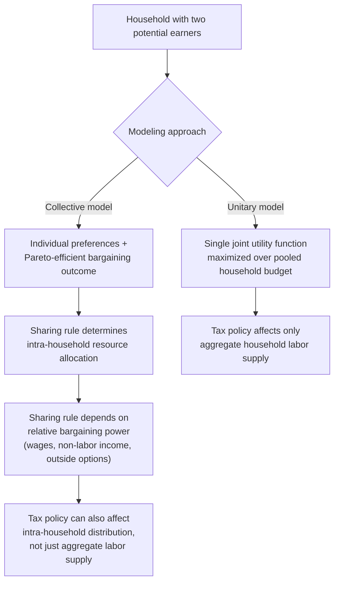
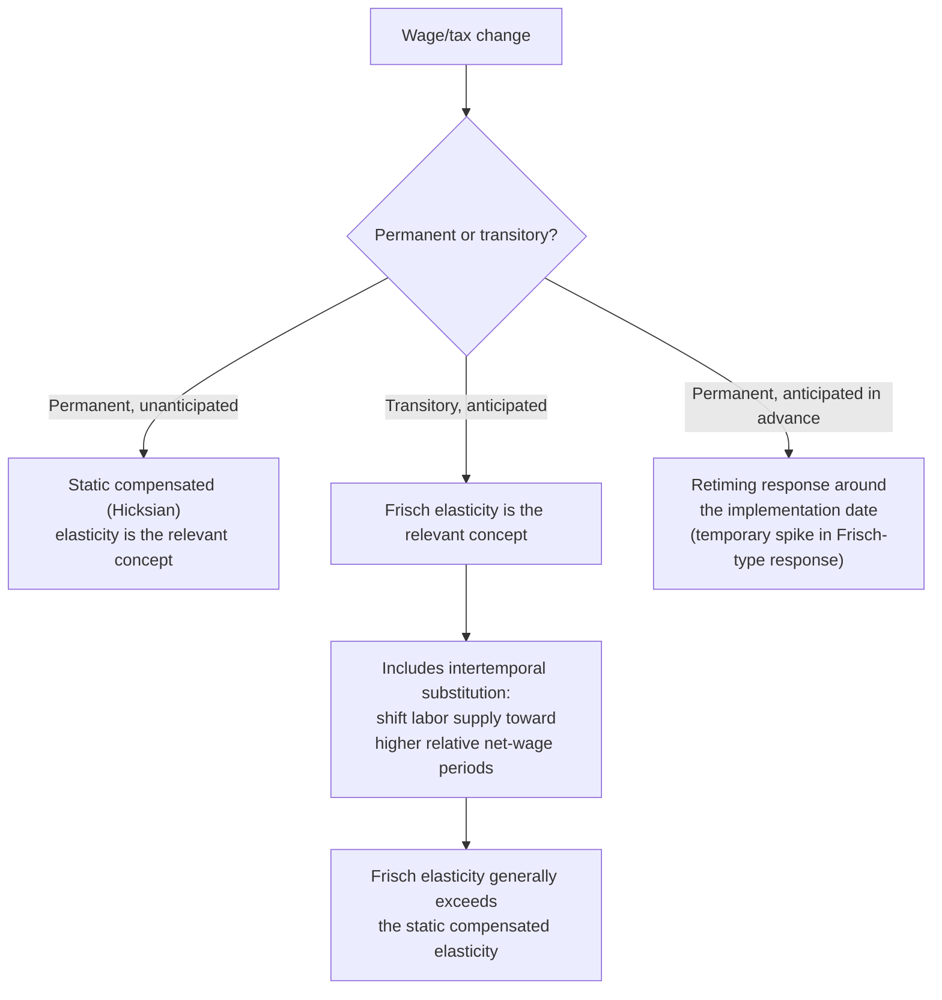

## Household and Life-Cycle Labor Supply Responses

### Conceptual Foundation

The household and life-cycle extensions of the labor supply model relax two central simplifying assumptions of the basic static single-agent framework introduced earlier in this chapter: (1) that labor supply decisions are made by isolated individuals rather than jointly within a family unit, and (2) that decisions are made in a single period rather than across a multi-period planning horizon involving savings, borrowing, and anticipated future wages. Both extensions are essential for realistic tax policy analysis, since real tax-and-transfer systems typically define tax units at the household/family level and operate over an individual's entire working lifetime, not a single isolated period.

### Household Labor Supply Models

**Unitary household model**: The simplest extension treats the household as a single decision-making unit maximizing a joint utility function over the consumption and leisure of both (or all) household members, subject to a combined household budget constraint:

$$\max_{c, l_1, l_2} \, u(c, l_1, l_2) \quad \text{subject to} \quad c = w_1(T-l_1) + w_2(T-l_2) + m$$

where subscripts 1 and 2 denote the two household members (e.g., spouses), $w_i$ their respective wages, and $m$ household non-labor income. This model treats the household "as if" it were a single utility-maximizing agent, implying that only total household income matters for consumption decisions (the "income pooling" hypothesis) regardless of which member earned it.

**Key Points**

- The unitary model has been empirically challenged by numerous studies finding that household consumption and expenditure patterns depend on *which* spouse controls a given increment of income, contrary to the pure income-pooling prediction — a finding that has motivated the development of collective household models.
- **Collective household models** (Chiappori, 1988, and subsequent extensions) instead model the household as a Pareto-efficient bargaining outcome between two individuals with potentially distinct preferences, linked by a "sharing rule" that determines how household resources are allocated between members, itself potentially a function of relative bargaining power (e.g., relative wages, non-labor income, or outside options such as divorce law regimes).
- Under collective models, tax and transfer policy can affect not only aggregate household labor supply but also the intra-household distribution of resources, since a policy that increases one spouse's individual after-tax earning power can shift bargaining power and thus the sharing rule, even holding total household resources fixed.

### Illustration: Household Labor Supply Decision Structure

### Primary and Secondary Earner Distinction

**Key Points**

- Empirically and in much of the applied optimal taxation literature, one household member is often treated as the **primary earner** (typically the higher-earning, more consistently employed member) and the other as the **secondary earner** (typically exhibiting a more elastic labor supply response, particularly at the extensive margin).
- Under **joint taxation** systems (where household income is combined and taxed as a unit, common historically in the U.S. married-filing-jointly system and in several other countries), the secondary earner's first dollar of earnings is effectively taxed starting at the marginal rate applicable to the household's combined income *after* the primary earner's income — meaning the secondary earner faces a comparatively high effective marginal tax rate on labor force entry, even though their own individual earnings may be modest.
- Under **individual (separate) taxation** systems, each spouse is taxed based solely on their own income, generally implying a lower effective marginal tax rate on a secondary earner's entry into the labor force relative to a joint taxation system, all else equal.
- Given the documented empirical finding that secondary earners (historically often women) exhibit larger extensive-margin elasticities than primary earners, the choice between joint and individual taxation carries direct efficiency implications: joint taxation systems impose a relatively larger efficiency cost on the more elastic secondary-earner margin, a key argument advanced in favor of individual taxation on Ramsey/optimal-tax efficiency grounds. [Inference: the magnitude of this efficiency cost depends on the specific elasticity gap between primary and secondary earners in a given population and time period, which is not a fixed universal constant]

### Diagram: Marginal Tax Rate Facing a Secondary Earner Under Joint vs. Individual Taxation (svg_diagram)

<svg xmlns="http://www.w3.org/2000/svg" viewBox="0 0 640 380">
<text x="320" y="26" text-anchor="middle" font-size="16" font-weight="bold" fill="#1a1a1a">Secondary Earner's Marginal Tax Rate (svg_diagram)</text>
<line x1="80" y1="320" x2="580" y2="320" stroke="#333" stroke-width="2" />
<line x1="80" y1="320" x2="80" y2="60" stroke="#333" stroke-width="2" />
<text x="330" y="355" text-anchor="middle" font-size="13" fill="#333">Secondary Earner's Own Earnings</text>
<text x="35" y="200" text-anchor="middle" font-size="13" fill="#333" transform="rotate(-90 35 200)">Marginal Tax Rate</text>
<line x1="80" y1="130" x2="580" y2="90" stroke="#dc2626" stroke-width="3" />
<text x="380" y="110" font-size="12" fill="#dc2626" font-weight="bold">Joint taxation (starts at household's existing bracket)</text>
<line x1="80" y1="280" x2="580" y2="200" stroke="#2563eb" stroke-width="3" stroke-dasharray="6,3" />
<text x="380" y="260" font-size="12" fill="#2563eb" font-weight="bold">Individual taxation (starts at zero-income bracket)</text>
</svg>

### Life-Cycle Labor Supply Models

**Conceptual foundation**: Life-cycle labor supply models extend the static framework to a multi-period setting in which individuals choose a sequence of consumption and labor supply (or leisure) over their working lifetime, subject to an intertemporal budget constraint allowing borrowing and saving, and typically evaluated using a discounted lifetime utility function:

$$\max_{\{c_t, l_t\}} \sum_{t=0}^{T} \beta^t u(c_t, l_t) \quad \text{subject to} \quad \sum_t \frac{c_t}{(1+r)^t} \leq \sum_t \frac{w_t(T-l_t)(1-\tau_t)}{(1+r)^t} + A_0$$

where $\beta$ is the discount factor, $r$ is the interest rate, $\tau_t$ is the period-$t$ tax rate, and $A_0$ is initial assets.

**Frisch elasticity**: The key elasticity concept in this dynamic setting is the **Frisch elasticity**, which measures the response of labor supply to a *transitory, anticipated* wage change, holding the marginal utility of wealth $\lambda$ (a sufficient statistic for the individual's entire lifetime resource position) constant:

$$e_F = \frac{\partial \ln L_t}{\partial \ln w_t}\bigg|_{\lambda \text{ constant}}$$

**Key Points**

- The Frisch elasticity is the theoretically relevant concept for analyzing responses to *temporary* tax changes (e.g., a one-year tax holiday or a temporary surtax), since such changes have a negligible effect on lifetime wealth/marginal utility of wealth but directly affect the relative price of current-period leisure versus future-period leisure.
- The Frisch elasticity is generally larger in magnitude than the static compensated (Hicksian) elasticity, because it captures not only the standard within-period substitution effect but also **intertemporal substitution** — the incentive to shift labor supply from periods of relatively low net wages to periods of relatively high net wages.
- This intertemporal substitution channel is the basis for concerns about **retiming responses** to anticipated permanent versus temporary tax changes: a well-publicized future tax increase can induce individuals to shift income/labor supply into the current (pre-reform) period, producing a short-run behavioral response that substantially overstates the long-run, steady-state elasticity relevant for permanent policy evaluation.

### Illustration: Static vs. Dynamic Elasticity Concepts

### Human Capital Investment and Life-Cycle Tax Responses

**Key Points**

- Life-cycle models incorporating endogenous human capital investment (e.g., education, on-the-job training) show that taxation can affect not only current-period labor supply but also the incentive to invest in future earning capacity, since taxes reduce the after-tax return to human capital investment in a manner broadly analogous to how they reduce the after-tax return to physical capital investment.
- Keane (2011) argues, in a comprehensive review, that many earlier structural labor supply estimates understated true elasticities partly by neglecting this human-capital-investment margin, since a higher tax rate can reduce not only current hours but also the incentive to acquire skills that would raise future wages, a distortion invisible to models focused solely on the static hours margin.
- This has direct relevance for the choice of tax base and progressivity structure over the life cycle: a highly progressive tax schedule that heavily taxes the high future earnings resulting from successful human capital investment can reduce the ex-ante incentive to invest in that human capital, an intertemporal analogue to the standard static labor supply distortion. [Inference: the empirical magnitude of this human-capital-investment distortion channel, relative to the standard static hours-margin distortion, is an area of ongoing research with results that vary across studies and calibration approaches]

### Worked Numerical Example

**Example**

Suppose an individual faces a temporary one-year tax surcharge that will raise their marginal tax rate from 30% to 45% next year only, reverting to 30% in all subsequent years, and their estimated Frisch elasticity is $e_F = 0.7$ (a relatively elastic intertemporal substitution response, consistent with values sometimes used in macro-calibrated life-cycle models).

The relevant net-of-tax rate change in the surcharge year is from $(1-0.30) = 0.70$ to $(1-0.45) = 0.55$, a log change of $\ln(0.55/0.70) \approx -0.241$, or about a 24.1% decline in the net-of-tax rate.

Applying the Frisch elasticity: $\% \Delta L \approx e_F \times \% \Delta (1-\tau) = 0.7 \times (-24.1\%) \approx -16.9\%$

This individual would be predicted to reduce labor supply by roughly 16.9% during the surcharge year specifically — but critically, under the life-cycle model, this large short-run response substantially reflects intertemporal *retiming* (shifting hours toward the surrounding lower-tax years) rather than a reduction in lifetime total labor supply, since the individual's overall wealth and marginal utility of wealth are barely affected by a one-year, pre-announced, temporary change. This illustrates why naive extrapolation from a temporary-tax-change elasticity estimate to a permanent-tax-change policy context would substantially overstate the true long-run behavioral and revenue effects of a permanent rate change. [Inference: this is an illustrative computation applying the stated formula and parameter value, not an empirical estimate for a specific real-world tax episode]

### Life-Cycle Considerations in Retirement Timing

**Key Points**

- The retirement decision is a central extensive-margin life-cycle choice, extensively studied for its sensitivity to the implicit tax/subsidy embedded in social security and pension benefit accrual rules across the life cycle (e.g., whether delaying retirement by one year yields an actuarially fair, favorable, or unfavorable increase in future benefits).
- Life-cycle models of retirement timing generally find that the *option value* of continued work (incorporating the entire remaining lifetime path of potential future benefit accrual, not just the current-year financial return to working one more year) is an important determinant of retirement timing, distinct from a purely static, single-period calculation of the current year's net financial return to working.
- Cross-country variation in pension system design (e.g., early retirement penalties, delayed retirement credits) has been used in several studies as a natural source of variation to estimate the responsiveness of the retirement/labor-force-exit decision to these life-cycle financial incentives. [Inference: specific elasticity magnitudes from this literature vary by country, cohort, and pension system design studied, and are not summarized here as a single universal figure]

### Interactions Between Household and Life-Cycle Dimensions

**Key Points**

- Household labor supply decisions themselves evolve over the life cycle: the presence and age of children substantially affects secondary-earner labor force participation at different life stages, meaning the "secondary earner elasticity" is not a time-invariant individual characteristic but partly a function of the household's current life-cycle stage (e.g., presence of young children versus an empty-nest stage).
- Joint modeling of household and life-cycle dimensions (dynamic collective household models) represents a more complete, though considerably more complex, framework for understanding how tax and transfer policy affects labor supply, incorporating both the intra-household bargaining dimension and the intertemporal substitution dimension simultaneously. [Inference: the additional complexity of fully joint dynamic collective models means they are less commonly used in direct applied policy calibration relative to simpler unitary or single-period models, though this is a practical modeling-tractability observation rather than a claim about which framework is theoretically preferable]

### Limitations of Household and Life-Cycle Extensions

- **Increased data and identification demands**: both household bargaining models and life-cycle models with intertemporal substitution require richer panel data (tracking individuals or households over time, ideally with variation in both spouses' wages and tax treatment) than the basic static single-agent model, limiting the settings in which these richer models can be credibly estimated.
- **Model specification sensitivity**: life-cycle model estimates of the Frisch elasticity have been found to be sensitive to functional form assumptions about utility (e.g., separability between consumption and leisure across periods) and to assumptions about borrowing constraints, meaning reported Frisch elasticity estimates can vary considerably depending on these modeling choices. [Inference: the degree of this sensitivity and which specific assumptions matter most is itself a subject of ongoing methodological debate within the structural labor supply literature]
- **Unitary model assumptions may not hold**: as noted above, the unitary household model's income-pooling prediction has been empirically challenged, meaning policy analysis relying on the simpler unitary framework may mischaracterize how tax policy affects intra-household welfare distribution, even if it reasonably approximates aggregate household labor supply responses.
- **Retirement and human capital margins add further behavioral complexity**: the life-cycle extensions introduce numerous additional behavioral margins (retirement timing, human capital investment, intertemporal consumption smoothing) beyond the pure labor supply hours/participation choice, and fully integrating all of these margins into a single tractable optimal tax framework remains a significant ongoing research challenge rather than a fully resolved area of the literature.

### Related Topics

- Static Labor Supply Model
- Intensive and Extensive Margin Responses
- Empirical Estimates of Labor Supply Elasticities
- Family Taxation: Joint versus Individual Taxation
- Tagging and the Use of Observable Characteristics
- Retirement and Social Security Claiming Decisions
- Human Capital Investment and Optimal Taxation
- Frisch Elasticity and Intertemporal Labor Supply