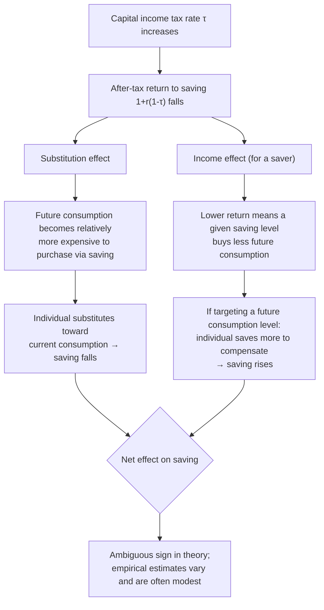

## Effects of Taxation on Household Saving

### Conceptual Foundation

The analysis of how taxation affects household saving applies the same income/substitution effect logic developed for labor supply to the intertemporal consumption-saving decision. A tax on capital income changes the relative price of future consumption versus present consumption, creating a substitution effect (relevant for efficiency analysis) that can, in principle, be reinforced or offset by an income effect — with the crucial complication that, for savings specifically, the theoretical sign of the *net* response to a capital income tax is famously ambiguous, and this ambiguity has been a central, long-standing theme in public finance.

### The Two-Period Life-Cycle Saving Model

**Basic setup**: Consider an individual choosing consumption in two periods, $c_1$ (current) and $c_2$ (future), with income $y_1$ in period 1 and no income in period 2, saving $s = y_1 - c_1$, and earning a pre-tax interest rate $r$ on savings:

$$\max_{c_1, c_2} \, u(c_1, c_2) \quad \text{subject to} \quad c_2 = (y_1 - c_1)[1 + r(1-\tau)]$$

where $\tau$ is the tax rate applied to capital income (interest earned on savings).

**First-order condition**: at the optimum,

$$\frac{u_1(c_1, c_2)}{u_2(c_1, c_2)} = 1 + r(1-\tau)$$

This states that the marginal rate of substitution between present and future consumption equals the after-tax gross return to saving, $1 + r(1-\tau)$. A capital income tax reduces this after-tax return relative to the pre-tax return $(1+r)$, altering the relative price of future consumption in terms of foregone present consumption.

### Income and Substitution Effects on Saving

**Key Points**

- **Substitution effect of a capital tax**: a higher $\tau$ reduces the after-tax return to saving, making future consumption relatively more expensive to "buy" via current saving. This makes current consumption relatively more attractive, inducing **less saving** (more current consumption) — an unambiguous direction, holding utility fixed.
- **Income effect of a capital tax**: for a saver (someone with positive savings), a higher $\tau$ reduces the future consumption obtainable from any given amount of current saving. If the individual has a *target* level of future consumption (e.g., a retirement consumption goal) they wish to preserve, this reduction in the effective return to saving induces them to **save more** in period 1 to compensate for the lower after-tax return — a direction opposite to the substitution effect.
- The **net effect of a capital income tax on saving is therefore theoretically ambiguous**, exactly analogous to the ambiguous net effect of a labor income tax on labor supply, and for the same underlying reason: the substitution and income effects work in opposite directions.
- This ambiguity is a classical result in public finance (sometimes associated with early treatments by Fisher and later formalized extensively in optimal capital taxation theory) and is frequently cited as a caution against assuming, without empirical verification, that capital taxes necessarily reduce aggregate saving.

### Illustration: Decomposing the Response of Saving to a Capital Income Tax

### Diagram: Intertemporal Budget Constraint and Optimal Saving (svg_diagram)

<svg xmlns="http://www.w3.org/2000/svg" viewBox="0 0 620 420">
<text x="310" y="26" text-anchor="middle" font-size="16" font-weight="bold" fill="#1a1a1a">Intertemporal Consumption Choice (svg_diagram)</text>
<line x1="70" y1="360" x2="580" y2="360" stroke="#333" stroke-width="2" />
<line x1="70" y1="360" x2="70" y2="60" stroke="#333" stroke-width="2" />
<text x="325" y="395" text-anchor="middle" font-size="13" fill="#333">Current Consumption (c₁)</text>
<text x="30" y="210" text-anchor="middle" font-size="13" fill="#333" transform="rotate(-90 30 210)">Future Consumption (c₂)</text>
<line x1="90" y1="90" x2="500" y2="340" stroke="#2563eb" stroke-width="3" />
<text x="140" y="140" font-size="12" fill="#2563eb" font-weight="bold">Pre-tax budget line (slope = -(1+r))</text>
<line x1="90" y1="180" x2="500" y2="340" stroke="#dc2626" stroke-width="3" stroke-dasharray="6,3" />
<text x="150" y="330" font-size="12" fill="#dc2626" font-weight="bold">After-tax budget line (slope = -(1+r(1-τ)))</text>
<circle cx="270" cy="230" r="6" fill="#16a34a" />
<text x="200" y="215" font-size="11" fill="#16a34a" font-weight="bold">Optimal choice (c₁*, c₂*)</text>
</svg>

### The Special Case of Constant Relative Risk Aversion (CRRA) Preferences

For the widely used CRRA utility specification, $u(c) = \dfrac{c^{1-\gamma}}{1-\gamma}$, applied additively across periods with discount factor $\beta$, the elasticity of intertemporal substitution (EIS) is $1/\gamma$, and it can be shown that the sign of the saving response to a change in the after-tax interest rate depends directly on the relationship between $\gamma$ (the coefficient of relative risk aversion, inversely related to the willingness to substitute consumption across time) and the specific parameter values:

**Key Points**

- When $\gamma = 1$ (logarithmic utility), the income and substitution effects on saving from an interest rate change exactly offset for a specific benchmark case, leaving the saving rate *unresponsive* to the interest rate (though the level of consumption in each period still changes).
- When $\gamma < 1$ (EIS $> 1$, individual relatively willing to substitute consumption intertemporally), the substitution effect tends to dominate, and a higher after-tax return leads to more saving (equivalently, a capital tax that lowers the after-tax return tends to reduce saving).
- When $\gamma > 1$ (EIS $< 1$, individual relatively unwilling to substitute intertemporally, closer to wanting stable consumption across time), the income effect tends to dominate, and a higher after-tax return can lead to *less* saving (equivalently, a capital tax could increase saving, as the individual saves more to compensate for the lower return in order to protect a target future consumption path).
- This CRRA-based decomposition is one of the clearest theoretical illustrations of why the **elasticity of intertemporal substitution (EIS)**, not merely "the interest elasticity of saving," is the more fundamental and cleanly interpretable structural parameter that empirical research in this area typically seeks to estimate, since it is a preference parameter isolating the compensated/substitution response.

### Empirical Estimates of Saving Responsiveness

**Key Points**

- Early empirical attempts to estimate the interest elasticity of saving using aggregate time-series data (e.g., Boskin, 1978) found relatively large positive elasticities, but these studies were subject to substantial methodological criticism regarding the identification of exogenous interest rate variation and the treatment of income effects.
- Subsequent studies using microeconomic, quasi-experimental variation (e.g., from differential tax treatment of specific savings vehicles) have generally found more modest and often imprecisely estimated elasticities of intertemporal substitution, with considerable disagreement across studies regarding both the sign and magnitude of the aggregate saving response to after-tax return changes. [Unverified: given the wide range of estimates across methodologies and datasets in this literature, this reference does not assert a single settled consensus point estimate]
- Studies of tax-preferred retirement savings accounts (e.g., 401(k) plans and IRAs in the U.S.) have generated a related but distinct empirical debate: whether contributions to these tax-advantaged accounts represent genuinely *new* saving, or primarily a *reshuffling* of existing savings from taxable accounts into tax-advantaged ones with limited effect on total household saving (discussed further under the relevant tax-preferred savings vehicle topic in this chapter).
- Behavioral economics research (e.g., studies of automatic enrollment and default options in retirement savings plans, such as work by Madrian and Shea, 2001, and subsequent literature) has found that non-price, behavioral features of savings program design (defaults, framing, inertia) can have effects on saving behavior comparable in magnitude to, or larger than, price/tax-incentive effects, suggesting that the classical price-theoretic income/substitution framework may not fully capture real-world household saving responses. [Inference: the relative importance of behavioral versus price-theoretic channels varies by population, savings vehicle, and study design, and is an active area of ongoing research rather than a fully settled finding]

### Worked Numerical Example

**Example**

Consider a household with CRRA preferences, $\gamma = 2$ (a commonly used benchmark value implying an elasticity of intertemporal substitution of 0.5), facing a pre-tax interest rate $r = 5\%$, currently subject to a 20% tax on capital income, being evaluated for a policy change raising the capital income tax rate to 35%.

The after-tax return falls from $1 + 0.05(1-0.20) = 1.04$ to $1 + 0.05(1-0.35) = 1.0325$, a decline in the net return factor of about 0.72%.

Using the CRRA elasticity of intertemporal substitution ($1/\gamma = 0.5$) as an approximation for the compensated response of the consumption growth rate to the after-tax return: the compensated consumption-growth response would decline by roughly $0.5 \times 0.72\% \approx 0.36\%$, a modest substitution effect. However, whether *total current-period saving* rises or falls also depends on the income effect (i.e., how the household adjusts current consumption to protect its target future consumption path given the lower return), which — with $\gamma = 2 > 1$ — works in the direction of *increasing* saving to help offset the reduced return, potentially producing a small or even reversed net effect on the observed household saving rate. [Inference: this is an illustrative application of the CRRA framework, not an empirical estimate of any specific household's or population's actual saving response]

### General Equilibrium and Aggregate Considerations

**Key Points**

- The household-level saving decision analyzed above is a partial-equilibrium concept; aggregate national saving also depends on corporate saving, government saving/dissolving of the government budget balance, and international capital flows, meaning even a well-identified household-level saving elasticity does not directly translate into an aggregate national saving response without additional general equilibrium analysis.
- Capital income taxation can also affect saving indirectly through effects on the pre-tax interest rate itself in a closed economy (as capital taxation affects the capital stock and thus the marginal product of capital in equilibrium), a channel entirely outside the partial-equilibrium household model presented above and central to dynamic general equilibrium analyses of capital taxation.
- In a small open economy with perfect international capital mobility, the pre-tax return to capital may be pinned down by world capital markets, meaning domestic capital income taxation primarily affects domestic saving/investment allocation and potentially capital flows, rather than the domestic pre-tax interest rate itself — a distinction with substantial implications for optimal capital tax design that is addressed more fully under other topics in this chapter (e.g., optimal capital income taxation).

### Interaction with Risk and Precautionary Saving

**Key Points**

- The two-period model presented above abstracts from uncertainty; in richer models incorporating income or return uncertainty, capital income taxation interacts with **precautionary saving** motives, since taxation of capital income (especially asymmetric taxation that does not fully offset losses) can affect the after-tax variance of returns, not just the after-tax mean return.
- Some models show that capital income taxation with full loss offset provisions (the government effectively shares in both gains and losses proportionally) can, under certain conditions, leave risk-taking behavior in a portfolio *unaffected* even as it reduces the after-tax expected return, a classical result (associated with Domar and Musgrave, 1944) sometimes cited to argue that capital taxation need not necessarily discourage risk-taking or saving intended for risk-buffering purposes to the degree naively expected. [Inference: this result depends on specific assumptions about loss offset provisions and the absence of borrowing constraints that may not hold precisely in real-world tax systems with imperfect loss offset rules]

### Limitations of the Standard Framework

- **Two-period simplification**: the basic model presented abstracts from the full multi-period life-cycle saving pattern (accumulation during working years, decumulation during retirement), which is more fully addressed by richer life-cycle saving models incorporating retirement planning, bequest motives, and uncertain lifespan.
- **Assumes frictionless capital markets**: the model assumes the household can freely save or borrow at the same after-tax rate, whereas many households face borrowing constraints, which can substantially alter the predicted saving response to a capital tax change relative to the frictionless benchmark, particularly for lower-income or lower-wealth households.
- **Excludes bequest motives and intergenerational considerations**: a substantial share of household wealth accumulation, particularly at higher wealth levels, may be motivated by intended bequests rather than purely life-cycle consumption smoothing, a consideration not captured by the simple life-cycle model and addressed separately in the wealth/bequest taxation literature.
- **Behavioral and default-effect channels not captured**: as noted above, the pure price-theoretic income/substitution framework may substantially understate or mischaracterize real-world saving responses when behavioral factors (defaults, inertia, limited attention, financial literacy) play a first-order role, particularly in the specific context of employer-sponsored and tax-advantaged retirement savings vehicles.

### Related Topics

- Income and Substitution Effects of Taxation
- Household and Life-Cycle Labor Supply Responses
- Optimal Taxation of Capital Income
- Tax-Preferred Savings Vehicles and Retirement Accounts
- Elasticity of Intertemporal Substitution
- Precautionary Saving Under Uncertainty
- Wealth and Bequest Taxation
- Corporate Saving and General Equilibrium Effects of Capital Taxation