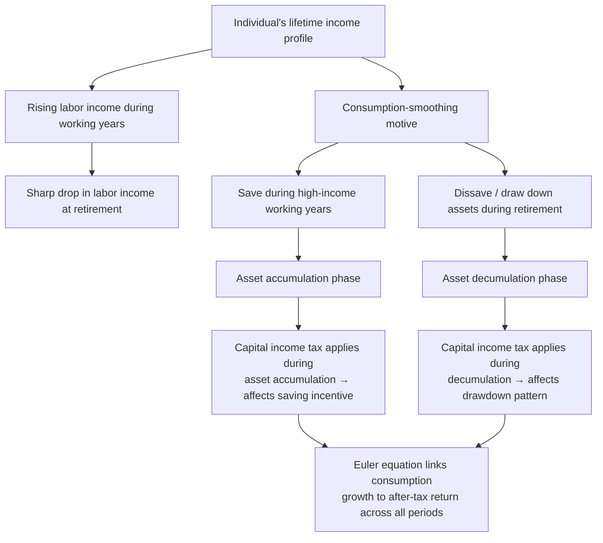
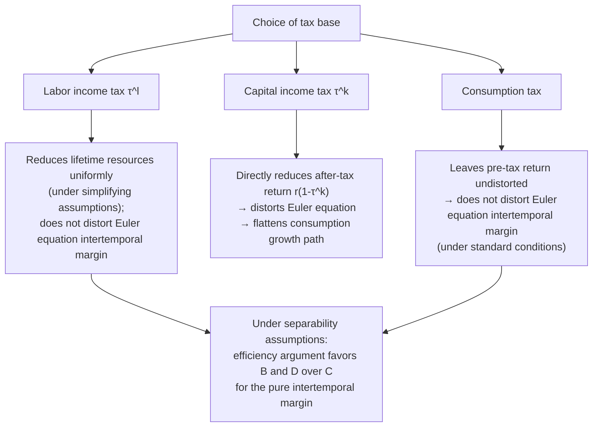

## Life-Cycle Consumption and Saving under Taxation

### Conceptual Foundation

The life-cycle model of consumption and saving, originating with Modigliani and Brumberg (1954) and Friedman's (1957) permanent income hypothesis, extends the two-period saving framework into a full multi-period (or continuous-time) setting spanning an individual's entire working and retirement years. The central behavioral premise is that rational, forward-looking individuals seek to **smooth consumption** over their lifetime relative to the more variable pattern of their labor income (which typically rises during working years and falls sharply at retirement), using saving and borrowing to transfer resources across periods. Taxation of labor and capital income at different life stages interacts with this consumption-smoothing motive in ways that a single-period static model cannot capture.

### The Multi-Period Life-Cycle Framework

**General setup**: an individual chooses a consumption path $\{c_t\}_{t=0}^{T}$ and asset holdings $\{a_t\}$ to maximize discounted lifetime utility:

$$\max_{\{c_t\}} \sum_{t=0}^{T} \beta^t u(c_t) \quad \text{subject to} \quad a_{t+1} = (1+r_t(1-\tau_t^k))a_t + y_t(1-\tau_t^l) - c_t$$

where $y_t$ is labor income in period $t$ (typically zero after a retirement age $R$), $\tau_t^k$ is the capital income tax rate, $\tau_t^l$ is the labor income tax rate, $\beta$ is the subjective discount factor, and $r_t$ is the pre-tax interest rate.

**Euler equation**: the key first-order condition governing the optimal consumption path across any two adjacent periods is the consumption Euler equation:

$$u'(c_t) = \beta[1+r_t(1-\tau_t^k)]\, u'(c_{t+1})$$

This condition states that the individual is indifferent, at the margin, between consuming one more unit today versus saving it (earning the after-tax return) and consuming the resulting larger amount tomorrow, appropriately discounted.

### Illustration: The Life-Cycle Consumption-Saving Profile

### Diagram: Stylized Lifetime Income and Consumption Profiles (svg_diagram)

<svg xmlns="http://www.w3.org/2000/svg" viewBox="0 0 640 400">
<text x="320" y="26" text-anchor="middle" font-size="16" font-weight="bold" fill="#1a1a1a">Life-Cycle Income, Consumption, and Assets (svg_diagram)</text>
<line x1="70" y1="340" x2="590" y2="340" stroke="#333" stroke-width="2" />
<line x1="70" y1="340" x2="70" y2="60" stroke="#333" stroke-width="2" />
<text x="330" y="375" text-anchor="middle" font-size="13" fill="#333">Age</text>
<text x="30" y="200" text-anchor="middle" font-size="13" fill="#333" transform="rotate(-90 30 200)">Level</text>
<path d="M 70 320 Q 200 120 340 130 L 340 340" fill="none" stroke="#2563eb" stroke-width="3" />
<line x1="340" y1="340" x2="340" y2="60" stroke="#999" stroke-width="1" stroke-dasharray="3,3" />
<text x="340" y="358" text-anchor="middle" font-size="10" fill="#666">Retirement</text>
<path d="M 340 130 Q 450 320 590 335" fill="none" stroke="#2563eb" stroke-width="3" />
<text x="150" y="130" font-size="11" fill="#2563eb" font-weight="bold">Labor income</text>
<path d="M 70 260 Q 250 190 340 200 Q 450 210 590 230" fill="none" stroke="#dc2626" stroke-width="3" stroke-dasharray="6,3" />
<text x="440" y="200" font-size="11" fill="#dc2626" font-weight="bold">Smoothed consumption</text>
<path d="M 70 340 Q 200 220 340 190 Q 450 260 590 335" fill="none" stroke="#16a34a" stroke-width="2" />
<text x="150" y="270" font-size="11" fill="#16a34a" font-weight="bold">Asset holdings</text>
</svg>

### The Elasticity of Intertemporal Substitution in the Life-Cycle Context

**Key Points**

- The consumption growth rate between any two periods, from the Euler equation with CRRA utility, satisfies $\dfrac{c_{t+1}}{c_t} = [\beta(1+r_t(1-\tau_t^k))]^{1/\gamma}$, showing directly that a higher after-tax return steepens the optimal consumption growth path (more consumption growth, implying more saving/deferral of consumption toward the future), governed by the elasticity of intertemporal substitution $1/\gamma$.
- This shows that in a full life-cycle model, capital income taxation affects not merely the *level* of saving in a single period but the entire *shape* of the lifetime consumption path, flattening it (reducing the incentive to defer consumption) as the after-tax return falls.
- Empirical estimation of the EIS in this life-cycle Euler-equation context has produced a wide range of estimates across studies, with many finding values below 1 (consistent with limited willingness to substitute consumption intertemporally), though methodological debates persist regarding aggregation, measurement error in consumption data, and the appropriate treatment of borrowing constraints and non-separabilities (e.g., between consumption and labor supply) in the underlying utility function. [Unverified: given substantial cross-study variation and ongoing methodological debate in this literature, this reference does not assert a single settled consensus point estimate for the EIS]

### Tax Timing and the Choice of Tax Base: Labor Income vs. Consumption vs. Capital Income

A central application of the life-cycle framework in public finance is comparing the lifetime welfare and behavioral effects of alternative broad tax base choices:

**Key Points**

- A **pure consumption tax** (equivalent, under certain conditions, to exempting the return to saving from taxation, i.e., taxing only $c_t$ each period) leaves the Euler equation's after-tax return term $[1+r_t]$ un-distorted by capital taxation, meaning it does not directly distort the intertemporal consumption-saving margin (though it can still have income effects and interacts with labor supply distortions via the labor income tax component typically levied alongside it).
- A **labor income tax** (taxing $y_t(1-\tau^l)$) reduces lifetime resources but, under certain simplifying assumptions (e.g., a constant tax rate applied uniformly across all periods and no differential treatment of savings), does not distort the *intertemporal* margin between present and future consumption, since it uniformly reduces the present value of lifetime resources without changing the relative price of consuming in one period versus another.
- A **capital income tax** directly distorts the intertemporal margin by reducing $r_t(1-\tau_t^k)$, the after-tax return, thereby altering the relative price of future versus present consumption — this is the source of the classical public finance argument (associated with the Atkinson-Stiglitz theorem's implications and subsequent capital taxation literature) that, under certain conditions, a pure labor income tax (or equivalently, a consumption tax) can dominate a capital income tax on efficiency grounds, since it avoids this additional intertemporal distortion while still achieving the same redistributive objective, provided preferences are appropriately separable between consumption and leisure. [Inference: this efficiency ranking depends on specific assumptions, including separability of preferences and the absence of certain forms of individual heterogeneity beyond ability, and does not hold unconditionally in all extended model settings]

### Illustration: How Different Tax Bases Interact with the Euler Equation

### Retirement Savings Vehicles and Life-Cycle Tax Deferral

**Key Points**

- Tax-preferred retirement savings accounts (e.g., traditional 401(k)/IRA-style deferred-taxation accounts, and Roth-style post-tax contribution accounts) can be understood within the life-cycle framework as mechanisms that shift the *timing* of taxation relative to a standard capital-income-taxed account, with important implications for the effective after-tax return over the life cycle.
- A **traditional (deferred-tax) account**, where contributions are made pre-tax and withdrawals are taxed at ordinary income rates in retirement, is equivalent under certain simplifying assumptions (constant tax rate across the individual's working and retirement years) to a **consumption-tax treatment** of that saving, since it effectively exempts the *return* to saving from taxation while still taxing the underlying labor income eventually, at the point of withdrawal.
- A **Roth-style (post-tax contribution) account**, where contributions are taxed upfront but withdrawals (including all accumulated returns) are tax-free, achieves an economically equivalent outcome to the traditional account under the same constant-tax-rate assumption, though the two vehicles diverge in their effective treatment if the individual's marginal tax rate differs between the contribution and withdrawal periods (e.g., due to life-cycle income variation or changes in the tax code over time).
- This equivalence result is a well-known application of the life-cycle Euler-equation framework and underlies much of the standard financial-planning guidance regarding the choice between traditional and Roth-style retirement accounts based on expected relative tax rates in the contribution versus withdrawal periods.

### Worked Numerical Example: Traditional vs. Roth Account Equivalence

**Example**

Consider an individual contributing $10,000 of pre-tax labor income, facing a constant tax rate $\tau = 25\%$ in both the working and retirement periods, with the investment earning a 6% annual pre-tax return over 20 years ($1.06^{20} \approx 3.207$).

**Traditional account**: The full $10,000 pre-tax amount is invested and grows tax-free until withdrawal: $10{,}000 \times 3.207 = \$32{,}070$ at withdrawal, then taxed at 25% upon withdrawal: after-tax proceeds $= 32{,}070 \times 0.75 = \$24{,}052.50$.

**Roth account**: The $10,000 is first taxed at 25%, leaving $7,500 to invest, which then grows tax-free and is withdrawn tax-free: $7{,}500 \times 3.207 = \$24{,}052.50$.

Both vehicles produce an identical after-tax outcome of $24,052.50 under the constant-tax-rate assumption, illustrating the equivalence result directly. If instead the individual's tax rate is expected to be *lower* in retirement (a common empirical pattern, since retirement income often falls below peak working-years income), the **traditional account becomes more advantageous**, since the tax is deferred to the lower-rate period; conversely, if the individual expects a *higher* tax rate in retirement, the **Roth account becomes more advantageous**. [Inference: the specific numerical outcome depends on the assumed constant-tax-rate scenario; real-world comparative advantage depends on each individual's specific expected lifetime tax-rate trajectory, which is inherently uncertain at the time of the contribution decision]

### Precautionary Saving and Buffer-Stock Behavior in Richer Life-Cycle Models

**Key Points**

- Richer life-cycle models incorporating income uncertainty (e.g., Carroll, 1997, "buffer-stock" saving models) show that households often hold a precautionary saving buffer well above what a pure certainty-equivalent life-cycle model would predict, to self-insure against income shocks, particularly earlier in the working life when human capital (future labor income) constitutes the bulk of lifetime wealth and is difficult to borrow against.
- Taxation interacts with this precautionary motive in two ways: (1) capital income taxation reduces the after-tax return on precautionary buffer assets, potentially requiring a larger pre-tax buffer to achieve the same effective self-insurance, and (2) the broader tax-and-transfer system itself (e.g., unemployment insurance, means-tested transfers) provides a form of public insurance that can substitute for private precautionary saving, an important interaction between social insurance policy design and observed household saving rates. [Inference: the empirical magnitude of this "crowding out" of private precautionary saving by public insurance programs varies substantially across studies, program designs, and populations studied]

### Bequest Motives and the Extended Life-Cycle Model

**Key Points**

- The basic life-cycle model as presented (with a finite horizon and no bequest motive) predicts that rational individuals should approximately exhaust their assets by the end of their planning horizon (subject to lifespan uncertainty considerations); the empirical observation that many elderly households continue to hold substantial assets late in life, without fully decumulating, has motivated extensions incorporating bequest motives directly into the utility function.
- Models incorporating bequests (either "warm glow" bequest motives valued for their own sake, or "dynastic" models in which parents value their children's lifetime utility directly) generate different predictions for how capital income and wealth/estate taxation affect lifetime saving and consumption patterns, since a bequest-motivated saver's response to a capital tax also depends on how the tax affects the after-tax value of the intended bequest, not solely the saver's own lifetime consumption.
- This extension links the household saving literature directly to the separate topic of wealth and bequest/estate taxation, since bequest-motivated saving behavior is a key input into the optimal design and revenue/efficiency analysis of estate and inheritance taxes.

### Limitations of the Life-Cycle Framework

- **Empirical departures from pure life-cycle predictions**: numerous empirical studies have documented that household consumption tracks income more closely than the pure life-cycle/permanent-income model would predict (a phenomenon often termed "excess sensitivity" of consumption to income), attributed to factors such as borrowing constraints, myopia/present bias, and limited financial sophistication, meaning the frictionless Euler-equation framework may not fully characterize real-world household behavior.
- **Sensitivity to discount rate and utility function assumptions**: predictions about the effects of taxation on lifetime saving depend sensitively on assumed values of the discount factor $\beta$ and the curvature parameter $\gamma$ (governing both risk aversion and the EIS under CRRA preferences), both of which are estimated with considerable uncertainty and disagreement across the empirical literature.
- **Behavioral departures from full rationality**: as with the general household saving literature discussed previously, behavioral factors (present bias/hyperbolic discounting, limited attention, default effects in employer-sponsored retirement plans) have been found in numerous studies to meaningfully affect real-world saving behavior in ways not captured by the standard exponential-discounting, fully rational life-cycle framework, motivating an active behavioral public finance literature examining alternative or augmented models of life-cycle saving under taxation.
- **Complexity of fully joint household-lifecycle-uncertainty models**: as noted in the household labor supply material, fully integrating household bargaining, life-cycle dynamics, income and lifespan uncertainty, and tax policy into a single tractable model remains a substantial ongoing research challenge, meaning most applied policy analyses necessarily simplify along one or more of these dimensions. [Inference: the specific simplifications considered acceptable for a given policy question are a matter of researcher judgment and depend on which margins are deemed first-order for the question at hand]

### Related Topics

- Effects of Taxation on Household Saving
- Optimal Taxation of Capital Income
- Elasticity of Intertemporal Substitution
- Tax-Preferred Savings Vehicles and Retirement Accounts
- Wealth and Bequest Taxation
- Precautionary Saving and Social Insurance Interactions
- Household and Life-Cycle Labor Supply Responses
- Atkinson-Stiglitz Theorem and Optimal Tax Base Choice