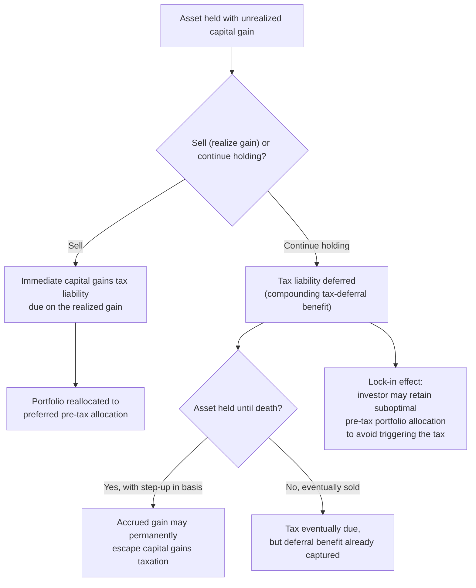

## Taxation of Capital Gains

### Conceptual Foundation

Capital gains taxation refers to the taxation of the increase in value of an asset (stocks, real estate, business interests, bonds, and other property) between the time it is acquired and the time it is disposed of. Capital gains taxation raises a distinct and technically rich set of issues within the broader taxation of capital income, primarily because gains are typically **realized-based** rather than **accrual-based** — that is, taxed only when the asset is sold, not as the value changes each period — which introduces a set of behavioral distortions and design challenges not present in the taxation of most other forms of capital income (e.g., interest, which typically accrues and is taxed annually regardless of whether it is withdrawn).

### Realization-Based vs. Accrual-Based Taxation

**Key Points**

- Under **accrual taxation**, an asset's gain in value is taxed each period as it occurs, regardless of whether the asset is sold, analogous to how interest income on a bond is taxed annually as it accrues.
- Under **realization-based taxation** (the near-universal practice for capital gains in virtually all tax systems), the gain is taxed only upon sale of the asset, meaning unrealized (or "paper") gains on assets still held are not taxed, potentially for many years or even indefinitely if the asset is never sold during the owner's lifetime.
- Realization-based taxation is used almost universally in practice primarily for **administrative and liquidity reasons**: taxing unrealized gains would require annual valuation of every asset (straightforward for publicly traded securities with observable market prices, but often difficult or impossible for illiquid assets such as privately held businesses, real estate, or collectibles) and could impose a tax liability on an asset holder who has not received any cash from the appreciation, creating a potential liquidity/cash-flow problem.
- This realization requirement is the source of the **lock-in effect**, one of the most extensively studied distortions in capital gains taxation.

### The Lock-In Effect

**Conceptual mechanism**: Because tax is due only upon sale, an asset holder with an unrealized gain faces an implicit incentive to delay selling the asset, since selling triggers an immediate tax liability while continuing to hold the asset defers that liability (and, if held until death in jurisdictions with a "step-up in basis" provision at death, may eliminate the accrued gain's tax liability entirely — see below).

**Key Points**

- This creates a distortion in portfolio allocation and asset-holding decisions that is **independent of the underlying economic merits of holding versus selling** the asset — an investor might prefer, on pure risk/return and portfolio-diversification grounds, to sell an appreciated asset and reallocate the proceeds elsewhere, but the tax cost of realizing the gain can outweigh this economic incentive, "locking in" a suboptimal portfolio allocation from a pure pre-tax perspective.
- The lock-in effect is more severe (a) the larger the accrued (unrealized) gain relative to the asset's current value, (b) the higher the capital gains tax rate, and (c) the longer the expected remaining holding period over which the tax deferral benefit can compound.
- Because the lock-in effect discourages realization, it can create a genuine tension for policymakers seeking to raise capital gains tax rates for revenue or equity reasons: a higher statutory rate can, especially for a fixed near-term time horizon, induce sufficiently less realization behavior that **realized capital gains tax revenue does not rise proportionally, and in some documented episodes has been found to fall**, a phenomenon closely related to the elasticity-of-taxable-income and Laffer-curve logic developed earlier in this course but specific to the timing/realization margin rather than the level of underlying economic activity.

### Illustration: The Lock-In Mechanism

### The Realization Elasticity and Revenue Effects

**Key Points**

- The **elasticity of realizations** with respect to the capital gains tax rate is the key empirical parameter governing how strongly the lock-in effect affects observed realized capital gains and associated tax revenue, analogous in structure to the elasticity of taxable income concept.
- Early influential studies (e.g., Feldstein, Slemrod, and Yitzhaki, 1980) found relatively **large** realization elasticities, implying substantial revenue sensitivity to capital gains rate changes and providing a basis for arguments that lower capital gains rates could, in some circumstances, raise (or not substantially reduce) realized capital gains tax revenue.
- Subsequent studies (e.g., Auerbach, 1988, and later work using improved panel data and instrumental variable approaches) have generally found **more modest** realization elasticities than the earliest estimates, and have emphasized the importance of distinguishing **short-run** realization elasticities (heavily influenced by retiming — investors accelerating or delaying sales around an announced rate change) from smaller **long-run** or "permanent" elasticities relevant for evaluating a persistent rate change.
- This short-run/long-run distinction closely parallels the general ETI literature's concern with anticipation and retiming effects (as discussed under the Elasticity of Taxable Income reference earlier in this course), and is a central methodological theme in the capital gains realization literature specifically. [Unverified: given the substantial range of realization elasticity estimates across studies and time periods, this reference does not assert a single settled consensus point estimate for either the short-run or long-run elasticity]

### Preferential Tax Rates on Capital Gains

**Key Points**

- Many tax systems apply a **preferential (lower) tax rate** to long-term capital gains relative to ordinary income (wages, interest), a design choice justified on several distinct grounds in the public finance literature: (1) mitigating the lock-in effect by reducing the tax cost of realization, (2) partially compensating for the fact that nominal (not inflation-adjusted) gains are typically taxed, meaning a portion of the "gain" may reflect pure inflation rather than real economic return, and (3) reducing the incentive for double taxation concerns when gains reflect previously-corporate-taxed retained earnings (relevant for capital gains on corporate stock).
- Critics of preferential capital gains rates argue that such preferential treatment (1) primarily benefits higher-income and higher-wealth taxpayers, who hold a disproportionate share of capital assets, raising vertical equity concerns, and (2) creates incentives for tax planning and income characterization games, in which taxpayers (particularly business owners and fund managers) seek to recharacterize what is economically labor income into capital-gains-taxed income to benefit from the preferential rate — a specific and extensively debated instance of this being the taxation of **carried interest** received by private equity and hedge fund managers.
- The debate over the appropriate capital gains tax rate is therefore not solely a question of the "pure" saving/investment distortion analyzed in the general capital income taxation literature, but is also substantially shaped by these realization-timing, inflation-indexation, and income-characterization considerations specific to the capital gains tax base.

### Step-Up in Basis at Death

**Key Points**

- In some tax systems (notably the United States), an asset's cost basis is "stepped up" to its fair market value at the owner's death, meaning any capital gain that accrued during the deceased's lifetime is **never subject to capital gains tax** if the asset is inherited and later sold by the heir (who would only owe tax on further appreciation after inheriting, using the stepped-up basis).
- This provision substantially amplifies the lock-in effect for older asset holders with large unrealized gains, since holding the asset until death can permanently eliminate the lifetime capital gains tax liability entirely, rather than merely deferring it — an especially strong incentive that has been extensively studied in the context of estate planning and wealth transfer behavior.
- The interaction between step-up-in-basis provisions and estate/inheritance taxation is a distinct and important policy design question: some proposals to reform capital gains taxation specifically target eliminating or limiting step-up in basis (e.g., taxing unrealized gains at death, or requiring heirs to use the decedent's original basis, i.e., "carryover basis") as a way to close this permanent tax-avoidance channel without necessarily changing the general realization-based approach for gains realized during an owner's lifetime.

### Diagram: Effective Lifetime Tax Rate on Gains, With and Without Step-Up (svg_diagram)

<svg xmlns="http://www.w3.org/2000/svg" viewBox="0 0 640 340">
<text x="320" y="26" text-anchor="middle" font-size="16" font-weight="bold" fill="#1a1a1a">Effect of Step-Up in Basis on Lifetime Gain Taxation (svg_diagram)</text>
<rect x="90" y="80" width="180" height="200" fill="#fee2e2" stroke="#dc2626" stroke-width="2" />
<text x="180" y="70" text-anchor="middle" font-size="13" fill="#dc2626" font-weight="bold">Asset sold during lifetime</text>
<text x="180" y="150" text-anchor="middle" font-size="12" fill="#333">Accrued gain</text>
<text x="180" y="180" text-anchor="middle" font-size="12" fill="#333">taxed at</text>
<text x="180" y="210" text-anchor="middle" font-size="12" fill="#333">capital gains rate</text>
<text x="180" y="250" text-anchor="middle" font-size="11" fill="#dc2626">Full tax liability realized</text>
<rect x="370" y="80" width="180" height="200" fill="#dcfce7" stroke="#16a34a" stroke-width="2" />
<text x="460" y="70" text-anchor="middle" font-size="13" fill="#16a34a" font-weight="bold">Asset held until death</text>
<text x="460" y="150" text-anchor="middle" font-size="12" fill="#333">Basis stepped up</text>
<text x="460" y="180" text-anchor="middle" font-size="12" fill="#333">to fair market value</text>
<text x="460" y="210" text-anchor="middle" font-size="12" fill="#333">at death</text>
<text x="460" y="250" text-anchor="middle" font-size="11" fill="#16a34a">Lifetime accrued gain never capital-gains-taxed</text>
</svg>

### Worked Numerical Example: Lock-In Effect and the Deferral Value

**Example**

Consider an investor holding an asset purchased for $100,000, now worth $300,000 (a $200,000 unrealized gain), facing a 20% capital gains tax rate, with an alternative investment opportunity offering the same 6% expected annual pre-tax return as the currently held asset.

If sold today: capital gains tax due $= 200{,}000 \times 0.20 = \$40{,}000$, leaving $\$260{,}000$ net proceeds to reinvest.

If held for 10 more years, then sold: assuming the asset continues to appreciate at 6% annually, its value grows to $300{,}000 \times 1.06^{10} \approx \$537{,}250$, generating a total accrued gain of $537{,}250 - 100{,}000 = \$437{,}250$ at that point, with a tax liability of $437{,}250 \times 0.20 = \$87{,}450$, leaving net proceeds of $\$449{,}800$.

Comparing this to what the $260,000 in net-of-tax proceeds from an immediate sale would have grown to if reinvested at the same 6% return for 10 years: $260{,}000 \times 1.06^{10} \approx \$465{,}670$ — in this specific numerical case, immediate realization and reinvestment ($465,670) slightly **exceeds** the value from continuing to hold and deferring the tax ($449,800), illustrating that the lock-in effect's strength depends on the specific relationship between the tax rate, the size of the embedded gain, and the relative expected returns of the held versus alternative asset — deferral is not always numerically advantageous even though it delays tax payment, though it very often is advantageous when a stepped-up basis at death is a realistic possibility, or when the after-tax return absent immediate taxation compounds for a sufficiently long horizon or larger embedded-gain share. [Inference: this is an illustrative computation under the specific assumed parameters; the qualitative and quantitative lock-in incentive is sensitive to the assumed holding period, rate of return, and size of the unrealized gain relative to total value]

### Alternative Design Approaches

**Key Points**

- **Mark-to-market (accrual) taxation for liquid assets**: some reform proposals suggest taxing unrealized gains annually for assets with a readily observable market value (e.g., publicly traded securities), which would eliminate the lock-in effect and realization-timing distortions for that subset of assets, at the cost of requiring taxpayers to pay tax on gains without necessarily having received cash (a liquidity concern, though potentially manageable for very liquid, easily-sold assets).
- **Retrospective taxation with an interest charge**: an alternative mechanism (associated with work by Auerbach, 1991, and others) proposes taxing gains only upon realization (as under current practice) but charging retrospective interest on the deferred tax liability to compensate for the time value of the deferral benefit, which can in principle replicate the economic equivalent of accrual taxation without requiring annual valuation of illiquid assets.
- **Indexing for inflation**: some tax systems index the cost basis of an asset for inflation before computing the taxable gain, ensuring that only the *real* (inflation-adjusted) gain is taxed, addressing the concern noted above that unindexed nominal capital gains taxation can tax phantom (purely inflationary) gains, particularly burdensome during periods of high inflation or for assets held over very long horizons.

### Capital Gains on Corporate Stock and the Double-Taxation Question

**Key Points**

- Capital gains on corporate stock raise a distinct integration question: corporate profits are typically taxed once at the corporate level, and then a shareholder's capital gain (reflecting retained, reinvested corporate earnings that increase the stock's value) is taxed again at the individual level upon sale, a form of potential "double taxation" of the same underlying economic income.
- This consideration is frequently cited as a justification for preferential capital gains rates on corporate stock specifically, and connects the capital gains taxation topic directly to the broader corporate-individual tax integration literature addressed separately in public finance and corporate tax courses.
- The economic significance of this double-taxation concern depends on assumptions about the incidence of the corporate income tax itself (i.e., who ultimately bears its economic burden — shareholders, workers, or consumers), an empirically and theoretically contested question in its own right. [Inference: the degree to which preferential capital gains rates are an efficient or well-targeted remedy for corporate-level double taxation, as opposed to other integration mechanisms such as dividend imputation credits, remains a live design question addressed differently across countries' tax systems]

### Limitations and Ongoing Debates

- **Difficulty isolating the "pure" lock-in distortion from other realization motives**: investors may delay or accelerate asset sales for many non-tax reasons (portfolio rebalancing needs, liquidity needs, expectations about future asset performance), complicating the econometric isolation of the specific tax-driven component of observed realization behavior.
- **Substantial heterogeneity in realization elasticity estimates across asset classes and taxpayer types**: elasticities estimated for publicly traded securities may not generalize to closely-held business interests, real estate, or other less liquid asset classes with different holding-period dynamics and disposal constraints.
- **Interaction with broader wealth and estate tax policy**: the step-up-in-basis provision's effects and any proposed reforms cannot be fully evaluated in isolation from the broader estate/inheritance tax system, since these two features interact directly in determining the total lifetime-plus-bequest tax burden on appreciated assets.
- **Administrative feasibility constraints on alternative designs**: while mark-to-market and retrospective-interest-charge proposals address the lock-in effect in principle, their administrative feasibility for illiquid or hard-to-value assets remains a genuine practical constraint limiting their real-world implementation, an issue distinct from their theoretical desirability. [Inference: the specific administrative cost and feasibility tradeoffs of these alternative approaches are context- and asset-class-specific and are not fully resolved as a matter of settled consensus in the literature]

### Related Topics

- Effects of Taxation on Household Saving
- Life-Cycle Consumption and Saving under Taxation
- Optimal Taxation of Capital Income
- Wealth and Bequest Taxation
- Corporate Income Tax Incidence and Integration
- Elasticity of Taxable Income
- Carried Interest and Income Characterization
- Inflation Indexation in Tax Systems