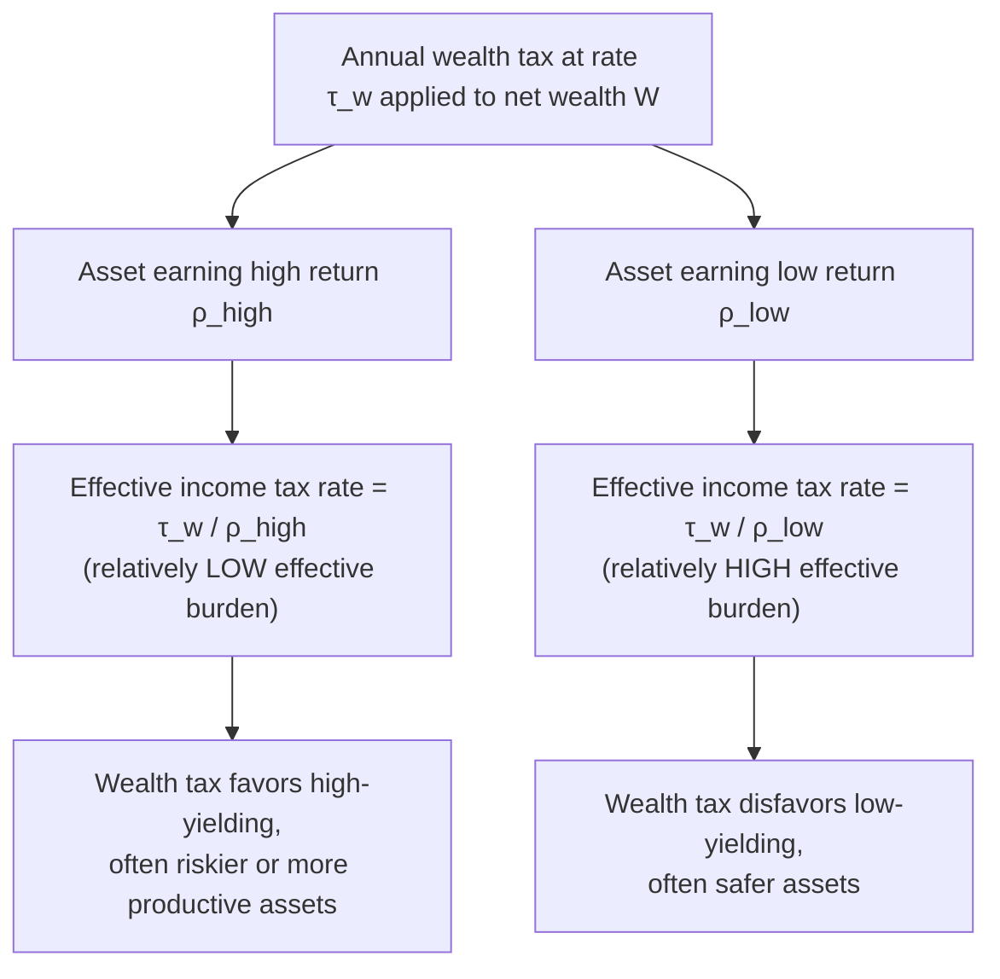
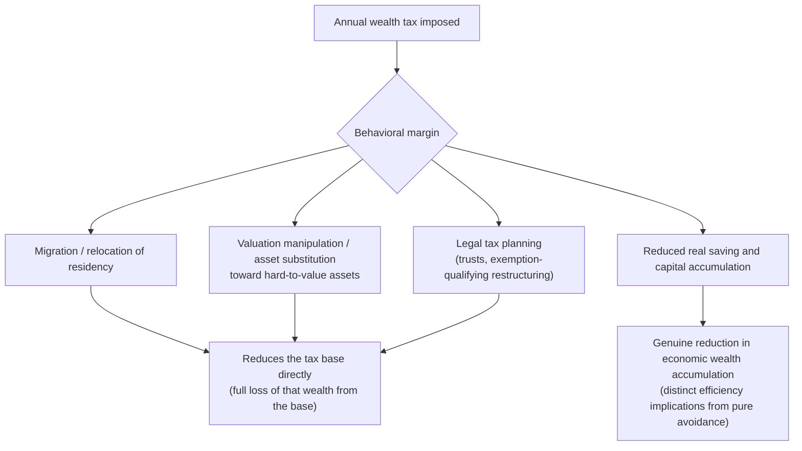

## Wealth Taxation

### Conceptual Foundation

Wealth taxation refers to a tax levied on an individual's or household's **net stock of assets** (total assets minus liabilities) at a point in time, rather than on a **flow** of income (labor earnings, interest, dividends, capital gains) as with conventional income taxation. This distinction between taxing a stock versus a flow is the central conceptual feature distinguishing wealth taxes from the income and capital gains taxes discussed elsewhere in this chapter, and it generates a distinct set of behavioral, administrative, and normative considerations.

**Basic structure**: an annual wealth tax typically takes the form

$$T_w = \tau_w \cdot \max(0, W - E)$$

where $W$ is total net wealth, $E$ is an exemption threshold below which no tax is owed, and $\tau_w$ is the wealth tax rate, often applied progressively with multiple brackets above the exemption threshold in real-world implementations.

### Wealth Tax as an Implicit Tax on the Return to Capital

**Key Points**

- A recurring annual wealth tax can be reinterpreted as equivalent to a tax on the *return* to capital, but one whose effective rate depends critically on the rate of return the asset actually earns — a wealth tax of $\tau_w$ percent is equivalent to an income tax at rate $\tau_w / \rho$ on an asset earning a return $\rho$, meaning the *effective* tax rate on income is higher for lower-yielding assets and lower for higher-yielding assets.
- This has a striking implication: a wealth tax imposes a **relatively heavier effective tax burden on assets with lower rates of return** and a relatively lighter effective burden on high-yielding assets, the opposite pattern from a standard capital income tax (which taxes a fixed proportion of whatever return is actually earned, regardless of asset type).
- This feature has been cited both as a **critique** of wealth taxation (potentially penalizing safe, lower-yielding assets disproportionately, or those held by asset owners who, for reasons such as risk aversion or life stage, prefer lower-return holdings) and as a potential **efficiency rationale** in specific models (e.g., Guvenen, Kambourov, Kuruscu, Ocampo, and Chen, 2019, which explores how a wealth tax — by taxing the *stock* rather than the realized return — can reallocate capital away from unproductive but wealth-holding owners toward more productive uses, under specific assumptions about entrepreneurial talent heterogeneity and its correlation with wealth versus realized returns). [Inference: the empirical relevance and magnitude of this reallocation effect is a subject of ongoing research and is sensitive to the specific model's assumptions about the correlation between wealth, talent, and realized returns]

### Illustration: Wealth Tax as an Implicit Income Tax, By Asset Return

### Diagram: Effective Implicit Income Tax Rate as a Function of Asset Return (svg_diagram)

<svg xmlns="http://www.w3.org/2000/svg" viewBox="0 0 620 380">
<text x="310" y="26" text-anchor="middle" font-size="16" font-weight="bold" fill="#1a1a1a">Implicit Income Tax Rate from a Wealth Tax (svg_diagram)</text>
<line x1="80" y1="330" x2="580" y2="330" stroke="#333" stroke-width="2" />
<line x1="80" y1="330" x2="80" y2="60" stroke="#333" stroke-width="2" />
<text x="330" y="365" text-anchor="middle" font-size="13" fill="#333">Asset's Actual Rate of Return (ρ)</text>
<text x="35" y="200" text-anchor="middle" font-size="13" fill="#333" transform="rotate(-90 35 200)">Implicit Income Tax Rate (τ_w / ρ)</text>
<path d="M 100 80 Q 200 150 300 230 T 560 320" fill="none" stroke="#dc2626" stroke-width="3" />
<text x="150" y="110" font-size="12" fill="#dc2626" font-weight="bold">τ_w / ρ falls as ρ rises</text>
<text x="120" y="300" font-size="11" fill="#555">Low-return assets:</text>
<text x="120" y="315" font-size="11" fill="#555">high implicit rate</text>
<text x="420" y="290" font-size="11" fill="#555">High-return assets:</text>
<text x="420" y="305" font-size="11" fill="#555">low implicit rate</text>
</svg>

### Worked Numerical Example

**Example**

Consider an annual wealth tax rate of $\tau_w = 2\%$ applied to two asset holders:

**Holder A** owns an asset earning a 3% annual return (e.g., government bonds or a low-yield savings vehicle): the implicit income tax rate is $\tau_w / \rho = 0.02 / 0.03 \approx 66.7\%$ — an extremely high effective tax on the actual income generated by this asset.

**Holder B** owns an asset earning a 10% annual return (e.g., a successful equity investment or business venture): the implicit income tax rate is $0.02 / 0.10 = 20\%$ — a comparatively modest effective tax on the actual income generated.

This example illustrates directly why a wealth tax's burden, expressed as an effective tax on actual realized income, varies dramatically depending on the underlying asset's performance, a feature with no direct analogue under a standard capital income tax (which would tax both holders' actual income at the same statutory rate, e.g., 20% of $3,000 for Holder A and 20% of $10,000 for Holder B, rather than a rate that itself varies by realized return). [Inference: this is an illustrative computation demonstrating the mechanical relationship between a wealth tax rate and an implicit income tax rate; it does not represent a claim about which asset holder pays "more" tax in absolute dollar terms, which instead depends on wealth levels compared to the exemption threshold]

### Behavioral Responses to Wealth Taxation

**Key Points**

- **Capital flight and cross-border relocation**: because wealth taxes are typically levied on a taxpayer's total net worth (often including assets located anywhere, subject to residency-based tax rules), they can induce migration or asset relocation to jurisdictions without a wealth tax, a concern extensively documented in studies of European wealth tax repeals (e.g., studies of the wealthy leaving France following its wealth tax, and similar dynamics studied in the context of Scandinavian wealth tax reforms).
- **Valuation avoidance and asset substitution**: wealth taxes create incentives to shift holdings toward asset classes that are harder to value accurately (favoring assets with ambiguous or easily understated valuations, such as certain private business interests or collectibles, over transparently priced public securities), a distinct form of avoidance response from the labor/capital income tax avoidance margins discussed elsewhere in this course.
- **Reduced saving and capital accumulation incentives**: to the extent a wealth tax is not fully capitalized into asset prices or otherwise neutralized, it reduces the after-tax return to accumulating wealth in the first place, potentially discouraging saving and investment at the margin, an effect analytically related to but distinct from the capital income tax distortions discussed under Effects of Taxation on Household Saving.
- **Empirical estimates of the wealth tax elasticity of reported wealth** (from studies of Scandinavian and other European wealth tax episodes, e.g., Seim, 2017, using Swedish data; Jakobsen, Jakobsen, Kleven, and Zucman, 2020, using Danish data) have generally found **substantial** behavioral responses, driven heavily by reporting/avoidance and some migration responses rather than purely real reductions in wealth accumulation, though the relative decomposition between real and avoidance responses (paralleling the ETI decomposition debate discussed earlier in this course) remains an active area of study. [Unverified: given cross-country and cross-study variation in estimated wealth tax elasticities and their decomposition, this reference does not assert a single settled consensus magnitude]

### Illustration: Behavioral Margins of Response to a Wealth Tax

### Design Variants: Annual Wealth Tax vs. One-Time Wealth Tax vs. Estate/Inheritance Tax

**Key Points**

- A **recurring annual wealth tax** (the primary focus above) is levied repeatedly over an individual's lifetime on their wealth stock, as historically implemented in several European countries (though many have since repealed or substantially scaled back their wealth taxes, notably France's conversion of its general wealth tax into a real-estate-focused wealth tax in 2018).
- A **one-time (non-recurring) wealth tax**, sometimes proposed as a crisis-response revenue measure (e.g., proposals following major fiscal shocks), has the theoretical advantage of being closer to a genuine **lump-sum tax** on pre-announced wealth (assuming it is unanticipated and non-repeatable), since it does not distort the ongoing return to future saving in the way a recurring, expected wealth tax would — though this advantage depends critically on the tax being credibly perceived as truly one-time and not setting a precedent for future repetition, which affects the discounted expected burden of holding wealth going forward.
- An **estate or inheritance tax**, levied only at the point of intergenerational wealth transfer (death or gift) rather than annually, represents a related but distinct approach to taxing wealth, addressed as a separate topic in this course, with a different set of behavioral margins (primarily affecting bequest and lifetime-gift-timing decisions rather than the ongoing annual return to holding wealth).

### Diagram: Wealth Tax Variants Along the Timing Dimension (svg_diagram)

<svg xmlns="http://www.w3.org/2000/svg" viewBox="0 0 640 300">
<text x="320" y="26" text-anchor="middle" font-size="16" font-weight="bold" fill="#1a1a1a">Wealth Tax Design Variants (svg_diagram)</text>
<line x1="60" y1="150" x2="580" y2="150" stroke="#333" stroke-width="3" />
<polygon points="580,150 568,144 568,156" fill="#333" />
<text x="320" y="180" text-anchor="middle" font-size="12" fill="#333">Timing of Taxation</text>
<circle cx="120" cy="150" r="8" fill="#2563eb" />
<text x="120" y="115" text-anchor="middle" font-size="12" fill="#333">Annual recurring wealth tax</text>
<circle cx="320" cy="150" r="8" fill="#16a34a" />
<text x="320" y="115" text-anchor="middle" font-size="12" fill="#333">One-time wealth tax</text>
<circle cx="520" cy="150" r="8" fill="#ca8a04" />
<text x="520" y="115" text-anchor="middle" font-size="12" fill="#333">Estate / inheritance tax (at death or gift)</text>
<text x="120" y="220" text-anchor="middle" font-size="11" fill="#555">Distorts ongoing saving/return decisions</text>
<text x="320" y="220" text-anchor="middle" font-size="11" fill="#555">Closer to lump-sum if credibly non-repeated</text>
<text x="520" y="220" text-anchor="middle" font-size="11" fill="#555">Distorts bequest and gift timing</text>
</svg>

### Normative Arguments For and Against Wealth Taxation

**Key Points**

- **Arguments for**: (1) wealth is a highly concentrated stock, often even more concentrated than income, so a wealth tax can be a directly targeted instrument for addressing wealth inequality specifically, rather than only income inequality; (2) wealth confers benefits beyond the income it generates (e.g., economic security, political and social influence, access to credit), which some normative frameworks argue justifies taxing the stock itself rather than only its income flow; (3) a wealth tax can reach forms of economic advantage that are difficult to capture through income taxation alone, such as unrealized capital gains on assets that may never be sold during an owner's lifetime (connecting directly to the lock-in and step-up-in-basis issues discussed under Taxation of Capital Gains).
- **Arguments against**: (1) valuation difficulties for illiquid assets (privately held businesses, real estate, art, and collectibles) raise substantial administrative and compliance costs, and create scope for valuation-based avoidance; (2) the potential for double taxation of the same underlying economic capital, since wealth is often itself the accumulated result of already-taxed income; (3) documented migration and avoidance responses in several European wealth tax episodes have led a number of countries to repeal their wealth taxes after finding that the anticipated revenue did not materialize as expected, or that administrative costs and behavioral erosion of the tax base undermined the tax's practical effectiveness; (4) potential adverse effects on entrepreneurship and business investment, if wealth tax liabilities force asset holders to liquidate illiquid, productive business assets to meet a cash tax obligation unrelated to the business's current cash flow.

### Recent Policy Debates and Proposed Designs

**Key Points**

- Prominent recent wealth tax proposals in some countries (e.g., U.S. proposals discussed in the 2020s political discourse) have generally focused on **very high exemption thresholds** (targeting only ultra-high-net-worth individuals, e.g., those with wealth above $50 million or similar thresholds), partly reflecting an implicit judgment that the administrative and avoidance challenges of wealth taxation are more manageable, and the equity case stronger, when applied narrowly to the very top of the wealth distribution rather than broadly across the population.
- Design features frequently discussed in these proposals include exit taxes (taxing unrealized gains upon renunciation of residency/citizenship, to address the migration-avoidance margin), enhanced third-party reporting and valuation requirements for illiquid assets, and payment-deferral or installment provisions for taxpayers whose wealth is concentrated in illiquid, income-poor assets (addressing the liquidity concern noted above). [Inference: the specific design features that would be included in any enacted wealth tax legislation are inherently a matter of the specific legislative proposal under consideration at any given time, and this reference does not assert the current status of any specific pending proposal]
- As of the available information for this reference, no U.S. federal wealth tax has been enacted; several European countries maintain narrower, real-estate-focused, or otherwise limited wealth tax variants rather than the broad annual wealth taxes more common in earlier decades. [Unverified: given that wealth tax legislation is an active and evolving area of policy debate, this reference does not assert the precise current legislative status in every jurisdiction as of the reader's present date]

### Limitations and Ongoing Debates

- **Valuation of illiquid assets remains the most significant practical implementation challenge**: unlike publicly traded securities with observable market prices, valuing privately held businesses, real estate, intellectual property, and collectibles for annual wealth tax purposes is inherently imprecise and contestable, creating both administrative burden and avoidance opportunities.
- **Behavioral elasticity estimates are highly context-dependent**: as noted above, estimated responses to wealth taxation vary substantially depending on the ease of cross-border migration in the specific country studied, the presence of asset-class exemptions in the specific wealth tax design, and the broader tax and legal environment, limiting the direct transferability of estimates from one country's experience to evaluate a different country's prospective wealth tax design.
- **Distinguishing real behavioral responses from reporting/avoidance responses**: as with the ETI literature, a substantial share of the observed "elasticity" of reported wealth to wealth tax rates in the empirical literature appears to reflect valuation and reporting responses rather than genuine reductions in real wealth accumulation, with direct implications for how much of the observed responsiveness represents a true efficiency cost versus a closeable reporting/enforcement gap. [Inference: the precise decomposition between real and avoidance responses in the wealth tax context, similar to the analogous ETI decomposition, remains a genuinely contested empirical question rather than one with an established consensus split]

### Related Topics

- Taxation of Capital Gains
- Effects of Taxation on Household Saving
- Optimal Taxation of Capital Income
- Wealth and Bequest Taxation (Estate and Inheritance Taxes)
- Elasticity of Taxable Income
- Tax Competition and International Capital Mobility
- Corporate Income Tax Incidence and Integration
- Tagging and the Use of Observable Characteristics