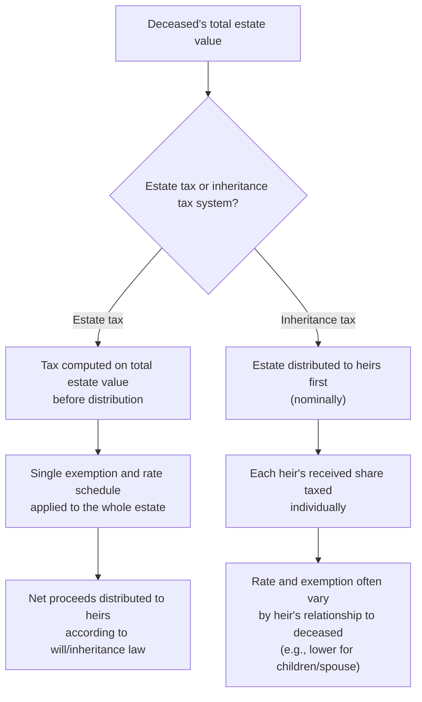
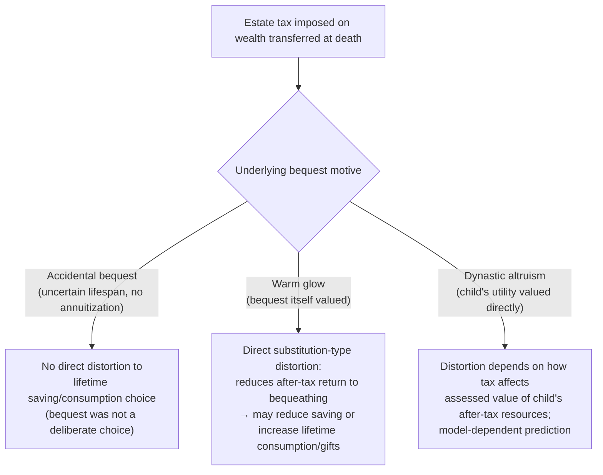

## Estate and Inheritance Taxation

### Conceptual Foundation

Estate and inheritance taxation refers to taxes levied on the transfer of wealth at death (and, in many systems, on lifetime gifts as a complementary measure to prevent avoidance via pre-death transfers). Unlike a recurring annual wealth tax, which taxes the stock of wealth repeatedly over an individual's lifetime, estate and inheritance taxes are levied only at the point of intergenerational transfer, making the relevant behavioral margins fundamentally different: rather than affecting the ongoing return to holding wealth each year, these taxes primarily affect bequest motives, the timing and structure of wealth transfers, and estate planning behavior.

**Terminological distinction**:

- An **estate tax** is levied on the total value of a deceased person's estate before distribution to heirs, with the tax liability determined by the size of the estate as a whole, regardless of how many heirs it is divided among (the approach historically used in the United States federal system).
- An **inheritance tax** is levied on each individual heir's received share, with the tax rate and exemptions often varying by the heir's relationship to the deceased (e.g., lower rates for children and spouses, higher rates for more distant relatives or unrelated beneficiaries) — this is the more common approach in many European countries.

### Formal Structure

A stylized estate tax takes the form:

$$T_e = \tau_e \cdot \max(0, B - E)$$

where $B$ is the value of the bequeathed estate, $E$ is an exemption threshold, and $\tau_e$ is the estate tax rate (often progressive, with multiple brackets above the exemption in real-world systems). An inheritance tax instead applies this structure to each heir's individual share $B_i$, potentially with heir-specific exemptions and rates depending on relationship to the deceased.

### Illustration: Estate Tax vs. Inheritance Tax Structure

### Rationale for Bequest and Estate Taxation

**Key Points**

- **Equalizing opportunity across generations**: a central normative argument for estate/inheritance taxation is that inherited wealth confers an advantage to heirs unrelated to their own effort or ability, and taxing large inheritances can be viewed as promoting equality of opportunity across individuals born into different family wealth circumstances, distinct from the equity arguments used for taxing earned income.
- **Addressing wealth concentration**: since wealth is typically even more concentrated than income, and intergenerational transfers are a primary mechanism by which wealth concentration persists across generations, estate taxation is frequently framed as a targeted tool for limiting the perpetuation of dynastic wealth concentration over time.
- **Backstopping capital gains taxation (interaction with step-up in basis)**: as discussed under Taxation of Capital Gains, unrealized capital gains held until death may permanently escape capital gains taxation under a step-up-in-basis provision; an estate tax can be viewed as at least partially compensating for this "escape" of accrued gains from ever being taxed under the income tax system, though the two taxes are conceptually distinct (an estate tax applies to the entire value of the estate, not merely the unrealized-gain component).
- **Revenue considerations**: estate and inheritance taxes typically raise relatively modest revenue as a share of total tax revenue in most countries that levy them, meaning the normative and behavioral-efficiency arguments (rather than pure revenue-raising considerations) often dominate the policy debate over these taxes' desirability and design. [Inference: the specific revenue share varies considerably by country and by the specific exemption thresholds and rates in force, and is not a fixed universal magnitude]

### Bequest Motives and Behavioral Responses

The behavioral response to estate taxation depends critically on the underlying **motive for bequests**, a question studied extensively in the life-cycle and bequest-motive literature:

**Key Points**

- **Accidental bequests**: under a pure life-cycle model with uncertain lifespan and no annuitization of all wealth, some wealth remaining at death is "accidental" — the individual did not specifically intend to leave a bequest but simply had not yet consumed all their remaining wealth when death occurred. Estate taxation of purely accidental bequests would, in principle, have no distortionary effect on the deceased's earlier saving/consumption behavior, since the bequest was never a deliberate choice variable being optimized.
- **"Warm glow" bequest motives**: models in which bequests enter the individual's utility function directly (the donor derives utility from the act of leaving a bequest, independent of the heir's resulting welfare) imply that an estate tax directly reduces the after-tax "return" to bequeathing, creating a genuine substitution-type distortion analogous to how a capital income tax distorts the return to saving, potentially reducing lifetime saving and/or inducing greater lifetime consumption or lifetime gift-giving to avoid the tax.
- **Dynastic/altruistic bequest motives**: models in which parents value their children's lifetime utility directly (as in a fully altruistic, infinite-horizon dynastic model) imply that an estate tax's effect on parental behavior depends on how it interacts with the parent's assessment of their child's own after-tax resources and utility, generating potentially different (and in some formal dynastic models, more muted) saving distortions than under the pure warm-glow specification. [Inference: the precise behavioral prediction under dynastic altruism models is sensitive to specific modeling assumptions about the utility-weighting of descendants and is not a single settled prediction across the theoretical literature]
- Empirically distinguishing between these bequest motives, and thus determining the true efficiency cost of estate taxation, has proven genuinely difficult, since observed bequest behavior is consistent with multiple underlying motive structures without additional identifying variation (e.g., studies exploiting variation in the number and needs of children, or unexpected wealth shocks near end-of-life, have been used to attempt to distinguish these motives with mixed and study-specific results). [Unverified: given the methodological difficulty of definitively distinguishing bequest motives, this reference does not assert a single settled empirical consensus on which motive structure best characterizes observed behavior in the general population]

### Illustration: Bequest Motive Type and Estate Tax Distortion

### Estate Planning, Avoidance, and the Role of Lifetime Gift Taxes

**Key Points**

- Estate taxation creates strong incentives for **estate planning** strategies designed to minimize the taxable estate, including lifetime gifting (transferring wealth before death, which is why most estate tax systems are paired with a complementary **gift tax** applying similar rates to lifetime transfers, to prevent simple avoidance via early transfer), trusts (various trust structures can be used to transfer wealth or its future appreciation out of a taxable estate while retaining some degree of control or benefit), and valuation discounting strategies (e.g., claiming minority-interest or lack-of-marketability discounts on transferred business or partnership interests to reduce the appraised taxable value).
- The empirical literature on estate tax avoidance (e.g., Kopczuk and Slemrod, 2001, and subsequent studies using estate tax return data) has generally found **significant evidence of avoidance behavior** and some evidence of estate-tax-motivated mortality-timing effects (i.e., studies examining whether reported deaths cluster suspiciously around favorable changes in estate tax law, a highly specific and much-debated empirical finding in this literature), alongside genuine reductions in reported/taxable estate size through legal planning mechanisms.
- The prevalence and effectiveness of these avoidance channels is a major argument advanced by critics of estate taxation, who contend that a large share of the tax's nominal burden is avoidable by sufficiently well-advised (typically higher-wealth) taxpayers, undermining both its revenue-raising and equity-promoting objectives in practice relative to the schedule's statutory design. [Inference: the specific magnitude of the avoidance gap between statutory and effective estate tax burden varies by country, time period, and the specific anti-avoidance provisions in force, and should not be treated as a fixed universal figure]

### Diagram: Estate Planning Channels Reducing Taxable Estate (svg_diagram)

<svg xmlns="http://www.w3.org/2000/svg" viewBox="0 0 640 340">
<text x="320" y="26" text-anchor="middle" font-size="16" font-weight="bold" fill="#1a1a1a">Estate Tax Avoidance Channels (svg_diagram)</text>
<rect x="240" y="60" width="160" height="50" rx="6" fill="#dbeafe" stroke="#2563eb" stroke-width="2" />
<text x="320" y="90" text-anchor="middle" font-size="12" fill="#2563eb" font-weight="bold">Gross taxable estate</text>
<line x1="320" y1="110" x2="140" y2="170" stroke="#333" stroke-width="1.5" />
<line x1="320" y1="110" x2="320" y2="170" stroke="#333" stroke-width="1.5" />
<line x1="320" y1="110" x2="500" y2="170" stroke="#333" stroke-width="1.5" />
<rect x="60" y="170" width="160" height="60" rx="6" fill="#fef3c7" stroke="#ca8a04" stroke-width="2" />
<text x="140" y="195" text-anchor="middle" font-size="11" fill="#333">Lifetime gifting (subject to gift tax but at favorable timing)</text>
<rect x="240" y="170" width="160" height="60" rx="6" fill="#fef3c7" stroke="#ca8a04" stroke-width="2" />
<text x="320" y="195" text-anchor="middle" font-size="11" fill="#333">Trust structures (transfer future appreciation out of estate)</text>
<rect x="420" y="170" width="160" height="60" rx="6" fill="#fef3c7" stroke="#ca8a04" stroke-width="2" />
<text x="500" y="195" text-anchor="middle" font-size="11" fill="#333">Valuation discounts (minority interest, marketability discounts)</text>
<text x="320" y="270" text-anchor="middle" font-size="12" fill="#dc2626" font-weight="bold">Reduced effective taxable estate</text>
</svg>

### Worked Numerical Example

**Example**

Consider an estate valued at $20 million, subject to an estate tax with a $12 million exemption and a flat 40% rate above the exemption (broadly illustrative of the general structure of the U.S. federal estate tax in recent years, though exact parameters change with legislation).

Taxable estate above the exemption: $20{,}000{,}000 - 12{,}000{,}000 = \$8{,}000{,}000$

Estate tax due: $8{,}000{,}000 \times 0.40 = \$3{,}200{,}000$

Net amount passing to heirs: $20{,}000{,}000 - 3{,}200{,}000 = \$16{,}800{,}000$, an effective average tax rate on the total estate of $3{,}200{,}000 / 20{,}000{,}000 = 16\%$ — notably lower than the 40% marginal rate, since the exemption shields the first $12 million entirely.

If, instead, the estate holder had transferred $5 million via lifetime gifts several years prior (assuming this amount had also been within a separate lifetime gift tax exemption, a common design feature that unifies the estate and gift tax exemptions into a single lifetime allowance in some systems, such as the U.S.), the taxable estate at death would fall to $15 million, with taxable estate above the exemption of $3 million and estate tax due of $3{,}000{,}000 \times 0.40 = \$1{,}200{,}000$ — a $2 million reduction in estate tax liability achieved purely through the timing/structuring of the transfer, illustrating the avoidance-planning incentive directly. [Inference: this example uses illustrative parameters loosely modeled on U.S. federal estate tax structure for pedagogical purposes; actual exemption amounts, rates, and unification rules between gift and estate tax exemptions vary by country and change over time with legislation]

### Cross-Country Variation in Estate/Inheritance Tax Design

**Key Points**

- Estate and inheritance tax regimes vary substantially across countries in structure, rates, exemption levels, and even in whether such a tax exists at all — several countries have abolished their estate or inheritance taxes in recent decades (citing revenue insufficiency relative to administrative and compliance costs, avoidance concerns, and political opposition), while others maintain substantial inheritance tax systems with heir-relationship-dependent rate structures.
- Countries using an **inheritance tax** design (taxing each heir's share) often justify this structural choice on the grounds that it more directly aligns the tax with the benefit received by each specific heir, and allows for differentiated treatment based on the relationship between the deceased and the heir (e.g., favoring transfers to a spouse or minor children over transfers to distant relatives or unrelated parties), a distributional nuance not directly achievable under a pure estate tax design that taxes the total estate regardless of its ultimate distribution.
- As with wealth taxation generally, cross-border mobility of wealthy individuals and their assets creates similar avoidance/migration concerns for estate taxation, particularly relevant for internationally mobile high-net-worth individuals who may relocate residency (and in some cases, citizenship) in anticipation of estate planning considerations. [Inference: the specific magnitude of migration responses attributable to estate tax considerations, as opposed to other lifestyle or business factors, is difficult to cleanly isolate empirically and estimates vary across the limited studies attempting to do so]

### Interaction with Wealth Taxation and Capital Gains Taxation

**Key Points**

- Estate/inheritance taxation, annual wealth taxation, and capital gains taxation (specifically the step-up-in-basis provision) are **interdependent policy instruments** addressing overlapping but distinct aspects of the taxation of accumulated wealth and its transfer, and policy analysis of any one instrument in isolation risks missing important interaction effects — for example, eliminating step-up in basis while simultaneously maintaining a robust estate tax could result in a form of double taxation of the same appreciated asset (once under capital gains rules at the point of the heir's eventual sale, and again under the estate tax at the point of transfer), a design consideration frequently debated in proposals to reform either provision.
- Some policy proposals explicitly coordinate these instruments, for example by allowing a deduction or credit for estate tax paid against subsequently realized capital gains on inherited, previously-stepped-down-basis assets, to avoid this double-taxation concern, though the specific coordination mechanisms vary considerably by country and proposal. [Inference: the specific mechanisms in force in any given jurisdiction's current tax code are subject to legislative change and are not asserted here as a fixed universal design]

### Limitations and Ongoing Debates

- **Distinguishing bequest motives remains empirically difficult**: as discussed above, the theoretically predicted efficiency cost of estate taxation depends heavily on which bequest motive (accidental, warm-glow, or dynastic) best characterizes actual behavior, and this remains a genuinely unresolved empirical question, limiting confidence in any single point estimate of the tax's efficiency cost.
- **Avoidance behavior may substantially undermine statutory tax design**: extensive evidence of estate planning and valuation-discounting behavior means that the *effective* incidence and revenue yield of estate taxation can diverge considerably from what the statutory rate and exemption structure alone would suggest, complicating straightforward revenue and equity analysis based on statutory parameters.
- **Political economy and revenue-versus-complexity tradeoffs**: given the historically modest revenue share generated by estate/inheritance taxes in most countries relative to the administrative and compliance complexity they introduce (valuation disputes, planning industry costs, enforcement resources), some policy analysts have questioned whether continued reliance on this instrument, versus alternative approaches to addressing wealth concentration (e.g., a broader capital gains tax base, elimination of step-up in basis, or a dedicated wealth tax), represents the most efficient available tool for achieving the underlying equity objectives. [Inference: this is a live policy design debate without a single settled resolution in the public finance literature, and reasonable analysts weigh the relevant tradeoffs differently depending on their normative priors and empirical assessments]

### Related Topics

- Wealth Taxation
- Taxation of Capital Gains
- Effects of Taxation on Household Saving
- Life-Cycle Consumption and Saving under Taxation
- Optimal Taxation of Capital Income
- Tax Competition and International Capital Mobility
- Intergenerational Mobility and Equality of Opportunity
- Trust and Estate Planning Structures