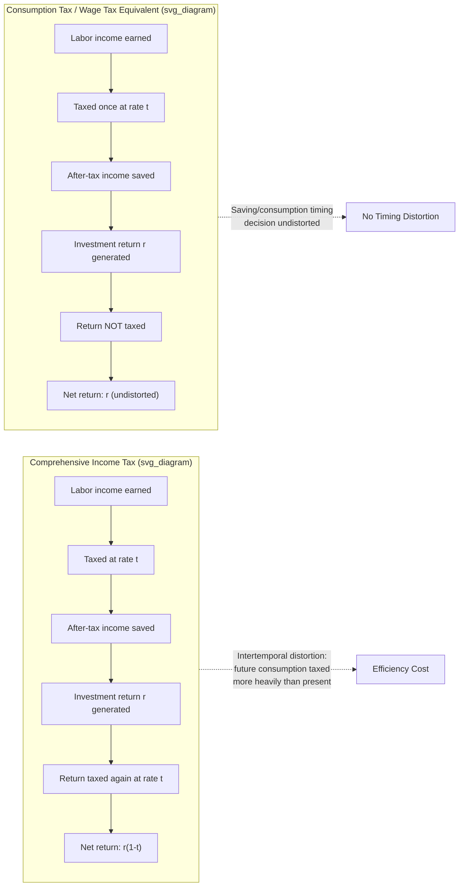

## Income Tax versus Consumption Tax Debate

### Definition and Scope

The income tax versus consumption tax debate is a central controversy in Public Economics concerning the appropriate tax base for financing government activity. An **income tax** levies tax on all accretions to economic power—labor earnings, interest, dividends, capital gains, and other capital income—regardless of whether that income is spent or saved. A **consumption tax** levies tax only on resources actually consumed, exempting saved (and reinvested) income from taxation until it is eventually withdrawn and spent. The debate centers on whether the "normal return to saving" (the risk-free time-value-of-money component of capital income) should be part of the tax base at all, and if so, at what rate relative to labor income.

This is not merely a debate about tax *instruments* (e.g., VAT vs. income tax as administrative categories) but about the **comprehensive tax base**: a "consumption tax" can be implemented through a retail sales tax, a value-added tax (VAT), a cash-flow business tax, or—critically for this chapter—a **personal expenditure tax** that operates through the income tax return by deducting net saving (a "consumed income tax," as proposed by Kaldor, 1955, and analyzed extensively by Meade Committee, 1978).

### Key Points

- **The core disagreement**: Should the "normal" (risk-free) return to saving be taxed at all? Consumption tax proponents say no (taxing it double-taxes deferred consumption); income tax proponents say yes (equal treatment of all economic power, regardless of timing).
- **Double taxation argument**: Under a comprehensive income tax, income is taxed once when earned (labor income) and again when the saved portion generates a return (capital income tax), which consumption-tax advocates argue disproportionately burdens savers relative to consumers of identical lifetime resources.
- **Equivalence results**: A tax on labor income alone (a "wage tax") is formally equivalent in present-value terms to a tax on consumption, under certain conditions—both exempt the "normal" return to saving from tax.
- **Efficiency case for consumption taxation**: In standard lifecycle models, taxing capital income distorts the intertemporal consumption choice (present vs. future consumption), while a consumption tax (or equivalently, a wage tax) is often argued to be neutral with respect to the saving decision under specific model assumptions.
- **Equity concerns**: Consumption taxes are often criticized as regressive when measured against annual income (since low-income households consume a higher share of current income), though proponents argue lifetime income is a better welfare metric, under which regressivity is muted.
- **Practical hybrid systems**: No major economy implements a "pure" comprehensive income tax or a "pure" consumption tax; actual systems (like the US federal income tax) are hybrids featuring extensive consumption-tax-like elements (401(k)/IRA accounts, capital gains preferences, homeownership tax treatment) layered onto a nominally comprehensive income base.

### Theoretical Framework: The Intertemporal Choice Model

**Setup**

Consider a two-period lifecycle model where an individual earns labor income $w$ in period 1, choosing to consume $c_1$ and save $s = w - c_1$. In period 2, consumption is:

$$c_2 = s(1+r)$$

where $r$ is the pre-tax rate of return on saving.

**Under a comprehensive income tax** at rate $t$ (applied to both labor income and capital income):

$$c_2 = (w - c_1)(1 + r(1-t))$$

The tax reduces the *net* return to saving from $r$ to $r(1-t)$, which drives a wedge between the pre-tax and post-tax relative price of future consumption in terms of present consumption. This wedge is the source of the "intertemporal distortion" central to the efficiency critique of income taxation.

**Under a consumption tax** (or equivalent wage tax) at rate $t$:

$$c_2 = (w(1-t) - c_1)(1+r)$$

Or, in present-value terms normalizing to lifetime consumption:

$$c_1 + \frac{c_2}{1+r} = w(1-t)$$

Here, the relative price of $c_2$ in terms of $c_1$ remains $(1+r)$—identical to the no-tax case—so the saving/consumption timing decision is undistorted. The tax reduces the *level* of lifetime resources (via the labor income tax) but not the intertemporal *relative price*.

**The key intuition**: A consumption tax (equivalently, a tax on wages only) is a lump-sum tax on the present value of lifetime resources with respect to the saving decision, since it does not vary with how those resources are allocated across time. An income tax, by taxing the return $r$, effectively taxes future consumption more heavily than present consumption in present-value terms, discouraging saving at the margin.

### Efficiency Arguments

**1. Corlett-Hague / Atkinson-Stiglitz Foundations**

The Atkinson-Stiglitz (1976) theorem is the most cited formal result in this debate. Under specific conditions—(a) individuals differ only in innate labor productivity (not in preferences or in access to capital markets), (b) the utility function is weakly separable between consumption goods and leisure—the theorem shows that **differential commodity taxation is unnecessary once an optimal nonlinear labor income tax is in place**. Applied to the saving decision, this implies that if the government has an optimal nonlinear earnings tax, it should **not** additionally tax capital income (i.e., the optimal tax on the normal return to saving is zero), because doing so does not improve redistribution beyond what the labor tax already achieves, while it does distort the consumption-saving margin.

$$\text{Optimal capital income tax} = 0 \quad \text{(under Atkinson-Stiglitz conditions)}$$

This result underpins much of the modern efficiency case for consumption taxation (or equivalently, zero taxation of the normal return to capital) among public finance economists, though it depends critically on assumptions that are frequently violated in practice (see caveats below).

**2. Chamley-Judd Result**

In infinite-horizon representative-agent growth models, Chamley (1986) and Judd (1985) derived that the **optimal long-run tax rate on capital income converges to zero**, because a permanent capital tax compounds over an infinite horizon into an effectively infinite tax on consumption arbitrarily far in the future, creating unboundedly large distortions to the capital accumulation path. This result has been influential in supply-side and optimal-taxation arguments for eliminating capital taxation, though it has been substantially qualified in follow-up literature (Straub & Werning, 2020, show the zero-tax result does not always hold even within the Chamley-Judd framework once certain parameter restrictions are relaxed) [Inference: this is an active area of ongoing theoretical revision rather than settled consensus].

**3. Consumption Taxes and Saving Behavior**

Empirically, the responsiveness of aggregate private saving to capital income tax changes (the elasticity of saving with respect to the after-tax return) is a long-standing and unresolved empirical question. Early theoretical predictions (based on the intertemporal substitution effect) suggest capital taxation should reduce saving, but income and substitution effects operate in opposite directions for savers with fixed future consumption targets, and cross-country/time-series estimates of the interest elasticity of saving have historically found effects that are small, statistically fragile, or sensitive to specification [Unverified: the empirical elasticity of aggregate private saving with respect to after-tax returns remains genuinely contested in the literature and should not be treated as a well-pinned-down parameter].

### Equity Arguments

**1. Horizontal and Vertical Equity Under Alternative Bases**

Consumption tax critics argue that two individuals with identical *lifetime* earnings but different *saving behavior* (one saves heavily for retirement, one consumes immediately) are treated identically under a lifetime consumption tax but differently under an annual income tax (the saver defers tax, benefiting from the time value of deferral, and pays no tax on the return itself). Consumption tax advocates respond that this is precisely the point: the annual income tax **penalizes deferred consumption relative to immediate consumption** for individuals with identical lifetime resources, which is itself a horizontal equity violation *between* time periods, even if not *between* individuals with different income levels in a given year.

**2. Regressivity Concerns**

Measured against **annual** income, consumption taxes (particularly retail sales taxes and VATs) appear regressive, since consumption-to-income ratios fall as income rises (higher earners save a larger share of current income). Measured against **lifetime** income, the regressivity is substantially reduced, because lifetime consumption approximately equals lifetime income (net of bequests) for most households. The empirical significance of this distinction depends on:

- The treatment of bequests and inheritances (a pure consumption tax exempts amounts left as bequests from ever being taxed under the donor's lifetime, unless supplemented by a separate wealth transfer tax).
- The time horizon used for equity assessment (annual snapshots vs. lifetime accounting).
- Whether progressivity is built into the consumption tax rate structure itself (a progressive expenditure tax, as proposed by Kaldor and analyzed in the Meade Report, applies graduated rates to *annual consumption*, addressing regressivity concerns that apply to flat-rate retail sales taxes/VATs but not necessarily to a progressive personal expenditure tax).

**3. Capital Income and the Very Wealthy**

A major equity objection to abandoning capital income taxation is that capital income is highly concentrated among high-wealth households, and a zero rate on the normal return to capital could substantially reduce effective tax burdens at the top of the wealth distribution, particularly if combined with dynastic wealth transmission (bequests) that are never subject to a labor-income-style tax base. This has motivated interest in **supplementary wealth taxes** or **inheritance/estate taxes** as complements to a consumption-tax-oriented income tax base, precisely to address the equity gap left by exempting capital income.

### Practical Implementation Models

**1. The Personal Expenditure Tax (Cash-Flow Consumption Tax)**

Proposed formally by Kaldor (1955) and elaborated by the UK's Meade Committee (1978), a personal expenditure tax operates by:

$$\text{Taxable base} = \text{Cash inflows} - \text{Net new saving} = \text{Consumption}$$

Administratively, this requires:

- Full deductibility of all new saving (deposits into qualifying accounts) from taxable income.
- Full inclusion of withdrawals from savings (principal plus accumulated return) in the taxable base when funds are eventually spent.
- This is the "TEE" vs. "EET" distinction in tax policy terminology: a standard income tax with no saving preference is "Taxed-Taxed-Exempt" is not quite right—more precisely, comprehensive income tax is roughly "TTE" (contributions from after-tax income, returns taxed annually, withdrawals exempt of further tax), while a consumption-tax-style treatment is "EET" (contributions Exempt/deductible, returns Exempt from annual tax, withdrawals Taxed).

**2. Retirement Account Approximations (Real-World EET and TEE Systems)**

Most existing systems approximate consumption taxation *only* for retirement saving, not for all saving:

- **EET (Exempt-Exempt-Taxed)**: Traditional 401(k)/IRA (US), most employer pensions internationally. Contributions deductible, growth untaxed, withdrawals taxed as ordinary income. This is mathematically equivalent to a consumption tax on that saving *if* the tax rate at contribution equals the tax rate at withdrawal.
- **TEE (Taxed-Exempt-Exempt)**: Roth IRA (US), Roth 401(k). Contributions from after-tax income, growth untaxed, withdrawals untaxed. Also equivalent to a consumption tax on that saving under the same rate-constancy condition—TEE and EET are formally equivalent in present value when tax rates don't change over time, though they differ if the saver's tax rate changes between contribution and withdrawal, and TEE also differs in how it interacts with contribution limits (a $7,000 TEE limit shelters more *after-tax* resources than a $7,000 EET limit).
- **Ordinary saving (non-qualified accounts)**: Taxed on an income basis—dividends, interest, and realized capital gains are taxed annually or upon realization, approximating (imperfectly, due to realization-based capital gains rules) a comprehensive income tax treatment.

**3. Business-Level Consumption Taxation**

At the business level, a **cash-flow tax** (as opposed to a standard corporate income tax) allows immediate expensing of capital investment (rather than depreciation over an asset's useful life) and does not allow deduction of interest expense, converting the tax base from "income" (revenue minus costs including financing costs) to "cash flow from real activity" (revenue minus real operating and capital costs, excluding financial flows). The **Destination-Based Cash-Flow Tax (DBCFT)**, proposed in the 2016 US House Republican "Better Way" tax reform blueprint, combined this cash-flow treatment with border adjustability, though it was not ultimately enacted [Unverified: DBCFT and similar cash-flow proposals remain largely theoretical/proposed rather than implemented at scale in major economies, with Estonia's corporate tax system being one of the few real-world approximations of a cash-flow-style base].

### Diagram: Comparative Tax Base Treatment of Saving (svg_diagram)

### Example

Consider two workers, A and B, each earning $100,000 in year 1 with a 20% flat tax rate and a 5% pre-tax annual return on saving.

**Worker A (spends immediately)**: Pays $20,000 in labor income tax, consumes the remaining $80,000 immediately. Under both an income tax and a consumption tax, A's treatment is identical, since there is no saving to differentially tax.

**Worker B (saves for 10 years)** under a **comprehensive income tax**: Pays $20,000 in labor income tax in year 1, saves the remaining $80,000. Each year, the accumulated balance grows at $5\%(1-0.20) = 4\%$ after-tax. After 10 years:

$$80{,}000 \times (1.04)^{10} \approx 118{,}436$$

**Worker B under a consumption tax (EET treatment)**: The full $100,000 is saved pre-tax (no tax paid in year 1), grows at the full 5% pre-tax rate for 10 years:

$$100{,}000 \times (1.05)^{10} \approx 162{,}889$$

Upon withdrawal, this amount is taxed at 20%: $162{,}889 \times 0.80 \approx 130{,}311$.

Worker B ends up with $130,311 under the consumption tax treatment versus $118,436 under the income tax treatment—a direct illustration of how income taxation of the return compounds against savers over time, and why the "double taxation of saving" characterization is central to the consumption-tax case. Note that Worker A's outcome is unaffected by the choice of regime, illustrating that the debate specifically concerns the tax treatment of *deferred* consumption, not consumption *per se*.

### Empirical and Political Economy Considerations

- **Transition costs**: Moving from an existing income tax to a consumption tax base creates one-time transitional equity issues—individuals who have already paid tax on labor income used to accumulate existing wealth would, under a naive consumption tax, effectively face taxation again when that wealth is eventually consumed (unless transition relief, such as basis step-ups or grandfathering rules, is provided).
- **International competitiveness arguments**: Consumption-tax-oriented reform (particularly at the corporate level) is frequently motivated by capital mobility concerns—capital income taxes are argued to be more distortionary in open economies where capital can relocate to lower-tax jurisdictions, though the empirical magnitude of this responsiveness is contested and varies by asset type and enforcement regime.
- **Revenue and administrability**: Consumption taxes (particularly VATs) are often praised for administrative simplicity and self-enforcement properties (the VAT's credit-invoice mechanism creates a paper trail incentivizing compliance), while personal expenditure taxes (Kaldor-style) face practical implementation challenges in comprehensively tracking all forms of saving and dissaving, which is one reason no major economy has adopted a comprehensive personal expenditure tax as its primary income tax replacement.
- **Political economy of hybridization**: In practice, political systems have tended to adopt **piecemeal consumption-tax elements** (retirement account preferences, capital gains preferences, accelerated depreciation) layered onto a nominal income tax, rather than a wholesale switch to either pure base—reflecting a political equilibrium that hedges between efficiency arguments for consumption taxation and equity/revenue concerns favoring some capital income taxation.

**Related Topics:**

- Atkinson-Stiglitz Theorem and Its Assumptions
- Chamley-Judd Optimal Capital Taxation Result and Critiques
- The Meade Report and the Expenditure Tax Proposal
- Corlett-Hague Rule and Optimal Commodity Taxation
- Wealth Taxation as a Complement to Consumption Taxation
- Realization-Based vs. Accrual-Based Capital Gains Taxation
- Destination-Based Cash-Flow Taxation (DBCFT)
- Retirement Savings Incentives: EET vs. TEE Account Design
- Double Taxation of Corporate Income (Classical vs. Integrated Systems)