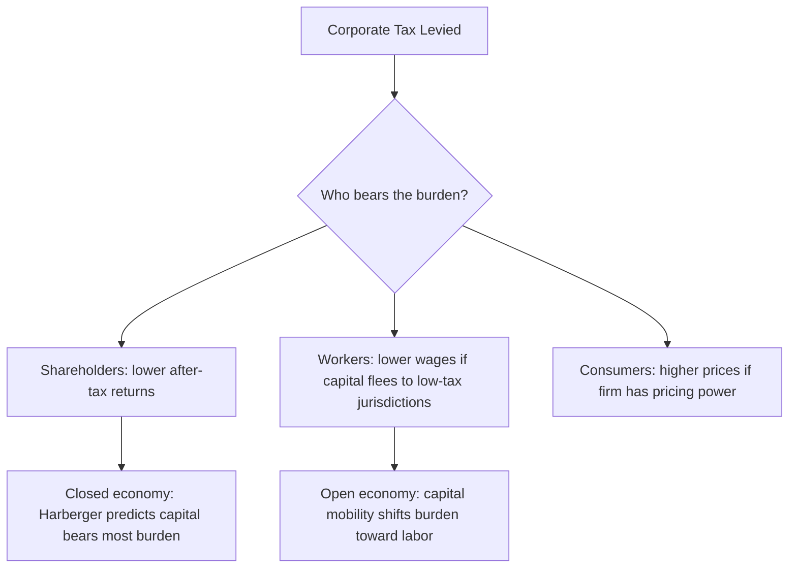

## Rationale for Taxing Corporations

### Overview

The corporate income tax (CIT) is one of the most theoretically contested instruments in public economics. Unlike taxes on individuals, a corporation is a legal fiction — it does not consume, save, or bear a tax burden in any real economic sense. All real burdens ultimately fall on people: shareholders (through lower returns), workers (through lower wages), or consumers (through higher prices). This makes the "rationale" for a separate corporate tax a genuinely open question, and the literature offers several distinct, sometimes competing, justifications.

### The Core Puzzle: Why Tax a Legal Fiction?

**Key Points**

- Corporations are not final economic agents; they are conduits through which income flows to individuals (shareholders, employees, suppliers)
- A tax "on the corporation" is a tax on some combination of capital owners, labor, and consumers, depending on incidence
- If personal income taxes already capture individual income, a separate entity-level tax appears redundant unless it serves a distinct function
- This is often called the "who really pays?" problem, formally studied under **tax incidence** theory (see Harberger model)

If the tax is fully redundant with personal taxation, economic theory would suggest integrating corporate and personal taxes (full imputation) rather than taxing twice. The persistence of separate CIT systems across nearly all countries suggests policymakers believe it serves purposes beyond simple revenue collection duplicated at the personal level.

### Rationale 1: Backstop to the Personal Income Tax

**Key Points**

- Without a corporate tax, retained earnings inside a corporation could permanently escape individual taxation
- Shareholders only pay personal tax when they realize income (dividends or capital gains upon sale)
- A firm could retain profits indefinitely, allowing wealth to compound tax-free at the corporate level
- The CIT acts as a **withholding mechanism**, taxing income as it is earned rather than waiting for eventual distribution

This is arguably the most widely accepted efficiency-based rationale among public finance economists. It treats the corporate tax not as a tax on an independent entity, but as a **prepayment or backstop** for the personal income tax that would otherwise be indefinitely deferred.

**Example**

A firm earns $1,000,000 in profit and retains all of it rather than paying dividends. Without a CIT:

- No tax is collected until shares are sold or dividends distributed, which may be decades later or never (if shares are held until death and receive a stepped-up basis, as in the U.S.)

  With a 21% CIT:
- $210,000 is collected immediately, regardless of the distribution timeline

### Rationale 2: Taxing Economic Rents

**Key Points**

- Firms often earn **economic rents** — returns above the normal competitive return to capital — due to market power, unique know-how, patents, brand value, or locational advantages
- A tax on pure rents is theoretically **non-distortionary** at the margin, since rents by definition exceed what is needed to induce investment
- The corporate tax is partly justified as a mechanism to capture a share of these above-normal returns
- This is closely tied to the distinction between the **normal return to capital** (compensation for time preference and risk) and **supernormal/rent returns**

The efficiency case for taxing rents rests on the idea that a truly marginal investment (one that just breaks even before tax) should not be discouraged, but an inframarginal investment earning rents above the required return can be taxed without changing the decision to invest.

$$\pi_{rent} = \pi_{total} - r \cdot K$$

where $\pi_{total}$ is total profit, $r$ is the required (normal) rate of return, and $K$ is invested capital. Ideal rent-based taxation (e.g., a cash-flow tax with full expensing) targets $\pi_{rent}$ only, leaving the normal return untaxed.

[Inference] In practice, most existing corporate tax systems do not cleanly separate rents from normal returns, because depreciation schedules, interest deductibility, and the definition of taxable income do not correspond exactly to the rent-only base described above.

### Rationale 3: Benefit Principle

**Key Points**

- Corporations receive **public goods and services**: legal infrastructure (contract enforcement, limited liability, courts), physical infrastructure (roads, utilities), a trained workforce (public education), and property rights protection
- The benefit principle holds that entities benefiting from state-provided infrastructure should contribute to its financing
- Limited liability itself is a **legal privilege** granted by the state, shielding shareholders from a firm's debts beyond their investment — this special protection is sometimes cited as justifying a "charter fee" in the form of a corporate tax

**Example**

A manufacturing corporation relies on publicly funded roads for logistics, a court system to enforce supplier contracts, and public universities to train its engineers. The CIT can be framed as a payment for the ongoing use of this institutional and physical infrastructure, distinct from taxes paid by the firm's individual stakeholders in their personal capacities.

### Rationale 4: Administrative and Enforcement Efficiency

**Key Points**

- It is administratively easier to tax income at the point of corporate accounting than to trace it to millions of dispersed shareholders, especially foreign or untraceable ones
- Corporations already maintain audited financial records, reducing compliance and verification costs relative to taxing beneficial owners directly
- Foreign shareholders are typically outside the reach of the domestic personal income tax system entirely — the CIT is often the *only* mechanism by which the domestic government captures tax revenue from foreign-owned capital operating within its borders

This is sometimes called the **withholding-for-foreigners** rationale: absent a corporate-level tax, profits attributable to foreign investors in domestic firms would go entirely untaxed by the host country, since personal income tax jurisdiction typically follows residency or citizenship, not source.

### Rationale 5: Revenue Generation

**Key Points**

- Straightforwardly, the CIT is a significant, relatively stable, and visible revenue source for governments
- It is politically more palatable than raising personal income tax rates, since the incidence is diffused and less directly visible to voters (a phenomenon related to **fiscal illusion**)
- [Unverified] The magnitude of CIT as a share of total tax revenue varies substantially by country and over time; OECD figures should be checked for current context rather than assumed static

### Rationale 6: Correcting Externalities and Behavior (Secondary Function)

**Key Points**

- Corporate tax design can be used instrumentally: investment tax credits, accelerated depreciation, R&D credits, and sector-specific provisions steer corporate behavior
- This is a **secondary, instrumental rationale** — using the corporate tax code as a policy lever rather than justifying the tax's existence per se
- Distinguishes the *existence* of a corporate tax from the *design* of its base and incentives, which is a separate area of study (see Chapter: Corporate Tax Base and Incentives)

### Competing View: The Case Against a Separate Corporate Tax

**Key Points**

- Since corporations cannot ultimately bear tax burdens, some economists argue the CIT is an inefficient, non-transparent way of taxing individuals
- It can create a **bias toward debt financing** over equity, since interest is typically deductible while dividends are not (deepening leverage and financial fragility) — see **debt-equity tax bias**
- It creates **double taxation** of equity-financed corporate income (once at the corporate level, once again at the shareholder level upon dividend/capital gains realization), distorting the corporate-vs-noncorporate organizational choice and the payout-vs-retention decision
- Full **integration** systems (e.g., dividend imputation credits, as historically used in Australia) attempt to eliminate this double taxation while preserving some of the backstop function

$$\tau_{total} = 1 - (1-\tau_c)(1-\tau_d)$$

where $\tau_c$ is the corporate tax rate and $\tau_d$ is the personal tax rate on distributed dividends, illustrating the compounding effect of unintegrated double taxation.

### Incidence: Who Actually Bears the Burden?

**Key Points**

- The statutory taxpayer (the corporation) is not necessarily the economic bearer of the tax
- The **Harberger model** (1962) was the foundational general-equilibrium analysis, concluding that in a closed economy, capital broadly bears the burden of the corporate tax because capital can only imperfectly escape into the untaxed sector
- In an **open economy** with highly mobile capital, a substantial share of the burden may shift to **labor**, since capital can relocate to lower-tax jurisdictions while labor is comparatively immobile
- [Inference] Empirical incidence estimates vary considerably by study, country, time period, and capital mobility assumptions; the labor-share-of-incidence figure is a matter of ongoing empirical debate, not a settled constant

### Rent-Only Taxation Diagram

The following illustrates conceptually how a rent-based rationale separates normal returns (untaxed under an ideal cash-flow tax) from supernormal rents (taxed):

<svg xmlns="http://www.w3.org/2000/svg" viewBox="0 0 640 320">
<text x="320" y="24" font-size="15" text-anchor="middle" font-family="sans-serif" font-weight="bold">Decomposition of Corporate Profit (svg_diagram)</text>
<rect x="120" y="60" width="140" height="200" fill="#a8d5ba" stroke="#2f6f4f" stroke-width="2" />
<text x="190" y="160" font-size="13" text-anchor="middle" font-family="sans-serif">Normal Return</text>
<text x="190" y="178" font-size="11" text-anchor="middle" font-family="sans-serif">(compensation for</text>
<text x="190" y="192" font-size="11" text-anchor="middle" font-family="sans-serif">capital &amp; risk)</text>
<text x="190" y="230" font-size="11" text-anchor="middle" font-family="sans-serif" font-style="italic">Ideally untaxed</text>
<rect x="120" y="30" width="140" height="30" fill="#e8a0a0" stroke="#8f2f2f" stroke-width="2" />
<text x="190" y="50" font-size="12" text-anchor="middle" font-family="sans-serif">Economic Rent</text>
<line x1="280" y1="45" x2="380" y2="45" stroke="#333" stroke-width="1.5" marker-end="url(#arrow)" />
<text x="450" y="40" font-size="12" font-family="sans-serif">Targeted by ideal</text>
<text x="450" y="55" font-size="12" font-family="sans-serif">rent-based CIT</text>
<line x1="280" y1="160" x2="380" y2="160" stroke="#333" stroke-width="1.5" marker-end="url(#arrow)" />
<text x="450" y="155" font-size="12" font-family="sans-serif">Excluded under</text>
<text x="450" y="170" font-size="12" font-family="sans-serif">full expensing</text>
</svg>

### Synthesis: A Multi-Rationale Instrument

**Key Points**

- No single rationale fully justifies the CIT in isolation; the modern consensus treats it as serving **several overlapping functions simultaneously**:
  1. Backstopping deferred personal taxation on retained earnings
  2. Capturing economic rents efficiently
  3. Taxing foreign-owned capital otherwise beyond domestic reach
  4. Enforcing the benefit principle for use of public/legal infrastructure
  5. Generating substantial, relatively stable revenue
- The **relative weight** given to each rationale shapes actual policy design — for example, an emphasis on rent-taxation favors cash-flow tax structures with full expensing, while an emphasis on the backstop function favors taxing retained earnings comprehensively

### Conclusion

The corporate income tax cannot be justified as a tax on a final economic entity, since corporations are conduits rather than bearers of economic burden. Its persistence rests instead on a bundle of complementary rationales: preventing indefinite tax deferral on retained corporate earnings, capturing economic rents with minimal distortion, reaching foreign capital otherwise untaxed domestically, compensating for the public and legal infrastructure corporations rely upon, and generating substantial fiscal revenue. Each rationale implies different ideal design features, and real-world corporate tax systems represent a political and administrative compromise among them rather than a pure implementation of any single theory.

**Related Topics**

- Tax Incidence and the Harberger Model
- Corporate Tax Base Design (Cash-Flow Tax vs. Comprehensive Income Tax)
- Debt-Equity Bias and Thin Capitalization Rules
- Dividend Imputation and Integration Systems
- International Tax Competition and Profit Shifting
- Destination-Based Cash Flow Taxation (DBCFT)
- Economic Rents and the Theory of Optimal Capital Taxation
- Double Taxation of Corporate Equity Income