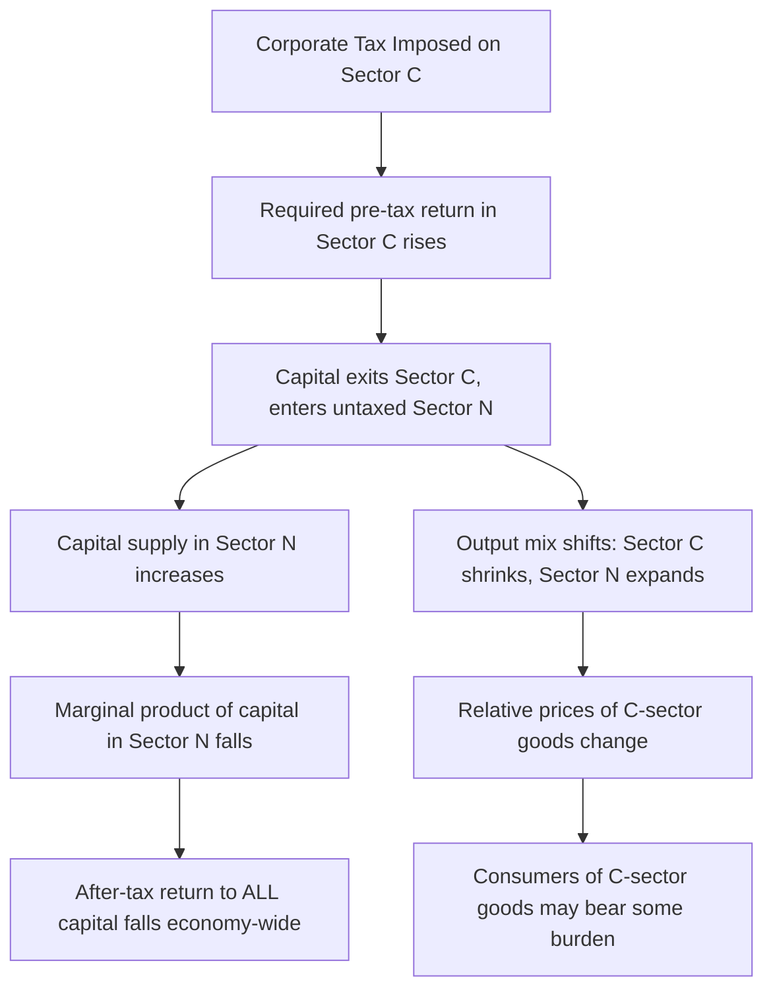

## Corporate Tax Incidence

### Overview

Corporate tax incidence asks a deceptively simple question: when a government levies a tax on corporate profits, which real people ultimately bear the economic burden? The **statutory** incidence (who writes the check — the corporation) is trivially the firm itself. The **economic** incidence (whose real income falls) is a matter of general-equilibrium analysis and remains one of the most debated empirical and theoretical questions in public finance. Candidates include shareholders (owners of corporate capital), capital owners broadly (if capital reallocates across sectors), workers (through lower wages), and consumers (through higher prices).

### Statutory vs. Economic Incidence

**Key Points**

- **Statutory incidence**: the legal obligation to remit the tax — always the corporation for the CIT
- **Economic incidence**: the actual change in real income borne by individuals after all market adjustments and price/wage/return changes have played out
- Because corporations are legal entities, not final consumers, 100% of the economic incidence must fall on some combination of shareholders, workers, and consumers — the tax cannot "stop" at the firm
- Incidence analysis requires a **general equilibrium** framework because taxing capital in one sector triggers capital reallocation, which changes returns and wages economy-wide

### The Harberger Model (1962): Foundational Framework

**Key Points**

- Arnold Harberger's two-sector general equilibrium model is the theoretical starting point for essentially all subsequent corporate incidence analysis
- Setup: economy divided into a **corporate sector** (taxed) and a **noncorporate sector** (untaxed), each combining capital and labor with different factor intensities and different elasticities of substitution
- A tax on corporate capital raises the required pre-tax return in the corporate sector, causing capital to flee toward the untaxed noncorporate sector
- This capital flight has two effects:
  1. **Output effect**: corporate sector shrinks, noncorporate sector expands, shifting relative output and prices
  2. **Factor substitution effect**: as capital floods the noncorporate sector, its after-tax return falls economy-wide (since capital is assumed perfectly mobile between sectors in the long run)
- **Central Harberger result**: in a closed economy, capital as a whole tends to bear a share of the burden that can exceed 100% of the revenue collected, because capital cannot escape the tax by moving sectors — it can only dilute its own return economy-wide

**Example**

Consider two sectors: manufacturing (capital-intensive, taxed) and services (labor-intensive, untaxed). A corporate tax on manufacturing profits raises the required return that capital demands there. Investors shift capital to services. As capital floods services, the marginal product of capital there falls, dragging down after-tax returns to capital economy-wide — even for capital owners with no exposure to manufacturing.

$$\text{Burden on Capital} = f(\sigma_{LK}, \; \theta_K, \; k_C/k_N)$$

where $\sigma_{LK}$ is the elasticity of substitution between labor and capital, $\theta_K$ is capital's income share, and $k_C/k_N$ is the relative capital intensity of the corporate versus noncorporate sector. [Inference] The exact incidence split in Harberger-style models is highly sensitive to these parameter assumptions, which is why empirical estimates diverge substantially.

### Short Run vs. Long Run

**Key Points**

- **Short run**: capital is largely fixed/immobile (sunk in existing corporate structures). The tax is closer to a tax on a fixed factor, and shareholders of taxed firms bear a disproportionate share (**capitalization effect** — asset prices of corporate equity fall to reflect the future tax liability)
- **Long run**: capital becomes mobile across sectors and jurisdictions, incidence spreads according to Harberger-style mechanisms, and the burden shifts away from the specific shareholders of taxed firms toward capital owners broadly, and potentially toward labor
- [Inference] The transition speed from short-run to long-run incidence depends on real-world adjustment frictions (asset specificity, regulatory barriers to capital reallocation), which are difficult to measure precisely and vary by industry

### Open Economy Incidence: The Role of Capital Mobility

**Key Points**

- The Harberger closed-economy model assumes capital cannot leave the domestic economy at all — it can only shift between the two domestic sectors
- In an **open economy** with high international capital mobility, domestic capital can escape the corporate tax entirely by relocating abroad, seeking the same after-tax return available globally
- If capital is **perfectly mobile internationally** and the domestic economy is small relative to world capital markets (a "small open economy" assumption), the **after-tax return to capital must equal the world rate** — capital cannot bear the burden in equilibrium, because it would simply exit
- Under this assumption, the burden falls predominantly on **immobile factors**, chiefly **labor** (lower wages due to reduced capital per worker) and potentially **land** or firm-specific rents
- This is the primary theoretical basis for the claim, prominent in more recent public finance literature (e.g., work associated with Harberger's later papers, and studies by Gravelle, Hassett, Mathur, among others), that **labor bears a substantial share of the corporate tax burden in open economies**

$$r^{*} = r_{world} \quad \text{(after-tax return pinned to world rate under perfect capital mobility)}$$

**Example**

A small country raises its corporate tax rate unilaterally. If capital is highly mobile, investors redirect new investment to other countries offering higher after-tax returns. Over time, the domestic capital stock shrinks, capital-to-labor ratios fall, and the marginal product of labor declines — wages fall even though workers pay no formal corporate tax liability themselves.

### Determinants of Incidence Split

**Key Points**

- **Capital mobility**: higher international/intersectoral mobility of capital shifts more burden toward labor and less toward capital owners
- **Labor mobility**: if labor is also mobile (e.g., across regions or borders), it can partially escape the burden too, shifting more back toward capital or land
- **Market structure**: in competitive markets, firms cannot simply "pass through" the tax to consumers via pricing without losing market share; under imperfect competition or market power, some pass-through to consumers via higher prices is more plausible
- **Elasticity of substitution between capital and labor** ($\sigma_{LK}$): higher substitutability tends to concentrate burden on the factor that is harder to substitute away from
- **Openness of the economy**: small open economies see more burden shifted to labor than large economies or closed economies, where capital has fewer outside options
- **Time horizon**: short-run incidence favors existing shareholders (capitalization); long-run incidence spreads more broadly

### Empirical Estimates

**Key Points**

- Empirical incidence estimates vary widely depending on methodology, country, time period, and model specification
- Some studies (e.g., certain work by Hassett and Mathur) have found large labor-burden shares from cross-country wage regressions on corporate tax rates
- Other studies using different specifications or focusing on within-country variation find substantially smaller labor shares, with capital or shareholders still bearing the majority of the burden
- [Unverified] Specific point estimates (e.g., "labor bears X% of the corporate tax") should not be treated as a settled consensus figure — the applied public finance literature continues to actively debate both magnitude and methodology, and results are sensitive to identification strategy, time period, and country sample
- U.S. Congressional Budget Office and Joint Committee on Taxation historically have used their own incidence assumptions (often splitting the burden between capital and labor in stylized proportions) for revenue-estimating and distributional purposes, and these assumptions have themselves changed over time as the literature evolved

### Incidence and Firm-Specific Rents

**Key Points**

- To the extent a firm earns **firm-specific economic rents** (from patents, brand, unique know-how, or market power), a portion of the corporate tax burden falls on the **owners of those rents** rather than on mobile capital generally
- Rents are, by construction, immobile and cannot escape via relocation the way ordinary capital can — this reduces the labor-share prediction from the pure Harberger/open-economy models for highly rent-intensive firms or sectors
- This creates an important **firm heterogeneity** dimension: incidence likely differs meaningfully between capital-intensive, low-margin firms in competitive tradable sectors versus firms with substantial market power or intangible-asset-driven rents

### Incidence Diagram: Capital Mobility Spectrum

<svg xmlns="http://www.w3.org/2000/svg" viewBox="0 0 640 260">
<text x="320" y="24" font-size="15" text-anchor="middle" font-family="sans-serif" font-weight="bold">Incidence Shifts with Capital Mobility (svg_diagram)</text>
<line x1="60" y1="140" x2="580" y2="140" stroke="#333" stroke-width="2" />
<circle cx="60" cy="140" r="5" fill="#333" />
<circle cx="580" cy="140" r="5" fill="#333" />
<text x="60" y="165" font-size="12" text-anchor="middle" font-family="sans-serif">Closed Economy</text>
<text x="60" y="180" font-size="11" text-anchor="middle" font-family="sans-serif">(no capital mobility)</text>
<text x="580" y="165" font-size="12" text-anchor="middle" font-family="sans-serif">Small Open Economy</text>
<text x="580" y="180" font-size="11" text-anchor="middle" font-family="sans-serif">(perfect capital mobility)</text>
<rect x="90" y="60" width="150" height="30" fill="#a8d5ba" stroke="#2f6f4f" />
<text x="165" y="80" font-size="12" text-anchor="middle" font-family="sans-serif">Capital bears most burden</text>
<rect x="400" y="60" width="150" height="30" fill="#e8a0a0" stroke="#8f2f2f" />
<text x="475" y="80" font-size="12" text-anchor="middle" font-family="sans-serif">Labor bears more burden</text>
<line x1="165" y1="90" x2="165" y2="135" stroke="#333" stroke-width="1" />
<line x1="475" y1="90" x2="475" y2="135" stroke="#333" stroke-width="1" />
</svg>

### Policy Implications of Incidence Findings

**Key Points**

- If labor bears a substantial share of the burden, corporate tax cuts are sometimes framed politically as a way to raise wages — a claim that depends heavily on the incidence assumptions used and is contested among economists
- If capital/shareholders bear most of the burden, the CIT functions more progressively (since capital ownership is concentrated among higher-income households), reinforcing its role in overall tax progressivity
- Distributional/progressivity analysis of any given country's tax system is **directly conditional** on which incidence assumption is adopted — this is a critical methodological choice for institutions like the CBO, Tax Policy Center, or Treasury when publishing distributional tables
- [Inference] Because incidence assumptions materially change measured progressivity, disagreements over corporate tax incidence often map onto broader political disagreements about tax policy, even though incidence is nominally a positive (not normative) economic question

### Conclusion

Corporate tax incidence separates the legal obligation to pay (always the firm) from the real economic burden (borne by people). The Harberger model established that even in a closed economy, capital broadly — not just shareholders of taxed firms — absorbs much of the burden through economy-wide return depression as capital reallocates across sectors. Opening the economy to international capital mobility shifts theoretical predictions substantially toward labor bearing a larger share, since capital can exit to jurisdictions offering higher after-tax returns while workers largely cannot follow. Real-world incidence likely lies between these polar cases and varies by firm rent-intensity, time horizon, and economic openness, and empirical estimates remain a genuinely contested area of public finance research rather than a settled figure.

**Related Topics**

- Rationale for Taxing Corporations
- The Harberger General Equilibrium Model in Depth
- Tax Incidence in Partial vs. General Equilibrium
- Capital Mobility and International Tax Competition
- Wage Effects of Corporate Tax Changes (Empirical Literature)
- Distributional Analysis and Progressivity of Tax Systems
- Economic Rents and Firm Heterogeneity in Tax Incidence
- CBO/JCT Distributional Methodology