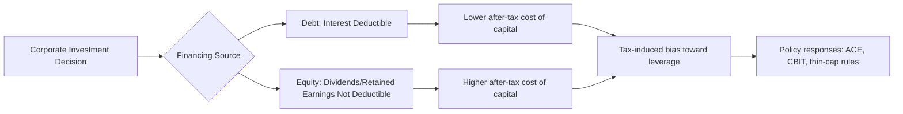

## Effects on Investment and the Cost of Capital

### Overview

The corporate income tax affects firms' investment decisions primarily through its influence on the **cost of capital** — the minimum pre-tax rate of return an investment project must earn to be worthwhile after accounting for taxes, depreciation, and financing costs. This topic sits at the core of public finance's efficiency analysis of corporate taxation: a tax that raises the cost of capital discourages otherwise profitable investment, creating deadweight loss, while a well-designed base can in principle leave marginal investment decisions largely undistorted.

### The Neoclassical Investment Framework

**Key Points**

- Firms invest up to the point where the **marginal product of capital** equals the **cost of capital**
- The corporate tax affects this equilibrium by altering the after-tax return required to justify an investment
- The foundational framework is due to Jorgenson (1963) and later extended by King and Fullerton (1984) into the widely used **effective tax rate** methodology
- Investment decisions depend not on statutory tax rates alone, but on the full interaction of the tax rate, depreciation rules, financing mix, and inflation

### The Cost of Capital Formula

**Key Points**

- The standard **Hall-Jorgenson cost of capital** formula expresses the minimum pre-tax real rate of return required for a marginal investment to break even
- It incorporates the discount rate, economic depreciation, the tax rate, and the present value of depreciation allowances (tax depreciation, not economic depreciation)

$$c = \frac{(r + \delta)(1 - \tau z)}{1 - \tau}$$

where:

- $c$ = cost of capital (required pre-tax real rate of return)
- $r$ = real discount rate (financing cost)
- $\delta$ = economic depreciation rate
- $\tau$ = statutory corporate tax rate
- $z$ = present value of tax depreciation allowances per dollar of investment (the **depreciation tax shield**)

**Key Points on Interpretation**

- If $z = 1$ (i.e., the tax system allows **immediate full expensing**, so the present value of depreciation deductions equals the investment cost), the formula simplifies to $c = r + \delta$, meaning the **tax rate drops out entirely** — the cost of capital becomes tax-neutral with respect to $\tau$
- This result is central to the case for **full expensing / cash-flow taxation**: a tax with full and immediate expensing of investment does not distort the marginal investment decision, regardless of the statutory rate, because on the margin the government essentially becomes a "silent partner" sharing in both the cost and the return proportionally
- If $z < 1$ (as with standard depreciation schedules spread over many years), a higher $\tau$ raises the cost of capital, discouraging investment at the margin
- [Inference] The exact magnitude of investment sensitivity to changes in $z$ or $\tau$ depends on empirically estimated elasticities of investment with respect to the cost of capital, which vary by asset type, industry, and study

### Marginal Effective Tax Rate (METR)

**Key Points**

- The **METR** measures the tax "wedge" between the pre-tax and post-tax required rate of return on a marginal investment (one that just breaks even before tax)
- Formally: $\text{METR} = \frac{c - r}{c}$, capturing how much of the required return is attributable to the tax system rather than underlying capital costs
- METRs vary substantially **across asset types** (equipment vs. structures vs. inventories) because depreciation schedules rarely track true economic depreciation exactly
- METRs also vary **across financing methods** (debt vs. equity) because interest is deductible while the return to equity generally is not, creating a **debt bias** in the cost of capital

**Example**

Suppose $r = 5\%$, $\delta = 10\%$, $\tau = 21\%$, and tax depreciation allows $z = 0.85$ (present value of allowances covers 85% of investment cost). Then:

$$c = \frac{(0.05 + 0.10)(1 - 0.21 \times 0.85)}{1 - 0.21} = \frac{0.15 \times 0.8215}{0.79} \approx 0.156$$

The required pre-tax return is about 15.6%, compared to the no-tax benchmark of $r + \delta = 15\%$ — a small tax-induced wedge of roughly 0.6 percentage points from imperfect expensing.

### Average Effective Tax Rate (AETR)

**Key Points**

- Distinct from the METR, the **AETR** measures the effective tax burden on an **inframarginal** (profitable, rent-earning) investment — relevant for discrete investment-location choices (e.g., "should this multinational build a plant here or in another country?") rather than marginal investment intensity decisions
- Devereux and Griffith (1998, 2003) developed the standard AETR methodology widely used in international tax competition literature
- METR is the right concept for **how much** a firm invests domestically; AETR is the right concept for **where** a firm chooses to locate discrete, profitable investment projects

### Debt vs. Equity Financing: The Debt Bias

**Key Points**

- Interest payments on debt are typically tax-deductible as a business expense, while the return to equity (dividends and retained-earnings-driven capital gains) generally is not deductible under a standard corporate income tax
- This asymmetry lowers the after-tax cost of debt financing relative to equity, creating a systematic incentive for **corporate leverage**
- Excess leverage driven by tax incentives (rather than optimal capital structure per Modigliani-Miller considerations) increases financial fragility and bankruptcy risk in the corporate sector
- Policy responses include **thin capitalization rules** (limiting interest deductibility relative to earnings or equity), an **Allowance for Corporate Equity (ACE)** (granting a notional deduction for the cost of equity capital, effectively equalizing treatment with debt), or a **Comprehensive Business Income Tax (CBIT)** (disallowing interest deductibility to equalize treatment from the other direction)

### Depreciation Policy and Investment Incentives

**Key Points**

- **Accelerated depreciation**: allowing firms to deduct a larger share of investment cost earlier than true economic depreciation would dictate, raising $z$ and lowering the cost of capital, thereby stimulating investment
- **Bonus depreciation**: a specific accelerated-depreciation policy allowing immediate deduction of a percentage of an asset's cost in the year of purchase (used repeatedly as a countercyclical stimulus tool in the U.S., e.g., post-2008 and post-2017 tax law)
- **Full expensing**: the limiting case of accelerated depreciation where 100% of investment cost is deducted immediately ($z=1$), which under the Hall-Jorgenson formula eliminates the tax's distortion of the marginal investment margin entirely (though it does not eliminate distortions related to *financing* method or *inframarginal/rent* taxation)
- **Straight-line depreciation**: deductions spread evenly over an asset's useful life, generally producing $z < 1$ in present-value terms and thus a positive tax wedge on investment
- [Inference] The stimulative effect of temporary accelerated depreciation/bonus depreciation provisions on aggregate investment is empirically well-documented in the literature, though the magnitude of the effect and the extent to which it merely shifts the *timing* of investment (pulling forward future investment) rather than increasing its total long-run level remains an active area of empirical estimation

### Investment Tax Credits (ITCs)

**Key Points**

- A direct credit against tax liability for a percentage of qualifying investment expenditure, distinct from depreciation (which merely times deductions) — an ITC directly reduces the cost of capital by effectively subsidizing the purchase price
- ITCs can be **targeted** (e.g., renewable energy, R&D) to correct externalities or promote specific policy goals, layering an instrumental rationale on top of the base corporate tax
- Interacts with depreciation basis rules: in many systems, claiming an ITC requires a corresponding reduction in the depreciable basis of the asset (to prevent double-dipping), which affects the net cost-of-capital calculation

### Empirical Evidence on Investment Responsiveness

**Key Points**

- A substantial empirical literature estimates the **elasticity of investment with respect to the cost of capital** (or equivalently, the user cost of capital), generally finding a negative and economically meaningful relationship — higher cost of capital reduces investment
- Studies using bonus depreciation "natural experiments" (exploiting eligibility discontinuities across asset types or time) have provided some of the most credible identification of this relationship
- [Unverified] Specific elasticity magnitudes vary considerably across studies, samples, time periods, and asset classes, and should not be treated as a single universal parameter
- Financing constraints matter: cost-of-capital effects tend to be larger for financially constrained firms (which cannot easily substitute internal for external funds) than for large, cash-rich firms with easy capital market access

### International Dimension: Cost of Capital and Capital Mobility

**Key Points**

- In an open economy, the domestic cost of capital interacts with international capital mobility (see Corporate Tax Incidence): a higher domestic cost of capital relative to the rest of the world reduces domestic investment as capital seeks higher after-tax returns abroad
- Multinational tax planning (transfer pricing, debt shifting, treaty shopping) can effectively lower the **AETR** faced by mobile capital without changing the statutory rate, complicating simple cost-of-capital analysis for globally integrated firms
- **Destination-Based Cash Flow Taxation (DBCFT)** proposals aim to combine full expensing (neutralizing the marginal investment distortion) with border adjustments (removing incentives for profit-shifting based on the location of sales rather than production)

### Diagram: Cost of Capital and the Investment Margin

<svg xmlns="http://www.w3.org/2000/svg" viewBox="0 0 640 300">
<text x="320" y="24" font-size="15" text-anchor="middle" font-family="sans-serif" font-weight="bold">Cost of Capital and Marginal Investment (svg_diagram)</text>
<line x1="70" y1="250" x2="580" y2="250" stroke="#333" stroke-width="2" />
<line x1="70" y1="250" x2="70" y2="50" stroke="#333" stroke-width="2" />
<text x="30" y="150" font-size="12" font-family="sans-serif" transform="rotate(-90 30 150)">Rate of Return</text>
<text x="330" y="280" font-size="12" text-anchor="middle" font-family="sans-serif">Capital Stock (K)</text>
<path d="M 90 70 Q 300 150 560 230" stroke="#2f6f4f" stroke-width="2" fill="none" />
<text x="500" y="210" font-size="11" font-family="sans-serif" fill="#2f6f4f">Marginal Product of Capital</text>
<line x1="70" y1="110" x2="580" y2="110" stroke="#8f2f2f" stroke-width="2" stroke-dasharray="6,3" />
<text x="500" y="105" font-size="11" font-family="sans-serif" fill="#8f2f2f">Cost of Capital (with tax, z&lt;1)</text>
<line x1="70" y1="150" x2="580" y2="150" stroke="#2f6f4f" stroke-width="2" stroke-dasharray="6,3" />
<text x="500" y="145" font-size="11" font-family="sans-serif" fill="#2f6f4f">Cost of Capital (full expensing, z=1)</text>
<line x1="290" y1="250" x2="290" y2="110" stroke="#888" stroke-width="1" stroke-dasharray="2,2" />
<line x1="370" y1="250" x2="370" y2="150" stroke="#888" stroke-width="1" stroke-dasharray="2,2" />
<text x="290" y="265" font-size="10" text-anchor="middle" font-family="sans-serif">K* (distorted)</text>
<text x="370" y="265" font-size="10" text-anchor="middle" font-family="sans-serif">K** (efficient)</text>
</svg>

The diagram illustrates that a higher effective cost of capital (from imperfect expensing) intersects the declining marginal product of capital curve at a lower capital stock ($K^*$), reducing investment below the level ($K^{**}$) that would obtain under full expensing where the tax wedge is eliminated.

### Policy Trade-offs

**Key Points**

- Full expensing eliminates the marginal investment distortion but forgoes taxing the **normal return** to capital entirely, shrinking the tax base to pure economic rents (see Rationale for Taxing Corporations) — this raises revenue trade-off considerations
- Accelerated depreciation and bonus depreciation are often used as **temporary, countercyclical** tools rather than permanent base changes, given their significant revenue cost if made permanent
- The choice between subsidizing investment via lower statutory rates versus via a more generous depreciation/expensing regime has different efficiency implications: rate cuts benefit both marginal and inframarginal (rent-earning) investment, while expensing targets the marginal investment margin more precisely without giving up as much taxation of rents

### Conclusion

The corporate tax's effect on investment operates through the cost of capital, which synthesizes the discount rate, depreciation policy, and tax rate into a single required-return threshold for the marginal investment. Immediate full expensing is the key policy lever that can neutralize this distortion by making $z=1$, in principle taxing only economic rents while leaving marginal investment decisions unaffected by the tax rate. In practice, most real-world tax systems allow only partial acceleration of depreciation, producing a positive cost-of-capital wedge that discourages some marginal investment, with the magnitude varying substantially by asset type and financing method. The tax-driven debt bias further distorts financing decisions independently of the investment-level distortion, motivating reform proposals like ACE and CBIT that aim to equalize debt and equity treatment.

**Related Topics**

- Rationale for Taxing Corporations
- Corporate Tax Incidence
- Depreciation Methods and Capital Recovery Systems
- Marginal vs. Average Effective Tax Rates (King-Fullerton, Devereux-Griffith)
- Debt Bias and the Allowance for Corporate Equity (ACE)
- Destination-Based Cash Flow Taxation (DBCFT)
- International Tax Competition and Profit Shifting
- Corporate Tax Base Design (Cash-Flow vs. Comprehensive Income)