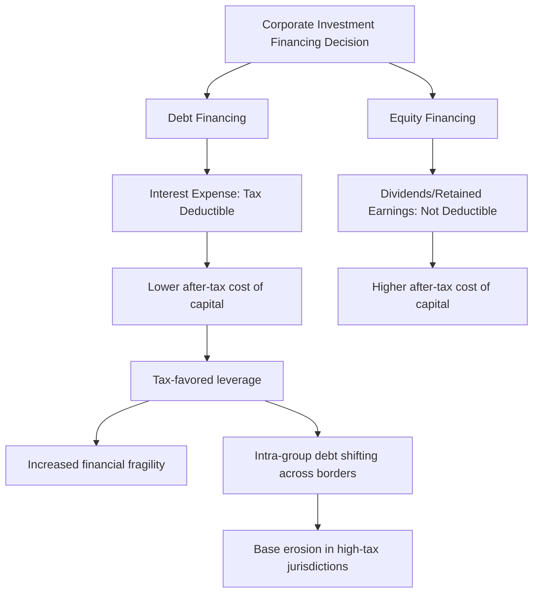

## Debt-Equity Tax Bias

### Overview

The debt-equity tax bias refers to the systematic preference most corporate income tax systems create for financing investment with debt rather than equity. This bias arises because interest payments on debt are typically deductible as a business expense in computing taxable corporate profit, while returns to equity holders — dividends and retained-earnings-driven capital gains — generally are not deductible. The resulting asymmetric tax treatment distorts firms' capital structure decisions away from what would otherwise be economically optimal, with implications for financial stability, tax revenue, and cross-border tax planning.

### The Asymmetry at the Core of the Bias

**Key Points**

- Under a standard (non-integrated) corporate income tax, taxable profit is calculated as revenue minus deductible expenses, and interest expense is treated as a deductible cost of doing business — analogous to wages or rent
- The return paid to equity holders (dividends, or the retained earnings that drive share price appreciation) is paid out of **after-tax** profit — it is not a deductible expense
- This creates a **differential effective tax rate** on the marginal source of investment finance: debt-financed investment faces a lower cost of capital than equity-financed investment, all else equal
- The bias is a direct consequence of defining the corporate tax base as profit net of interest but gross of the return to equity — a design choice, not an unavoidable feature of taxing corporations

### Formalizing the Bias via the Cost of Capital

**Key Points**

- Building on the Hall-Jorgenson cost of capital framework (see Effects on Investment and the Cost of Capital), the cost of capital differs by financing source because the discount rate $r$ effectively differs between debt and equity once taxes are incorporated
- For **debt-financed** investment, the after-tax cost of borrowing is $r_d(1-\tau)$, since interest deductibility shields the corporate tax rate $\tau$ from the cost of debt
- For **equity-financed** investment, the required return $r_e$ is not tax-shielded at the corporate level, so the full pre-tax cost of equity capital must be earned by the underlying investment

$$c_{debt} = \frac{(r_d(1-\tau) + \delta)(1 - \tau z)}{1 - \tau}, \qquad c_{equity} = \frac{(r_e + \delta)(1 - \tau z)}{1 - \tau}$$

**Key Points on Interpretation**

- Because $r_d(1-\tau) < r_d$, and assuming $r_d$ and $r_e$ are not too different (as Modigliani-Miller-adjacent reasoning would suggest absent taxes), $c_{debt} < c_{equity}$ under standard corporate tax treatment
- The gap between $c_{debt}$ and $c_{equity}$ is the **debt-equity tax wedge**, and it grows directly with the statutory corporate tax rate $\tau$
- [Inference] The magnitude of this wedge in practice also depends on personal-level taxation of interest versus dividends/capital gains, which can partially offset or reinforce the corporate-level bias depending on the jurisdiction's personal tax treatment of each income type

### Personal-Level Taxes and the "Old View" vs. "New View" of Dividend Taxation

**Key Points**

- A full incidence analysis of the debt-equity bias must consider **both** corporate and personal-level taxation, since the overall wedge depends on the combined effect
- The **"old view"** treats dividend taxes as a straightforward disincentive to equity-financed, dividend-paying investment, reinforcing the debt bias
- The **"new view"** (associated with Auerbach, Bradford, King) argues that for a mature firm financing investment out of retained earnings, the dividend tax is capitalized into share value and does not affect the marginal investment decision at the margin, because the tax is unavoidable on any payout method chosen (dividend now vs. later) — under this view, dividend taxation does not by itself worsen the debt-equity distortion for retained-earnings-financed firms, though it still affects the level of shareholder wealth
- [Unverified] The empirical applicability of the "new view" versus "old view" depends on firm-specific financing patterns (e.g., whether the firm is raising new equity vs. financing from retained earnings) and remains a topic of ongoing debate in the corporate finance and public finance literature

### Consequences of the Debt Bias

**Key Points**

- **Excess leverage**: firms are incentivized to use more debt financing than they would choose absent the tax distortion, pushing capital structure away from the level implied by non-tax considerations (bankruptcy costs, agency costs, financial flexibility)
- **Increased financial fragility**: higher leverage raises the probability and severity of financial distress and bankruptcy, particularly during economic downturns — a concern amplified after the 2008 global financial crisis, where excessive leverage in the financial sector was partly attributed to tax-favored debt financing
- **Revenue erosion**: aggressive interest deductions (including through intra-group lending) can substantially shrink the corporate tax base, especially for **highly leveraged multinational structures**
- **Cross-border profit shifting**: multinational groups can use intra-group debt to shift profits from high-tax to low-tax jurisdictions by concentrating debt (and thus deductible interest) in high-tax affiliates — a specific and heavily targeted form of **base erosion and profit shifting (BEPS)**

**Example**

A multinational parent based in a low-tax jurisdiction lends money to its subsidiary operating in a high-tax jurisdiction. The subsidiary deducts the interest paid on this intra-group loan against its high-tax local profits, while the parent receives the interest income in the low-tax jurisdiction. This reduces the group's overall effective tax rate without any change in real economic activity, illustrating how the debt bias interacts with international tax planning.

### Policy Responses: Restricting Interest Deductibility

**Key Points**

- **Thin capitalization rules**: limit the amount of related-party (or sometimes all) debt on which interest can be deducted, typically via a maximum debt-to-equity ratio; interest on debt exceeding the threshold becomes non-deductible or is recharacterized as a dividend
- **Earnings-stripping / fixed-ratio rules**: limit interest deductibility to a percentage of a measure of earnings (commonly EBITDA or EBIT), regardless of the debt-to-equity ratio — this approach is the basis of the OECD's **BEPS Action 4** recommendations and has been widely adopted (e.g., the EU's Anti-Tax Avoidance Directive, and the U.S. Section 163(j) limitation introduced/tightened under the Tax Cuts and Jobs Act of 2017)
- [Inference] Fixed-ratio (EBITDA-based) rules are generally considered more robust against profit-shifting than simple debt-to-equity thin-cap rules, since they are harder to circumvent through equity injections that do not change real leverage economics, though this assessment depends on the specific design and anti-avoidance provisions layered on top

### Policy Responses: Leveling the Playing Field

**Key Points**

- **Allowance for Corporate Equity (ACE)**: grants a notional deduction for the cost of equity capital, calculated as a fixed rate applied to the firm's equity base, mirroring the deduction already available for debt — this eliminates the bias by extending debt-like treatment to equity rather than restricting debt
  - [Unverified] Countries that have implemented ACE-type systems (e.g., Belgium's former "notional interest deduction," Italy's ACE) have shown mixed results regarding revenue cost and effectiveness at reducing leverage, and design details (rate-setting, anti-abuse rules) materially affect outcomes
- **Comprehensive Business Income Tax (CBIT)**: takes the opposite approach — disallows interest deductibility entirely, taxing debt and equity returns symmetrically at the corporate level (interest becomes non-deductible, similar to dividends)
- **Cash-flow taxation with full expensing**: as discussed in Effects on Investment and the Cost of Capital, a properly designed cash-flow tax combined with disallowing interest deductibility (or symmetric treatment of all financial flows) can achieve neutrality between financing methods while also removing the marginal investment distortion
- **Dividend imputation / integration systems**: address double taxation of equity income at the shareholder level (see Rationale for Taxing Corporations) but do not by themselves fully resolve the *corporate-level* interest deductibility asymmetry unless paired with equity-side relief

### Comparison of Policy Approaches

**Key Points**

- **Restrict debt (thin-cap/EBITDA rules)**: preserves existing corporate tax base structure, targets profit shifting directly, but does not fully equalize the cost of capital across financing methods for purely domestic, non-abusive leverage decisions
- **ACE**: achieves full neutrality between debt and equity financing but at a significant revenue cost, since it extends a new deduction rather than removing an existing one
- **CBIT**: achieves neutrality by removing the debt-side advantage entirely, which raises revenue relative to ACE but increases the cost of capital for debt-financed investment (potentially discouraging investment broadly, depending on general equilibrium effects)
- **Full cash-flow taxation**: theoretically the cleanest solution to both the debt-equity bias and the marginal investment distortion simultaneously, but represents a more radical departure from existing income-tax-based systems and raises transition and international-coordination challenges

### Diagram: Effective Tax Wedge by Financing Source

<svg xmlns="http://www.w3.org/2000/svg" viewBox="0 0 640 300">
<text x="320" y="24" font-size="15" text-anchor="middle" font-family="sans-serif" font-weight="bold">Cost of Capital by Financing Source (svg_diagram)</text>
<line x1="80" y1="250" x2="580" y2="250" stroke="#333" stroke-width="2" />
<line x1="80" y1="250" x2="80" y2="50" stroke="#333" stroke-width="2" />
<text x="35" y="150" font-size="12" font-family="sans-serif" transform="rotate(-90 35 150)">Required Return</text>
<rect x="150" y="170" width="100" height="80" fill="#a8d5ba" stroke="#2f6f4f" stroke-width="2" />
<text x="200" y="265" font-size="12" text-anchor="middle" font-family="sans-serif">Debt-Financed</text>
<rect x="380" y="90" width="100" height="160" fill="#e8a0a0" stroke="#8f2f2f" stroke-width="2" />
<text x="430" y="265" font-size="12" text-anchor="middle" font-family="sans-serif">Equity-Financed</text>
<text x="200" y="160" font-size="11" text-anchor="middle" font-family="sans-serif">c_debt (lower)</text>
<text x="430" y="80" font-size="11" text-anchor="middle" font-family="sans-serif">c_equity (higher)</text>
<line x1="150" y1="170" x2="380" y2="170" stroke="#333" stroke-width="1" stroke-dasharray="4,3" />
<text x="315" y="185" font-size="10" text-anchor="middle" font-family="sans-serif">Tax wedge from</text>
<text x="315" y="197" font-size="10" text-anchor="middle" font-family="sans-serif">non-deductibility</text>
</svg>

### Interaction with the 2017 U.S. Tax Cuts and Jobs Act

**Key Points**

- The TCJA reduced the U.S. statutory corporate rate from 35% to 21%, which mechanically **narrows** the absolute size of the debt-equity tax wedge, since the wedge scales with $\tau$
- Simultaneously, the TCJA introduced a stricter limitation on interest deductibility under Section 163(j), initially capping deductible net interest at 30% of EBITDA (tightening in 2022 to 30% of EBIT, a narrower earnings base), directly targeting the debt bias from the "restrict debt" side of the policy toolkit
- The TCJA also permitted 100% bonus depreciation (full expensing) for qualifying property, which — per the Hall-Jorgenson framework — further reduces the marginal investment distortion independent of the financing-method distortion
- [Unverified] The net effect of these simultaneous changes (lower rate, tighter interest limits, full expensing) on aggregate corporate leverage is an empirical question that depends on how firms respond jointly to all three provisions; isolating the debt-bias-specific effect requires careful empirical identification

### Conclusion

The debt-equity tax bias is a structural feature of standard corporate income taxation, arising from the asymmetric deductibility of interest versus the non-deductibility of returns to equity. This asymmetry lowers the after-tax cost of debt-financed investment relative to equity-financed investment, encouraging higher corporate leverage than would otherwise be chosen, with consequences for financial stability, tax revenue, and multinational tax planning through intra-group debt shifting. Policy responses fall into two broad categories: restricting interest deductibility (thin-capitalization and earnings-stripping rules, increasingly harmonized internationally under BEPS-style EBITDA limitations) and extending equity-like treatment to level the playing field (ACE systems) or removing debt's advantage entirely (CBIT), with full cash-flow taxation representing the theoretically cleanest but most structurally significant reform option.

**Related Topics**

- Rationale for Taxing Corporations
- Effects on Investment and the Cost of Capital
- Base Erosion and Profit Shifting (BEPS)
- Thin Capitalization and Earnings-Stripping Rules
- Allowance for Corporate Equity (ACE) Systems
- Comprehensive Business Income Tax (CBIT)
- Dividend Imputation and Shareholder-Level Integration
- Destination-Based Cash Flow Taxation (DBCFT)
- Section 163(j) and the U.S. Tax Cuts and Jobs Act