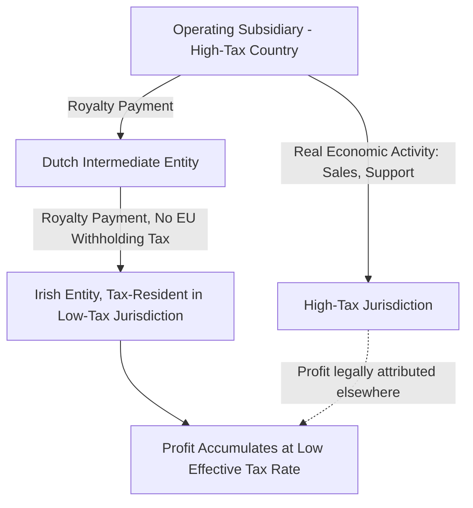

## Corporate Tax Avoidance and Profit Shifting

### Overview

Corporate tax avoidance and profit shifting refer to the range of legal strategies multinational enterprises (MNEs) use to reduce their global tax liability, primarily by relocating taxable profits from high-tax jurisdictions to low-tax jurisdictions without necessarily relocating the underlying real economic activity. This is distinct from **tax evasion**, which involves illegal concealment of income. Profit shifting exploits differences in national tax rules, transfer pricing flexibility, and the mismatch between where value is legally attributed and where real economic activity occurs, and it has become a central concern in international public finance and a major driver of coordinated multilateral tax reform.

### Avoidance vs. Evasion: A Critical Distinction

**Key Points**

- **Tax avoidance**: legal reduction of tax liability through structuring transactions, entities, and financial flows within the letter of the law — the focus of this topic
- **Tax evasion**: illegal non-reporting or misreporting of income, falsification of records, or outright concealment — a separate area of tax administration and enforcement
- Profit shifting occupies a genuinely legal (if often aggressive) space, though jurisdictions increasingly use **anti-avoidance doctrines** (economic substance requirements, general anti-avoidance rules/GAARs) to challenge arrangements deemed to lack genuine business purpose
- [Inference] The boundary between "aggressive but legal avoidance" and arrangements that cross into abuse subject to successful GAAR challenge is often litigated case-by-case and varies by jurisdiction's legal doctrine, making a bright-line distinction difficult to state universally

### Core Mechanisms of Profit Shifting

**Key Points**

- **Transfer pricing manipulation**: mispricing intra-group transactions (goods, services, royalties, loans) between related entities in different jurisdictions to shift profit toward low-tax affiliates
- **Debt shifting / intra-group lending**: concentrating debt in high-tax jurisdiction subsidiaries to maximize deductible interest expense there, while routing the interest income to low-tax jurisdiction parents or finance affiliates (see Debt-Equity Tax Bias)
- **Intangible asset / IP location**: relocating ownership of intellectual property (patents, trademarks, algorithms, brand value) to low-tax jurisdictions, then charging high royalties to operating affiliates in high-tax jurisdictions for the right to use that IP
- **Contract manufacturing and principal structures**: restructuring supply chains so that a low-tax "principal" entity contractually bears the risks and owns the resulting profit margin, while high-tax jurisdiction affiliates perform only routine, low-margin functions (manufacturing, distribution, marketing) compensated at a modest markup
- **Treaty shopping**: routing investment through intermediate jurisdictions specifically to access favorable tax treaty provisions (e.g., reduced withholding tax rates) not available via a direct investment route

### The Arm's Length Principle and Transfer Pricing

**Key Points**

- Most countries require intra-group transactions to be priced as if conducted between unrelated parties under comparable circumstances — the **arm's length principle (ALP)**, codified in OECD Transfer Pricing Guidelines and most bilateral tax treaties
- In practice, the ALP is difficult to apply to **unique intangibles** (proprietary IP, brand value, algorithms) precisely because no genuinely comparable arm's-length transaction exists to benchmark against
- This valuation difficulty for intangibles is widely regarded as a central structural weakness enabling profit shifting: MNEs can set internal transfer prices for hard-to-value intangibles in ways that are difficult for tax authorities to challenge with confidence, even where authorities suspect mispricing
- Standard transfer pricing methods include the **Comparable Uncontrolled Price (CUP) method**, **Cost Plus method**, **Resale Price method**, and profit-based methods like the **Transactional Net Margin Method (TNMM)** and **Profit Split method**

**Example**

A U.S. technology firm develops software IP domestically, then transfers ownership of that IP to a subsidiary in a low-tax jurisdiction (historically common with structures like the so-called "Double Irish"). The low-tax subsidiary then licenses the IP back to operating affiliates worldwide, charging royalty fees that shift the bulk of global profit margin into the low-tax entity, even though the underlying economic activity (sales, engineering, marketing) occurs predominantly elsewhere.

### The "Double Irish with a Dutch Sandwich" (Historical Case Study)

**Key Points**

- A well-documented structure historically used by some U.S. multinationals (particularly technology firms) prior to its phase-out
- Involved two Irish-incorporated entities (one tax-resident in a tax haven due to Irish rules on corporate residency based on management location rather than incorporation) and a Dutch intermediate entity to exploit EU intra-directive withholding tax exemptions
- Profit was funneled via royalty payments: operating subsidiary → Dutch entity (no withholding tax within EU) → Irish entity resident in a Caribbean tax haven for tax purposes, ultimately taxed at very low effective rates
- Ireland closed the loophole enabling this structure for new arrangements starting 2015, with a transition period for existing structures ending 2020, following sustained international criticism and OECD/EU pressure
- [Unverified] The precise revenue impact of this specific structure's closure on affected companies' effective tax rates varies by firm and has not been comprehensively quantified in public data

### Measuring the Scale of Profit Shifting

**Key Points**

- Researchers estimate the scale of profit shifting using multiple approaches: analyzing discrepancies between reported profits and real economic activity (employment, sales, tangible assets) by jurisdiction, and studying the sensitivity of reported profits to statutory tax rate differentials across affiliates of the same MNE
- A widely cited stylized fact from this literature is that reported profitability of MNE affiliates in low-tax jurisdictions is disproportionately high relative to their share of real economic activity (employment, tangible capital) in those jurisdictions
- The OECD, IMF, and academic researchers (e.g., Tørsløv, Wier, Zucman; Clausing) have published influential estimates of global profit-shifting magnitudes
- [Unverified] Precise dollar or percentage estimates of global profit shifting vary substantially across studies due to differing methodologies, data sources (national accounts vs. firm-level data), and time periods — current-year figures should be verified against up-to-date published estimates rather than treated as fixed

### Consequences of Profit Shifting

**Key Points**

- **Revenue loss**: erosion of the corporate tax base in jurisdictions where real economic activity occurs, shifting the tax burden toward other tax bases (labor income, consumption) or requiring higher statutory rates on a narrower base to raise equivalent revenue
- **Horizontal inequity**: purely domestic firms without cross-border structuring options bear a comparatively higher effective tax rate than similarly profitable multinational competitors with access to profit-shifting strategies, distorting competition
- **Tax competition pressure**: profit shifting incentivizes a **race to the bottom** in statutory corporate tax rates as jurisdictions compete to attract mobile reported profit (and sometimes real investment), a dynamic closely related to but distinct from Corporate Tax Incidence discussions of capital mobility
- **Misallocation of real activity**: to the extent profit shifting is correlated with real investment location decisions (rather than purely paper-based restructuring), it can distort where firms locate genuine production, employment, and R&D activity

### The OECD/G20 BEPS Project

**Key Points**

- The **Base Erosion and Profit Shifting (BEPS)** Project, launched by the OECD and G20 in 2013, produced a 15-action plan addressing various profit-shifting channels, finalized in 2015
- **Action 4** addressed interest deductibility limitations (EBITDA-based fixed-ratio rules — see Debt-Equity Tax Bias)
- **Action 5** targeted harmful preferential tax regimes and required substantial activity requirements for IP-box regimes
- **Action 6** addressed treaty abuse and treaty shopping via a Principal Purpose Test and Limitation on Benefits provisions
- **Action 8-10** revised transfer pricing guidelines to better align profit allocation with value creation, particularly for hard-to-value intangibles and risk allocation
- **Action 13** introduced **Country-by-Country Reporting (CbCR)**, requiring large MNEs to report revenue, profit, tax paid, and employee/asset counts by jurisdiction to tax authorities — substantially improving the data available for measuring profit shifting
- **Action 15** established a **Multilateral Instrument (MLI)** allowing jurisdictions to efficiently amend existing bilateral tax treaties to incorporate BEPS-related provisions without renegotiating each treaty individually

### BEPS 2.0: Pillar One and Pillar Two

**Key Points**

- Following continued pressure — particularly around taxation of highly digitalized businesses that can generate substantial local revenue without traditional physical presence — the OECD/G20 Inclusive Framework developed a further two-pillar reform, agreed in principle by over 135 jurisdictions in 2021
- **Pillar One**: reallocates a portion of the largest and most profitable MNEs' residual profit to market jurisdictions (where sales/users are located) regardless of physical presence, addressing the traditional "permanent establishment" nexus limitation
- **Pillar Two**: establishes a **global minimum effective tax rate of 15%** via interlocking rules — the **Income Inclusion Rule (IIR)**, allowing a parent jurisdiction to top up tax on low-taxed foreign income of subsidiaries, and the **Undertaxed Payments Rule (UTPR)** as a backstop
- [Unverified] As of the last verified information, implementation status and effective dates for Pillar One and Pillar Two provisions vary by jurisdiction and have faced delays and political disagreement (including significant U.S. positioning on Pillar Two); current implementation status should be verified against recent OECD and national government publications given the fast-moving nature of this area

### Unilateral Measures and National Responses

**Key Points**

- **Digital Services Taxes (DSTs)**: unilateral taxes on gross revenue from digital services (search advertising, social media, online marketplaces) adopted by several countries as an interim measure pending multilateral Pillar One implementation, often contested as discriminatory (particularly by the U.S., given the concentration of large tech companies affected)
- **GILTI (Global Intangible Low-Taxed Income)**: a U.S. minimum tax provision introduced by the 2017 Tax Cuts and Jobs Act, taxing U.S. shareholders on a share of their controlled foreign corporations' income exceeding a routine return threshold, functioning as a unilateral precursor to the broader Pillar Two minimum tax concept
- **Controlled Foreign Corporation (CFC) rules**: longstanding provisions in many countries attributing certain categories of low-taxed foreign subsidiary income back to the domestic parent for current taxation, targeting passive income shifting specifically
- **Diverted Profits Tax**: adopted by the UK and Australia, imposing a punitive tax rate on profits assessed to have been artificially diverted from the domestic tax base

### Diagram: Profit Shifting Incentive Structure

<svg xmlns="http://www.w3.org/2000/svg" viewBox="0 0 640 280">
<text x="320" y="24" font-size="15" text-anchor="middle" font-family="sans-serif" font-weight="bold">Statutory Rate Differential and Shifting Incentive (svg_diagram)</text>
<line x1="80" y1="230" x2="580" y2="230" stroke="#333" stroke-width="2" />
<line x1="80" y1="230" x2="80" y2="50" stroke="#333" stroke-width="2" />
<text x="30" y="140" font-size="12" font-family="sans-serif" transform="rotate(-90 30 140)">Reported Profit Share</text>
<rect x="130" y="80" width="90" height="150" fill="#e8a0a0" stroke="#8f2f2f" stroke-width="2" />
<text x="175" y="245" font-size="11" text-anchor="middle" font-family="sans-serif">High-Tax Jurisdiction</text>
<text x="175" y="70" font-size="10" text-anchor="middle" font-family="sans-serif">Low reported profit</text>
<text x="175" y="258" font-size="10" text-anchor="middle" font-family="sans-serif">(high real activity)</text>
<rect x="420" y="180" width="90" height="50" fill="#a8d5ba" stroke="#2f6f4f" stroke-width="2" />
<text x="465" y="245" font-size="11" text-anchor="middle" font-family="sans-serif">Low-Tax Jurisdiction</text>
<text x="465" y="170" font-size="10" text-anchor="middle" font-family="sans-serif">High reported profit</text>
<text x="465" y="258" font-size="10" text-anchor="middle" font-family="sans-serif">(low real activity)</text>
</svg>

### Distinguishing Real Investment Response from Pure Profit Shifting

**Key Points**

- Empirically, MNE tax responsiveness reflects a blend of **pure profit shifting** (paper-based reallocation of reported profit with minimal real activity change) and **real location decisions** (genuine investment, R&D, or headquarters location choices responsive to tax rates)
- Estimated **semi-elasticities of reported profit with respect to tax rate differentials** in the empirical literature are generally understood to be substantially larger than estimated elasticities of real investment location, consistent with a significant pure-shifting component, though the precise split is contested and methodology-dependent
- [Inference] This distinction matters significantly for policy design: measures targeting pure profit shifting (CbCR, transfer pricing enforcement, minimum taxes) address a different margin than measures aimed at attracting genuine real investment (statutory rate competition, investment incentives), and conflating the two can lead to policy responses mismatched to the actual behavioral margin being targeted

### Conclusion

Corporate tax avoidance and profit shifting exploit the mismatch between where multinational enterprises legally attribute taxable profit and where their real economic activity occurs, primarily through transfer pricing on intangibles, intra-group debt, and strategic entity structuring across jurisdictions with differing tax rates and treaty networks. While legal, these practices erode tax bases in higher-tax jurisdictions, create horizontal inequity between multinational and domestic firms, and intensify international tax competition. The OECD/G20 BEPS Project and its successor two-pillar reform represent the most significant multilateral effort to date to realign profit taxation with real economic substance and establish a global minimum tax floor, though implementation remains an evolving and politically contested process across jurisdictions.

**Related Topics**

- Debt-Equity Tax Bias
- International Tax Competition and Capital Mobility
- Transfer Pricing Methods and the Arm's Length Principle
- OECD BEPS Action Plan and Pillar One/Pillar Two
- Global Minimum Tax (GILTI, Income Inclusion Rule)
- Controlled Foreign Corporation (CFC) Rules
- Digital Services Taxes and Nexus Rules
- Country-by-Country Reporting and Tax Transparency