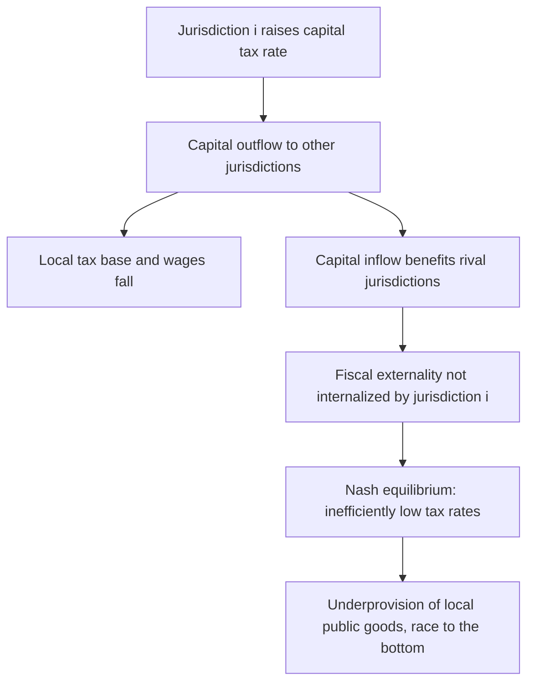

## Tax Competition among Jurisdictions

### Overview

Tax competition among jurisdictions refers to the strategic setting of tax rates and rules by governments seeking to attract mobile tax bases — capital, corporate profit, high-income individuals, or economic activity generally — from other jurisdictions. Unlike simple tax-rate variation, jurisdictional tax competition is fundamentally a **strategic, game-theoretic** phenomenon: each government's optimal tax policy depends on what other governments choose, since tax bases can relocate in response to relative tax burdens. This topic bridges public economics and international economics, and is central to understanding modern corporate tax policy, capital income taxation, and the rationale for international coordination efforts like the OECD BEPS project.

### Theoretical Foundations: The Tiebout Model as a Starting Point

**Key Points**

- Charles Tiebout's (1956) model of local public goods provides an early theoretical basis for beneficial competition: mobile households "vote with their feet," sorting into jurisdictions whose tax-and-public-goods bundle matches their preferences
- In its pure form, Tiebout competition is **efficiency-enhancing**: competition disciplines local governments to provide public goods efficiently, analogous to competition among firms in a product market
- However, Tiebout's framework was designed for local public goods and household mobility, not directly for capital/corporate tax competition, and its efficiency conclusions do not automatically transfer to the capital-tax setting
- [Inference] The applicability of Tiebout-style beneficial sorting logic to corporate tax competition is contested precisely because capital and profit mobility differ structurally from household residential mobility (fewer offsetting local-amenity trade-offs, more scope for pure tax-driven relocation without genuine welfare-improving sorting)

### The Standard Capital Tax Competition Model (Zodrow-Mieszkowski)

**Key Points**

- The canonical formal model, developed by Zodrow and Mieszkowski (1986) building on earlier work by Oates, analyzes symmetric jurisdictions competing for a fixed pool of mobile capital
- Each jurisdiction sets its capital tax rate taking as given the tax rates of other jurisdictions (a Nash equilibrium in tax rates)
- Because capital is mobile and each jurisdiction is "small" relative to the total capital pool, each jurisdiction perceives that raising its capital tax rate drives capital out, reducing the domestic capital stock, wages, and the tax base itself
- Each jurisdiction fails to internalize that its capital tax also benefits **other** jurisdictions by pushing capital toward them (a form of positive fiscal externality on rival jurisdictions) — this externality is not accounted for by individually optimizing governments
- **Central result**: the resulting Nash equilibrium produces **capital tax rates that are inefficiently low relative to the jointly optimal (cooperative) rate**, and consequently **under-provision of local public goods**, since capital taxation is a key revenue source being competed away

$$\frac{\partial \tau_i^*}{\partial K_i} < 0 \quad \text{(each jurisdiction under-taxes mobile capital relative to the social optimum)}$$

**Example**

Consider two otherwise identical jurisdictions, A and B, each hosting half of a fixed global capital stock. If jurisdiction A unilaterally raises its capital tax rate, capital flows to B, eroding A's tax base and public goods funding without a corresponding gain to global welfare — the capital hasn't disappeared, it has merely relocated, but A bears the cost of losing it. Anticipating this, both A and B set tax rates below what they would choose if they could coordinate, since neither wants to be the one to lose capital first.

### The "Race to the Bottom" Thesis

**Key Points**

- The "race to the bottom" describes the dynamic prediction that competitive pressure drives statutory and effective capital/corporate tax rates progressively downward over time as jurisdictions respond to each other's cuts
- Empirically, average statutory corporate tax rates across OECD countries have fallen substantially over recent decades, a pattern often cited as consistent with the race-to-the-bottom thesis
- [Unverified] Attribution of this observed rate decline specifically to competitive dynamics (versus other contributing factors like base-broadening tax reforms, changing views on optimal capital taxation, or domestic political economy shifts) is an empirical identification challenge, and the literature includes some dissenting views on how much of the decline is purely competition-driven
- Critics of the strict race-to-the-bottom narrative point out that statutory rate declines have often been accompanied by **base broadening** (eliminating deductions, credits, and loopholes), meaning effective tax rates and total corporate tax revenue as a share of GDP have not necessarily fallen as dramatically as statutory rates alone would suggest

### Tax Competition: Efficient or Inefficient?

**Key Points**

- **The inefficiency view** (Zodrow-Mieszkowski tradition): tax competition is analogous to a prisoner's dilemma — individually rational tax-cutting by each jurisdiction leads to a collectively worse outcome (underfunded public goods) than cooperative tax-setting would achieve
- **The Leviathan/discipline view** (associated with Brennan and Buchanan): tax competition can be **welfare-improving** if governments are prone to excessive spending or inefficiency absent competitive pressure — competition constrains a revenue-maximizing "Leviathan" government, forcing it toward more efficient and accountable provision of public services
- Reconciling these views empirically requires assessing whether the relevant baseline government behavior is closer to a benevolent social planner (favoring the inefficiency view) or a rent-seeking/inefficient bureaucracy (favoring the discipline view) — a normatively and empirically contested premise
- [Inference] Most mainstream public finance analysis leans toward the inefficiency view for corporate/capital tax competition specifically, given evidence of genuine under-provision of public goods and the prominence of profit-shifting (rather than real efficiency-enhancing relocation) in observed firm behavior, though this remains a matter of ongoing debate rather than unanimous consensus

### Tax Competition vs. Profit Shifting: A Key Distinction

**Key Points**

- **Real tax competition**: jurisdictions compete for genuine, real economic activity (factories, headquarters, R&D facilities, employment) via tax rates and incentives — this involves actual relocation of productive capital and labor
- **Profit-shifting-driven "competition"**: jurisdictions (often small, low-tax jurisdictions with limited real economic capacity to host genuine activity) compete purely for **reported taxable profit** via favorable transfer pricing environments, IP-box regimes, or low headline rates — without corresponding real economic activity (see Corporate Tax Avoidance and Profit Shifting)
- This distinction matters for welfare analysis: real tax competition has genuine (if contested) efficiency trade-offs per the models above, while pure profit-shifting competition offers essentially no efficiency benefit and functions largely as a pure transfer of tax revenue from high-tax to low-tax jurisdictions
- Small jurisdictions with limited productive capacity (certain low-tax "conduit" jurisdictions) are frequently characterized in the literature as competing primarily on the profit-shifting margin rather than the real-activity margin, given their limited capacity to host large-scale genuine economic activity relative to the reported profits routed through them

### Preferential Tax Regimes and "Poaching"

**Key Points**

- Beyond general statutory rate competition, jurisdictions engage in **targeted preferential regimes** — IP boxes/patent boxes offering reduced rates on IP-derived income, special economic zones, holding company regimes, and negotiated rulings for specific large investors
- These targeted regimes allow a jurisdiction to compete aggressively for specific mobile tax bases while maintaining a higher general statutory rate for immobile domestic activity — a form of **tax base segmentation**
- The OECD's BEPS Action 5 specifically targeted "harmful" preferential regimes, establishing a "nexus approach" requiring substantial local R&D activity to qualify for IP-box benefits, aiming to align preferential treatment with genuine value-creating activity rather than pure paper relocation

### Diagram: Race to the Bottom Dynamic

<svg xmlns="http://www.w3.org/2000/svg" viewBox="0 0 640 300">
<text x="320" y="24" font-size="15" text-anchor="middle" font-family="sans-serif" font-weight="bold">Strategic Tax Rate Interdependence (svg_diagram)</text>
<line x1="80" y1="250" x2="580" y2="250" stroke="#333" stroke-width="2" />
<line x1="80" y1="250" x2="80" y2="50" stroke="#333" stroke-width="2" />
<text x="30" y="150" font-size="12" font-family="sans-serif" transform="rotate(-90 30 150)">Statutory Tax Rate</text>
<text x="330" y="280" font-size="12" text-anchor="middle" font-family="sans-serif">Time</text>
<path d="M 100 80 L 200 110 L 300 145 L 400 175 L 500 200" stroke="#8f2f2f" stroke-width="2" fill="none" />
<text x="500" y="190" font-size="11" font-family="sans-serif" fill="#8f2f2f">Jurisdiction A</text>
<path d="M 100 95 L 200 125 L 300 155 L 400 180 L 500 205" stroke="#2f6f4f" stroke-width="2" fill="none" />
<text x="500" y="220" font-size="11" font-family="sans-serif" fill="#2f6f4f">Jurisdiction B</text>
<line x1="80" y1="220" x2="580" y2="220" stroke="#888" stroke-width="1" stroke-dasharray="4,3" />
<text x="500" y="235" font-size="10" font-family="sans-serif" fill="#888">Cooperative (efficient) rate</text>
</svg>

### Coordination Mechanisms and Their Trade-offs

**Key Points**

- **Minimum tax floors**: the OECD Pillar Two global minimum tax (15%) directly addresses the race-to-the-bottom dynamic by establishing a coordinated lower bound on effective tax rates, reducing (though not eliminating) the incentive to undercut rivals below that floor
- **Tax base harmonization**: proposals like the EU's Common Consolidated Corporate Tax Base (CCCTB) aim to harmonize the tax base definition (though not necessarily the rate) across jurisdictions, reducing profit-shifting opportunities that arise from base definition differences even where rate competition persists
- **Formulary apportionment**: an alternative to the arm's-length transfer pricing system, allocating a multinational's consolidated global profit across jurisdictions using an apportionment formula (based on sales, payroll, and/or assets in each location) rather than transaction-by-transaction pricing — used sub-nationally within some federations (e.g., U.S. states) and proposed as a more profit-shifting-resistant alternative at the international level, though it introduces its own formula-design and enforcement challenges
- [Inference] Any coordination mechanism faces an inherent collective-action problem: individual jurisdictions retain unilateral incentives to defect from cooperative arrangements if they can capture disproportionate benefit from doing so, which is why sustained multilateral coordination (as opposed to one-off agreements) has historically proven difficult to achieve and maintain

### Empirical Evidence on Tax Competition

**Key Points**

- A substantial empirical literature estimates **strategic tax reaction functions** — the degree to which one jurisdiction's tax rate changes in response to changes by competitor jurisdictions (particularly neighboring or economically integrated jurisdictions)
- Studies generally find evidence of positive strategic complementarity in tax setting (jurisdictions' tax rates move together, consistent with competitive interaction), though the estimated magnitude of these reaction functions varies by study, region, and time period
- [Unverified] Specific elasticity or reaction-function coefficient estimates should be sourced from current literature rather than treated as fixed parameters, given the sensitivity of such estimates to specification and sample period
- Small, geographically proximate, or economically integrated jurisdictions (e.g., within federal systems or closely integrated regional blocs like the EU) tend to show stronger evidence of strategic tax interaction than large, relatively closed economies with limited cross-border capital substitutability

### Conclusion

Tax competition among jurisdictions is a strategic phenomenon in which governments set tax rates and rules while accounting for (or, in equilibrium models, failing to fully internalize) the mobility of capital and profit across borders. The canonical Zodrow-Mieszkowski framework predicts that such competition, absent coordination, leads to inefficiently low capital tax rates and under-provision of public goods, though the "Leviathan" perspective offers a countervailing view in which competition disciplines otherwise inefficient governments. A crucial analytical distinction separates competition for genuine real economic activity from competition for merely reported taxable profit via aggressive transfer pricing and preferential regimes, with the latter offering little efficiency justification. Contemporary international coordination efforts — particularly the OECD's global minimum tax under Pillar Two — represent a direct policy response to the race-to-the-bottom dynamics predicted by the standard theoretical models, though sustained multilateral cooperation continues to face collective-action challenges.

**Related Topics**

- Corporate Tax Avoidance and Profit Shifting
- Corporate Tax Incidence
- OECD BEPS Project and Global Minimum Tax (Pillar Two)
- Formulary Apportionment vs. Arm's Length Pricing
- Fiscal Federalism and Tiebout Competition
- Preferential Tax Regimes and IP Box Rules
- Capital Mobility and the Open-Economy Incidence of Capital Taxes
- EU Common Consolidated Corporate Tax Base (CCCTB)