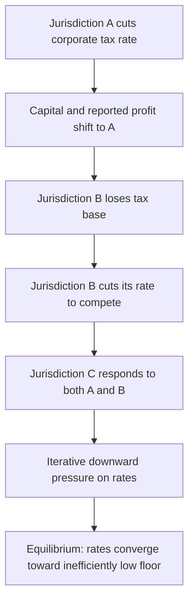

## Race-to-the-Bottom Hypothesis

### Overview

The race-to-the-bottom hypothesis is the prediction that uncoordinated tax competition among jurisdictions for mobile capital and corporate profit drives tax rates — and potentially regulatory standards more broadly — progressively downward over time, converging toward an inefficiently low equilibrium. While closely related to the general theory of tax competition, the race-to-the-bottom hypothesis specifically emphasizes the **dynamic, path-dependent** aspect of the phenomenon: a sequential or repeated process of mutual undercutting rather than a single static equilibrium calculation. This topic examines the hypothesis's theoretical basis, the empirical evidence for and against it, and the distinction between rate-based and standards-based races.

### Origins and Scope of the Hypothesis

**Key Points**

- The term "race to the bottom" originated in U.S. corporate law debates (notably associated with Justice Louis Brandeis's 1933 dissent criticizing competitive state chartering of corporations) before being extended to tax policy and regulatory competition more broadly
- In public economics, the hypothesis applies most directly to **capital and corporate income taxation**, since capital is the most mobile major tax base, but the logic has also been extended to environmental regulation, labor standards, and financial regulation — any domain where jurisdictions compete for mobile factors or activity by relaxing standards or reducing costs
- The core mechanism mirrors the static Zodrow-Mieszkowski tax competition model (see Tax Competition among Jurisdictions) but frames the outcome as an ongoing, potentially unstable **dynamic process** rather than a single Nash equilibrium calculation

### The Theoretical Mechanism

**Key Points**

- Each jurisdiction, acting individually rational, cuts its tax rate (or relaxes standards) to attract or retain mobile capital, anticipating that failing to do so will result in capital flight to lower-tax rivals
- Because every jurisdiction faces the same incentive simultaneously, one jurisdiction's cut triggers responsive cuts elsewhere, in a sequential or iterative process
- This is formally a **prisoner's dilemma**-structured game: each jurisdiction has a dominant strategy to undercut rivals given their current rates, but the resulting mutual undercutting leaves most or all jurisdictions worse off (less public goods revenue) than they would be under a cooperative, coordinated rate-setting arrangement
- The theoretical endpoint of an unconstrained race, in the starkest formal models, is a tax rate on the fully mobile factor approaching zero — jurisdictions instead relying more heavily on immobile factors (land, labor, consumption) to fund public goods

$$\tau_i^{t+1} = f(\tau_{-i}^{t}) \quad \text{with} \quad \frac{\partial f}{\partial \tau_{-i}} > 0$$

capturing the strategic complementarity: jurisdiction $i$'s tax rate in period $t+1$ responds positively to the tax rates $\tau_{-i}$ set by rival jurisdictions in period $t$, generating a downward-spiraling dynamic if rivals are simultaneously cutting.

### Distinguishing the Race-to-the-Bottom from Simple Tax Competition Equilibrium

**Key Points**

- Static tax competition models (Zodrow-Mieszkowski) predict a single inefficiently-low **equilibrium** rate reached once, based on each jurisdiction's best response to others — this is a snapshot outcome, not necessarily a continuously declining trend
- The race-to-the-bottom hypothesis additionally implies a **dynamic, historically observable downward trend** over time, often invoked to explain observed multi-decade declines in statutory corporate tax rates across countries
- [Inference] Whether observed rate declines represent movement toward a new, lower steady-state equilibrium (consistent with a "race" having occurred and settled) or an ongoing unstable dynamic (a race still in progress) is difficult to distinguish empirically without a long, stable post-decline period to observe, and reasonable interpretations differ across studies

### Empirical Evidence: The Rate-Revenue Puzzle

**Key Points**

- Statutory corporate tax rates across OECD countries have fallen substantially since the 1980s — a well-documented empirical trend broadly consistent with race-to-the-bottom predictions
- However, corporate tax **revenue as a share of GDP** in many OECD countries has remained relatively stable or even risen over the same period in various sub-periods — a pattern sometimes called the **"race to the bottom" paradox or puzzle**, since a pure race-to-the-bottom story would predict declining revenue alongside declining rates
- Proposed explanations for this apparent puzzle include: (1) **base broadening** — governments eliminated deductions, credits, and loopholes even as they cut headline rates, keeping effective tax rates more stable than statutory rates alone suggest; (2) rising corporate profitability and profit share of GDP over the period, which mechanically supports revenue even at lower rates; (3) increased incorporation (more economic activity organized in corporate form) expanding the base subject to CIT; (4) profit-shifting-driven concentration of reported profit in a few very profitable multinational sectors, which can sustain aggregate revenue figures even as competitive dynamics persist
- [Unverified] The relative contribution of each explanatory factor to the rate-revenue puzzle is not settled in the literature and likely varies by country and time period; current-year OECD revenue statistics should be consulted directly for up-to-date figures rather than assuming a stable historical pattern continues indefinitely

### Rate Competition vs. Base Competition

**Key Points**

- The race-to-the-bottom hypothesis, applied narrowly to statutory rates, may understate the true extent of competitive pressure if jurisdictions substitute **base-narrowing** measures (targeted incentives, accelerated depreciation, preferential regimes, tax holidays) for headline rate cuts
- This means observing stable statutory rates does not necessarily indicate an absence of a race — competition may simply have shifted margins from the visible statutory rate to less visible base provisions, effective tax rates, or negotiated firm-specific incentives
- Empirical assessment of the race-to-the-bottom hypothesis is therefore more reliably conducted using **effective tax rate** measures (METR/AETR — see Effects on Investment and the Cost of Capital) rather than statutory rates alone, since effective rates better capture the combined effect of rate and base changes

### The Leviathan Counter-Hypothesis

**Key Points**

- The Brennan-Buchanan "Leviathan" framework directly challenges the normative implication of the race-to-the-bottom hypothesis: if governments left unconstrained tend toward excessive taxation and inefficient spending (a revenue-maximizing rather than welfare-maximizing objective), then a "race to the bottom" in tax rates may actually represent a welfare-**improving** disciplining mechanism rather than a harmful erosion of public capacity
- Under this view, the normatively loaded term "race to the bottom" itself embeds an assumption (that pre-competition tax/spending levels were closer to optimal) that is not universally accepted
- [Inference] Empirical resolution of this normative disagreement would require assessing counterfactual government efficiency absent competitive constraint, which is inherently difficult to observe directly, making this largely a matter of theoretical and ideological disagreement about the appropriate baseline model of government behavior rather than a purely empirical question

### Race to the Bottom Beyond Statutory Rates: Regulatory and Standards Competition

**Key Points**

- The race-to-the-bottom logic has been extended in the broader public economics and political economy literature to non-tax domains: environmental regulation, labor and safety standards, financial regulation, and corporate governance rules, wherever jurisdictions compete for mobile capital or business location
- The strength of race-to-the-bottom dynamics in these non-tax domains is even more contested empirically than in the tax domain, since regulatory competitiveness effects are harder to isolate from other drivers of regulatory change (domestic political preferences, technological change, international agreements)
- [Unverified] This response focuses primarily on the tax competition application per the chapter context; claims about regulatory races-to-the-bottom in other domains involve a separate and distinct empirical literature not covered in depth here

### Policy Responses Motivated by the Hypothesis

**Key Points**

- **Global minimum tax (OECD Pillar Two, 15% floor)**: the most direct multilateral policy response explicitly designed to halt further downward rate competition by establishing a coordinated floor below which effective tax rates cannot fall without triggering top-up taxation in other jurisdictions
- **Tax base harmonization proposals** (e.g., EU CCCTB): address the "base competition" channel of the race by standardizing what counts as taxable profit, reducing the scope for competitive base-narrowing even where headline rates continue to vary
- **Enhanced transparency requirements** (Country-by-Country Reporting, public registries): while primarily targeted at profit shifting, transparency measures also constrain race-to-the-bottom dynamics by making preferential regimes and effective tax rate gaps more visible to other governments and the public, increasing political pressure against a "race"
- [Inference] The long-run effectiveness of the Pillar Two minimum tax floor at actually halting further downward competition depends on the robustness of its enforcement mechanisms (the Undertaxed Payments Rule backstop) and the degree of jurisdictional participation, both of which were still evolving as of the last verified information and should be checked against current implementation status

### Diagram: Rate Decline vs. Revenue Stability (Conceptual)

<svg xmlns="http://www.w3.org/2000/svg" viewBox="0 0 640 300">
<text x="320" y="24" font-size="15" text-anchor="middle" font-family="sans-serif" font-weight="bold">The Rate-Revenue Divergence (svg_diagram)</text>
<line x1="80" y1="250" x2="580" y2="250" stroke="#333" stroke-width="2" />
<line x1="80" y1="250" x2="80" y2="50" stroke="#333" stroke-width="2" />
<text x="330" y="280" font-size="12" text-anchor="middle" font-family="sans-serif">Time (decades)</text>
<path d="M 100 70 L 200 100 L 300 135 L 400 165 L 500 195" stroke="#8f2f2f" stroke-width="2" fill="none" />
<text x="530" y="200" font-size="11" font-family="sans-serif" fill="#8f2f2f">Statutory Rate</text>
<path d="M 100 190 L 200 185 L 300 195 L 400 180 L 500 188" stroke="#2f6f4f" stroke-width="2" fill="none" />
<text x="530" y="180" font-size="11" font-family="sans-serif" fill="#2f6f4f">Revenue/GDP</text>
</svg>

### Assessing the Hypothesis: Where the Evidence Stands

**Key Points**

- **Support**: consistent, multi-decade decline in statutory corporate rates across most economies; documented strategic complementarity in cross-jurisdiction tax reaction functions; substantial documented use of preferential regimes and targeted incentives consistent with active competitive behavior
- **Complication**: relative stability of corporate revenue-to-GDP ratios in many countries over the same period, attributable in part to base broadening, meaning the starkest "erosion of fiscal capacity" version of the hypothesis is not straightforwardly confirmed by aggregate revenue data alone
- **Synthesis**: most public finance economists treat the race-to-the-bottom hypothesis as **partially validated** — real and measurable downward pressure on capital/corporate tax rates driven by competitive dynamics, but tempered and partially offset by simultaneous base-broadening policy choices, rising corporate profitability, and revenue-protecting reforms, rather than the unconstrained "rates converge to zero" limiting case predicted by the starkest formal models

### Conclusion

The race-to-the-bottom hypothesis extends the static logic of tax competition into a dynamic, historically-grounded claim: that uncoordinated jurisdictions engaged in repeated strategic tax-rate setting will drive rates on mobile capital progressively downward, echoing a prisoner's-dilemma-style collective action failure. The empirical record offers partial support — clear statutory rate declines and documented strategic tax-setting behavior — complicated by relatively resilient corporate revenue-to-GDP ratios attributable to offsetting base-broadening reforms. The hypothesis remains central to the policy rationale behind the OECD's global minimum tax initiative, which represents the most direct multilateral attempt to halt further downward rate competition by establishing a coordinated effective tax rate floor.

**Related Topics**

- Tax Competition among Jurisdictions
- Corporate Tax Avoidance and Profit Shifting
- OECD Pillar Two and the Global Minimum Tax
- Effective Tax Rates: Marginal vs. Average (METR/AETR)
- The Leviathan Model of Government (Brennan-Buchanan)
- Base Broadening and Rate-Cutting Tax Reform Patterns
- Preferential Tax Regimes and Tax Holidays
- Formulary Apportionment as a Structural Alternative