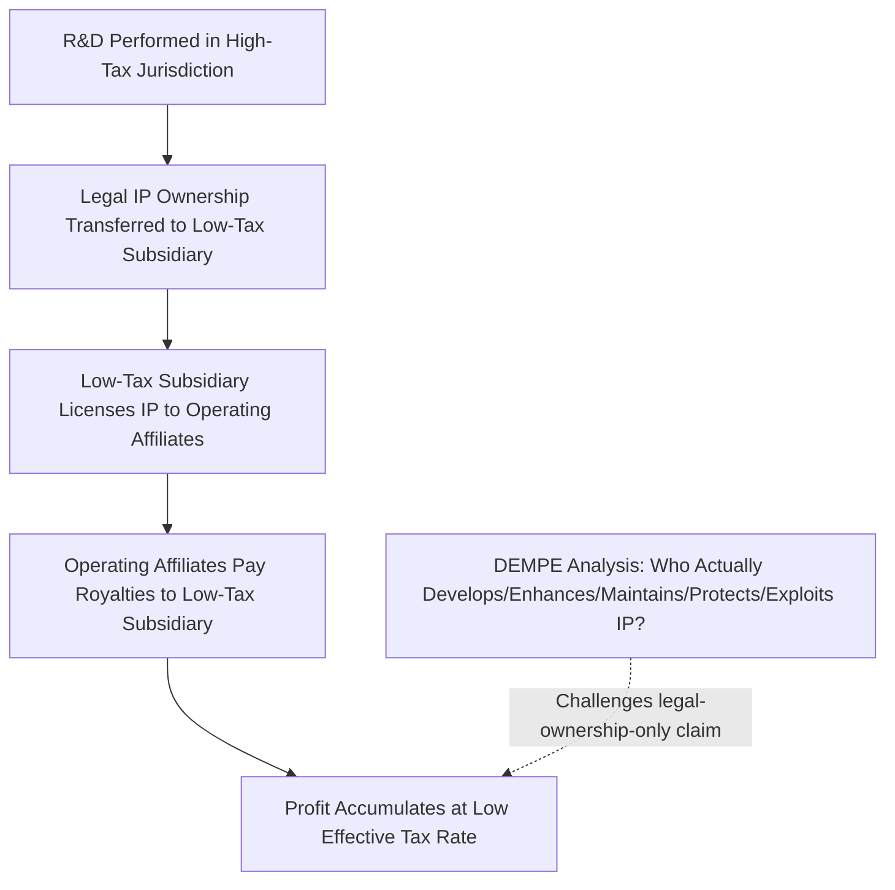

## Transfer Pricing and Profit Shifting

### Overview

Transfer pricing refers to the pricing of transactions between related entities within the same multinational corporate group — goods, services, intangible property, and intra-group financing. Because these prices are set internally rather than through arm's-length market negotiation, transfer pricing is the primary technical mechanism through which multinational enterprises (MNEs) can shift reported taxable profit between jurisdictions. This topic examines the regulatory framework governing transfer pricing (the arm's length principle and its methods), the specific channels through which mispricing enables profit shifting, and the structural challenges — particularly around intangibles — that make transfer pricing enforcement difficult.

### The Arm's Length Principle: Legal and Economic Foundation

**Key Points**

- The **arm's length principle (ALP)** requires that transactions between related entities (parent-subsidiary, sister companies within a group) be priced as if the parties were unrelated, independent entities negotiating under comparable market conditions
- Codified internationally in **Article 9 of the OECD Model Tax Convention** and implemented in domestic law by most countries, with detailed methodological guidance provided by the **OECD Transfer Pricing Guidelines**
- The economic rationale is straightforward: absent this requirement, a multinational group could freely allocate profit to whichever jurisdiction offers the lowest tax rate simply by setting internal prices arbitrarily, regardless of where real value is created
- The ALP's core practical difficulty is that it requires finding or constructing a **comparable** transaction between unrelated parties — a requirement that becomes progressively harder to satisfy as the transferred item becomes more unique (culminating in the especially difficult case of unique intangible assets)

### The Five Standard Transfer Pricing Methods

**Key Points**

- **Comparable Uncontrolled Price (CUP) method**: directly compares the price charged in the related-party transaction to the price charged in a comparable transaction between unrelated parties — the most direct method but requires a genuinely comparable market transaction to exist
- **Resale Price Method (RPM)**: works backward from the price at which a related-party-purchased good is resold to an independent third party, subtracting an appropriate gross margin to derive an arm's-length transfer price — commonly used for distribution functions
- **Cost Plus Method**: adds an appropriate markup to the costs incurred by the supplier in a related-party transaction — commonly used for contract manufacturing or routine service provision
- **Transactional Net Margin Method (TNMM)**: compares the net profit margin (relative to an appropriate base such as costs, sales, or assets) realized by the tested party to margins earned by comparable independent companies performing similar functions — widely used in practice because it is less sensitive to product-level comparability than CUP
- **Profit Split Method**: allocates combined profit from a related-party transaction between the parties based on the relative value of their contributions (functions performed, assets used, risks assumed) — typically reserved for cases involving unique, high-value contributions from multiple related parties that cannot be reliably benchmarked using one-sided methods

### The Functional Analysis: Functions, Assets, and Risks (FAR)

**Key Points**

- Transfer pricing method selection and application depend on a **functional analysis** — identifying which entity within the group performs which functions, owns which assets, and bears which risks (the "FAR analysis")
- Under arm's length logic, the entity bearing greater risk and contributing more valuable functions/assets is entitled to a greater share of the resulting profit
- This creates a structuring opportunity: MNEs can contractually allocate risk-bearing and asset ownership (particularly IP ownership) to a low-tax jurisdiction entity, even if the *operational* functions generating that risk are performed elsewhere — a strategy historically central to profit-shifting structures, and specifically targeted by the OECD BEPS Actions 8-10 revisions, which require that contractual risk allocation be supported by genuine **control over the risk** (decision-making capability and financial capacity to bear it), not merely paper allocation

### The Intangibles Problem

**Key Points**

- Intangible assets — patents, trademarks, proprietary algorithms, customer data, brand value, trade secrets — present the most acute transfer pricing challenge because, by definition, they are often **unique**, meaning no genuinely comparable arm's-length transaction exists to benchmark their value
- Valuation of unique intangibles typically requires income-based approaches (discounted cash flow projections of the future income attributable to the intangible), which involve substantial forecasting uncertainty and professional judgment, giving MNEs considerable latitude in setting internal royalty rates or buy-in payments for IP transfers
- The OECD's response, the **DEMPE framework** (Development, Enhancement, Maintenance, Protection, and Exploitation of intangibles), requires that entitlement to intangible-related returns be aligned with which entities actually perform the DEMPE functions — not simply which entity holds legal title to the IP — directly countering the strategy of relocating IP ownership to low-tax entities that perform none of the underlying value-creating functions

**Example**

A pharmaceutical company develops a drug patent through R&D conducted primarily in its home country, then transfers legal ownership of the patent to a subsidiary in a low-tax jurisdiction via an internal sale (a "buy-in" payment). The low-tax subsidiary subsequently licenses the patent back to operating affiliates worldwide, collecting royalty income taxed at a low rate. Under the DEMPE framework, tax authorities can challenge this structure if the low-tax subsidiary performed none of the actual development, enhancement, or protection functions — arguing that returns should instead flow to the jurisdiction where those functions genuinely occurred.

### Intra-Group Financing and Interest-Based Shifting

**Key Points**

- Beyond goods and IP, intra-group **loans** represent a major transfer pricing channel: interest rates on related-party debt must also satisfy the arm's length standard, but debt terms (interest rate, guarantee fees, thin-cap structuring) offer additional flexibility for shifting profit via deductible interest expense (see Debt-Equity Tax Bias)
- MNEs can concentrate debt in high-tax jurisdiction subsidiaries (maximizing deductible interest there) while directing the corresponding interest income to low-tax jurisdiction lending affiliates
- This channel is addressed both through transfer pricing rules (arm's length interest rate benchmarking) and separately through **interest limitation rules** (EBITDA-based caps under BEPS Action 4), representing a case where two distinct regulatory tools — transfer pricing and interest deductibility limits — jointly constrain the same underlying shifting channel

### Cost-Sharing and Contribution Arrangements

**Key Points**

- **Cost Contribution Arrangements (CCAs)**, sometimes called cost-sharing arrangements, allow related entities to jointly fund the development of an intangible (e.g., R&D) in exchange for a proportional share of the resulting rights
- If a low-tax jurisdiction entity contributes a disproportionately small share of actual R&D funding relative to the share of resulting IP rights and future royalty income it receives, this can function as a profit-shifting mechanism disguised as legitimate joint development
- OECD guidelines require that CCA participants' contributions be assessed at value (not just cost) and that the anticipated benefits be proportional to contributions, narrowing (though not eliminating) the scope for abuse

### Advance Pricing Agreements (APAs) and Dispute Resolution

**Key Points**

- **Advance Pricing Agreements (APAs)** allow an MNE to negotiate transfer pricing methodology with tax authorities in advance, providing certainty and reducing the risk of later disputes or double taxation — available as unilateral (one country), bilateral, or multilateral agreements
- Transfer pricing disputes between tax authorities of different countries (each potentially claiming taxing rights over the same profit) are addressed through **Mutual Agreement Procedures (MAP)** under tax treaties, and increasingly through mandatory binding arbitration clauses in updated treaties
- [Inference] The growing complexity and resource-intensity of transfer pricing enforcement — requiring specialized economic and legal expertise on both taxpayer and tax authority sides — creates asymmetric enforcement capacity between well-resourced tax administrations (in large, high-income countries) and lower-capacity administrations (often in developing countries), a concern raised repeatedly in the international tax policy literature regarding the distributional effects of the current transfer pricing regime

### Measuring Transfer-Pricing-Driven Profit Shifting

**Key Points**

- Empirical identification of transfer-pricing-driven profit shifting typically examines the sensitivity of reported affiliate profitability to statutory tax rate differentials within the same MNE group, controlling for real economic activity (employment, tangible assets, sales)
- **Country-by-Country Reporting (CbCR)**, introduced under BEPS Action 13, requires large MNEs (generally those above a consolidated revenue threshold, commonly €750 million) to report revenue, profit before tax, tax paid, employees, and tangible assets by jurisdiction — providing researchers and tax authorities with substantially improved data to detect misalignment between reported profit and real activity
- Studies using CbCR-style data and tax-rate-differential methodologies have documented disproportionately high reported profitability in low-tax jurisdictions relative to those jurisdictions' share of real economic indicators (employment, tangible capital) — a pattern broadly consistent with transfer-pricing-facilitated profit shifting
- [Unverified] Precise quantitative estimates of global transfer-pricing-driven profit shifting vary across studies depending on data source, time period, and methodology, and current-year estimates should be verified against recently published academic or OECD/IMF sources rather than treated as static figures

### Formulary Apportionment as a Structural Alternative

**Key Points**

- Given the persistent enforcement difficulty of the arm's length/transfer pricing system — particularly for intangibles — some economists and policymakers advocate **formulary apportionment** as a structural alternative: rather than pricing each transaction, a multinational's total consolidated global profit is apportioned across jurisdictions using a formula based on measurable factors like sales, payroll, and tangible assets in each location
- Formulary apportionment is already used **sub-nationally** in some federations (e.g., allocation of corporate income among U.S. states) and has been proposed at the international level (e.g., the EU's now-shelved Common Consolidated Corporate Tax Base, CCCTB, and its narrower successor proposals)
- Advantages: eliminates the need to price individual intangible-heavy transactions, reducing the scope for the specific abuse channels described above
- Disadvantages: introduces new manipulation incentives around the *apportionment formula's* input factors (e.g., strategic location of payroll or tangible assets to influence the formula outcome), and requires substantial international agreement on formula design and consolidated profit definition — a high coordination bar not yet achieved globally
- [Inference] The relative merits of formulary apportionment versus a reformed arm's length system remain a genuinely open policy design question in the international tax literature, with credible economists on both sides of the debate

### Diagram: Transfer Pricing Method Selection Logic

<svg xmlns="http://www.w3.org/2000/svg" viewBox="0 0 640 320">
<text x="320" y="24" font-size="15" text-anchor="middle" font-family="sans-serif" font-weight="bold">Transfer Pricing Method Selection (svg_diagram)</text>
<rect x="250" y="45" width="140" height="40" fill="#d8e8f0" stroke="#2f5f7f" stroke-width="2" />
<text x="320" y="70" font-size="12" text-anchor="middle" font-family="sans-serif">Comparable transaction exists?</text>
<line x1="320" y1="85" x2="150" y2="130" stroke="#333" stroke-width="1" />
<text x="200" y="105" font-size="10" font-family="sans-serif">Yes</text>
<rect x="80" y="130" width="140" height="35" fill="#a8d5ba" stroke="#2f6f4f" stroke-width="2" />
<text x="150" y="152" font-size="11" text-anchor="middle" font-family="sans-serif">CUP Method</text>
<line x1="320" y1="85" x2="490" y2="130" stroke="#333" stroke-width="1" />
<text x="440" y="105" font-size="10" font-family="sans-serif">No</text>
<rect x="420" y="130" width="140" height="35" fill="#f0d8a8" stroke="#8f6f2f" stroke-width="2" />
<text x="490" y="152" font-size="11" text-anchor="middle" font-family="sans-serif">Routine function?</text>
<line x1="490" y1="165" x2="350" y2="210" stroke="#333" stroke-width="1" />
<text x="400" y="188" font-size="10" font-family="sans-serif">Yes</text>
<rect x="280" y="210" width="150" height="35" fill="#a8d5ba" stroke="#2f6f4f" stroke-width="2" />
<text x="355" y="232" font-size="11" text-anchor="middle" font-family="sans-serif">Cost Plus / Resale Price / TNMM</text>
<line x1="490" y1="165" x2="560" y2="230" stroke="#333" stroke-width="1" />
<text x="555" y="200" font-size="10" font-family="sans-serif">No</text>
<rect x="470" y="230" width="150" height="55" fill="#e8a0a0" stroke="#8f2f2f" stroke-width="2" />
<text x="545" y="252" font-size="11" text-anchor="middle" font-family="sans-serif">Unique/high-value</text>
<text x="545" y="266" font-size="11" text-anchor="middle" font-family="sans-serif">contribution:</text>
<text x="545" y="280" font-size="11" text-anchor="middle" font-family="sans-serif">Profit Split Method</text>
</svg>

### Conclusion

Transfer pricing is the technical mechanism through which the arm's length principle governs — and, in practice, imperfectly constrains — the allocation of multinational profit across jurisdictions. While the standard transfer pricing methods (CUP, Resale Price, Cost Plus, TNMM, Profit Split) work reasonably well for routine, comparable transactions, they struggle fundamentally with unique intangible assets, where the absence of genuine market comparables gives MNEs substantial latitude in setting internal prices. The OECD's post-BEPS reforms — particularly the DEMPE framework for intangibles and enhanced risk-allocation scrutiny under Actions 8-10 — represent an attempt to realign transfer pricing outcomes with genuine economic substance rather than contractual or legal form alone. Persistent enforcement challenges, especially regarding intangibles and asymmetric tax administration capacity, continue to motivate structural alternative proposals like formulary apportionment, though international agreement on such alternatives remains elusive.

**Related Topics**

- Corporate Tax Avoidance and Profit Shifting
- Debt-Equity Tax Bias
- Tax Competition among Jurisdictions
- OECD BEPS Actions 8-10 and the DEMPE Framework
- Formulary Apportionment vs. Arm's Length Pricing
- Country-by-Country Reporting and Tax Transparency
- Advance Pricing Agreements and Mutual Agreement Procedures
- OECD Pillar One and Pillar Two Reforms