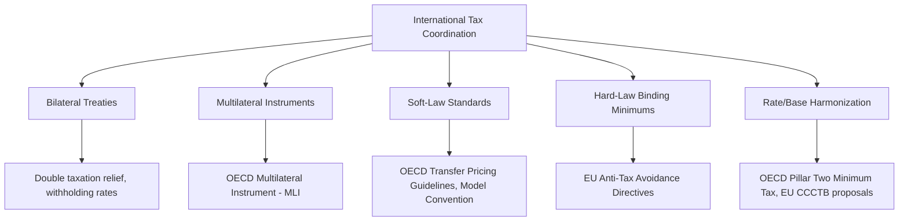

## International Tax Coordination

### Overview

International tax coordination refers to cooperative efforts among governments to jointly design, harmonize, or constrain tax rules across jurisdictions, in order to address the collective-action problems generated by uncoordinated tax competition and profit shifting. Where tax competition among jurisdictions predicts inefficiently low capital tax rates as an equilibrium outcome, and the race-to-the-bottom hypothesis frames this as a dynamic, self-reinforcing process, international tax coordination represents the policy response: institutional and legal mechanisms designed to internalize the fiscal externalities that individual jurisdictions cannot address unilaterally.

### The Economic Rationale for Coordination

**Key Points**

- Uncoordinated tax competition generates a **fiscal externality**: when jurisdiction A cuts its capital tax rate, it does not account for the cost imposed on jurisdiction B (lost tax base) or the benefit conferred on jurisdiction B if capital instead flows there — no individual jurisdiction internalizes the full welfare consequences of its unilateral choice
- This is structurally a **prisoner's dilemma**: individually rational unilateral action (undercutting rivals or tolerating profit shifting) produces a collectively worse outcome (underfunded public goods, eroded tax bases) than cooperative rate-setting or rule-harmonization would achieve
- Coordination is the standard economic remedy for externality problems generally — analogous to how environmental agreements address cross-border pollution externalities — applied here to the fiscal domain
- [Inference] The strength of the case for coordination depends on which theoretical view of tax competition one adopts: under the Zodrow-Mieszkowski "inefficiency" view, coordination straightforwardly improves welfare by correcting the externality; under the Brennan-Buchanan "Leviathan" view, coordination could instead remove a beneficial disciplining constraint on government size, making the welfare case for coordination genuinely contested rather than a settled conclusion

### Forms of International Tax Coordination

**Key Points**

- **Bilateral tax treaties**: agreements between two countries addressing double taxation, withholding tax rates, permanent establishment definitions, and dispute resolution — the oldest and most extensive form of coordination, with thousands of bilateral treaties in force globally, though each addresses only the relationship between two specific jurisdictions
- **Multilateral instruments**: agreements or frameworks binding many jurisdictions simultaneously, allowing more efficient and consistent rule-setting than a web of separate bilateral negotiations — exemplified by the OECD's **Multilateral Instrument (MLI)**, adopted under BEPS Action 15, which allowed signatory jurisdictions to amend numerous existing bilateral treaties simultaneously to incorporate BEPS-related provisions
- **Soft-law coordination (standards and guidelines)**: non-binding but widely adopted frameworks like the OECD Transfer Pricing Guidelines or the OECD Model Tax Convention, which achieve de facto coordination through voluntary adoption and peer pressure rather than binding legal obligation
- **Hard-law coordination (binding minimum standards)**: legally binding commitments to specific minimum rules, exemplified by the EU's Anti-Tax Avoidance Directives (ATAD I and II), which impose binding minimum anti-avoidance standards across EU member states
- **Rate/base coordination**: the most ambitious form, involving actual harmonization of tax rates or the tax base definition itself, exemplified by the OECD Pillar Two global minimum tax (rate floor coordination) and proposals like the EU's Common Consolidated Corporate Tax Base (base harmonization)

### The OECD/G20 as the Central Coordination Venue

**Key Points**

- The **OECD**, historically a club of higher-income economies, has become the de facto primary venue for international tax coordination, extended through the **OECD/G20 Inclusive Framework on BEPS**, which as of recent years includes well over 140 member jurisdictions, including many non-OECD developing economies
- This broadened membership structure was itself a coordination innovation: earlier OECD tax standard-setting was criticized for excluding developing countries from rule design despite those rules significantly affecting their revenue bases; the Inclusive Framework format sought to address this legitimacy gap
- The **G20** provides political-level endorsement and pressure, translating technical OECD proposals into commitments with higher-level political backing from major economies
- [Unverified] The practical influence and enforcement capacity of non-OECD-founding members within the Inclusive Framework's actual rule-design process, versus their formal inclusion, has been a subject of ongoing debate among international tax policy researchers and developing-country advocates

### The BEPS Project as a Coordination Case Study

**Key Points**

- The 2013-2015 **Base Erosion and Profit Shifting (BEPS)** Project (see Corporate Tax Avoidance and Profit Shifting) represents the most comprehensive coordination effort to date, producing a 15-action plan addressing interest deductibility, treaty abuse, transfer pricing, harmful preferential regimes, and transparency
- Coordination success varied by action: transparency measures (**Country-by-Country Reporting**, Action 13) achieved broad, relatively rapid adoption since compliance costs for adopting jurisdictions were modest and benefits (better information) were clear
- Substantive rate/rule harmonization actions faced more resistance, since they directly constrained jurisdictions' policy autonomy and revenue-raising flexibility — illustrating a general pattern in coordination efforts where transparency and procedural coordination advance faster than substantive rate or base harmonization

### Pillar Two and the Global Minimum Tax as Advanced Coordination

**Key Points**

- The OECD Pillar Two global minimum tax (15% floor) represents a qualitatively more ambitious coordination step than earlier BEPS measures, because it directly constrains the *rate* dimension of tax competition rather than only addressing profit-shifting techniques or transparency
- Its enforcement design uses an innovative "coordination without universal agreement" mechanism: the **Income Inclusion Rule (IIR)** allows a parent jurisdiction to top up tax on low-taxed foreign subsidiary income, while the **Undertaxed Payments Rule (UTPR)** acts as a backstop allowing other jurisdictions to deny deductions or impose equivalent charges if the low-tax jurisdiction and parent jurisdiction both fail to apply a top-up tax — meaning the minimum tax can partially "activate" even without full universal adoption, since adopting jurisdictions can effectively claim taxing rights over profit that non-adopting low-tax jurisdictions leave under-taxed
- This design directly addresses the classic coordination **free-rider problem**: a jurisdiction that refuses to adopt the minimum tax does not necessarily gain a competitive advantage, since other jurisdictions can claim the forgone tax revenue via the backstop mechanisms
- [Unverified] The practical effectiveness of this design at deterring free-riding, and the actual pace and scope of global implementation, involves fast-moving developments (including significant political contestation from some major economies) that should be verified against current OECD and national government sources rather than assumed settled

### Coordination Challenges: Sovereignty and Heterogeneous Interests

**Key Points**

- Tax policy is traditionally viewed as a core element of national fiscal sovereignty; jurisdictions are often reluctant to cede meaningful control over rate-setting or base definition to international bodies, even where coordination would be collectively beneficial
- **Heterogeneous interests** across jurisdiction types complicate coordination: capital-exporting, high-tax, large-market economies often favor coordination (protecting their tax base from erosion), while small, capital-importing, or low-tax jurisdictions may see coordination as directly threatening their comparative advantage in attracting mobile capital or reported profit
- Developing countries have distinct interests from high-income OECD members: many rely more heavily on withholding taxes and source-based taxation (since they host productive activity by foreign multinationals without commensurate residence-based taxing rights), giving them different priorities in coordination negotiations (e.g., stronger source-country taxing rights) than the historically residence-country-oriented OECD framework
- **Unilateral measures** (Digital Services Taxes, GILTI, diverted profits taxes) often emerge specifically *because* multilateral coordination is slow or incomplete — jurisdictions act unilaterally while negotiations continue, which can itself complicate eventual coordination by creating a patchwork of potentially inconsistent rules that a final multilateral agreement must reconcile or supersede

### The Free-Rider Problem in Coordination Design

**Key Points**

- Any coordination agreement with less than universal (100%) participation faces an inherent risk: non-participating jurisdictions can potentially capture disproportionate benefit by remaining outside the agreement while participating jurisdictions bear the cost of compliance
- Coordination mechanisms address this in different ways: **binding backstop rules** (as in Pillar Two's UTPR) attempt to neutralize free-riding by extending effective reach to non-participants' tax base; **peer review and reputational mechanisms** (used in earlier OECD harmful tax practices work) rely on naming/shaming non-compliant jurisdictions; **conditionality** (linking market access, aid, or other benefits to tax cooperation) has been used more selectively and controversially, particularly regarding developing-country jurisdictions

### Diagram: Coordination Depth Spectrum

<svg xmlns="http://www.w3.org/2000/svg" viewBox="0 0 640 260">
<text x="320" y="24" font-size="15" text-anchor="middle" font-family="sans-serif" font-weight="bold">Spectrum of Coordination Depth (svg_diagram)</text>
<line x1="60" y1="150" x2="580" y2="150" stroke="#333" stroke-width="2" />
<circle cx="60" cy="150" r="5" fill="#333" />
<circle cx="580" cy="150" r="5" fill="#333" />
<text x="60" y="175" font-size="11" text-anchor="middle" font-family="sans-serif">No Coordination</text>
<text x="60" y="190" font-size="10" text-anchor="middle" font-family="sans-serif">(Unilateral competition)</text>
<text x="580" y="175" font-size="11" text-anchor="middle" font-family="sans-serif">Full Harmonization</text>
<text x="580" y="190" font-size="10" text-anchor="middle" font-family="sans-serif">(Common rate &amp; base)</text>
<rect x="140" y="55" width="110" height="30" fill="#d8e8f0" stroke="#2f5f7f" />
<text x="195" y="75" font-size="10" text-anchor="middle" font-family="sans-serif">Bilateral Treaties</text>
<rect x="270" y="90" width="110" height="30" fill="#c8dcc8" stroke="#2f6f4f" />
<text x="325" y="110" font-size="10" text-anchor="middle" font-family="sans-serif">BEPS Transparency</text>
<rect x="400" y="55" width="110" height="30" fill="#f0d8a8" stroke="#8f6f2f" />
<text x="455" y="75" font-size="10" text-anchor="middle" font-family="sans-serif">Pillar Two Min. Tax</text>
</svg>

### Institutional Bodies Beyond the OECD

**Key Points**

- **United Nations Tax Committee**: an alternative, UN-based forum for international tax standard-setting, historically seen as more attentive to developing-country priorities (stronger source-based taxing rights) than the OECD-centered process; there have been ongoing discussions and negotiations about potentially expanding the UN's role in global tax rule-setting, including proposals for a UN framework convention on international tax cooperation
- **European Union**: functions as a supranational coordination body with binding legal authority (directives) among member states, going further than most global coordination mechanisms in enforceability, though EU tax coordination is itself constrained by the requirement of unanimity among member states for many tax-related decisions, which has historically slowed adoption of more ambitious harmonization proposals like the CCCTB
- **IMF and World Bank**: contribute technical assistance, capacity-building support (particularly for developing-country tax administrations), and economic analysis informing coordination debates, without direct rule-setting authority
- [Unverified] The relative institutional balance between OECD-centered and UN-centered international tax coordination has been an active and evolving area of international negotiation; current developments should be verified against recent reporting given the pace of institutional change in this space

### Assessing the Success of Coordination Efforts

**Key Points**

- **Transparency-focused coordination** (CbCR, automatic exchange of information, beneficial ownership registries) has achieved relatively broad and rapid multilateral adoption, reflecting lower compliance costs and clearer mutual benefit
- **Substantive rate/base coordination** (Pillar Two) represents a more ambitious and more contested coordination achievement, with broader initial political agreement but more variable and gradual actual implementation across jurisdictions
- **Structural alternatives** (formulary apportionment, full base harmonization via CCCTB-style proposals) remain largely aspirational at the global level, having achieved only sub-national or regional-bloc-level implementation to date
- [Inference] The overall trajectory of international tax coordination over the past decade suggests movement toward deeper cooperation is possible but proceeds unevenly across different coordination dimensions (transparency advancing faster than rate/base harmonization), and remains vulnerable to shifts in individual major economies' political positions, given the absence of any supranational tax authority with independent enforcement power comparable to domestic tax administrations

### Conclusion

International tax coordination addresses the fiscal externality problem inherent in uncoordinated tax competition, ranging from longstanding bilateral treaty networks through soft-law guidelines to the more ambitious rate-floor coordination embodied in the OECD's Pillar Two global minimum tax. The OECD/G20 Inclusive Framework has become the central (though not exclusive) venue for this coordination, achieving notably faster progress on transparency measures than on substantive rate or base harmonization, reflecting the deeper sovereignty and free-rider challenges inherent in constraining jurisdictions' core tax-setting autonomy. Continued heterogeneity of interests between high-tax/capital-exporting and low-tax/capital-importing jurisdictions, alongside unresolved institutional questions about the appropriate venue (OECD versus UN) for future rule-setting, ensures that international tax coordination remains an active and evolving area of policy development rather than a fully settled framework.

**Related Topics**

- Tax Competition among Jurisdictions
- Race-to-the-Bottom Hypothesis
- Transfer Pricing and Profit Shifting
- OECD BEPS Action Plan and the Multilateral Instrument
- OECD Pillar One and Pillar Two Reforms
- EU Anti-Tax Avoidance Directives and CCCTB
- UN Tax Committee and Developing-Country Tax Priorities
- Automatic Exchange of Information and Tax Transparency