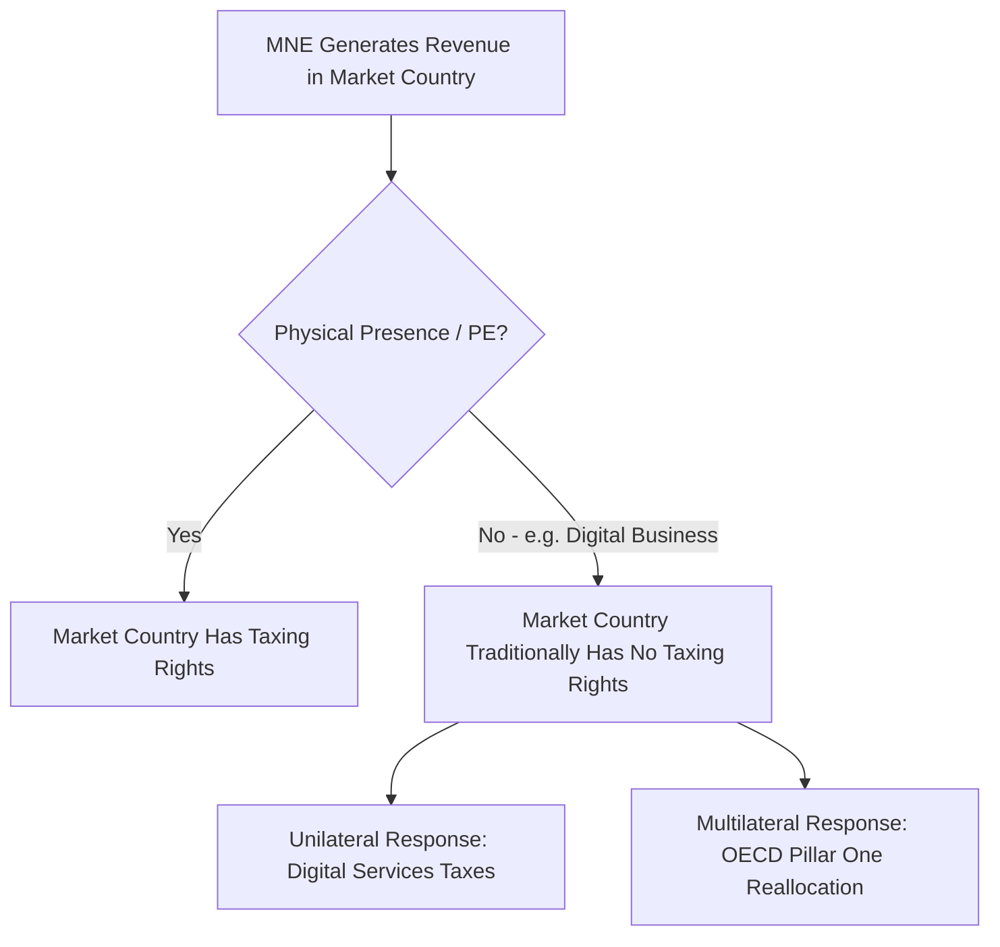

## Taxation of Multinational Enterprises

### Overview

The taxation of multinational enterprises (MNEs) addresses how tax jurisdiction, taxing rights, and tax liability are allocated when a corporate group operates across multiple countries. Because MNEs generate income through activities spanning several tax jurisdictions simultaneously, their taxation raises distinct conceptual and administrative challenges not present for purely domestic firms: determining which country has the right to tax which portion of income, preventing both double taxation and double non-taxation, and constraining the profit-shifting opportunities that cross-border structuring makes possible. This topic synthesizes the jurisdictional, structural, and reform dimensions of MNE taxation, connecting the transfer pricing, tax competition, and coordination material from earlier in this chapter.

### Residence-Based vs. Source-Based Taxation

**Key Points**

- **Residence-based (worldwide) taxation**: a jurisdiction taxes its resident corporations on their **global** income, regardless of where it was earned, typically with a credit or exemption mechanism for foreign taxes already paid to avoid double taxation
- **Source-based (territorial) taxation**: a jurisdiction taxes only income earned **within its borders**, regardless of the taxpayer's residence — foreign-source income of resident corporations is generally exempt
- Most countries today operate some hybrid: a broadly territorial system with targeted anti-deferral provisions (like Controlled Foreign Corporation rules or GILTI-style minimum taxes) to prevent the territorial exemption from becoming an unlimited profit-shifting incentive
- The historical shift among major economies (including the U.S. under the 2017 Tax Cuts and Jobs Act, which moved from a worldwide system with deferral toward a largely territorial system with minimum-tax backstops) reflects a broader international convergence toward territorial-leaning hybrid systems over the past several decades

### The Permanent Establishment Concept

**Key Points**

- Traditional international tax law grants a source country the right to tax an MNE's business profits only if the MNE has a **Permanent Establishment (PE)** there — a fixed place of business (office, factory, branch) or, under some treaty provisions, an agent habitually concluding contracts on the enterprise's behalf
- This concept, dating to early 20th-century international tax treaty design, presumes that meaningful economic presence requires physical presence — an assumption increasingly strained by digital and remote business models that can generate substantial local revenue (advertising, data monetization, platform transactions) without any physical footprint
- The PE threshold has become a central point of contention in modern international tax debates, since highly digitalized MNEs can legally avoid triggering PE status in market countries while still deriving significant revenue from users/consumers there — a core motivation behind both unilateral Digital Services Taxes and the OECD's Pillar One reform (see International Tax Coordination)

### The Separate Entity vs. Unitary Business Approaches

**Key Points**

- The dominant international framework treats each legal entity within an MNE group as a **separate taxpayer**, with cross-border transactions between related entities priced under the arm's length principle (see Transfer Pricing and Profit Shifting) — this is the approach embedded in OECD guidelines and most national tax laws
- An alternative, the **unitary business / formulary apportionment approach**, treats the MNE group as a single economic unit and apportions its consolidated global profit across jurisdictions using a formula (commonly based on sales, payroll, and assets) rather than pricing individual transactions — used sub-nationally among U.S. states and proposed (but not yet adopted) at the international level via the EU's CCCTB-style initiatives
- The separate entity approach is more consistent with each jurisdiction's legal sovereignty and existing treaty infrastructure but is more vulnerable to the transfer pricing manipulation challenges discussed elsewhere in this chapter; the unitary approach reduces transfer-pricing-specific manipulation but introduces new formula-design manipulation risks and requires a much higher degree of international coordination to implement consistently

### Double Taxation Relief Mechanisms

**Key Points**

- **Foreign Tax Credit (FTC)**: a residence-country mechanism allowing an MNE to credit taxes paid to a foreign (source) jurisdiction against its residence-country tax liability on the same income, up to the residence-country tax rate — prevents double taxation while preserving the residence country's right to top up tax on income taxed at a lower foreign rate
- **Participation exemption**: a source/territorial-style mechanism exempting foreign-source dividend or branch income from residence-country taxation entirely (rather than crediting foreign tax paid), typically conditioned on minimum ownership thresholds and anti-abuse rules
- **Tax treaties**: bilateral agreements that allocate taxing rights between residence and source countries for specific income categories (business profits, dividends, interest, royalties, capital gains) and typically reduce withholding tax rates on cross-border passive income flows between treaty partners
- [Inference] The choice between FTC-based worldwide systems and exemption-based territorial systems has historically been associated with different incentives regarding repatriation and the location of retained foreign earnings, though the practical significance of this distinction has been altered by more recent minimum-tax-style anti-deferral provisions layered on top of either base system

### Controlled Foreign Corporation (CFC) Rules and Minimum Taxes

**Key Points**

- **CFC rules** attribute certain categories of a foreign subsidiary's income (traditionally passive income like interest, royalties, and dividends, though scope has broadened in many jurisdictions) back to the domestic parent for current taxation, even without actual repatriation — designed to prevent indefinite deferral of tax on easily-shiftable passive income parked in low-tax foreign subsidiaries
- **GILTI (Global Intangible Low-Taxed Income)**, introduced by the U.S. 2017 Tax Cuts and Jobs Act, extends this logic to a broader base — taxing U.S. shareholders currently on their share of foreign subsidiaries' income exceeding a routine return on tangible assets, functioning as a unilateral minimum tax on foreign earnings that anticipated key features of the later multilateral Pillar Two design
- The OECD Pillar Two **Income Inclusion Rule (IIR)** generalizes this minimum-tax logic multilaterally: any parent jurisdiction can top up tax on a subsidiary's income taxed below the 15% global minimum rate, regardless of the income's character (not limited to traditionally "passive" categories as in older CFC rules)
- [Unverified] The interaction and potential overlap/duplication between GILTI and Pillar Two's IIR for U.S.-parented multinationals involves technical coordination questions that were still being resolved as of the last verified information and should be checked against current guidance

### Withholding Taxes on Cross-Border Payments

**Key Points**

- Source countries commonly impose **withholding taxes** on outbound payments of dividends, interest, and royalties to non-resident recipients, collected at the point of payment since the foreign recipient may otherwise be difficult for the source country to tax directly
- Bilateral tax treaties typically **reduce** withholding tax rates between treaty partners relative to domestic statutory withholding rates, creating an incentive for **treaty shopping**: routing payments through an intermediate jurisdiction with a favorable treaty network specifically to minimize withholding tax, even absent genuine business substance in that intermediate jurisdiction
- The OECD's **Principal Purpose Test (PPT)**, introduced under BEPS Action 6 and incorporated into many treaties via the Multilateral Instrument, denies treaty benefits where obtaining those benefits was one of the principal purposes of a given arrangement — a general anti-abuse rule specifically targeting treaty shopping

### Diagram: MNE Taxing Rights Allocation Framework

<svg xmlns="http://www.w3.org/2000/svg" viewBox="0 0 640 280">
<text x="320" y="24" font-size="15" text-anchor="middle" font-family="sans-serif" font-weight="bold">MNE Income Taxing Rights Allocation (svg_diagram)</text>
<rect x="60" y="60" width="200" height="60" fill="#d8e8f0" stroke="#2f5f7f" stroke-width="2" />
<text x="160" y="85" font-size="12" text-anchor="middle" font-family="sans-serif">Residence Country</text>
<text x="160" y="102" font-size="10" text-anchor="middle" font-family="sans-serif">(Worldwide/CFC/GILTI/IIR)</text>
<rect x="380" y="60" width="200" height="60" fill="#c8dcc8" stroke="#2f6f4f" stroke-width="2" />
<text x="480" y="85" font-size="12" text-anchor="middle" font-family="sans-serif">Source Country</text>
<text x="480" y="102" font-size="10" text-anchor="middle" font-family="sans-serif">(PE-based / Withholding)</text>
<rect x="220" y="180" width="200" height="60" fill="#f0d8a8" stroke="#8f6f2f" stroke-width="2" />
<text x="320" y="205" font-size="12" text-anchor="middle" font-family="sans-serif">Market Country</text>
<text x="320" y="222" font-size="10" text-anchor="middle" font-family="sans-serif">(New: Pillar One reallocation)</text>
<line x1="160" y1="120" x2="290" y2="180" stroke="#333" stroke-width="1" />
<line x1="480" y1="120" x2="350" y2="180" stroke="#333" stroke-width="1" />
<line x1="260" y1="90" x2="380" y2="90" stroke="#333" stroke-width="1" stroke-dasharray="4,3" />
<text x="320" y="80" font-size="9" text-anchor="middle" font-family="sans-serif">FTC / Exemption / Treaty</text>
</svg>

### Pillar One: Reallocating Taxing Rights to Market Jurisdictions

**Key Points**

- Pillar One directly addresses the PE limitation by creating a new taxing right for **market jurisdictions** — countries where an MNE's customers/users are located — even absent physical presence, applying to the largest and most profitable MNEs above defined revenue and profitability thresholds
- Mechanically, Pillar One (specifically its "Amount A" component) reallocates a portion of covered MNEs' **residual profit** (profit above a routine return threshold) to market jurisdictions based on a formula tied to local sales, representing a partial, targeted shift toward formulary-style allocation for a narrow set of very large, highly profitable multinationals, without abandoning the separate-entity/arm's-length system for the broader universe of MNEs
- [Unverified] As of the last verified information, Pillar One's implementation faced significant delays and unresolved political issues (including the treatment of existing unilateral Digital Services Taxes and required multilateral treaty ratification), and its current status should be verified against recent OECD reporting

### Firm Heterogeneity in MNE Tax Planning

**Key Points**

- Not all MNEs engage in profit shifting to the same degree: capacity for aggressive tax planning correlates with factors including intangible-asset intensity (firms with valuable, hard-to-value IP have more scope for transfer-pricing-based shifting), industry sector (technology and pharmaceutical firms are disproportionately represented in profit-shifting studies, reflecting their IP intensity), and firm size (larger firms can better absorb the fixed costs of sophisticated international tax planning and structuring)
- [Inference] This heterogeneity means that MNE tax policy targeting (e.g., minimum tax thresholds, Pillar One revenue thresholds) inherently involves distributional choices about which firms and sectors bear the compliance and tax burden of new rules, and threshold design has material practical consequences for how comprehensively new coordination measures actually address observed profit-shifting behavior across the full MNE population versus only the largest firms

### Compliance Burden and Administrative Complexity

**Key Points**

- MNE taxation compliance has grown substantially more complex following BEPS-era reforms: Country-by-Country Reporting, master file/local file transfer pricing documentation requirements, CFC rule compliance, GILTI/IIR calculations, and (where applicable) Pillar One/Two-specific computations layer on top of traditional corporate tax filing obligations
- [Inference] This growing compliance complexity likely creates disproportionate burden on mid-sized MNEs relative to the largest multinationals, which can more readily absorb specialized tax compliance costs as a smaller share of overall revenue — though systematic empirical quantification of this specific distributional compliance-cost effect is limited in the current literature
- Tax administrations, particularly in lower-capacity developing-country contexts, face corresponding challenges in building sufficient technical expertise to effectively audit and enforce increasingly complex MNE tax rules, a concern raised repeatedly in international tax policy discussions regarding the practical reach of coordination reforms

### Conclusion

The taxation of multinational enterprises requires resolving fundamental jurisdictional questions — which country has the right to tax which portion of cross-border income — through the interacting frameworks of residence/source taxation, the permanent establishment concept, and double-taxation relief mechanisms. The traditional separate-entity, arm's-length, PE-based system has faced mounting strain from digitalization (enabling substantial market-country revenue without physical presence) and from the profit-shifting opportunities inherent in cross-border related-party transactions. Contemporary reforms — CFC rules, GILTI-style minimum taxes, and especially the OECD's two-pillar solution — represent a substantial, if still incompletely implemented, restructuring of the international MNE tax framework, moving incrementally toward greater taxing rights for market jurisdictions and a coordinated minimum effective tax rate floor, while leaving the underlying separate-entity system largely intact for the broader universe of multinational firms below the largest-MNE thresholds targeted by the newest reforms.

**Related Topics**

- Transfer Pricing and Profit Shifting
- Tax Competition among Jurisdictions
- International Tax Coordination
- Permanent Establishment and Digital Business Models
- Controlled Foreign Corporation (CFC) Rules and GILTI
- OECD Pillar One: Market Jurisdiction Taxing Rights
- Formulary Apportionment vs. Separate Entity Accounting
- Digital Services Taxes and Unilateral Measures