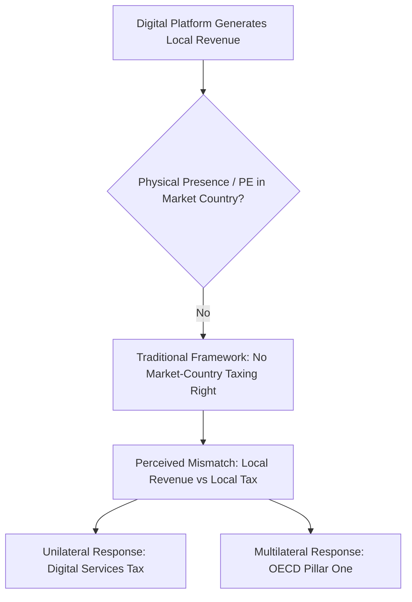
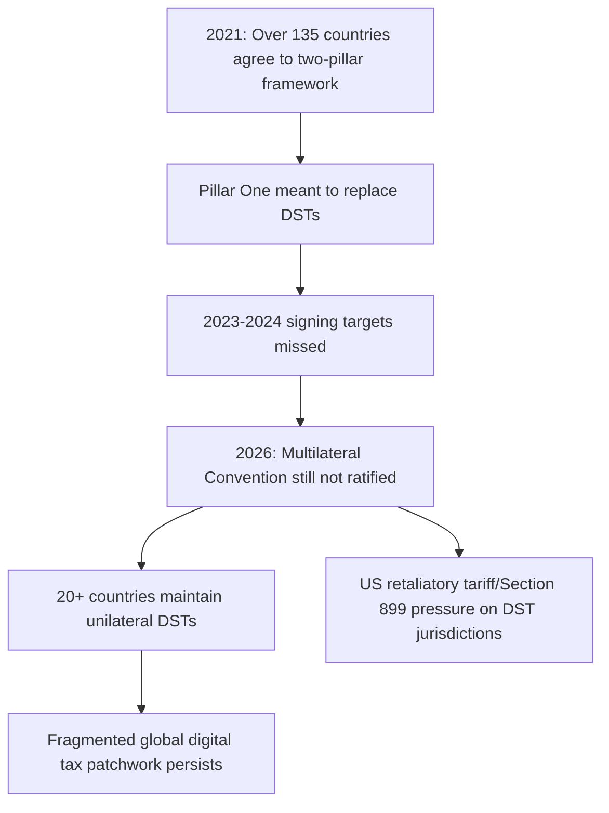

## Digital Economy Taxation

### Overview

Digital economy taxation addresses the distinct challenges that digitalized business models pose to traditional international tax frameworks — frameworks built around physical presence, tangible goods, and clearly located production. Highly digitalized firms (search and social media advertising platforms, online marketplaces, streaming and app-store services, data-driven businesses) can generate substantial revenue and user engagement in a market country while having little or no physical footprint there, straining the Permanent Establishment (PE) concept that traditionally determines source-country taxing rights (see Taxation of Multinational Enterprises). This topic covers the conceptual challenge, the primary policy responses — unilateral Digital Services Taxes (DSTs) and the multilateral OECD Pillar One reform — and the current, still-unresolved state of play between them.

### Why Digitalization Strains the Traditional Tax Framework

**Key Points**

- Traditional international tax law allocates business profit taxing rights to the source country only where the enterprise has a **Permanent Establishment** — a fixed place of business — reflecting an early-20th-century assumption that meaningful economic activity requires physical presence
- Digital business models can generate substantial local revenue through several channels without triggering PE status: targeted digital advertising sold to local audiences, online marketplace transactions between local buyers and sellers, subscription/streaming services consumed locally, and monetization of data generated by local users' activity
- A further conceptual challenge is **user-generated value**: for platforms with strong network effects (social media, search, marketplaces), user engagement and data itself contribute to the platform's value, raising the question of whether the *user's location*, not just physical assets or personnel, should ground a taxing right — a genuinely novel policy question without clean precedent in pre-digital international tax law
- [Inference] The degree to which "value creation" is meaningfully located at the user/market level, versus at the location of the underlying algorithm development, engineering, and intangible asset ownership, is itself a contested conceptual question underlying the broader digital tax policy debate, not a settled technical matter

### Digital Services Taxes (DSTs): Design and Rationale

**Key Points**

- A **DST** is a tax on selected **gross revenue** streams of large digital companies — typically digital advertising, online marketplace/intermediation revenue, and data sale/monetization — rather than a tax on profit
- Because it is revenue-based rather than profit-based, a DST sits **outside** the traditional corporate income tax system and typically outside the scope of bilateral tax treaty obligations, which is precisely why jurisdictions could implement DSTs unilaterally and relatively quickly compared to the slower multilateral negotiation process
- DSTs are typically applied at rates between roughly 1.5% and 7.5% on revenues from digital advertising, online marketplaces, and data monetization activities [Whtcalculator](https://whtcalculator.com/blog-digital-services-tax-2026)
- DSTs emerged in the 2018-2020 period specifically as a response to frustration with the slow pace of the OECD's Pillar One negotiations, functioning as interim, unilateral measures pending multilateral agreement [Whtcalculator](https://whtcalculator.com/blog-digital-services-tax-2026)
- Revenue thresholds are commonly used to ring-fence DSTs to the largest digital firms (both a global revenue threshold and a local in-country revenue threshold), which — combined with the concentration of large digital platforms in a small number of (primarily U.S.-headquartered) firms — has made DSTs politically contentious as perceived to disproportionately target American companies

**Example**

A DST applying a 3% rate to in-country digital advertising and marketplace revenue above a local threshold would tax a large platform's gross local ad revenue directly, regardless of whether that platform reports any profit in that jurisdiction under traditional transfer-pricing-based corporate tax rules — bypassing the PE and arm's-length framework entirely.

### The Trade Conflict Dimension

**Key Points**

- Because DSTs disproportionately affect large digital platforms concentrated among U.S.-headquartered firms, DSTs are perceived as discriminatory by the United States, which has responded with retaliatory tariff threats, urging countries to abandon their DSTs [Tax Foundation](https://taxfoundation.org/data/all/eu/digital-services-taxes-europe/)
- On February 21, 2025, a U.S. executive order titled "Defending American Companies and Innovators from Overseas Extortion and Unfair Fines and Penalties" designated digital service taxes as a target for retaliatory action [Tax Policy Center](https://taxpolicycenter.org/sites/default/files/2025-05/A-Primer-on-Digital-Service-Taxes-and-the-OECD's-Two-Pillars.pdf)
- The U.S. has deployed a retaliatory tool (Section 899 of subsequent domestic legislation) that reshapes the global DST landscape by threatening jurisdictions that impose taxes targeting American digital companies [Whtcalculator](https://whtcalculator.com/blog-digital-services-tax-2026)
- Under this pressure, Canada repealed its DST in June 2025, illustrating that DST policy has become entangled with broader bilateral trade and tariff dynamics rather than remaining a purely technical tax policy question [Whtcalculator](https://whtcalculator.com/blog-digital-services-tax-2026)
- [Unverified] The scope, triggers, and practical application of U.S. retaliatory measures against DST-imposing jurisdictions continue to evolve and should be verified against current government sources given the fast-moving and politically contested nature of this area

### OECD Pillar One: The Multilateral Alternative

**Key Points**

- Pillar One would allocate 25% of residual profits for large multinationals — defined as those with global revenues of $20 billion or more and profit margins over 10% — to be taxed by countries based on where customers are located, an amount referred to as "Amount A" [Congress.gov](https://www.congress.gov/crs-product/R47988)
- While Pillar One initially applied only to automated digital services and consumer-facing businesses, its scope was later broadened to apply to all business models, subject to certain exceptions — meaning Pillar One evolved from a digital-economy-specific fix into a broader reallocation mechanism for the largest, most profitable MNEs generally [Oecdpillars](https://oecdpillars.com/pillar_one/pillar-one-digital-service-taxes-2/)
- The Multilateral Convention to Implement Amount A of Pillar One coordinates a reallocation of taxing rights to market jurisdictions with respect to a share of the profits of the largest and most profitable multinational enterprises, improves tax certainty, and removes digital service taxes [OECD](https://www.oecd.org/en/topics/reallocation-of-taxing-rights-to-market-jurisdictions.html)
- A key part of Pillar One is the removal of existing DSTs and a commitment not to enact future DSTs or "relevant similar measures" that impose taxation based on market-based criteria, are ring-fenced to foreign and foreign-owned businesses, and sit outside the income tax system, though the Progress Report clarifies this removal requirement does not extend to value-added taxes, transaction taxes, or withholding taxes treated as covered taxes [Oecdpillars](https://oecdpillars.com/pillar_one/pillar-one-digital-service-taxes-2/)[Oecdpillars](https://oecdpillars.com/pillar_one/pillar-one-digital-service-taxes-2/)

### Current Status: Pillar One Stalled, DSTs Persist

**Key Points**

- As of August 2026, Pillar One remains unsigned, with successive signing deadlines missed; the mechanism was designed to reallocate approximately $200 billion in multinational profits to market jurisdictions annually, and the OECD had estimated it would generate $13 billion to $36 billion in additional global tax revenue per year, but the required Multilateral Convention has not been ratified [Consorata](https://www.consorata.ae/news/oecd-pillar-one-reallocation-stalls-as-digital-tax-patchwork-persists/)
- Targets for conclusion in 2023 and 2024 were both missed; several governments, including the United Kingdom, have revised their internal planning assumptions to 2027, while confirming their digital services taxes remain in operation in the interim [Consorata](https://www.consorata.ae/news/oecd-pillar-one-reallocation-stalls-as-digital-tax-patchwork-persists/)
- More than 20 countries now operate unilateral digital services taxes, with rates generally between 2% and 5% on gross revenues, creating parallel compliance obligations across differing calculation bases and documentation requirements for affected multinationals [Consorata](https://www.consorata.ae/news/oecd-pillar-one-reallocation-stalls-as-digital-tax-patchwork-persists/)
- Because Pillar One negotiations have failed to result in an agreement that would eliminate DSTs, roughly half of all European OECD countries have either announced, proposed, or implemented a DST, reflecting continued reliance on unilateral measures despite the nominal multilateral commitment to repeal them once Pillar One takes effect [Tax Foundation](https://taxfoundation.org/data/all/eu/digital-services-taxes-europe/)
- The DST landscape as of 2026 shows significant country-level variation: Canada's DST has been repealed, Belgium is introducing a new DST in 2027, and the EU is debating a unified bloc-wide digital levy as an alternative to fragmented national DSTs [Whtcalculator](https://whtcalculator.com/blog-digital-services-tax-2026)

### The U.S. Political Position

**Key Points**

- On January 20, 2025, a U.S. executive order titled "The Organization for Economic Co-operation and Development (OECD) Global Tax Deal" stated that any prior U.S. commitment to the OECD global tax agreements had no effect in the U.S. without action by Congress [Tax Policy Center](https://taxpolicycenter.org/sites/default/files/2025-05/A-Primer-on-Digital-Service-Taxes-and-the-OECD's-Two-Pillars.pdf)
- U.S. adoption of Pillar One would require Congress's approval, and since a large fraction of the profit affected by Amount A reallocation involves U.S.-headquartered multinationals, U.S. non-participation substantially undermines the practical viability of the multilateral agreement [Congress.gov](https://www.congress.gov/crs-product/R47988)
- By contrast, countries have been adopting Pillar Two's minimum tax provisions without requiring U.S. agreement, illustrating a divergence in implementation viability between the two pillars — Pillar Two can proceed more independently of U.S. participation than Pillar One's market-jurisdiction reallocation, which was designed around and depends heavily on capturing U.S. tech-sector profit [Congress.gov](https://www.congress.gov/crs-product/R47988)
- [Unverified] The evolving U.S. political position on both DSTs and Pillar One is subject to ongoing change and should be verified against current government and OECD sources given the pace of developments in this area

### Consequences of the Current Fragmented Equilibrium

**Key Points**

- **Compliance complexity**: the renewed momentum toward DSTs and expanded nexus rules targeting digital services increases business complexity, uncertainty, and operational costs for affected multinationals, who must navigate differing DST calculation bases, thresholds, and documentation requirements across jurisdictions rather than a single harmonized framework [EY](https://www.ey.com/en_gl/insights/tax/how-taxation-of-digital-services-is-again-a-concern-for-businesses)
- **Revenue effectiveness concerns**: some analysis suggests DSTs generate relatively little revenue, place the practical cost burden on domestic consumers rather than the large digital companies nominally targeted, and risk escalating trade disputes — raising a genuine question about whether unilateral DSTs achieve their stated policy objectives even where implemented [Tax Foundation](https://taxfoundation.org/research/all/eu/digital-services-taxes-eu-budget/)
- **Prolonged uncertainty**: the stalled state of Pillar One means multinationals face continued uncertainty about whether, when, or in what final form a multilateral resolution will arrive, complicating long-term tax planning and compliance system investment
- [Inference] The persistence of this fragmented equilibrium — DSTs neither fully repealed nor Pillar One fully implemented — illustrates the broader coordination challenges discussed in International Tax Coordination: transparency-oriented coordination measures have advanced relatively smoothly, while measures requiring the largest, most politically significant economies (particularly the U.S., given its concentration of affected firms) to cede taxing-right allocations have proven substantially harder to conclude

### Alternative and Complementary Approaches

**Key Points**

- **VAT/GST on digital services**: many jurisdictions have separately extended value-added tax or goods-and-services tax obligations to non-resident digital service providers (requiring foreign platforms to register and remit consumption tax on B2C digital sales) — this is a distinct, generally less contentious mechanism from DSTs, since it taxes consumption rather than profit or gross revenue, and is explicitly excluded from the DST-removal requirements under Pillar One's Progress Report [Oecdpillars](https://oecdpillars.com/pillar_one/pillar-one-digital-service-taxes-2/)
- **Expanded nexus rules**: some jurisdictions have proposed or implemented broader "significant economic presence" nexus tests for corporate tax purposes specifically, as either an alternative or complement to formal DST regimes
- **EU-level unified levy proposals**: the EU has been debating a bloc-wide unified digital levy as a coordinated alternative to the current fragmented patchwork of individual member-state DSTs, which would reduce compliance complexity for platforms operating EU-wide while still functioning outside the Pillar One framework unless and until Pillar One is ratified [Whtcalculator](https://whtcalculator.com/blog-digital-services-tax-2026)

### Diagram: Digital Tax Policy Options Compared

<svg xmlns="http://www.w3.org/2000/svg" viewBox="0 0 640 260">
<text x="320" y="24" font-size="15" text-anchor="middle" font-family="sans-serif" font-weight="bold">Digital Tax Approaches Compared (svg_diagram)</text>
<rect x="40" y="55" width="170" height="90" fill="#e8a0a0" stroke="#8f2f2f" stroke-width="2" />
<text x="125" y="80" font-size="12" text-anchor="middle" font-family="sans-serif" font-weight="bold">DST</text>
<text x="125" y="100" font-size="10" text-anchor="middle" font-family="sans-serif">Gross revenue tax</text>
<text x="125" y="115" font-size="10" text-anchor="middle" font-family="sans-serif">Unilateral, fast</text>
<text x="125" y="130" font-size="10" text-anchor="middle" font-family="sans-serif">Trade dispute risk</text>
<rect x="235" y="55" width="170" height="90" fill="#a8d5ba" stroke="#2f6f4f" stroke-width="2" />
<text x="320" y="80" font-size="12" text-anchor="middle" font-family="sans-serif" font-weight="bold">Pillar One</text>
<text x="320" y="100" font-size="10" text-anchor="middle" font-family="sans-serif">Profit reallocation</text>
<text x="320" y="115" font-size="10" text-anchor="middle" font-family="sans-serif">Multilateral, stalled</text>
<text x="320" y="130" font-size="10" text-anchor="middle" font-family="sans-serif">Needs treaty ratification</text>
<rect x="430" y="55" width="170" height="90" fill="#d8e8f0" stroke="#2f5f7f" stroke-width="2" />
<text x="515" y="80" font-size="12" text-anchor="middle" font-family="sans-serif" font-weight="bold">Digital VAT/GST</text>
<text x="515" y="100" font-size="10" text-anchor="middle" font-family="sans-serif">Consumption tax</text>
<text x="515" y="115" font-size="10" text-anchor="middle" font-family="sans-serif">Widely adopted</text>
<text x="515" y="130" font-size="10" text-anchor="middle" font-family="sans-serif">Less contentious</text>
</svg>

### Conclusion

Digital economy taxation exposes a structural mismatch between traditional Permanent-Establishment-based international tax law and business models that generate substantial market-country revenue without physical presence. The resulting policy response has bifurcated into unilateral Digital Services Taxes — fast to implement but revenue-based, trade-dispute-prone, and criticized as disproportionately targeting U.S. firms — and the OECD's multilateral Pillar One reform, which would reallocate a share of the largest MNEs' residual profit to market jurisdictions in exchange for DST repeal. As of the current period, Pillar One remains unratified after repeatedly missed deadlines, with U.S. political non-commitment a central obstacle, leaving more than twenty countries operating DSTs in an uneasy, unresolved parallel track alongside the stalled multilateral process. This produces a genuinely fragmented global compliance landscape for affected multinationals, with resolution timelines that have already slipped multiple years and remain uncertain.

**Related Topics**

- Taxation of Multinational Enterprises
- International Tax Coordination
- OECD Pillar One and Pillar Two Reforms
- Permanent Establishment and Nexus Rules
- Tax Competition among Jurisdictions
- VAT/GST Treatment of Cross-Border Digital Services
- U.S.–EU Trade and Tax Policy Disputes
- Formulary Apportionment as an Alternative to Arm's Length Pricing