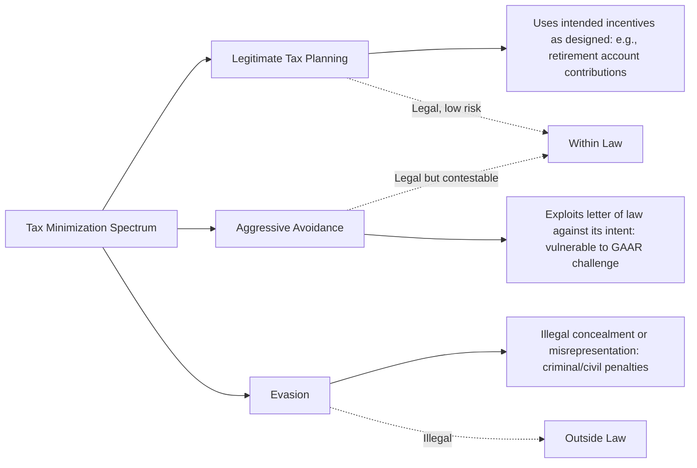

## Distinction between Evasion and Avoidance

### Overview

Tax evasion and tax avoidance are conceptually distinct responses to taxation that are frequently conflated in casual usage but rest on a fundamentally different legal and economic basis: **legality**. Tax evasion is illegal non-compliance involving concealment or misrepresentation of tax liability; tax avoidance is the legal arrangement of one's affairs to minimize tax liability within the boundaries of the law. This distinction is foundational to the study of tax administration and compliance, since evasion and avoidance call for entirely different policy responses — enforcement and detection for evasion, versus base design and anti-abuse rules for avoidance.

### Core Definitional Distinction

**Key Points**

- **Tax evasion**: illegal actions to reduce tax liability, typically involving concealment of income, falsification of records, underreporting of transactions, or outright non-filing — evasion violates the law as written and exposes the taxpayer to criminal or civil penalties if detected
- **Tax avoidance**: legal actions to reduce tax liability by arranging transactions, entities, or timing to take advantage of provisions in the tax code — even where the arrangement exploits the letter of the law in ways inconsistent with its underlying policy intent, it remains, by definition, within the bounds of legality
- The distinction is sometimes summarized as: evasion is what you do **outside** the law; avoidance is what you do **within** the law, however aggressively
- [Inference] This is a legal, not purely economic, distinction — the same underlying behavioral response to a tax incentive (reducing reported/taxable activity) can be either evasion or avoidance depending entirely on whether the specific method used complies with legal reporting and substance requirements, meaning classification requires legal analysis of the specific arrangement rather than economic analysis of its effect alone

### The Legal Boundary Is Not Always Sharp

**Key Points**

- While the evasion/avoidance distinction is conceptually clean (legal vs. illegal), the practical boundary in specific cases can be genuinely contested, particularly for aggressive avoidance arrangements that push against a jurisdiction's anti-abuse doctrines
- Many jurisdictions employ **General Anti-Avoidance Rules (GAARs)** or judicial doctrines (e.g., "substance over form," "economic substance," "business purpose" tests) that allow tax authorities to disregard or recharacterize arrangements that, while nominally compliant with specific statutory provisions, lack genuine economic substance or business purpose beyond tax reduction
- Arrangements successfully challenged under a GAAR or judicial anti-abuse doctrine are typically **not** reclassified as criminal evasion; rather, the tax benefit is denied and the transaction is treated according to its underlying economic substance, with the taxpayer generally facing back taxes and possibly civil penalties, but not criminal liability, absent separate concealment or fraud
- This creates a middle category sometimes called **"aggressive tax avoidance"** or **"abusive tax avoidance"** — arrangements within the letter of the law but vulnerable to being unwound under anti-abuse doctrine, distinct from both straightforward legitimate avoidance and criminal evasion

### Examples Illustrating the Distinction

**Key Points**

**Example**

Tax evasion: A self-employed contractor accepts cash payments and deliberately does not report this income on their tax return, or a business maintains a second set of falsified accounting records to understate revenue to tax authorities. Both involve active concealment of taxable activity that actually occurred, in direct violation of reporting requirements.

**Example**

Legitimate tax avoidance: An individual contributes to a tax-advantaged retirement savings account (e.g., a 401(k) or IRA in the U.S.) specifically because the tax code offers preferential treatment to encourage retirement savings — this is precisely the behavior the provision was designed to incentivize, and using it as intended is uncontroversial avoidance.

**Example**

Aggressive/contested avoidance: A multinational structures intra-group transactions and entity locations specifically to minimize global tax liability through transfer pricing and profit shifting techniques (see Transfer Pricing and Profit Shifting) that, while technically compliant with specific transfer pricing rules as applied, may be challenged under GAAR-type doctrines or targeted anti-avoidance provisions (like BEPS-inspired DEMPE requirements) if judged to lack genuine economic substance relative to their tax benefit.

### Economic Framing: The Compliance Cost and Detection Risk Distinction

**Key Points**

- From an economic modeling perspective, evasion and avoidance impose different cost structures on the taxpayer: evasion carries a **detection risk** (probability of audit/discovery) combined with a **penalty** if caught, following the classic Allingham-Sandmo (1972) framework of evasion as a gamble under uncertainty
- Avoidance, by contrast, carries **no detection/penalty risk in the traditional sense** (since it is legal), but instead involves **real resource costs** — the cost of structuring transactions, hiring tax advisors, and potentially accepting a suboptimal business structure purely for tax reasons (a form of the "excess burden" or deadweight loss associated with distortionary taxation)
- [Inference] This distinction matters for optimal tax policy: because evasion responds to detection probability and penalty severity while avoidance responds to the tax base's structural loopholes and the cost of exploiting them, effective evasion policy centers on enforcement and audit resources, while effective avoidance policy centers on base design, closing specific loopholes, and anti-abuse rules — conflating the two policy problems risks applying enforcement-style solutions to what is fundamentally a base-design problem, or vice versa

### The Allingham-Sandmo Framework for Evasion

**Key Points**

- The foundational economic model of tax evasion, developed by Allingham and Sandmo (1972), treats the decision to evade as a **portfolio choice under uncertainty**: the taxpayer weighs the certain gain from underreporting income against the probability-weighted cost of detection and penalty
- Core predictions include that evasion should increase with the tax rate (a higher rate raises the gain from evading, though the actual empirical/theoretical relationship is more nuanced due to risk-aversion effects), decrease with the probability of audit, and decrease with the severity of penalties if caught
- $$E[U] = (1-p) \cdot U(W - \tau \cdot D) + p \cdot U(W - \tau \cdot I - \pi \cdot (I - D))$$

  where $p$ is audit probability, $I$ is true income, $D$ is declared income, $\tau$ is the tax rate, and $\pi$ is the penalty rate on unreported income if caught, illustrating the expected-utility trade-off underlying the evasion decision
- [Unverified] The strict Allingham-Sandmo model has been noted in subsequent literature to under-predict observed real-world compliance rates relative to what pure expected-utility-maximizing behavior with realistic audit probabilities and penalties would suggest — this "compliance puzzle" has motivated substantial subsequent research incorporating norms, morale, and non-pecuniary compliance motivations, and should be treated as an area of continued academic development rather than a fully resolved empirical question

### Why the Distinction Matters for Policy Design

**Key Points**

- **Different policy levers apply**: reducing evasion primarily requires enforcement investment (audit rates, information reporting requirements, penalty design, third-party reporting/withholding systems); reducing (undesired) avoidance primarily requires legislative or regulatory base-design changes (closing specific loopholes, GAAR enactment, targeted anti-avoidance rules)
- **Different legal consequences**: evasion exposes taxpayers to criminal prosecution in serious cases, alongside civil penalties and interest; avoidance, even if successfully challenged and unwound, typically results in back taxes, interest, and civil penalties, but not criminal liability, absent an independent finding of fraud or concealment
- **Different revenue estimation approaches**: the **tax gap** (the difference between taxes theoretically owed and taxes actually collected) is typically decomposed into components attributable to non-filing, underreporting (evasion-related), underpayment, and separately, revenue loss attributable to legal avoidance and base erosion — requiring distinct estimation methodologies for each component
- **Different normative framing**: evasion is essentially universally condemned as a violation of tax law; avoidance occupies a normatively contested space, ranging from uncontroversial use of intended incentives to ethically criticized (though technically legal) aggressive structuring — this normative ambiguity is itself a distinguishing feature of avoidance that has no counterpart in the evasion category

### The Tax Gap: Decomposing Non-Compliance

**Key Points**

- Many tax administrations (e.g., the U.S. IRS, HMRC in the UK) publish **tax gap** estimates measuring the difference between total tax liability theoretically owed under the law and taxes voluntarily and timely paid
- The tax gap is typically decomposed into: the **non-filing gap** (taxpayers who fail to file required returns), the **underreporting gap** (taxpayers who file but understate income or overstate deductions — capturing most evasion), and the **underpayment gap** (taxpayers who file accurately but fail to remit the tax owed)
- Legal tax avoidance, by contrast, does **not** appear in traditional tax gap estimates at all, since avoidance is by definition compliant with the letter of the law — the revenue effect of avoidance is instead captured (if at all) through separate estimates of "tax expenditures" or base erosion, a conceptually distinct exercise from tax gap measurement
- [Inference] This measurement distinction reinforces the evasion/avoidance boundary at a practical administrative level: because tax gap methodology is specifically designed to measure deviations from legal compliance, it structurally cannot capture the revenue effects of legal avoidance, meaning policymakers must consult separate analytical frameworks (tax expenditure budgets, profit-shifting estimates) to assess avoidance's fiscal impact

### Diagram: Tax Gap Components vs. Avoidance

<svg xmlns="http://www.w3.org/2000/svg" viewBox="0 0 640 280">
<text x="320" y="24" font-size="15" text-anchor="middle" font-family="sans-serif" font-weight="bold">Tax Gap vs. Avoidance-Driven Revenue Loss (svg_diagram)</text>
<rect x="60" y="55" width="280" height="180" fill="none" stroke="#8f2f2f" stroke-width="2" stroke-dasharray="6,3" />
<text x="200" y="75" font-size="12" text-anchor="middle" font-family="sans-serif" font-weight="bold">Tax Gap (Illegal)</text>
<rect x="80" y="90" width="240" height="40" fill="#e8a0a0" stroke="#8f2f2f" />
<text x="200" y="114" font-size="11" text-anchor="middle" font-family="sans-serif">Non-Filing Gap</text>
<rect x="80" y="140" width="240" height="40" fill="#e8a0a0" stroke="#8f2f2f" />
<text x="200" y="164" font-size="11" text-anchor="middle" font-family="sans-serif">Underreporting Gap (Evasion)</text>
<rect x="80" y="190" width="240" height="40" fill="#e8a0a0" stroke="#8f2f2f" />
<text x="200" y="214" font-size="11" text-anchor="middle" font-family="sans-serif">Underpayment Gap</text>
<rect x="400" y="55" width="180" height="180" fill="none" stroke="#2f5f7f" stroke-width="2" stroke-dasharray="6,3" />
<text x="490" y="75" font-size="12" text-anchor="middle" font-family="sans-serif" font-weight="bold">Legal (Outside Tax Gap)</text>
<rect x="415" y="100" width="150" height="110" fill="#d8e8f0" stroke="#2f5f7f" />
<text x="490" y="150" font-size="11" text-anchor="middle" font-family="sans-serif">Avoidance-Driven</text>
<text x="490" y="165" font-size="11" text-anchor="middle" font-family="sans-serif">Revenue Loss</text>
<text x="490" y="180" font-size="11" text-anchor="middle" font-family="sans-serif">(Tax Expenditures /</text>
<text x="490" y="195" font-size="11" text-anchor="middle" font-family="sans-serif">Base Erosion Estimates)</text>
</svg>

### Overlap and Edge Cases

**Key Points**

- Some arrangements can involve **both** avoidance and evasion elements simultaneously: for example, a structure might be designed as a legal avoidance arrangement in form, but implemented with false supporting documentation or misrepresented facts, crossing into evasion for the misrepresented component even though the underlying structuring concept was avoidance-oriented
- **Money laundering and illicit financial flows** are sometimes discussed alongside tax evasion but are conceptually and legally distinct categories, typically involving proceeds of separate underlying criminal activity rather than tax-motivated concealment specifically, though overlap frequently occurs in practice
- [Inference] Because the evasion/avoidance line depends on specific factual and legal characterization rather than a clean economic bright line, real-world enforcement and dispute resolution frequently involves case-by-case administrative or judicial determination rather than mechanical rule application, particularly for the "aggressive avoidance" middle category

### Conclusion

The distinction between tax evasion and tax avoidance rests fundamentally on legality: evasion is illegal concealment or misrepresentation of tax liability, subject to criminal and civil penalties, while avoidance is the legal arrangement of affairs to minimize tax liability within the bounds of the law, ranging from straightforward use of intended tax incentives to aggressive structuring vulnerable to anti-abuse challenge. This distinction is not merely semantic — it determines which policy tools are appropriate (enforcement and detection for evasion; base design and anti-avoidance rules for avoidance), what legal consequences taxpayers face, and how revenue loss from non-compliance is measured and reported. While the conceptual boundary is clear, its practical application to specific aggressive arrangements often requires case-by-case legal analysis under GAAR-type doctrines, reflecting the genuine difficulty of translating a clean legal distinction into unambiguous real-world classification.

**Related Topics**

- The Allingham-Sandmo Model of Tax Evasion
- General Anti-Avoidance Rules (GAARs) and Substance-Over-Form Doctrines
- Tax Gap Measurement and Decomposition
- Corporate Tax Avoidance and Profit Shifting
- Tax Morale and Non-Pecuniary Compliance Motivations
- Audit Probability, Penalties, and Optimal Enforcement Design
- Information Reporting and Third-Party Withholding Systems
- Money Laundering vs. Tax Evasion: Legal Distinctions