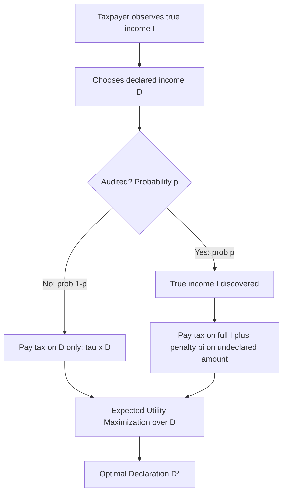
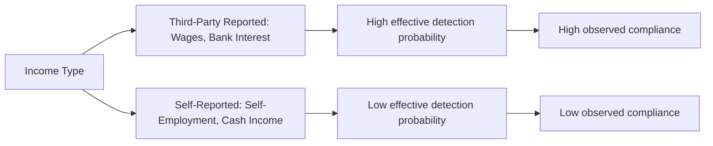

## Allingham-Sandmo Model of Tax Evasion

### Overview

The Allingham-Sandmo model, introduced by Michael Allingham and Agnar Sandmo in their 1972 paper "Income Tax Evasion: A Theoretical Analysis," is the foundational economic framework for analyzing tax evasion as a rational decision under uncertainty. It recasts the choice to evade as a portfolio problem analogous to gambling: the taxpayer weighs a certain gain from underreporting income against a probability-weighted risk of detection and penalty, modeled through standard expected utility theory. Despite significant subsequent refinements and critiques, the model remains the essential starting point for the theory of tax compliance and evasion in public economics.

### Model Setup

**Key Points**

- A risk-averse taxpayer has true income $I$, known only to themselves, and must decide how much income $D$ to declare to the tax authority, where $0 \leq D \leq I$
- The tax authority audits with a fixed, exogenous probability $p$, independent of the taxpayer's declaration
- If not audited (probability $1-p$), the taxpayer pays tax only on declared income $D$ at rate $\tau$
- If audited (probability $p$), the true income $I$ is discovered with certainty, and the taxpayer pays tax on the full true income $\tau I$, plus a penalty on the undeclared amount $(I - D)$ at penalty rate $\pi > \tau$ (the penalty rate exceeds the standard tax rate, or evasion would carry no meaningful deterrent even with certain detection)
- The taxpayer is assumed to be an **expected utility maximizer** with a concave (risk-averse) utility function $U(\cdot)$, reflecting diminishing marginal utility of income

### The Formal Decision Problem

**Key Points**

- The taxpayer's expected utility as a function of declared income $D$ is:

$$E[U(D)] = (1-p) \cdot U\big(I - \tau D\big) + p \cdot U\big(I - \tau D - \pi(I-D)\big)$$

- The first term captures the "not caught" state: final income equals true income minus tax paid on the declared amount
- The second term captures the "caught" state: final income equals true income minus tax paid on the declared amount minus the penalty applied to the undeclared amount
- The taxpayer chooses $D$ to maximize $E[U(D)]$, subject to $0 \leq D \leq I$

### First-Order Condition and Interior Solution

**Key Points**

- Differentiating with respect to $D$ and setting the derivative to zero yields the first-order condition:

$$(1-p)(-\tau) U'\big(I - \tau D\big) + p(\pi - \tau) U'\big(I - \tau D - \pi(I-D)\big) = 0$$

- Rearranging gives the classic condition characterizing the optimal declaration:

$$\frac{p(\pi - \tau)}{(1-p)\tau} = \frac{U'(\text{income if not caught})}{U'(\text{income if caught})}$$

- An **interior solution** (where $0 < D < I$, i.e., partial evasion) exists when the expected marginal benefit of evading a small amount of income exactly balances the expected marginal cost, weighted by the marginal utilities in each state
- A key structural result: whether the individual evades any income at all depends on comparing the **expected marginal return to evasion at $D = I$ (full declaration)** to zero — if $p\pi > (1-p)\tau \cdot 0$... more precisely, evasion occurs at the margin whenever $p \cdot \pi < \tau$ is false in the relevant sense; the standard condition for **any** evasion to be privately optimal is that the expected penalty-adjusted cost of evasion is less than the certain tax saved, i.e., $p\pi < \tau$ is the condition under which even risk-neutral behavior would evade fully, while risk aversion moderates this toward partial evasion for a range of parameters

### Comparative Statics: Core Theoretical Predictions

**Key Points**

- **Effect of audit probability ($p$)**: an increase in audit probability unambiguously **increases** declared income (reduces evasion) — a higher chance of detection raises the expected cost of evading, a straightforward and intuitively robust result
- **Effect of penalty rate ($\pi$)**: an increase in the penalty rate similarly **increases** declared income (reduces evasion), for analogous reasons — higher penalties raise the expected cost of being caught evading
- **Effect of the tax rate ($\tau$) — the theoretically ambiguous result**: the model's most famous and counterintuitive prediction is that the effect of a **higher tax rate on evasion is theoretically ambiguous**, depending on the taxpayer's degree of relative risk aversion
  - A higher tax rate mechanically increases the gain from evading a given amount of income (a **substitution effect** favoring more evasion)
  - But a higher tax rate also reduces income in **both** the audited and non-audited states, and under decreasing absolute risk aversion (a standard assumption), lower income makes the individual more risk-averse at the margin, which can **reduce** the amount of evasion undertaken (an **income effect** favoring less evasion)
  - The net effect on the evaded amount depends on which effect dominates, which in turn depends on the specific form of the utility function and the taxpayer's risk-aversion characteristics
- [Inference] This ambiguous tax-rate result is one of the most discussed features of the model precisely because it runs counter to the common intuition that "higher taxes cause more evasion" — the model shows this intuition is not a logical necessity under expected utility maximization with risk aversion, though it also does not rule out a positive relationship for plausible utility function specifications

### The Yitzhaki (1974) Extension

**Key Points**

- Shlomo Yitzhaki's 1974 extension modified the penalty structure: instead of penalizing the undeclared **amount** of income $(I-D)$, the penalty is applied to the **evaded tax** itself, i.e., $\pi \cdot \tau (I - D)$ rather than $\pi(I-D)$ — more closely matching how many real-world tax penalty systems are actually structured (as a multiple of unpaid tax, rather than a rate on unreported income)
- Under this alternative penalty specification, Yitzhaki showed that the **ambiguous tax-rate effect disappears**: with the penalty proportional to evaded tax, a higher statutory tax rate **unambiguously increases** declared income (reduces evasion), because the substitution effect vanishes when both the "gain" and the "penalty" scale proportionally with the tax rate, leaving only the (evasion-reducing) income/risk-aversion effect
- This result is important because it demonstrates that the ambiguous tax-rate prediction of the original Allingham-Sandmo model is **sensitive to the specific penalty structure assumed**, not a robust general feature of rational evasion behavior under uncertainty — a key methodological lesson about the model's sensitivity to functional form assumptions

### Strengths of the Framework

**Key Points**

- Provides a rigorous, tractable, first-principles framework grounding evasion behavior in standard expected utility maximization, making it analytically comparable to other economic decisions under uncertainty (insurance purchase, portfolio choice)
- Generates clear, testable comparative-static predictions regarding audit probability and penalty severity, both of which have received considerable empirical support in subsequent research (higher audit rates and penalties are generally associated with reduced evasion)
- Establishes a rigorous foundation for subsequent optimal enforcement literature, informing how tax administrations should allocate scarce audit resources and set penalty schedules to deter evasion cost-effectively

### The Empirical "Compliance Puzzle"

**Key Points**

- A persistent and widely discussed critique of the Allingham-Sandmo framework is that it substantially **under-predicts observed real-world tax compliance**: using realistic (typically quite low) audit probabilities and penalty rates observed in actual tax systems, the model predicts far more evasion than is actually observed among real taxpayers, particularly among those with income subject to third-party information reporting
- This gap between predicted and observed compliance is often called the **"compliance puzzle"** or "evasion puzzle" in the tax compliance literature
- [Unverified] The magnitude of this puzzle (how much compliance the model under-predicts relative to observed behavior) varies across studies and depends heavily on assumed risk-aversion parameters and audit probability estimates, so specific quantitative claims about the size of the puzzle should be sourced from current empirical studies rather than treated as a single fixed benchmark
- Proposed explanations for the puzzle, developed in subsequent literature, include: **tax morale** (intrinsic motivation to comply beyond pure deterrence, potentially linked to perceived fairness, social norms, or civic duty), **overestimation of audit probability** by taxpayers (behavioral deviation from the model's assumed correct probability assessment), **third-party information reporting** (which the basic model does not incorporate, but which dramatically reduces the feasibility of evasion for income subject to withholding or employer/bank reporting, such as wages), **social/psychological costs of evading** beyond the pure financial penalty (guilt, stigma, reputational risk), and **prospect theory-based behavioral models** replacing expected utility maximization with reference-dependent, loss-averse decision-making

### Information Reporting as a Key Real-World Extension

**Key Points**

- The basic Allingham-Sandmo model treats audit probability $p$ as exogenous and fixed, independent of the type of income involved — but real-world compliance research has demonstrated that **information reporting** (third-party reporting of income to tax authorities, e.g., employer wage reporting, bank interest reporting) dramatically affects the *effective* detection probability for specific income types
- Income subject to substantial third-party reporting and/or withholding (wages, salaries) exhibits very high compliance rates in practice, while income with limited third-party verification (self-employment income, cash transactions, informal sector activity) exhibits substantially lower compliance — a pattern well-documented in tax gap studies (see Distinction between Evasion and Avoidance)
- This empirical regularity is broadly consistent with an *extended* Allingham-Sandmo-style framework where effective detection probability $p$ varies systematically by income type/reporting environment, even though the original 1972 model treated $p$ as a single fixed parameter

### Behavioral and Social Extensions Beyond the Core Model

**Key Points**

- **Tax morale models**: incorporate a direct utility cost or benefit from compliance/evasion itself (beyond the pecuniary consequences), often linked to perceived government legitimacy, fairness of the tax system, and reciprocity norms (willingness to comply conditional on believing others comply and that public goods are being fairly funded)
- **Social interaction and peer effects**: evasion decisions may depend on perceived or observed evasion by peers, creating potential multiple equilibria (high-compliance and low-compliance social norms) not captured in the individual-decision-maker Allingham-Sandmo framework
- **Prospect theory applications**: replace expected utility maximization with reference-dependent preferences (gains and losses evaluated relative to a reference point, typically with loss aversion and probability weighting), which can generate different predictions regarding response to audit probability changes, particularly for low-probability, high-stakes audit scenarios where standard expected utility and prospect theory can diverge substantially in their predictions
- [Inference] These behavioral and social extensions are generally understood as complements to, rather than wholesale replacements for, the core Allingham-Sandmo deterrence logic — most contemporary compliance research treats detection/penalty-based deterrence and intrinsic/social compliance motivations as jointly operative rather than mutually exclusive explanations for observed behavior

### Policy Implications for Enforcement Design

**Key Points**

- The model's core comparative statics directly inform tax administration resource allocation: since both audit probability and penalty severity reduce evasion, administrations face a policy choice between investing more heavily in audit coverage (higher $p$, but costly to administer) versus stiffer penalties (higher $\pi$, cheaper to implement but subject to potential proportionality and political-acceptability constraints)
- Because penalties are administratively far cheaper to raise than audit rates (which require costly personnel and investigation resources), a naive reading of the model might suggest heavy reliance on severe penalties with minimal audit investment — but this conclusion is complicated by risk-aversion considerations (extremely severe, rarely-enforced penalties may be viewed as unfair or disproportionate, undermining tax morale) and by the reality that credible deterrence requires taxpayers to believe detection is genuinely possible, which requires some minimum observable audit activity
- [Inference] The practical balance between audit investment and penalty severity in real tax administrations reflects a combination of the Allingham-Sandmo cost-effectiveness logic and separate considerations around perceived fairness, legal/constitutional constraints on penalty severity, and the broader tax-morale effects of an enforcement regime perceived as excessively punitive relative to detection likelihood

### Conclusion

The Allingham-Sandmo model provides the foundational rational-choice framework for understanding tax evasion as a decision under uncertainty, analogous to a risky gamble between the certain gain of underreporting and the probability-weighted cost of detection and penalty. Its clearest and most robust predictions — that higher audit probability and higher penalties both reduce evasion — have proven durable and empirically influential for enforcement policy design. Its most famous and debated prediction — the theoretically ambiguous effect of the tax rate itself on evasion — turns out to be sensitive to the specific penalty structure assumed, as demonstrated by Yitzhaki's extension. The model's most significant empirical limitation is its substantial under-prediction of real-world compliance relative to observed audit probabilities and penalties, a gap that has motivated a substantial subsequent literature incorporating information reporting, tax morale, social norms, and behavioral economics into the study of tax compliance.

**Related Topics**

- Distinction between Evasion and Avoidance
- Tax Gap Measurement and Decomposition
- Tax Morale and Non-Pecuniary Compliance Motivations
- Yitzhaki's Penalty Structure Extension
- Information Reporting and Third-Party Withholding Systems
- Optimal Audit Probability and Enforcement Resource Allocation
- Prospect Theory Applications to Tax Compliance
- Risk Aversion and Decision-Making Under Uncertainty