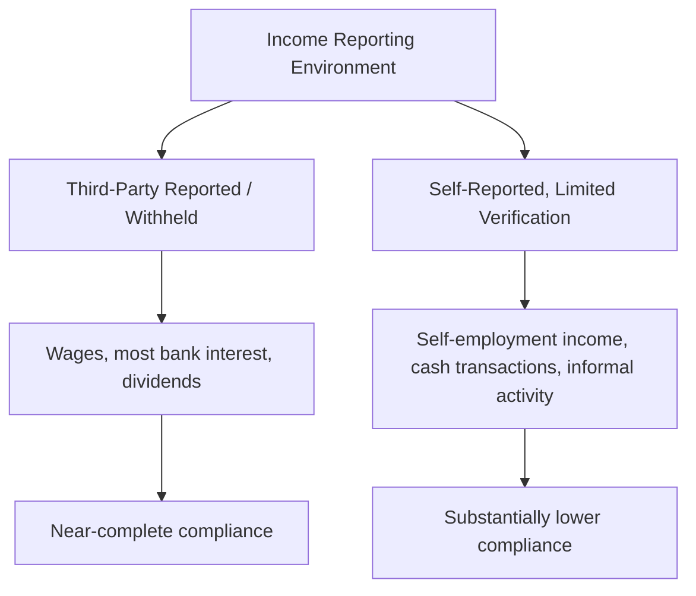
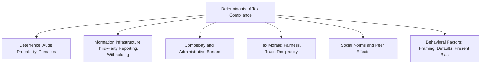

## Determinants of Tax Compliance

### Overview

Determinants of tax compliance encompass the full range of factors — economic, institutional, social, and psychological — that influence whether taxpayers accurately report and pay taxes owed. While the Allingham-Sandmo model provides the foundational deterrence-based framework (audit probability and penalties), decades of subsequent theoretical and empirical research have established that compliance is shaped by a substantially broader set of forces, including information reporting infrastructure, tax morale, social norms, perceived fairness, administrative complexity, and behavioral factors. This topic synthesizes these determinants into a comprehensive framework.

### Deterrence-Based Determinants

**Key Points**

- **Audit probability**: the perceived (not necessarily actual) likelihood of being audited is a core deterrence variable — higher perceived audit probability increases compliance, consistent with the core Allingham-Sandmo prediction (see Allingham-Sandmo Model of Tax Evasion)
- **Penalty severity**: higher penalties for detected non-compliance increase compliance, though extremely severe penalties relative to detection likelihood can also undermine perceived system fairness and legitimacy, potentially eroding intrinsic compliance motivation
- **Detection technology and data-matching capability**: tax administrations' actual capacity to detect non-compliance (through data analytics, cross-referencing third-party information, international information exchange) affects the *credibility* of audit probability, independent of the formal audit rate itself — a taxpayer's subjective belief about detection risk depends on more than the raw statistical audit rate
- [Inference] Deterrence-based determinants map most directly onto easily observed and verified income; their effectiveness is substantially weaker for income categories where actual detection capability is genuinely low, regardless of stated audit rates or penalty schedules, which is why deterrence-based determinants interact closely with the information-reporting determinants discussed next

### Information Reporting and Withholding Infrastructure

**Key Points**

- **Third-party information reporting**: when a party other than the taxpayer (an employer, bank, or platform) reports income directly to the tax authority, taxpayer compliance rises dramatically, since misreporting requires collusion or successful concealment from an independent verifying source rather than simple self-report manipulation
- **Withholding at source**: where tax is deducted before income reaches the taxpayer (as with most wage income in many countries), compliance becomes close to automatic, since the taxpayer never has physical control over the untaxed portion
- This produces one of the most robust empirical regularities in tax compliance research: **compliance rates vary dramatically by income visibility/reporting environment**, with third-party-reported and withheld income (wages, salaries, most investment income with reporting requirements) showing near-complete compliance, and self-reported income with limited third-party verification (self-employment income, cash-based business income, informal sector activity, some capital gains) showing substantially lower compliance
- [Unverified] Precise compliance rate figures by income category vary by country, time period, and measurement methodology (tax gap studies, randomized audit studies); current-period figures should be sourced from up-to-date tax administration or academic publications rather than treated as fixed universal constants

### Complexity and Administrative Burden

**Key Points**

- **Tax code complexity**: more complex tax rules increase both unintentional non-compliance (errors) and opportunities for deliberate aggressive interpretation, since ambiguous or highly technical provisions create more room for taxpayer discretion in application
- **Compliance costs**: the time, effort, and financial cost of filing accurately (record-keeping, professional preparation fees, navigating forms) can itself discourage full and timely compliance, particularly for lower-income and small-business taxpayers with limited resources to absorb these costs
- **Pre-filled returns and simplified filing systems**: administrative innovations that reduce the taxpayer's active reporting burden (e.g., government-prepared returns using already-reported third-party data, simplified filing regimes for straightforward cases) have been associated with improved compliance and reduced unintentional errors in jurisdictions that have implemented them
- [Inference] Complexity-related non-compliance is conceptually distinct from strategic evasion, since it may reflect taxpayer error or confusion rather than a deliberate cost-benefit evasion decision, suggesting that compliance-improving interventions targeting complexity (simplification, pre-filling, taxpayer assistance) operate through a different behavioral channel than deterrence-based interventions (audits, penalties)

### Tax Morale and Intrinsic Motivation

**Key Points**

- **Tax morale** refers to the intrinsic motivation to pay taxes, independent of deterrence considerations — encompassing civic duty, social norms, and internalized obligation to contribute to public goods
- Empirical tax morale research (often using survey-based measures alongside behavioral data) consistently finds substantial variation in stated tax morale across individuals, countries, and over time, and that measured tax morale correlates with observed or self-reported compliance behavior, even after controlling for deterrence variables
- Tax morale is theorized to be shaped by several sub-factors, discussed individually below: perceived fairness of the tax system, trust in government and public institutions, quality of public goods/services received in exchange for taxes paid, and social/peer norms around compliance
- [Unverified] While tax morale is widely believed in the literature to be causally related to compliance behavior (not merely correlated), establishing clean causal identification is methodologically challenging since tax morale itself may be partly endogenous to compliance behavior and enforcement experience, and the compliance literature continues to refine causal identification strategies in this area

### Perceived Fairness and Procedural Justice

**Key Points**

- **Distributive fairness**: perceptions of whether the tax burden is fairly distributed across income groups affect willingness to comply — taxpayers who believe the system disproportionately burdens or favors certain groups may exhibit lower voluntary compliance
- **Procedural fairness**: perceptions of whether tax administration procedures (audit selection, appeals processes, taxpayer treatment) are conducted fairly and respectfully independently affect compliance, distinct from the substantive fairness of tax rates or burden distribution — this connects to the broader "procedural justice" literature in behavioral public administration
- **Reciprocity and the fiscal exchange framework**: compliance is theorized to be higher when taxpayers perceive a clear, fair exchange between taxes paid and public goods/services received — the "fiscal exchange" or "tax-benefit link" hypothesis, sometimes summarized as taxpayers being more willing to comply when they see tangible value from government spending
- **Horizontal equity concerns**: perceptions that similarly-situated taxpayers are treated similarly (versus perceptions that some taxpayers, particularly wealthy individuals or large corporations, can access avoidance opportunities unavailable to ordinary taxpayers) can affect broader compliance norms, connecting to public perceptions of corporate tax avoidance discussed elsewhere in this course

### Trust in Government and Institutional Quality

**Key Points**

- Cross-country and within-country studies generally find that **higher trust in government** institutions correlates with higher tax compliance and tax morale, consistent with the reciprocity/fiscal-exchange logic above
- **Institutional quality** more broadly — perceived corruption levels, rule of law, government effectiveness, quality of public service delivery — is similarly associated with compliance levels in cross-country comparative studies, though establishing the direction of causality (does low institutional quality reduce compliance, does low compliance undermine institutional capacity, or do both result from a common underlying factor) remains a genuine identification challenge in this literature
- [Inference] Given the plausible bidirectional relationship between institutional quality and tax compliance (weak institutions may both cause and result from widespread non-compliance), this determinant is best understood as part of a broader self-reinforcing system rather than a simple one-directional causal factor, complicating straightforward policy prescriptions based solely on this correlation

### Social Norms and Peer Effects

**Key Points**

- Individual compliance decisions are influenced by **perceived compliance behavior of peers and the broader community** — if taxpayers believe evasion is widespread and socially accepted, this can reduce their own compliance (a descriptive social norm effect), independent of any change in actual audit probability or penalties
- Experimental and field studies using randomized informational interventions (e.g., informing taxpayers about actual local compliance rates or peer compliance behavior) have been used to test these social norm effects directly, generally finding some behavioral response to norm-based messaging, though effect sizes vary by study design and context
- This creates potential for **multiple equilibria** in aggregate compliance: a community or society could plausibly settle into either a high-compliance equilibrium (where the norm of compliance is self-reinforcing) or a low-compliance equilibrium (where widespread evasion is normalized and individually rational given the perceived low cost of non-conformity), a dynamic not captured in individual-decision-maker models like the basic Allingham-Sandmo framework

### Behavioral Economics Determinants

**Key Points**

- **Default effects and framing**: how tax obligations, refunds, or payment options are presented (framed as gains vs. losses, default enrollment vs. opt-in choices) has been shown in behavioral tax research to affect compliance-related behaviors, consistent with broader behavioral economics findings on the power of defaults and framing
- **Salience**: taxes that are less visible or salient at the point of transaction (e.g., taxes embedded in withholding or automatically deducted, versus taxes requiring an active, visible payment) may generate different compliance and even different real economic responses, connecting to the broader "tax salience" literature in behavioral public finance
- **Present bias and procrastination**: behavioral factors affecting timely filing and payment (as distinct from accuracy of reported amounts) — taxpayers exhibiting present bias may be more likely to file late or underpay due to procrastination rather than deliberate evasion, a distinct compliance margin from accuracy-based evasion
- **Loss aversion and reference-dependent preferences**: some research applies prospect-theory-style reference dependence to compliance decisions, for example finding that taxpayers expecting a refund (framed as a "gain" if compliant) may behave differently than those expecting to owe additional tax (framed as a "loss"), though the robustness and generalizability of specific findings in this sub-literature varies by study

### Taxpayer Characteristics and Heterogeneity

**Key Points**

- **Income level and source**: compliance varies systematically by income source (as discussed under information reporting) and, in some studies, by income level, though findings on the income-level relationship are more mixed and context-dependent than the income-source relationship
- **Firm size and sophistication**: larger firms and higher-income individuals often have greater access to sophisticated tax planning and avoidance strategies (see Corporate Tax Avoidance and Profit Shifting), which may substitute for outright evasion — meaning observed low evasion rates among large firms may partly reflect substitution toward legal avoidance rather than higher intrinsic compliance
- **Small business and self-employed taxpayers**: this group faces a distinct compliance profile, combining lower third-party information reporting (more self-reported income), often greater complexity in applicable rules (business expense deductions, depreciation), and potentially different risk tolerance and financial literacy characteristics compared to wage-earning taxpayers
- [Inference] Because compliance determinants operate differently across taxpayer types (large corporations substituting toward avoidance, small businesses facing information-reporting gaps, wage earners facing near-automatic compliance via withholding), aggregate compliance statistics can mask substantial heterogeneity, and effective compliance policy likely requires segment-specific rather than uniform approaches

### Policy Levers Mapped to Determinants

**Key Points**

- **Deterrence determinants** → policy levers: risk-based audit selection, penalty schedule design, visible enforcement communication
- **Information/reporting determinants** → policy levers: expanding third-party reporting requirements, withholding expansion, data-matching and analytics investment, international automatic exchange of information for cross-border income
- **Complexity determinants** → policy levers: tax simplification, pre-filled returns, taxpayer education and assistance services
- **Tax morale/fairness determinants** → policy levers: transparency about public spending and tax use, procedural justice improvements in audit and appeals processes, addressing perceived avoidance by high-income/corporate taxpayers to preserve broader compliance norms
- **Social norm determinants** → policy levers: normative messaging campaigns, peer-comparison information interventions (though evidence on effect size and durability is mixed)
- **Behavioral determinants** → policy levers: choice architecture and default design in filing systems, salience-conscious payment/refund structuring, reminders and simplified deadlines to address present-bias-driven late filing

### Diagram: Integrated Compliance Determinants Model

<svg xmlns="http://www.w3.org/2000/svg" viewBox="0 0 640 320">
<text x="320" y="24" font-size="15" text-anchor="middle" font-family="sans-serif" font-weight="bold">Integrated Model of Compliance Determinants (svg_diagram)</text>
<circle cx="320" cy="170" r="60" fill="#f0d8a8" stroke="#8f6f2f" stroke-width="2" />
<text x="320" y="165" font-size="12" text-anchor="middle" font-family="sans-serif" font-weight="bold">Compliance</text>
<text x="320" y="180" font-size="12" text-anchor="middle" font-family="sans-serif" font-weight="bold">Decision</text>
<rect x="30" y="50" width="140" height="45" fill="#e8a0a0" stroke="#8f2f2f" stroke-width="2" />
<text x="100" y="77" font-size="11" text-anchor="middle" font-family="sans-serif">Deterrence (p, penalty)</text>
<rect x="30" y="240" width="140" height="45" fill="#d8e8f0" stroke="#2f5f7f" stroke-width="2" />
<text x="100" y="267" font-size="11" text-anchor="middle" font-family="sans-serif">Information Reporting</text>
<rect x="470" y="50" width="140" height="45" fill="#a8d5ba" stroke="#2f6f4f" stroke-width="2" />
<text x="540" y="77" font-size="11" text-anchor="middle" font-family="sans-serif">Tax Morale / Fairness</text>
<rect x="470" y="240" width="140" height="45" fill="#c8b8e0" stroke="#5f2f7f" stroke-width="2" />
<text x="540" y="267" font-size="11" text-anchor="middle" font-family="sans-serif">Social Norms</text>
<line x1="170" y1="72" x2="270" y2="140" stroke="#333" stroke-width="1" />
<line x1="170" y1="262" x2="270" y2="200" stroke="#333" stroke-width="1" />
<line x1="470" y1="72" x2="370" y2="140" stroke="#333" stroke-width="1" />
<line x1="470" y1="262" x2="370" y2="200" stroke="#333" stroke-width="1" />
</svg>

### Conclusion

Tax compliance is determined by a multidimensional set of factors extending well beyond the deterrence variables (audit probability, penalty severity) emphasized in the foundational Allingham-Sandmo framework. Information reporting infrastructure and withholding systems function as perhaps the single most powerful practical determinant, dramatically raising compliance for verifiable income sources. Tax morale, shaped by perceived fairness, trust in government, and reciprocity between taxes paid and public goods received, provides an intrinsic compliance motivation operating alongside pure deterrence. Complexity, administrative burden, social norms, and behavioral factors (framing, defaults, present bias) round out a comprehensive determinants framework, with significant heterogeneity across taxpayer types (wage earners, self-employed individuals, large corporations) in which determinants matter most. Effective compliance policy accordingly requires a portfolio of interventions matched to the specific determinant and taxpayer segment being addressed, rather than reliance on deterrence-based enforcement alone.

**Related Topics**

- Allingham-Sandmo Model of Tax Evasion
- Distinction between Evasion and Avoidance
- Tax Gap Measurement and Decomposition
- Information Reporting and Third-Party Withholding Systems
- Behavioral Public Finance and Tax Salience
- Procedural Justice in Tax Administration
- Automatic Exchange of Information (International Compliance)
- Small Business and Self-Employment Tax Compliance