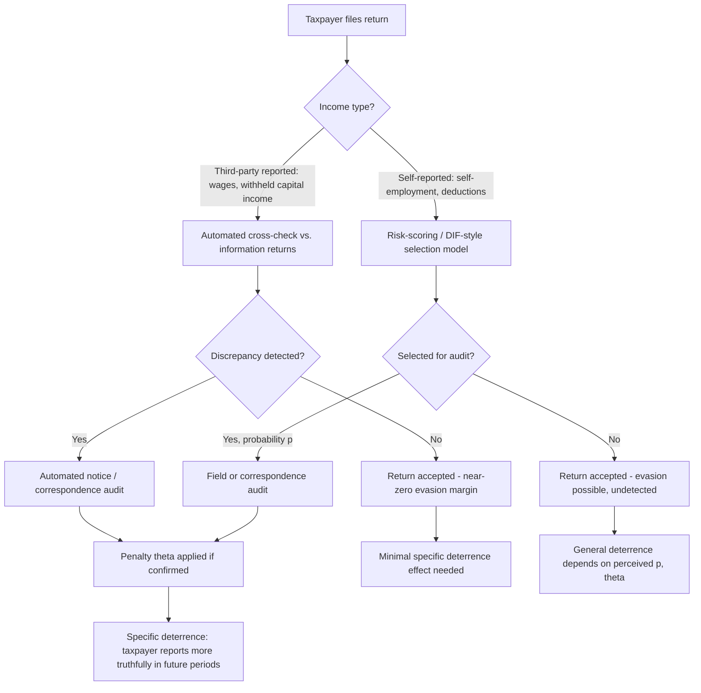

## Enforcement, Audits, and Third-Party Reporting

### Overview and Conceptual Framework

Tax enforcement encompasses the set of institutional mechanisms — audits, information reporting, penalties, and detection technology — that governments deploy to induce compliance with declared tax liabilities. The economic study of enforcement departs from a purely legal view of tax administration by treating compliance as a decision problem under uncertainty, where taxpayers weigh the expected benefits of underreporting against the expected costs of detection and punishment.

Three enforcement instruments dominate the literature and practice:

- **Audits**: ex-post verification of a taxpayer's self-reported liability, with a probability of selection $p$ and a resulting penalty if noncompliance is found
- **Third-party (information) reporting**: ex-ante verification whereby a party other than the taxpayer (employer, bank, broker) reports income or transactions directly to the tax authority
- **Withholding**: a special case of third-party reporting in which tax is remitted at the source of income rather than self-assessed

These instruments are complements, not substitutes, in practice — audits are used to enforce compliance precisely where third-party reporting is absent or weak, and the effectiveness of audits depends on the information environment that third-party reporting creates.

### The Allingham-Sandmo Model of Tax Evasion

The canonical starting point is the Allingham-Sandmo (1972) portfolio-choice model, which frames evasion as a gamble under expected utility maximization.

A taxpayer with true income $W$ chooses declared income $X \leq W$ to maximize:

$$EU = (1-p) \, U(W - tX) + p \, U(W - tX - \theta t(W - X))$$

where:

- $t$ is the tax rate
- $p$ is the audit probability
- $\theta$ is the penalty multiplier applied to evaded tax if caught ($\theta > 1$)
- $U(\cdot)$ is a concave (risk-averse) utility function

**Key Points**

- The first-order condition yields a standard result: evasion increases when $p$ or $\theta$ falls, and decreases when either rises, holding the other fixed
- A puzzling comparative static: the model predicts that a higher tax rate $t$ has an *ambiguous* effect on evasion — a pure substitution effect (higher $t$ raises the marginal payoff to evasion) competes with an income effect (higher $t$ lowers after-tax income, and if absolute risk aversion is decreasing, this raises the marginal utility cost of risk-bearing, discouraging evasion)
- Under **decreasing absolute risk aversion (DARA)**, Yitzhaki (1974) showed that if the penalty $\theta$ is applied to the *evaded tax* (rather than evaded income), the substitution effect vanishes and a higher tax rate unambiguously *reduces* evasion — a counterintuitive result that has generated substantial empirical scrutiny
- The model's central empirical failure is that observed compliance rates are far higher than the model predicts given realistic (low, roughly 1-3%) audit probabilities and (moderate) penalty multipliers — this is the "tax compliance puzzle," motivating extensions involving morale, social norms, and non-expected-utility preferences

**Example**

Consider $t = 0.30$, $p = 0.02$, $\theta = 2$ (a 200% penalty on evaded tax), and risk-neutral utility. The expected cost per dollar evaded is $p \cdot \theta \cdot t = 0.02 \times 2 \times 0.30 = 0.012$, far below the marginal benefit of evasion, $t = 0.30$. A risk-neutral or mildly risk-averse taxpayer under this pure deterrence calculus should evade fully — yet observed evasion among wage earners subject to withholding is close to zero, illustrating the gap between the model's prediction and reality.

### Detection Technology and the Enforcement Production Function

Enforcement is not a single lever but a production process converting government resources into detected noncompliance. The **detection probability** $p$ is itself endogenous to:

- Audit selection algorithms (risk-scoring models, DIF scores in the U.S. context)
- The intensity/scope of the audit (correspondence audit vs. field audit)
- The **information environment** — how much third-party-verifiable data exists against which self-reports can be cross-checked

This last point is central to modern enforcement economics: audits are far more effective, dollar-for-dollar, when they can be targeted using information reports, transforming enforcement from *random deterrence* to *near-certain detection* for reportable income categories.

### Third-Party Reporting: The Kleven et al. Framework

The most influential modern contribution is Kleven, Knudsen, Kreiner, Pedersen, and Saez (2011), based on a randomized tax enforcement field experiment in Denmark. The paper's central conceptual contribution is decomposing income into two categories:

$$\text{Total Income} = \underbrace{\text{Self-reported income}}_{\text{no third-party verification}} + \underbrace{\text{Third-party-reported income}}_{\text{pre-populated, verified}}$$

**Key Points**

- For **third-party-reported income** (wages, most capital income, mortgage interest), evasion is close to zero *regardless of audit probability or penalty severity*, because misreporting is trivially detected by a simple cross-check — the taxpayer effectively cannot lie
- For **self-reported income** (self-employment income, certain deductions), evasion is substantial and *responsive* to audit probability, consistent with the Allingham-Sandmo framework
- This implies compliance is not primarily a function of a taxpayer's risk preferences or moral character, but of the **information structure** the tax authority has access to — evasion is a technology-and-institutions problem as much as a behavioral one
- The Danish experiment found that increasing the audit probability had a *specific deterrence effect* (audited taxpayers report more truthfully afterward) but limited *general deterrence effect* on taxpayers who merely learned audits were more likely, except where self-reported income was large

**Illustration: Compliance by Income Verifiability (svg_diagram)**

<svg xmlns="http://www.w3.org/2000/svg" viewBox="0 0 720 360">
<text x="360" y="25" font-size="16" font-weight="bold" text-anchor="middle" fill="#1a1a1a">Evasion Rate by Reporting Category (svg_diagram)</text>
<line x1="80" y1="300" x2="680" y2="300" stroke="#333" stroke-width="2" />
<line x1="80" y1="60" x2="80" y2="300" stroke="#333" stroke-width="2" />

<text x="30" y="305" font-size="12" fill="#333">0%</text>

<text x="20" y="185" font-size="12" fill="#333">25%</text>

<text x="20" y="70" font-size="12" fill="#333">50%</text>

<line x1="75" y1="180" x2="680" y2="180" stroke="#ddd" stroke-width="1" stroke-dasharray="4,4" />

<rect x="140" y="292" width="90" height="8" fill="#2e7d32" />
<text x="185" y="330" font-size="12" text-anchor="middle" fill="#333">Third-party</text>
<text x="185" y="345" font-size="12" text-anchor="middle" fill="#333">wages</text>
<rect x="290" y="285" width="90" height="15" fill="#558b2f" />
<text x="335" y="330" font-size="12" text-anchor="middle" fill="#333">Third-party</text>
<text x="335" y="345" font-size="12" text-anchor="middle" fill="#333">capital income</text>
<rect x="440" y="150" width="90" height="150" fill="#c62828" />
<text x="485" y="330" font-size="12" text-anchor="middle" fill="#333">Self-employment</text>
<text x="485" y="345" font-size="12" text-anchor="middle" fill="#333">income</text>
<rect x="590" y="100" width="90" height="200" fill="#8e24aa" />
<text x="635" y="330" font-size="12" text-anchor="middle" fill="#333">Self-reported</text>
<text x="635" y="345" font-size="12" text-anchor="middle" fill="#333">deductions</text>

<text x="380" y="55" font-size="11" text-anchor="middle" fill="#666">Bars = estimated evasion rate; height increases as verifiability falls</text>

</svg>

### Withholding as an Enforcement-Design Choice

Withholding is the extreme case of third-party reporting: the payer remits tax before the recipient ever has custody of the pre-tax income. It combines three effects:

1. **Detection**: since the amount is remitted and reported, self-misreporting is essentially impossible without payer collusion
2. **Liquidity/salience**: taxpayers under withholding often over-withhold, generating refunds — a behavioral by-product unrelated to pure deterrence but consequential for compliance (there is little incentive to evade income you never physically receive)
3. **Collection cost shifting**: administrative cost of remittance shifts to the withholding agent (employer), lowering the tax authority's own operating costs relative to auditing millions of individual filers

**Key Points**

- Empirically, compliance rates on withheld wage income in most OECD countries exceed 95-99%, versus far lower rates (often 40-60%, depending on sector and country) for self-employment and informal-sector income
- This creates a **horizontal equity concern**: two individuals with identical true income face very different effective evasion opportunities depending on whether their income arrives through a withholding employer or through self-employment/cash transactions — sometimes termed the "wage earner's tax burden" problem
- It also creates a rationale, independent of revenue-maximizing tax rate arguments, for governments to prefer broad third-party information regimes (e.g., 1099 reporting for gig platforms, VAT invoice-matching) over pure rate increases as a compliance strategy

### The VAT Paper Trail and Third-Party Information Design

Value-added tax systems illustrate a design-based enforcement mechanism distinct from income tax withholding: the **invoice-credit method** creates a self-enforcing paper trail because each firm's claimed input credit must match a corresponding firm's reported output sale.

$$\text{VAT liability of firm } i = t \left( \text{Sales}_i - \text{Purchases}_i \right)$$

Because firm $i$'s purchases are firm $j$'s (its supplier's) reported sales, misreporting by firm $i$ generates a **cross-checkable discrepancy** in the tax authority's data — provided the authority actually matches invoices (as in modern electronic-invoicing/real-time reporting systems used in Brazil, India's GST, and increasingly the EU).

**Key Points**

- Pomeranz (2015), studying VAT enforcement in Chile, found that threat-of-audit letters increased reported sales substantially more for firms operating in **final-consumer-facing (B2C)** transactions — where no third party verifies the sale — than for firms whose sales were to other VAT-registered firms (**B2B**), where the paper trail already deterred evasion
- This finding generalizes the Kleven et al. result to a different tax base: enforcement effort has heterogeneous returns depending on the *pre-existing information structure*, meaning optimal audit targeting should focus resources on the segments of the tax base lacking natural third-party verification
- The **VAT gap** (uncollected VAT relative to a theoretical liability computed from national accounts) is a widely used empirical measure of enforcement effectiveness, though it conflates evasion, avoidance, and legitimate policy gaps (exemptions, reduced rates)

### Optimal Audit and Enforcement Design

The government's enforcement problem can be posed as choosing an audit rule (probability of audit as a function of reported income, or of a risk score) and a penalty schedule to maximize revenue net of administrative cost, subject to taxpayer optimization and a resource constraint.

$$\max_{p(\cdot), \theta} \; \mathbb{E}[t \cdot X] - C(p) \quad \text{s.t. taxpayer best-response } X^*(p, \theta, t)$$

where $C(p)$ is the administrative cost of achieving audit coverage $p$.

**Key Points**

- A classic result (Kaplow, Polinsky-Shavell literature on optimal enforcement) is that, absent bounds on penalties, it is efficient to set the **penalty $\theta$ arbitrarily high and the audit probability $p$ arbitrarily low** — maintaining the same expected cost of evasion, $p \theta$, while economizing on audit resources. This is the standard *"maximal fines, minimal enforcement"* result
- This result breaks down once realistic constraints are introduced: (i) risk-averse taxpayers bear excessive uncertainty from low-probability/high-penalty regimes, imposing a welfare cost; (ii) legal/constitutional limits on penalty severity (proportionality doctrines); (iii) wealth constraints (taxpayers may be judgment-proof against arbitrarily large fines); (iv) errors in enforcement (wrongful penalization of compliant taxpayers) become more costly as $\theta$ rises
- **Endogenous audit selection** (as opposed to random audits) — targeting taxpayers whose reported income deviates from third-party-verified benchmarks, industry norms, or algorithmic risk scores — dominates random auditing in expected-revenue terms, but introduces its own distortions: taxpayers may learn to "bunch" reports just below detectable thresholds (an audit-avoidance analog of the bunching literature at kink points)
- **Reputational/informational enforcement** — public disclosure of large delinquents, "naming and shaming," or peer-comparison letters (à la Slemrod et al.'s Minnesota experiment and later "descriptive norm" nudge experiments) — has been shown in several field experiments to raise compliance at near-zero marginal administrative cost, though effect sizes are typically modest relative to genuine detection-probability increases

### Tax Morale and the Limits of the Deterrence Model

Because the Allingham-Sandmo deterrence framework substantially under-predicts observed compliance, the enforcement literature has incorporated non-pecuniary motivations under the umbrella term **tax morale**:

- **Intrinsic motivation / duty-to-comply**: taxpayers derive direct utility (or avoid disutility) from complying, independent of audit risk
- **Reciprocity**: perceived fairness of the tax system and quality of public goods received raises voluntary compliance (a "fiscal exchange" or "quasi-voluntary compliance" framework, associated with Levi 1988 and later formalized in public economics)
- **Social norms and information about peer compliance**: compliance is higher when taxpayers believe evasion is rare or socially sanctioned among their reference group
- **Trust in government / legitimacy**: cross-country evidence (e.g., using World Values Survey tax-morale indices) correlates higher institutional trust with higher self-reported compliance, though causality is difficult to establish

**Key Points**

- These channels matter for enforcement design because they imply audits and information campaigns can have **spillover effects beyond direct deterrence** — e.g., an audit letter may shift beliefs about peer compliance or institutional legitimacy, not merely update the perceived probability $p$
- They also caution against over-reliance on punitive framing: several field experiments (e.g., in the UK and Australian tax authorities) find that "moral suasion" messages combined with deterrence messages can be more effective than deterrence messages alone, though results are heterogeneous across contexts [Unverified — effect sizes and even sign vary substantially by country and experimental design]

### Enforcement, Avoidance, and the "Elasticity of Taxable Income" Connection

Enforcement interacts with the broader behavioral-response literature (see also the Elasticity of Taxable Income, ETI) because reported-income responses to tax rate changes are a *composite* of:

$$e_{ETI} = e_{\text{real labor supply}} + e_{\text{evasion}} + e_{\text{avoidance}} + e_{\text{income shifting}}$$

**Key Points**

- Feldstein (1999) and subsequent work established that the ETI captures **all margins of response**, including illegal evasion and legal avoidance/shifting, not merely labor supply — a major reason ETI estimates vary so widely across studies and jurisdictions with different enforcement intensity
- Stronger enforcement and third-party reporting **mechanically shrink the evasion component of ETI**, which is one channel by which enforcement investment raises measured revenue-maximizing tax rates in Laffer-curve/optimal-taxation calculations (see the chapter's treatment of "Tax Avoidance, the Elasticity of Taxable Income, and the Laffer Curve," if covered separately)
- This is the mechanism behind Kleven et al.'s policy conclusion: broadening third-party information coverage is, in efficiency terms, often a cheaper way to raise revenue than raising statutory rates, because it reduces the evasion-driven component of the ETI without the accompanying real behavioral distortion

### Institutional and Cross-Country Enforcement Architecture

**Third-Party Reporting Regimes (illustrative, non-exhaustive)**

| Jurisdiction/Regime | Mechanism | Base Covered |
| --- | --- | --- |
| U.S. Form W-2 / 1099 series | Employer/payer information returns | Wages, dividends, interest, gig income (1099-K/NEC) |
| EU VAT invoice/e-invoicing | Mandatory invoice matching, increasingly real-time | B2B and B2C VAT transactions |
| Scandinavian pre-populated returns | Government pre-fills return from employer/bank data | Wages, capital income, mortgage interest |
| India's GST/TDS | Tax deducted at source + invoice matching (GSTN) | Goods/services transactions, wages |
| Brazil's Nota Fiscal Eletrônica | Real-time electronic invoicing | All formal B2B/B2C sales |

**Key Points**

- The move toward **pre-populated tax returns** (Denmark, Sweden, Chile, Spain) represents the logical endpoint of expanding third-party reporting: when nearly all income is third-party verified, the taxpayer's "return" becomes a confirmation task rather than a self-assessment task, collapsing most of the evasion margin by design
- **Real-time/continuous transaction reporting** for VAT (as opposed to periodic filing) is an emerging enforcement technology aimed at closing the VAT gap by making the paper-trail check near-instantaneous rather than retrospective [Unverified — long-run compliance effects still being assessed as adoption is recent in many jurisdictions]
- Developing economies typically face a structural constraint: **large informal sectors** limit the reach of third-party reporting (cash transactions, unregistered firms), which is why enforcement strategy in these contexts often emphasizes presumptive taxation, withholding at few large "choke points" (e.g., banks, large formal employers, import points), and financial-account information reporting as second-best substitutes for a full information trail

### Process Flow: From Filing to Enforcement Outcome

### Empirical Measurement of the Tax Gap

The **tax gap** — the difference between true tax liability and voluntarily/timely paid tax — is the standard aggregate metric of enforcement performance, decomposed as:

$$\text{Tax Gap} = \underbrace{\text{Nonfiling Gap}}_{\text{no return filed}} + \underbrace{\text{Underreporting Gap}}_{\text{return filed, income understated}} + \underbrace{\text{Underpayment Gap}}_{\text{liability reported, not remitted}}$$

**Key Points**

- In the U.S., IRS tax gap estimates (based on the National Research Program, a stratified random audit program) attribute the large majority of the gross tax gap to the **underreporting gap**, and within that, disproportionately to categories with *low or no third-party information reporting* (e.g., sole-proprietor/self-employment income), consistent with the Kleven-style verifiability result
- Random-audit programs like the NRP serve a dual purpose: they generate unbiased tax-gap estimates *and* feed the risk-scoring algorithms (e.g., DIF scores) used for targeted, non-random audit selection — creating a methodological link between measurement and enforcement design
- Cross-country tax gap comparisons are complicated by differing definitions, differing shares of informal-sector activity, and differing baseline compliance technology, so gap magnitudes should be compared cautiously across jurisdictions [Unverified — comparability across national tax-gap studies is limited by methodological heterogeneity]

**Related Topics**

- Optimal Penalty and Audit Probability Design (Polinsky-Shavell enforcement theory)
- The Elasticity of Taxable Income and Its Decomposition into Real, Avoidance, and Evasion Responses
- VAT Design: Invoice-Credit Method, Exemptions, and the VAT Gap
- Tax Morale, Trust in Government, and Quasi-Voluntary Compliance
- Presumptive Taxation and Enforcement in Informal-Sector-Heavy Economies
- Behavioral Nudges in Tax Compliance (Deterrence vs. Descriptive Norm Messaging)
- Firm-Level Tax Evasion and the Role of Accountants/Intermediaries
- Digital Platforms and the Expansion of Third-Party Reporting (Gig Economy, 1099-K)
- International Information Exchange (CRS, FATCA) and Offshore Tax Evasion