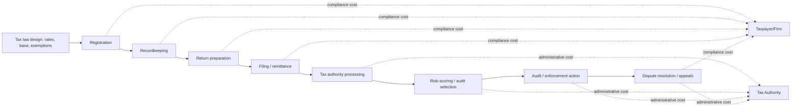

## Administrative and Compliance Costs of Taxation

### Overview and Conceptual Framework

The operating costs of a tax system are distinct from its **efficiency costs** (deadweight loss from behavioral distortion). Even a tax with zero deadweight loss (e.g., a true lump-sum tax) would still consume real resources to administer and comply with. Public economics decomposes the total resource cost of raising revenue $R$ into:

$$\text{Total Cost of Taxation} = \underbrace{R}_{\text{revenue transferred}} + \underbrace{DWL}_{\text{deadweight loss}} + \underbrace{AC}_{\text{administrative cost}} + \underbrace{CC}_{\text{compliance cost}}$$

- **Administrative costs (AC)**: resources spent by the *government* (tax authority) to assess, collect, and enforce taxes — staffing, audit infrastructure, IT systems, taxpayer services
- **Compliance costs (CC)**: resources spent by *taxpayers* (and third parties, e.g., employers, accountants) to determine, document, and remit tax liability — recordkeeping, tax preparation, professional fees, time cost

Both are **real resource costs**, not transfers, and therefore enter social cost-benefit calculus alongside deadweight loss — a tax system can be "efficient" in the Ramsey/Mirrlees sense (low DWL) yet still be a costly system overall if $AC + CC$ is large.

### Administrative Costs: Definition and Measurement

Administrative cost is conventionally measured as a ratio:

$$\text{Cost-of-Collection Ratio} = \frac{\text{Tax Authority Operating Budget}}{\text{Total Revenue Collected}}$$

**Key Points**

- For most OECD tax authorities, this ratio is small — typically in the range of **0.5% to 1.5%** of revenue collected, though it varies by tax type and administrative maturity
- The ratio is **not a clean efficiency metric** on its own: a very low ratio can indicate an efficient administration, or alternatively an *underfunded* administration that is failing to pursue enforceable noncompliance (i.e., leaving tax-gap revenue uncollected) — cost-of-collection ratios should be read jointly with tax-gap and audit-coverage statistics
- Administrative cost is **not proportional to revenue** in a mechanical sense — most core costs (IT systems, staff, forms processing) are largely **fixed or quasi-fixed** with respect to the tax rate or bracket structure, meaning a tax increase that does not change the base or reporting requirements adds little marginal administrative cost, while adding a *new tax instrument* or *new taxpayer segment* generates a large fixed setup cost
- Administrative costs are **generally lower per-dollar-collected for taxes with a small number of large remitters** (e.g., VAT collected from registered firms, wage withholding collected from employers) than for taxes collected from a large number of small, dispersed taxpayers (e.g., taxing many small self-employed individuals directly) — this is a central justification for the intermediary-based collection designs discussed in enforcement and third-party reporting

### Compliance Costs: Definition, Components, and Measurement

Compliance cost is typically decomposed into three categories, following the influential Sandford, Godwin, and Hardwick (1989) taxonomy still used in most modern compliance-cost studies:

1. **Direct monetary costs**: fees paid to external tax preparers, accountants, or software
2. **Time costs**: hours spent by the taxpayer (or in-house staff, for firms) on recordkeeping, form completion, and dealing with tax authority correspondence, valued at an opportunity-cost wage
3. **Psychological/stress costs**: the disutility of compliance uncertainty and complexity — typically unmeasured in monetary compliance-cost studies but noted in the literature as a real, non-pecuniary cost

**Key Points**

- Compliance costs are measured via **taxpayer survey methods** (time-diary or recall surveys asking taxpayers/firms to estimate hours and fees spent) since there is no administrative data source that directly records this cost — this makes compliance-cost estimates inherently less precise than administrative-cost estimates drawn from government budgets
- A robust empirical regularity across countries and tax types is that compliance costs are **regressive with respect to firm size** — small businesses bear a disproportionately higher compliance cost *per dollar of revenue or per dollar of tax liability* than large businesses, because a large share of compliance cost is a **fixed cost** (understanding the rules, setting up recordkeeping systems, filing regardless of transaction volume) that does not scale down proportionally with firm size
- For individuals, compliance costs are similarly regressive with respect to income complexity rather than income level per se — a low-income taxpayer with self-employment income or multiple benefit interactions can face compliance costs (in time and stress) disproportionate to their tax liability, an issue central to debates over EITC/means-tested benefit take-up
- **Corporate income tax compliance costs** are consistently found to be a larger share of revenue than VAT or wage-withholding compliance costs in cross-country studies, reflecting the complexity of the corporate base (depreciation schedules, loss carryforwards, transfer pricing, international provisions)

**Illustration: Compliance Cost as a Share of Liability, by Firm Size (svg_diagram)**

<svg xmlns="http://www.w3.org/2000/svg" viewBox="0 0 720 340">
<text x="360" y="25" font-size="16" font-weight="bold" text-anchor="middle" fill="#1a1a1a">Regressivity of Compliance Cost (svg_diagram)</text>
<line x1="90" y1="280" x2="680" y2="280" stroke="#333" stroke-width="2" />
<line x1="90" y1="60" x2="90" y2="280" stroke="#333" stroke-width="2" />

<text x="60" y="285" font-size="12" fill="#333">0%</text>

<text x="55" y="180" font-size="12" fill="#333">10%</text>

<text x="55" y="80" font-size="12" fill="#333">20%</text>

<line x1="85" y1="170" x2="680" y2="170" stroke="#ddd" stroke-width="1" stroke-dasharray="4,4" />

<rect x="140" y="90" width="80" height="190" fill="#8e24aa" />
<text x="180" y="305" font-size="12" text-anchor="middle" fill="#333">Micro firms</text>
<rect x="280" y="150" width="80" height="130" fill="#5e35b1" />
<text x="320" y="305" font-size="12" text-anchor="middle" fill="#333">Small firms</text>
<rect x="420" y="210" width="80" height="70" fill="#3949ab" />
<text x="460" y="305" font-size="12" text-anchor="middle" fill="#333">Medium firms</text>
<rect x="560" y="255" width="80" height="25" fill="#1e88e5" />
<text x="600" y="305" font-size="12" text-anchor="middle" fill="#333">Large firms</text>

<text x="385" y="50" font-size="11" text-anchor="middle" fill="#666">Fixed-cost share of compliance burden falls as firm size / transaction volume rises</text>

</svg>

### Determinants of Compliance Cost: The Role of Tax System Design

Compliance cost is substantially a **design choice**, not a fixed technological constant. Key structural drivers include:

**Key Points**

- **Number of distinct rates, brackets, and exemptions**: each additional rate differentiation, carve-out, or eligibility threshold requires taxpayers (or their agents) to determine which category applies, and requires the tax authority to verify boundary cases — this is the standard rationale behind the "broad base, low(er) rate" design principle in optimal tax administration, distinct from the broad-base argument made purely on efficiency (Ramsey) grounds
- **Filing frequency and reporting granularity**: more frequent filing (e.g., monthly VAT returns vs. annual) raises compliance cost in aggregate hours even if it improves cash-flow and enforcement timeliness for the government — an explicit administrative-cost-vs.-enforcement-benefit tradeoff
- **Thresholds and notches**: registration or filing thresholds (e.g., VAT registration thresholds, small-business exemptions) reduce compliance cost for below-threshold entities but can generate **bunching** just below the threshold (a behavioral response studied extensively in the bunching-estimator literature) as firms avoid crossing into a higher compliance-cost regime, independent of any change in true tax liability
- **Pre-population and default reporting**: as discussed under third-party reporting, government pre-filled returns (Scandinavian model) shift compliance burden away from the taxpayer entirely for third-party-verified income, converting a "prepare-and-file" task into a "review-and-confirm" task — this is simultaneously an enforcement-improving and compliance-cost-reducing technology, illustrating that administrative-cost and compliance-cost objectives are not always in tension
- **Complexity from anti-avoidance provisions**: rules designed to close avoidance channels (e.g., CFC rules, transfer pricing documentation, general anti-avoidance rules) are a first-order source of compliance cost growth in corporate tax systems, creating a direct tradeoff between avoidance deterrence and compliance-cost minimization

### The Administrative Cost–Compliance Cost–Enforcement Tradeoff

A central design tension in tax administration economics is that the three cost/effectiveness margins are **jointly determined** and often trade off against one another:

$$\text{Given a fixed enforcement outcome, a government can shift burden between:} \quad AC \; \longleftrightarrow \; CC \; \longleftrightarrow \; \text{Tax Gap}$$

**Key Points**

- **Third-party reporting shifts compliance burden from individual taxpayers to intermediaries** (employers, banks, platforms) — individual taxpayer compliance cost falls, but the withholding agent bears a new compliance cost, and the *net* system-wide compliance cost may rise or fall depending on the intermediary's cost of compliance relative to the aggregate individual cost avoided; empirically it is generally believed to fall because intermediaries have economies of scale (one payroll system serving thousands of employees is cheaper per-taxpayer than thousands of individuals separately tracking and reporting the same income)
- **Simplification (e.g., presumptive taxes, standard deductions, flat-ish rate schedules) reduces both compliance and administrative cost simultaneously**, but typically at the cost of reduced targeting/progressivity precision — a standard deduction is cheap to administer and comply with, but a system relying heavily on standard deductions rather than itemization sacrifices the ability to means-test finely
- **Investment in administrative capacity (better IT, risk-scoring, e-filing) can lower compliance cost and raise enforcement effectiveness simultaneously** — e-filing systems, once built, typically reduce taxpayer time cost (auto-calculation, error-checking) while also improving the tax authority's data quality for audit targeting, making them a relatively rare case of a cost margin that is *not* purely a tradeoff against the others, which is a major reason digitalization of tax administration is a persistent policy priority in both developed and developing-country tax reform agendas

### International and Developing-Country Perspectives

**Key Points**

- Developing-country tax administrations frequently face a distinctive combination: **high administrative cost per dollar collected** (due to a large informal sector, weak third-party information infrastructure, and capacity constraints) alongside **high compliance cost concentrated among formal-sector firms** who bear a disproportionate share of the tax burden precisely because they are the segment the administration can effectively monitor — this "large taxpayer" concentration is a well-documented pattern in developing-economy revenue administration, often formalized through dedicated **Large Taxpayer Units (LTUs)** that manage a small number of firms responsible for a majority of collected revenue
- Semi-autonomous revenue authorities (SARAs) — a governance reform adopted in several developing countries from the 1990s onward, separating tax administration from the core civil service with greater operational and budgetary autonomy — were motivated substantially by administrative-cost and capacity arguments, though evidence on their long-run effectiveness at reducing the cost-of-collection ratio is mixed across country studies [Unverified — cross-country evidence on SARA effectiveness is heterogeneous and sensitive to implementation quality]
- Digitalization initiatives (e-filing, e-invoicing, mobile-money-integrated withholding) are widely viewed in the recent public finance literature as having the potential to simultaneously lower administrative cost, lower compliance cost for formal firms, and improve third-party information coverage, but the fixed cost of digital infrastructure investment and the digital-access gap for informal or rural taxpayers are recognized constraints on how quickly these gains can be realized [Unverified — magnitude and timeline of net cost savings from digitalization vary by country and are still being empirically assessed in recent literature]

### Process View: Where Costs Arise Across the Tax Cycle

### Welfare Implications and Policy Design Principles

**Key Points**

- Because administrative and compliance costs are real resource costs, the **marginal cost of public funds (MCF)** used in optimal tax and expenditure analysis should, in principle, incorporate them alongside the marginal deadweight loss from the behavioral distortion — in practice, most applied MCF estimates focus on deadweight loss and treat administrative/compliance cost as a secondary or omitted consideration, which is recognized in the literature as a simplification rather than a claim that these costs are negligible
- The "optimal complexity" of a tax system, in this framework, balances the **marginal targeting/equity benefit** of an additional rule, bracket, or exemption against its **marginal administrative and compliance cost** — this is analytically parallel to the standard efficiency-equity tradeoff in optimal tax theory but operates on a different margin (system complexity rather than marginal tax rates)
- A recurring normative conclusion across the compliance-cost literature is that **small, low-revenue-contributing complexity features are frequently poor value** — a narrowly targeted credit or deduction with small aggregate revenue effect can nonetheless impose compliance and administrative costs disproportionate to the equity or efficiency gain it delivers, which is the standard public-finance argument for periodic "simplification" tax reforms

**Related Topics**

- Enforcement, Audits, and Third-Party Reporting (this chapter)
- The Marginal Cost of Public Funds and Its Use in Cost-Benefit Analysis
- Bunching at Notches and Kinks: Behavioral Responses to Threshold-Based Rules
- Presumptive Taxation and Simplified Regimes for Small Firms
- Semi-Autonomous Revenue Authorities and Tax Administration Reform
- Digitalization of Tax Administration: E-Filing, E-Invoicing, and Data Infrastructure
- Tax Base Broadening vs. Rate Reduction as Simplification Strategies
- Large Taxpayer Units and Segmented Tax Administration Design