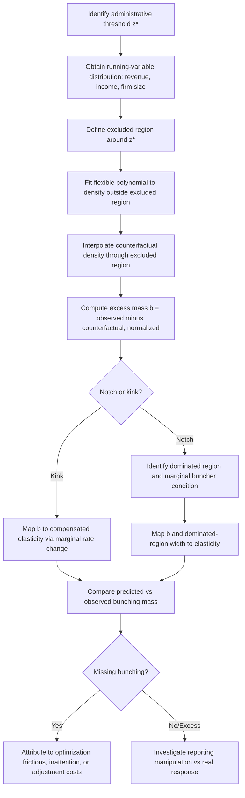

## Bunching Responses to Tax Administration

### Overview and Conceptual Framework

Bunching is the empirical phenomenon in which the distribution of a decision variable (reported income, sales, firm size, transaction value) exhibits an excess mass — a visible spike — at a specific point, rather than the smooth distribution predicted by continuous underlying heterogeneity. In the context of tax administration, bunching typically arises where a **discontinuity in the marginal incentive schedule** (a kink) or a **discontinuity in the average incentive/regulatory regime** (a notch) creates a strong localized incentive to locate exactly at, or just below, the discontinuity point.

While bunching is most famously associated with real behavioral responses to marginal tax rate kinks (Saez 2010), this item focuses specifically on bunching as it relates to **tax administration and enforcement design** — i.e., where the bunching point is not primarily a marginal-rate kink but an **administrative threshold**: a registration requirement, an audit-selection cutoff, a compliance-regime boundary, or a reporting obligation trigger.

### Kinks versus Notches: The Foundational Distinction

**Key Points**

- A **kink** is a point where the *marginal* tax rate (or marginal incentive) changes discontinuously, while the *average* rate remains continuous — e.g., the marginal tax rate jumping from 20% to 30% at a bracket threshold. Optimal bunching at a convex kink is theoretically bounded and used to estimate the **compensated elasticity of taxable income** via the excess-mass method (Saez 2010; Chetty, Friedman, Olsen, and Pistaferri 2011)
- A **notch** is a point where the *average* tax rate, price, or regulatory burden changes discontinuously — e.g., crossing a VAT registration threshold and becoming liable for tax on the *entire* base, not just the marginal unit above threshold; or crossing a size threshold that triggers a wholly new compliance regime. Notches generate **much larger bunching responses** than kinks of comparable marginal-incentive size, because crossing a notch can make the agent strictly worse off in **total** terms (Kleven and Waseem 2013) — there exists a *dominated region* just above the notch that no optimizing agent should ever locate in, since a lower point below the notch yields strictly higher after-tax income/profit
- Administrative and compliance-cost thresholds are almost always **notches**, not kinks, which is why bunching responses to administrative rules (registration thresholds, audit-triggering cutoffs, simplified-regime eligibility caps) tend to be sharper and more diagnostic than bunching at pure marginal tax-rate kinks

### The Bunching Estimator: Formal Setup

The standard bunching estimator compares the observed density of the running variable (income, revenue, etc.) near a threshold $z^*$ to a **counterfactual density** — what the distribution would look like absent the threshold — typically estimated by fitting a flexible polynomial to the density outside an excluded region around $z^*$ and interpolating through the excluded region.

$$b = \frac{\int_{z^*}^{z^* + \Delta z} \left[ h(z) - \hat{h}_0(z) \right] dz}{\hat{h}_0(z^*)}$$

where $h(z)$ is the observed density, $\hat{h}_0(z)$ is the counterfactual (smooth) density, and $b$ (normalized excess mass, often expressed as multiples of the counterfactual density at $z^*$) is the bunching statistic.

**Key Points**

- For a **kink**, the excess mass $b$ maps to a structural elasticity via the marginal rate change $\Delta t / (1-t)$ at the kink, under an assumed functional form for utility (typically iso-elastic)
- For a **notch**, the mapping is different: because a dominated region exists, the bunching mass at $z^*$ must equal the "missing mass" in the dominated region $[z^*, z^* + \Delta z^*]$, and the width of the dominated region itself (not just the excess mass) is informative about the elasticity — Kleven and Waseem (2013) formalize this using a **marginal buncher** condition, where the agent located exactly at the upper edge of the dominated region is indifferent between bunching at $z^*$ and jumping past the notch
- A critical diagnostic in notch settings is comparing the **theoretically predicted bunching mass** (given the notch's structural parameters and an assumed elasticity) to the **observed bunching mass** — a large observed shortfall (the phenomenon of "missing bunching," i.e., much less bunching than frictionless optimization predicts) is itself an important empirical finding, discussed below

### Administrative Thresholds as Notches: Common Applications

**Key Points**

- **VAT/turnover registration thresholds**: firms bunch just below the revenue threshold at which VAT registration (and associated compliance/administrative cost, plus tax liability on prior-exempt turnover) becomes mandatory — documented extensively across countries (e.g., UK VAT threshold bunching in Liu, Lockwood, Almunia, and Tam 2021; similar patterns in developing-country VAT and turnover-tax studies)
- **Size-based regulatory/compliance thresholds**: firm-size cutoffs that trigger labor regulation, audit likelihood, or formal accounting/reporting obligations generate bunching in firm size or reported revenue distributions — a well-known cross-country pattern linked to the broader "missing middle" phenomenon in firm-size distributions in developing economies, where a disproportionately small share of firms operate just above small-firm thresholds
- **Presumptive/simplified tax regime eligibility caps**: many countries offer simplified, lower-compliance-cost tax regimes (e.g., small-business or "micro-enterprise" regimes) up to a revenue cap, above which firms revert to the standard (more costly, often higher-rate) regime — bunching just below these caps is a standard finding and is used to estimate the *combined* tax-plus-compliance-cost elasticity, since the incentive to remain below threshold reflects both the marginal tax-rate change and the discrete compliance-cost saving
- **Audit-probability discontinuities**: where audit selection algorithms use explicit rule-based cutoffs (e.g., "flag returns reporting deductions above $X$" or "flag firms with declared margin below industry norm $Y$"), taxpayers with knowledge of (or beliefs about) the cutoff may bunch just below it — an audit-avoidance analog to the tax-rate bunching literature, though harder to detect empirically because audit-selection rules are frequently not publicly disclosed by tax authorities, precisely to limit this gaming behavior
- **Reporting-obligation thresholds** (e.g., cash transaction reporting limits, large-transaction disclosure rules): bunching just below reporting thresholds is a recognized pattern in the anti-money-laundering and tax-compliance literature (sometimes termed "structuring" when done to evade reporting requirements), illustrating that bunching-as-avoidance-of-scrutiny is a general phenomenon extending beyond pure tax-rate schedules

**Illustration: Notch-Induced Bunching at a Registration Threshold (svg_diagram)**

<svg xmlns="http://www.w3.org/2000/svg" viewBox="0 0 720 380">
<text x="360" y="25" font-size="16" font-weight="bold" text-anchor="middle" fill="#1a1a1a">Density of Firm Revenue Near Threshold (svg_diagram)</text>
<line x1="80" y1="320" x2="680" y2="320" stroke="#333" stroke-width="2" />
<line x1="80" y1="50" x2="80" y2="320" stroke="#333" stroke-width="2" />
<text x="360" y="355" font-size="13" text-anchor="middle" fill="#333">Reported Revenue (z)</text>
<text x="35" y="185" font-size="13" text-anchor="middle" fill="#333" transform="rotate(-90 35 185)">Density h(z)</text>

<path d="M 100 300 Q 250 260 340 250 L 360 250 Q 380 100 400 100 Q 420 270 460 280 Q 550 300 660 300" fill="none" stroke="`#1e88e5`" stroke-width="3" />

<path d="M 100 300 Q 250 260 340 250 Q 360 245 380 240 Q 420 235 460 230 Q 550 220 660 210" fill="none" stroke="`#c62828`" stroke-width="2" stroke-dasharray="6,4" />

<line x1="370" y1="50" x2="370" y2="320" stroke="#333" stroke-width="1.5" stroke-dasharray="3,3" />
<text x="370" y="45" font-size="12" text-anchor="middle" fill="#333">z* (threshold)</text>
<rect x="370" y="50" width="60" height="270" fill="#ffcdd2" opacity="0.4" />
<text x="400" y="335" font-size="11" text-anchor="middle" fill="#c62828">dominated region</text>

<text x="500" y="120" font-size="12" fill="`#c62828`">Counterfactual density (no threshold)</text>

<text x="130" y="270" font-size="12" fill="`#1e88e5`">Observed density (with bunching)</text>

</svg>

### The "Missing Bunching" Puzzle and Optimization Frictions

A recurring and economically important finding across notch-bunching studies is that **observed bunching mass is systematically smaller than what frictionless optimization predicts** given a plausible elasticity — this gap is termed "missing bunching" or attributed to **optimization frictions**.

**Key Points**

- Kleven and Waseem (2013), studying income tax notches in Pakistan, found substantial missing bunching and interpreted it as evidence of **adjustment costs and inattention** — not all taxpayers costlessly reoptimize around the notch, either because they are unaware of the exact threshold, face costs to adjusting reported income precisely (e.g., self-employment income cannot be perfectly fine-tuned), or use tax professionals with imperfect information
- This has a direct implication for **structural elasticity estimation**: naively inverting the bunching-mass formula without accounting for frictions will produce a **downward-biased elasticity estimate**, because some of the "missing" response reflects frictions rather than a genuinely small behavioral elasticity — the frictionless bunching estimator, when frictions are present, is best interpreted as a **lower bound** on the true structural elasticity
- This finding is central to the **administrative design** implications of bunching research: if a large share of the target population fails to bunch at a threshold that should, in principle, offer a clear discrete benefit, this signals either (a) poor **taxpayer awareness/salience** of the threshold rule (an information/communication failure in tax administration) or (b) binding real constraints on the ability to adjust the running variable (e.g., a firm's revenue is largely determined by market demand, not a choice variable that can be finely tuned) — distinguishing these explanations has direct relevance for whether administrative interventions (e.g., notification campaigns) could increase bunching-consistent behavior
- Some studies find the **opposite pattern** — bunching mass exceeding what a real-response elasticity alone would predict — and attribute the excess to a **non-behavioral/reporting margin**: taxpayers or firms manipulating *reported* (not real) revenue to appear just below threshold, which is evasion/misreporting rather than genuine real economic adjustment. Distinguishing "real bunching" from "reporting bunching" is a persistent identification challenge, typically addressed using auxiliary data (e.g., comparing self-reported revenue bunching to third-party-verified transaction data, where available) [Unverified — the real-vs-reporting decomposition is context-specific and not always empirically separable with available data]

### Bunching as a Diagnostic Tool for Tax Administration Design

Beyond its use for elasticity estimation, bunching analysis has become a standard **diagnostic instrument** for evaluating and designing administrative thresholds themselves.

**Key Points**

- The **magnitude of bunching at a threshold is a direct, visually and statistically transparent measure of how distortionary that threshold is** — a threshold generating large bunching mass is imposing a large discrete disincentive to grow past it, which can be weighed by policymakers against the administrative/compliance-cost savings the threshold was designed to achieve (e.g., the tradeoff between reduced compliance burden below a small-business threshold and the growth-inhibiting notch it creates)
- This has motivated policy proposals to **replace notches with kinks or smoothed phase-in schedules** in threshold design — e.g., gradually phasing in VAT liability or compliance obligations over a revenue range rather than imposing the full obligation discretely at a single point — a design response directly informed by the empirical bunching literature's finding that notches generate disproportionately large distortions (including the dominated-region welfare loss, which has no analog at a kink) relative to the revenue or administrative-cost objective being pursued
- Bunching estimates are also used to **back out revenue and welfare costs of specific thresholds**: the "missing" tax revenue from firms who would have reported more revenue absent the threshold (the mass in the dominated region that "escaped" to just below threshold) can be quantified and compared to the administrative-cost savings the threshold was designed to generate, providing an explicit cost-benefit framework for threshold-setting as a tax administration policy instrument
- In audit-selection contexts specifically, bunching evidence around known or suspected selection cutoffs has been used by tax authorities themselves as an **input to enforcement targeting** — if bunching just below a known threshold is detected, the tax authority can update its risk-scoring model to specifically flag near-threshold reporting as higher-risk, effectively counteracting the gaming behavior the original threshold-based rule induced (a dynamic "cat-and-mouse" pattern between taxpayer avoidance and administrative rule design)

### Empirical Workflow for a Bunching Analysis

### Relationship to the Broader Enforcement and Compliance-Cost Literature

**Key Points**

- Bunching at administrative thresholds sits at the intersection of the enforcement literature (audit-probability discontinuities) and the compliance-cost literature (registration and regime-eligibility thresholds) discussed elsewhere in this chapter — the same notch-bunching methodology applies regardless of whether the underlying discontinuity is enforcement-driven (higher audit risk above a cutoff) or compliance-cost-driven (higher reporting burden above a cutoff), since both generate a discrete, threshold-crossing disincentive rather than a smooth marginal one
- Because notch-driven bunching responses are frequently a **mix of real economic adjustment and reporting/evasion behavior**, bunching evidence at administrative thresholds is often used as **indirect evidence on the extent of evasion or avoidance enabled by a given threshold rule** — a finding of substantial bunching combined with implausibly precise revenue targeting (e.g., an unusual concentration of firms reporting revenue exactly $1 below a cap) is typically interpreted as reporting manipulation rather than genuine real-output constraint, especially when third-party data sources (e.g., bank transaction records) suggest true economic activity above the reported level
- This connects directly to the **elasticity of taxable income (ETI)** decomposition discussed under enforcement: bunching-based elasticity estimates, because they typically cannot cleanly separate real responses from reporting responses, are best interpreted as capturing a **composite behavioral elasticity** analogous to the ETI's mixture of real, avoidance, and evasion margins, rather than a pure structural labor-supply or production elasticity

**Related Topics**

- Enforcement, Audits, and Third-Party Reporting (this chapter)
- Administrative and Compliance Costs of Taxation (this chapter)
- The Elasticity of Taxable Income and Its Decomposition into Real, Avoidance, and Evasion Responses
- Optimal Threshold and Notch Design in Tax and Regulatory Policy
- The "Missing Middle" in Firm-Size Distributions and Regulatory Thresholds
- Presumptive Taxation and Simplified Regimes for Small Firms
- Identification and Estimation Methods: Bunching Estimators vs. Difference-in-Differences and RD Designs
- Salience and Taxpayer Awareness of Administrative Rules