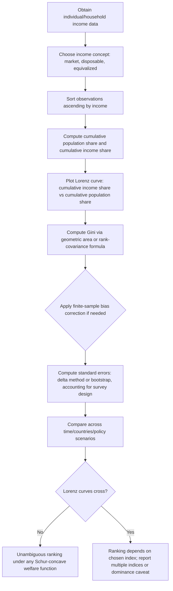

## Lorenz Curve and Gini Coefficient

### Overview and Conceptual Framework

The Lorenz curve and the Gini coefficient are the foundational graphical and scalar tools for measuring income (or wealth) inequality within a population. The Lorenz curve provides a full, ordinal-preserving graphical representation of the distribution's inequality, while the Gini coefficient compresses that information into a single summary statistic. Both are central to public economics because inequality measurement underlies the equity side of the equity-efficiency tradeoff in optimal taxation, the evaluation of redistributive policy, and cross-country/cross-time comparisons of distributional outcomes.

### The Lorenz Curve: Formal Definition

Let income (or another nonnegative variable of interest) be represented by a random variable $X$ with cumulative distribution function $F(x)$ and mean $\mu$. Order the population from poorest to richest. The Lorenz curve $L(p)$ maps the cumulative share of population $p \in [0,1]$ to the cumulative share of total income held by that poorest $p$ share:

$$L(p) = \frac{1}{\mu} \int_0^p F^{-1}(t) \, dt$$

where $F^{-1}(t)$ is the quantile function (inverse CDF) of income.

**Key Points**

- $L(p)$ is defined on $[0,1] \times [0,1]$, with $L(0) = 0$ and $L(1) = 1$ by construction
- The curve is **convex and non-decreasing**, lying on or below the 45-degree **line of perfect equality**, $L(p) = p$, which represents the case where every individual holds an identical income share
- The vertical distance between the 45-degree line and the Lorenz curve at any point $p$ measures the degree of inequality among the bottom $p$ share of the population relative to perfect equality
- **Perfect equality** corresponds to $L(p) = p$ for all $p$; **maximal inequality** (one individual holds all income) corresponds to $L(p) = 0$ for all $p < 1$ and $L(1) = 1$ — a curve that hugs the horizontal axis before jumping vertically at $p=1$
- The slope of the Lorenz curve at point $p$ equals $F^{-1}(p)/\mu$, i.e., that individual's income relative to the mean — the curve is increasing and convex precisely because incomes are sorted from lowest to highest, so the marginal contribution to cumulative income share rises monotonically as one moves up the distribution

**Illustration: The Lorenz Curve (svg_diagram)**

<svg xmlns="http://www.w3.org/2000/svg" viewBox="0 0 480 480">
<text x="240" y="25" font-size="16" font-weight="bold" text-anchor="middle" fill="#1a1a1a">Lorenz Curve (svg_diagram)</text>
<line x1="60" y1="420" x2="440" y2="420" stroke="#333" stroke-width="2" />
<line x1="60" y1="420" x2="60" y2="60" stroke="#333" stroke-width="2" />
<text x="250" y="455" font-size="13" text-anchor="middle" fill="#333">Cumulative Share of Population (p)</text>
<text x="25" y="240" font-size="13" text-anchor="middle" fill="#333" transform="rotate(-90 25 240)">Cumulative Share of Income</text>

<text x="55" y="435" font-size="11" text-anchor="middle" fill="#333">0</text>

<text x="440" y="435" font-size="11" text-anchor="middle" fill="#333">1</text>

<text x="45" y="425" font-size="11" text-anchor="middle" fill="#333">0</text>

<text x="45" y="65" font-size="11" text-anchor="middle" fill="#333">1</text>

<line x1="60" y1="420" x2="440" y2="60" stroke="#333" stroke-width="1.5" stroke-dasharray="5,5" />
<text x="360" y="130" font-size="12" fill="#333">Line of perfect equality: L(p) = p</text>

<path d="M 60 420 Q 150 410 250 340 Q 350 250 440 60" fill="none" stroke="`#c62828`" stroke-width="3" />

<text x="120" y="400" font-size="12" fill="`#c62828`">Lorenz curve L(p)</text>

<path d="M 60 420 Q 150 410 250 340 Q 350 250 440 60 L 440 60 L 60 420 Z" fill="`#c62828`" opacity="0.12" />

<text x="180" y="300" font-size="12" fill="`#c62828`" font-style="italic">Area A</text>

<path d="M 60 420 L 440 60 Q 350 250 250 340 Q 150 410 60 420 Z" fill="`#1e88e5`" opacity="0.12" />

<text x="310" y="380" font-size="12" fill="`#1e88e5`" font-style="italic">Area B</text>

</svg>

### The Gini Coefficient: Derivation from the Lorenz Curve

The Gini coefficient $G$ is defined geometrically as the ratio of the area between the line of perfect equality and the Lorenz curve (**Area A**) to the total area under the line of perfect equality (**Area A + B**, which equals $1/2$):

$$G = \frac{A}{A+B} = 2A = 1 - 2\int_0^1 L(p)\, dp$$

**Key Points**

- $G \in [0,1]$: $G = 0$ corresponds to perfect equality ($L(p) = p$ everywhere, so $A = 0$); $G \to 1$ corresponds to maximal inequality (the Lorenz curve collapses toward the horizontal axis)
- In practice, observed Gini coefficients for disposable household income across countries typically range from roughly 0.25 (highly equal, e.g., several Nordic countries) to above 0.60 (highly unequal, e.g., several Sub-Saharan African and Latin American countries), with most OECD countries clustering in the 0.30–0.40 range [Unverified — exact rankings and values shift across years and data vintages; consult current cross-country datasets such as the World Bank's PovcalNet/World Inequality Database for up-to-date figures]
- An equivalent and widely used **statistical (rather than geometric) formula** expresses the Gini coefficient as half the **relative mean absolute difference**:

$$G = \frac{1}{2\mu n^2} \sum_{i=1}^n \sum_{j=1}^n |x_i - x_j|$$

which is the expected absolute difference between two randomly drawn individuals' incomes, normalized by twice the mean — this formulation is useful because it does not require first estimating a continuous Lorenz curve and applies directly to discrete survey data

- A third common representation, useful in decomposition exercises, expresses the Gini using the **covariance between income and its rank**:

$$G = \frac{2 \, \text{Cov}(X, F(X))}{\mu}$$

where $F(X)$ is the individual's percentile rank in the income distribution — this form underlies several of the decomposition techniques discussed below

### Properties of the Gini Coefficient

**Key Points**

- **Scale invariance**: $G$ is unchanged if all incomes are multiplied by a positive constant (e.g., converting currency units or adjusting for uniform inflation) — a property sometimes termed *mean independence*
- **Population invariance (replication invariance)**: $G$ is unchanged if the population is replicated (e.g., merging two identical copies of the same population) — this allows meaningful comparison of Gini coefficients across countries or regions of different population sizes
- **Anonymity (symmetry)**: $G$ depends only on the distribution of incomes, not on which specific individual holds which income — reshuffling identities without changing the income vector leaves $G$ unchanged
- **Pigou-Dalton transfer sensitivity**: a mean-preserving transfer of income from a richer to a poorer individual (that does not reverse their relative ranking) strictly reduces $G$ — this is the core normative property required of any inequality index, and the Gini satisfies it, though (as discussed below) it does not weight transfers uniformly across the distribution
- **Decomposability limitations**: unlike the Theil index and other members of the Generalized Entropy class, the Gini coefficient is **not perfectly additively decomposable** into within-group and between-group components when the population is partitioned into subgroups with overlapping income ranges — a residual "overlap" or "interaction" term typically remains, complicating exact within/between decompositions (Gini decomposition methods exist, e.g., Dagum's decomposition, but require additional terms beyond simple within/between components that fully decomposable indices like Theil's $T$ or Theil's $L$ do not require)

### Sensitivity Across the Distribution: The Gini's Implicit Weighting

**Key Points**

- The Gini coefficient is most sensitive to changes occurring **around the middle of the income distribution**, because the transfer-sensitivity weight implicit in the Gini formula (derived from the rank-based covariance representation) is **highest near the median** and falls off toward both tails
- This is a frequently cited limitation relative to policy questions specifically about the **tails** of the distribution: a transfer between two very poor individuals, or between two very rich individuals, moves the Gini coefficient by less than an equally sized transfer occurring near the median — for research questions centered on poverty (bottom of the distribution) or top-income concentration, complementary measures are typically preferred (e.g., the Foster-Greer-Thorbecke poverty indices for the bottom of the distribution, or top income shares computed from tax-record data, often associated with the World Inequality Database/Piketty-Saez-Zucman tradition, for the top of the distribution)
- This sensitivity pattern is a direct consequence of the Gini satisfying the Pigou-Dalton principle only in a specific, rank-weighted form, and is one motivation for the broader **Generalized Entropy** and **Atkinson** index families, which allow the researcher to explicitly parameterize how much relative weight is placed on inequality at different points in the distribution (see below)

### Relationship to Other Inequality Indices

**Key Points**

- The **Atkinson index**, $A_\epsilon = 1 - \left[\frac{1}{n}\sum_i (x_i/\mu)^{1-\epsilon}\right]^{1/(1-\epsilon)}$, is explicitly welfare-theoretic: it is derived from an assumed social welfare function with an inequality-aversion parameter $\epsilon$, and unlike the Gini, its value has a direct normative interpretation as the "equally distributed equivalent income" loss due to inequality — as $\epsilon \to \infty$, the Atkinson index becomes maximally sensitive to the bottom of the distribution (Rawlsian weighting), a flexibility the Gini does not offer
- The **Theil indices** (Theil's $T$, based on entropy, and the related **Mean Log Deviation**, Theil's $L$) belong to the **Generalized Entropy (GE) class**, which is fully additively decomposable into exact within-group and between-group components — a property the Gini lacks, making GE-class indices generally preferred in applied work that requires clean subgroup decomposition (e.g., decomposing national inequality into within-region and between-region components)
- The **variance of log income** and the **coefficient of variation** are simpler dispersion measures sometimes used for computational convenience, but they do not satisfy all of the normative axioms (e.g., the coefficient of variation squared is a member of the GE class only at a specific parameter value, and variance of log income can, in some empirical settings, violate the Pigou-Dalton transfer principle depending on where in the distribution income is measured on the log scale)
- The **top income share** (e.g., top 1% or top 10% share of total income) is not itself a summary inequality index in the axiomatic sense but is a widely used complementary statistic, particularly valuable because it can be constructed from **tax-record (administrative) data**, which captures top incomes far more accurately than household survey data — survey-based Gini coefficients are well known to understate top-driven inequality due to survey under-coverage/under-reporting at the top of the distribution, a key methodological caveat when comparing Gini estimates across data sources

### Measurement Issues and Data Considerations

**Key Points**

- **Choice of income concept** materially affects the measured Gini: market income (pre-tax, pre-transfer) Gini coefficients are substantially higher than disposable income (post-tax, post-transfer) Gini coefficients in most countries, and the **difference between the two** is a standard summary measure of the redistributive effect of the tax-and-transfer system — this comparison is a direct empirical link between inequality measurement and the public economics of tax/transfer policy design
- **Choice of equivalence scale** (adjusting household income for household size and composition, e.g., the OECD-modified scale or square-root scale) affects measured inequality because larger households benefit from economies of scale in consumption — Gini estimates using unadjusted per-capita income versus equivalized income can differ meaningfully, and cross-country comparisons require consistent equivalence-scale choices
- **Survey versus administrative (tax-record) data**: household surveys are subject to under-reporting (particularly of capital and top-end income) and top-coding (survey instruments often cap or bracket top incomes for confidentiality), both of which bias survey-based Gini coefficients downward relative to the true population value — reconciling survey-based and tax-record-based inequality estimates (as in the "distributional national accounts" approach associated with Piketty, Saez, and Zucman) has become a major methodological focus in the recent inequality-measurement literature [Unverified — the magnitude of survey under-coverage bias and appropriate correction methods remain subjects of ongoing methodological debate]
- **Income versus consumption versus wealth**: the Gini coefficient can be applied to any nonnegative distributional variable, but income, consumption, and wealth Ginis differ substantially in both level and interpretation — **wealth Gini coefficients are typically much higher than income Gini coefficients** (often 0.7–0.9 in many countries) because wealth accumulation compounds income differences over time and because a meaningful share of the population holds zero or negative net wealth, a case the standard Gini formula (which assumes nonnegative values) requires adjustment to handle correctly

### Statistical Estimation and Inference

**Key Points**

- The Gini coefficient computed from a finite sample is a **biased estimator** of the population Gini (the bias arises from the nonlinear, rank-dependent structure of the statistic); the standard **finite-sample bias correction** multiplies the naive sample Gini by $n/(n-1)$, though this correction is most consequential in small samples and becomes negligible in the large household-survey samples typical of applied work
- **Confidence intervals and standard errors** for the Gini coefficient are non-trivial to derive analytically because the statistic is a nonlinear functional of the full distribution; standard practice uses either the **influence-function/delta-method approach** (deriving the asymptotic variance from the Gini's influence function) or **bootstrap resampling**, particularly important for survey data with complex sampling designs (stratification, clustering, sampling weights) where naive formulas understate true sampling variance
- Comparing Gini coefficients across countries, time periods, or policy regimes for statistical significance requires these standard errors — a raw difference in point estimates (e.g., a Gini of 0.32 versus 0.34) is not by itself evidence of a statistically significant change in underlying inequality without an accompanying inference procedure

### Policy Relevance in Public Economics

**Key Points**

- The Lorenz curve and Gini coefficient are the standard empirical inputs for evaluating the **distributive effect of tax and transfer policy**, typically via **Lorenz dominance** comparisons: if the post-policy Lorenz curve lies everywhere on or above the pre-policy Lorenz curve (and above at some point), the policy is unambiguously equalizing regardless of the specific social welfare function used, as long as that welfare function is Schur-concave (i.e., respects the Pigou-Dalton principle) — this is the foundation of the Atkinson (1970) theorem linking Lorenz dominance to social welfare rankings
- When Lorenz curves **cross** (one distribution is more equal in one part of the range, less equal in another), no unambiguous ranking exists without specifying a particular inequality index or social welfare function — this is a frequent occurrence in practice (e.g., comparing a policy that helps the poor but slightly widens upper-middle inequality against one with the reverse pattern) and is a standard caveat when Gini-coefficient rankings are used to make normative claims, since a single Gini ranking can mask crossing Lorenz curves that would be revealed by a full distributional (rather than single-index) comparison
- The **Reynolds-Smolensky index** and related "redistributive effect" measures build directly on the Gini/Lorenz framework, using the difference between the **concentration coefficient** of post-tax income (a Gini-like measure using the pre-tax ranking rather than the post-tax ranking) and the pre-tax Gini to decompose redistribution into vertical equity and reranking components — this is a standard tool in applied tax-incidence and tax-benefit microsimulation work connecting inequality measurement directly to tax policy evaluation

### Computation Workflow

**Related Topics**

- Atkinson Index and Social Welfare-Theoretic Inequality Measures
- Generalized Entropy Indices and Decomposable Inequality Measures (Theil's T and L)
- Foster-Greer-Thorbecke Poverty Indices
- Top Income Shares and the Piketty-Saez-Zucman Distributional National Accounts Approach
- Tax-Benefit Incidence and the Reynolds-Smolensky Redistribution Index
- Lorenz Dominance and Social Welfare Rankings (Atkinson 1970 Theorem)
- Wealth Inequality Measurement and the Treatment of Negative Net Wealth
- Equivalence Scales and Household-Size Adjustment in Distributional Analysis