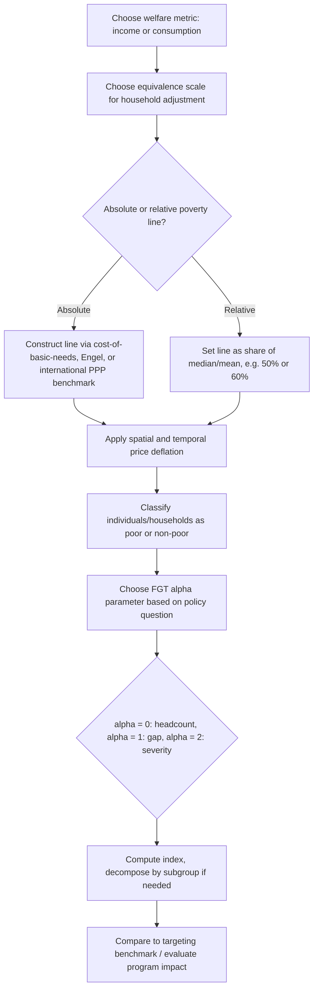

## Poverty Measurement and Poverty Lines

### Overview and Conceptual Framework

Poverty measurement addresses a distinct question from inequality measurement: rather than characterizing dispersion across the entire distribution, it asks how many individuals (or what share of the population) fall short of a specified minimum standard of living, and by how much. Poverty measurement therefore requires two separate analytical components: (1) a **poverty line** (the threshold defining deprivation) and (2) a **poverty index** (a functional form aggregating information about individuals below that line into a summary statistic). Both components embed substantive value judgments, and public economics treats the methodological choices at each stage as consequential for policy targeting, program evaluation, and redistributive tax-and-transfer design.

### Setting the Poverty Line: Absolute versus Relative Approaches

**Key Points**

- **Absolute poverty lines** fix a threshold representing a minimum bundle of goods (or its monetary equivalent) considered necessary for basic subsistence, typically anchored to caloric/nutritional requirements plus essential non-food needs, and held fixed in real terms over time (adjusted only for inflation) — the canonical example is the **World Bank International Poverty Line**, historically set around $1.90/day (2011 PPP) and updated to approximately $2.15/day (2017 PPP) in the Bank's more recent methodology, used for global and cross-country extreme-poverty comparisons [Unverified — the exact current PPP-adjusted threshold and reference year should be checked against the World Bank's latest poverty methodology documentation, as these values are periodically rebased]
- **Relative poverty lines** define the threshold as a fixed proportion of a contemporaneous distributional statistic — most commonly **50% or 60% of median (equivalized) household income** — a convention standard in EU and OECD poverty reporting. Under a relative line, the poverty threshold moves automatically with the overall income distribution, so relative poverty can persist (or even rise) even as absolute living standards for the poor improve, provided the broader distribution shifts commensurately
- **Basic needs / cost-of-basic-needs approaches** construct the line from a priced bundle of specific goods (a minimum food basket meeting caloric requirements, scaled up by an allowance for non-food essentials, often using the ratio of food-to-total spending observed among households near the poverty line — the **Engel method**, or by directly pricing a non-food bundle — the **Rowntree method**) — these methods are common in national poverty-line construction, particularly in developing-country contexts, and require detailed household expenditure survey data
- **Subjective poverty lines** derive thresholds from survey questions asking respondents what income they consider the minimum needed to "get by," aggregated into a line via statistical methods (e.g., the Leyden approach) — used less frequently for official reporting but valuable as a robustness check against the values embedded in "objective" absolute or relative methods, since they reveal how the population's own perception of minimally adequate income compares to administratively set thresholds

**Key Points (continued)**

- The choice between absolute and relative concepts is not merely technical but reflects differing normative views on the nature of poverty: absolute measures treat poverty as failure to meet a fixed subsistence standard (appropriate for very low-income contexts and for tracking progress against extreme deprivation over time), while relative measures treat poverty as a form of **social exclusion** — falling too far below prevailing living standards to participate fully in society — a concept more commonly applied in high-income-country contexts where subsistence-level absolute poverty is rare
- **Equivalence scales** (adjusting the poverty line, or household income, for household size and composition) are required in virtually all poverty-line applications, since a given income supports different living standards depending on household size and the economies of scale in shared consumption (e.g., housing, utilities) — common choices include the **OECD-modified scale** and the simpler **square-root scale**, and the choice of scale can shift both the poverty rate and, more importantly, *which* household types (e.g., large families versus single-person households) are classified as poor
- **Multidimensional poverty measurement** extends beyond income/consumption to directly measure deprivation across multiple domains simultaneously (education, health, living standards) — the most widely used implementation is the **Alkire-Foster method**, underlying the UNDP's **Multidimensional Poverty Index (MPI)**, which identifies a household as multidimensionally poor if it is deprived across a weighted sum of indicators exceeding a specified cutoff, then aggregates using a headcount-times-intensity structure analogous to the FGT framework described below

### The Foster-Greer-Thorbecke (FGT) Class of Poverty Indices

Once a poverty line $z$ is fixed, an aggregation method is needed to summarize the shortfall of the poor population into a single index. The dominant framework is the **Foster-Greer-Thorbecke (1984) class**, parameterized by $\alpha \geq 0$:

$$FGT(\alpha) = \frac{1}{n} \sum_{i=1}^{q} \left( \frac{z - x_i}{z} \right)^\alpha$$

where $x_i$ is individual $i$'s income (or consumption), $z$ is the poverty line, $q$ is the number of poor individuals (those with $x_i < z$), and $n$ is total population. The term $(z-x_i)/z$ is the **normalized poverty gap** for individual $i$, set to zero for the non-poor.

**Key Points**

- **$\alpha = 0$: the Headcount Ratio ($P_0$)** — simply the share of the population below the poverty line, $P_0 = q/n$. This is by far the most widely reported poverty statistic due to its intuitive interpretation, but it has a well-known limitation: it is **insensitive to the depth of poverty** among the poor — a transfer from a very poor individual to a slightly-less-poor individual (both remaining below $z$) leaves $P_0$ unchanged, and even a transfer that pushes someone from just below $z$ to just above $z$ moves $P_0$ discretely while ignoring how far below the line the remaining poor are
- **$\alpha = 1$: the Poverty Gap Index ($P_1$)** — the mean normalized shortfall across the *entire* population (poor individuals contribute their proportional gap; non-poor contribute zero). $P_1$ captures both the incidence (how many are poor) and the intensity (how far below the line, on average) of poverty, and has a direct policy interpretation: it is proportional to the **minimum total transfer (as a share of the poverty line, aggregated across the population) required to eliminate poverty under perfectly targeted transfers** — i.e., the minimum cost of closing every poor person's gap exactly, assuming no leakage to the non-poor and no transaction costs
- **$\alpha = 2$: the Squared Poverty Gap / FGT-2 Index ($P_2$)** — weights each poor individual's gap by its own value, so the index is disproportionately sensitive to the **poorest of the poor** ("depth-weighted" or "severity" measure) — a mean-preserving progressive transfer among the poor (from a poorer to a less-poor individual, both remaining poor) *reduces* $P_2$, satisfying a distribution-sensitivity property among the poor that $P_0$ and $P_1$ both lack ($P_1$ is insensitive to such transfers because the poverty gap is a linear function of the shortfall; only $\alpha > 1$ produces sensitivity to inequality among the poor)
- **General property**: higher $\alpha$ places progressively more weight on the poorest individuals within the poor population, mirroring the role of the inequality-aversion parameter in the Atkinson index — the FGT family is therefore often described as building an explicit **poverty-aversion parameter** directly into the choice of index, analogous to the inequality-aversion parameter $\epsilon$ discussed for the Atkinson index in the companion inequality-indices item
- The FGT class is **fully additively decomposable** by population subgroup for any $\alpha$: national $FGT(\alpha)$ equals the population-share-weighted sum of subgroup $FGT(\alpha)$ values — this makes the FGT class the standard tool for regional, sectoral, or demographic poverty decomposition (e.g., "how much of national poverty is attributable to rural areas"), analogous to the decomposability advantage of the Generalized Entropy indices over the Gini in the inequality-measurement literature

**Illustration: FGT Index Components (svg_diagram)**

<svg xmlns="http://www.w3.org/2000/svg" viewBox="0 0 720 380">
<text x="360" y="25" font-size="16" font-weight="bold" text-anchor="middle" fill="#1a1a1a">FGT Poverty Indices: Weighting the Poor Population (svg_diagram)</text>
<line x1="90" y1="320" x2="650" y2="320" stroke="#333" stroke-width="2" />
<line x1="90" y1="60" x2="90" y2="320" stroke="#333" stroke-width="2" />
<text x="370" y="350" font-size="13" text-anchor="middle" fill="#333">Income (sorted ascending)</text>
<text x="40" y="190" font-size="13" text-anchor="middle" fill="#333" transform="rotate(-90 40 190)">FGT Weight</text>
<line x1="330" y1="60" x2="330" y2="320" stroke="#333" stroke-width="1.5" stroke-dasharray="4,4" />
<text x="330" y="55" font-size="12" text-anchor="middle" fill="#333">z (poverty line)</text>
<rect x="90" y="60" width="240" height="260" fill="#ffcdd2" opacity="0.2" />
<text x="210" y="80" font-size="11" text-anchor="middle" fill="#c62828">poor population</text>
<line x1="90" y1="150" x2="330" y2="150" stroke="#1e88e5" stroke-width="3" />
<line x1="330" y1="150" x2="650" y2="150" stroke="#1e88e5" stroke-width="3" stroke-dasharray="2,2" />
<text x="150" y="140" font-size="12" fill="#1e88e5">P0: flat weight (headcount only)</text>
<path d="M 90 90 L 330 260" stroke="#43a047" stroke-width="3" fill="none" />
<text x="120" y="105" font-size="12" fill="#43a047">P1: linear in gap</text>
<path d="M 90 65 Q 200 90 330 260" stroke="#c62828" stroke-width="3" fill="none" />
<text x="95" y="245" font-size="12" fill="#c62828">P2: convex, severity-weighted</text>
</svg>

### Beyond FGT: Additional Poverty and Related Measures

**Key Points**

- The **Sen Poverty Index** (Sen 1976), a precursor to the FGT class, combines the headcount ratio, the (poor-population-only) poverty gap, and a Gini coefficient computed among the poor into a single weighted index — historically important for introducing distribution-sensitivity into poverty measurement, but largely superseded in applied work by the axiomatically cleaner and more easily decomposable FGT class
- The **Watts Index**, based on the mean logarithmic shortfall among the poor, is another distribution-sensitive alternative satisfying strong axiomatic properties (including a version of the transfer principle and "subgroup consistency," a property ensuring that if poverty falls in one subgroup and does not rise in others, aggregate poverty must fall — a property not guaranteed by all FGT-family members for certain population change scenarios) — used more often in the theoretical poverty-measurement literature than in headline policy reporting
- **Poverty dynamics and chronic versus transient poverty**: with panel (longitudinal) data, poverty measurement can be extended to distinguish individuals who are poor persistently across periods (**chronic poverty**) from those who move in and out of poverty (**transient poverty**) — this distinction matters substantially for policy design, since chronic poverty may call for different interventions (e.g., structural/human-capital investment) than transient poverty (e.g., income-smoothing safety nets, unemployment insurance)
- **Vulnerability to poverty**: a forward-looking concept measuring the probability that a currently non-poor (or poor) household will be poor in a future period, given income volatility and risk exposure — relevant to social protection policy design but requiring panel data or risk-modeling assumptions not needed for standard cross-sectional FGT calculations

### Targeting, Take-Up, and the Policy Application of Poverty Indices

**Key Points**

- The **Poverty Gap Index ($P_1$)** has a direct application in transfer-program design: because it is proportional to the minimum aggregate transfer needed to eliminate poverty under perfect targeting, program evaluators often compare a program's **actual poverty-reduction impact** to this theoretical minimum, yielding a normalized **targeting efficiency** or **cost-effectiveness** measure — actual programs virtually always fall short of the perfect-targeting benchmark due to identification errors (Type I: excluding eligible poor; Type II: including ineligible non-poor) and incomplete take-up
- **Errors of exclusion and inclusion** are typically evaluated against a chosen poverty line and headcount measure, but the interaction between targeting mechanism design (means-testing, proxy-means-testing, geographic targeting, self-selection/workfare mechanisms) and measured poverty-index reduction is a central applied topic connecting poverty measurement directly to optimal transfer program design — a program can substantially reduce $P_0$ (moving many people just above the line) while doing little to reduce $P_2$ (leaving the poorest of the poor still far below), illustrating why **the choice of which FGT-family member is used to evaluate a program materially affects the conclusion about its effectiveness**
- **Benefit incidence analysis**, combining poverty-line classification with data on public program participation, is used to assess whether spending is **pro-poor** (a disproportionate share of benefits accrue to those below the poverty line relative to their population share) — this connects poverty measurement directly to the public-expenditure incidence side of public economics, complementing the tax-incidence side typically paired with inequality (rather than poverty) measurement

### Measurement Challenges and Data Issues

**Key Points**

- **Income versus consumption as the welfare metric**: consumption is often preferred to income for poverty measurement, particularly in developing-country and informal-economy contexts, because consumption is believed to better reflect a household's actual living standard (smoothing over income volatility via savings, credit, and informal risk-sharing) and is typically measured with less error in household surveys than self-employment or informal income — however, consumption data collection (via detailed expenditure diaries or recall modules) is itself costly and subject to its own measurement challenges (recall bias, survey-module length effects)
- **Purchasing Power Parity (PPP) conversion** is required for cross-country absolute poverty-line comparisons (e.g., the World Bank's international poverty line), and the **choice of PPP conversion factors and their periodic rebasing** has historically produced material revisions to global poverty headcounts even absent any real change in underlying living standards — a widely recognized methodological sensitivity in the cross-country poverty-measurement literature [Unverified — the magnitude of specific PPP-rebasing revisions varies by rebasing round and should be checked against current World Bank methodology notes]
- **Price deflation and spatial cost-of-living adjustment** within a country (urban versus rural, regional price differences) is required for internally consistent poverty-line application, since a nominal poverty line failing to adjust for local price levels can systematically misclassify poverty status across regions with different costs of living
- **Survey frequency and comparability over time**: changes in survey instrument design, questionnaire length, or recall period between survey rounds can generate breaks in poverty time series that are difficult to distinguish from genuine changes in poverty, a recurring caveat in interpreting national poverty trend statistics

### Poverty Measurement Workflow

### Relationship to Inequality Measurement

**Key Points**

- Poverty and inequality measurement are related but analytically distinct: a reduction in inequality (e.g., a falling Gini) does not necessarily imply a reduction in poverty, and vice versa — for example, a progressive transfer occurring entirely *above* the poverty line reduces inequality but leaves every poverty index unchanged, while broad-based income growth that leaves relative shares unchanged (constant Gini) can substantially reduce absolute poverty
- The FGT class's parametric structure (weighting by $\alpha$) directly mirrors the parametric structure of the Generalized Entropy and Atkinson inequality indices (weighting by $\alpha$ or $\epsilon$) discussed in the companion inequality-indices item — both frameworks make explicit that summarizing a distribution into a single number requires an explicit, defensible choice about where in the distribution the index should be most sensitive, and both encourage reporting multiple parameter values rather than relying on a single headcount-style statistic
- **Growth-poverty-inequality decomposition** (Datt-Ravallion decomposition and related methods) formally separates observed changes in poverty over time into a component attributable to overall income/consumption growth (holding the distribution's shape fixed) and a component attributable to changes in distribution/inequality (holding the mean fixed) — a standard applied tool linking growth, inequality, and poverty trends within a single accounting framework, frequently used to assess whether growth has been "pro-poor" in a given country or period

**Related Topics**

- Lorenz Curve and Gini Coefficient (this chapter)
- Alternative Inequality Indices (this chapter)
- Multidimensional Poverty and the Alkire-Foster Method
- Targeting Mechanisms in Transfer Programs: Means-Testing, Proxy-Means-Testing, and Self-Selection
- Benefit Incidence Analysis and Pro-Poor Public Spending
- Datt-Ravallion Growth-Inequality-Poverty Decomposition
- Purchasing Power Parity and Cross-Country Poverty Comparisons
- Chronic versus Transient Poverty and Panel-Data Poverty Dynamics