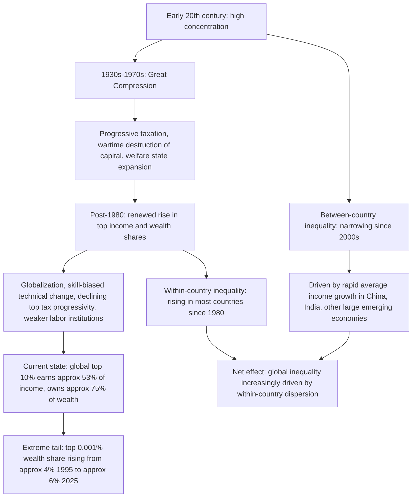

## Trends in Income and Wealth Inequality

### Overview and Conceptual Framework

This item synthesizes the empirical record of how income and wealth inequality have evolved — globally, within major economies, and between countries — over the long run and in recent decades. It draws primarily on the **World Inequality Database (WID)** distributional national accounts (DINA) methodology, which combines tax records, household surveys, and national accounts to correct for the top-end under-coverage that afflicts survey-only estimates (see the measurement-issues discussion under "Lorenz Curve and Gini Coefficient" in this chapter). The trends below should be read as the current empirical consensus as of the most recent major reporting cycle (the **World Inequality Report 2026**, published December 2025), with the understanding that specific point estimates are periodically revised as new data and methodological refinements are incorporated.

### The U-Shaped Long-Run Pattern

**Key Points**

- The dominant stylized fact from long-run WID series is a **U-shaped trajectory** for top income and wealth shares across most high-income countries over the twentieth and early twenty-first centuries: high concentration in the early 1900s, a sharp compression during the mid-century period (roughly the 1930s–1970s, associated with the World Wars, the Great Depression, progressive taxation, and the expansion of the welfare state — termed the "Great Compression" in the U.S. context), followed by a **renewed rise in concentration beginning around 1980** that has continued, with variation in pace and magnitude, through the present
- Income inequality across the world has risen quite rapidly since the 1980s, with the richest 1 percent in the world now accounting for roughly 20 percent of total global income, up from around 16 percent in 1980, while the share of the bottom 50 percent has remained roughly flat around 9 percent since the 1980s — this asymmetry (rising top share, stagnant bottom share, implying the middle absorbed most of the relative loss) is a recurring pattern across the global inequality literature [pressreader](https://www.pressreader.com/india/business-standard/20171221/282316795399156)[pressreader](https://www.pressreader.com/india/business-standard/20171221/282316795399156)
- The post-1980 turn coincides with, and is widely linked in the literature to, a cluster of factors including trade and financial globalization, skill-biased technological change, declining top marginal tax rates and reduced progressivity in many OECD countries, weakening of labor-market institutions (union density, minimum wage erosion in some countries), and the rising capital share of income — the literature does not attribute the trend to a single cause, and the relative weight of each factor remains a subject of ongoing empirical debate [Unverified — the decomposition of causal contributions across these channels varies across studies and is not settled]

### Current Global Income Distribution

**Key Points**

- According to the most recent WID reporting, the global top 10% (approximately 560 million adults) earns around 53% of all global income in a given year, while the bottom half of humanity (2.8 billion people) collectively receives about 8% — meaning the top decile earns more than six times what the bottom half earns in aggregate [USAPP](https://blogs.lse.ac.uk/inequalities/2026/05/12/56000-people-own-three-times-more-wealth-than-half-of-humanity/)
- At the very top, in 2023 the global top 1% of income earners earned 23.7% of total income, the top 10% earned 56.8%, the bottom 50% earned 10.7%, and the middle 40% earned 32.4% [figures vary slightly by report vintage and methodology vintage; treat as approximate] [World Inequality Database](https://wid.world/news-article/inequality-in-2024-a-closer-look-at-six-regions/)
- Within-country patterns vary substantially: the top 10% in different countries earns roughly 33–47% of total income, while the bottom half takes 16–21%, and income distribution across Asia is mixed — countries like Bangladesh and China show a comparatively more balanced structure, whereas India, Thailand, and Türkiye remain top-heavy, with the richest 10% earning more than half of all income [Al Jazeera](https://www.aljazeera.com/news/2025/12/10/where-in-the-world-are-wealth-and-income-most-unequal)[Al Jazeera](https://www.aljazeera.com/news/2025/12/10/where-in-the-world-are-wealth-and-income-most-unequal)
- Sub-Saharan Africa, often characterized primarily as poor rather than unequal, in fact ranks among the world's most unequal regions, with the richest 10% capturing 55% of national income and the top 1% earning 20% — this is driven substantially by extremely unequal countries such as South Africa, where the top 10% holds around 65% of total national income [World Inequality Database](https://wid.world/news-article/inequality-in-2024-a-closer-look-at-six-regions/)[World Inequality Database](https://wid.world/news-article/inequality-in-2024-a-closer-look-at-six-regions/)
- Within the OECD, the United States is the most unequal member country, with 21% of national income going to the top 1% — matching Mexico and exceeding South Africa's 19% [World Inequality Database](https://wid.world/news-article/10-facts-on-global-inequality-in-2024/)

### Current Global Wealth Distribution

Wealth inequality is substantially more extreme than income inequality in virtually every country and at the global level, a pattern consistent with the theoretical expectation that wealth accumulation compounds income differences over time.

**Key Points**

- The global top 10% owns three-quarters of all personal wealth, while the bottom half holds only 2%; the top 1% alone controls 37% of all wealth — roughly eighteen times the wealth share of the bottom half [USAPP](https://blogs.lse.ac.uk/inequalities/2026/05/12/56000-people-own-three-times-more-wealth-than-half-of-humanity/)
- The top 0.001% of the global adult population (approximately 56,000 individuals) owned around 4% of global personal wealth in 1995; by 2025 this had risen to about 6%, while the bottom half's share barely moved, hovering around 2% over the same three decades — this concentration at the extreme tail is described in the report as continuing to accelerate rather than plateau [USAPP](https://blogs.lse.ac.uk/inequalities/2026/05/12/56000-people-own-three-times-more-wealth-than-half-of-humanity/)
- Over 1995–2025, wealth for the bottom half of the world grew at about 3.4% per year after inflation, while wealth growth accelerates sharply moving up the distribution, producing the "wealth growth incidence curve" pattern documented in the World Inequality Report — a graphical device analogous to a growth-incidence curve but applied to wealth rather than income, used to visualize how unevenly wealth gains have been distributed across the global population [USAPP](https://blogs.lse.ac.uk/inequalities/2026/05/12/56000-people-own-three-times-more-wealth-than-half-of-humanity/)
- Even in Europe, the region with the lowest wealth inequality globally, the top 1% still owns 25% of all wealth — more than eight times its proportionate share [USAPP](https://blogs.lse.ac.uk/inequalities/2026/05/12/56000-people-own-three-times-more-wealth-than-half-of-humanity/)
- Country-level estimates place the U.S. top 1% wealth share at around 40.5% of national wealth per OECD statistics, among the highest of any advanced economy, with other sources placing the figure in a similar high-30s-to-40-percent range depending on methodology and data vintage [Unverified — U.S. top-1% wealth share estimates vary by several percentage points depending on whether the source uses SCF survey data, capitalized-income methods, or estate-multiplier methods; treat single-point figures as approximate] [Inequality.org](https://inequality.org/facts/global-inequality/)

**Illustration: Divergence of Income vs. Wealth Concentration (svg_diagram)**

<svg xmlns="http://www.w3.org/2000/svg" viewBox="0 0 720 380">
<text x="360" y="25" font-size="16" font-weight="bold" text-anchor="middle" fill="#1a1a1a">Global Top 10% Share: Income vs. Wealth (svg_diagram)</text>
<line x1="90" y1="320" x2="650" y2="320" stroke="#333" stroke-width="2" />
<line x1="90" y1="60" x2="90" y2="320" stroke="#333" stroke-width="2" />
<text x="40" y="190" font-size="13" text-anchor="middle" fill="#333" transform="rotate(-90 40 190)">Share of Total (%)</text>

<text x="60" y="325" font-size="11" fill="#333">0%</text>

<text x="55" y="195" font-size="11" fill="#333">50%</text>

<text x="55" y="65" font-size="11" fill="#333">100%</text>

<line x1="85" y1="190" x2="650" y2="190" stroke="#ddd" stroke-width="1" stroke-dasharray="4,4" />

<rect x="150" y="182" width="90" height="138" fill="#1e88e5" />
<text x="195" y="345" font-size="12" text-anchor="middle" fill="#333">Income</text>
<text x="195" y="175" font-size="12" text-anchor="middle" fill="#1e88e5">~53%</text>
<rect x="330" y="70" width="90" height="250" fill="#c62828" />
<text x="375" y="345" font-size="12" text-anchor="middle" fill="#333">Wealth</text>
<text x="375" y="62" font-size="12" text-anchor="middle" fill="#c62828">~75%</text>
<rect x="510" y="270" width="90" height="50" fill="#43a047" />
<text x="555" y="345" font-size="12" text-anchor="middle" fill="#333">Bottom 50% (wealth)</text>
<text x="555" y="262" font-size="12" text-anchor="middle" fill="#43a047">~2%</text>

<text x="360" y="55" font-size="11" text-anchor="middle" fill="#666">Top decile's wealth share exceeds its income share; bottom half's wealth share is far below its income share</text>

</svg>

### Country-Level and Regional Heterogeneity

**Key Points**

- Trends are not uniform across countries even within the post-1980 "rising inequality" period. Among the countries where the top 10%'s share of national income rose most between 1980 and 2020 are India, Russia, South Africa, Poland, China, Korea, the United States, Australia, Germany, and Japan — a mix of advanced, transition, and emerging economies, indicating the trend is not confined to any single institutional or development category [pressreader](https://www.pressreader.com/india/business-standard/20171221/282316795399156)
- Some countries show more volatile, non-monotonic patterns rather than a steady post-1980 rise: in New Zealand, inequality peaked in the early 2000s with the top 10% controlling 41% of national income in 2010, before declining to 35% by 2023 — still above 1980s levels of 31%; similarly in Australia, pre-tax inequality has slightly declined since a peak around 2010, with the top 10% earning 33% of national income in the most recent data, down from 35% in 2014, but still far above the 24% share observed in 1979 [World Inequality Database](https://wid.world/news-article/inequality-in-2024-a-closer-look-at-six-regions/)[World Inequality Database](https://wid.world/news-article/inequality-in-2024-a-closer-look-at-six-regions/)
- India's top 1% expanded its wealth by 62% between 2000 and 2023 according to a G20-commissioned report, and separately India's "Billionaire Raj" has been characterized by recent World Inequality Lab research as now exceeding the inequality levels of the British colonial-era "Raj" [note: this characterization reflects the researchers' framing in the cited study rather than a universally agreed historical comparison] [deccanherald](https://www.deccanherald.com/india/indias-top-1-grew-its-wealth-by-62-since-2000-g20-report-3785671)[CoinLaw](https://coinlaw.io/wealth-inequality-statistics/)
- Transition and post-communist economies (Russia, Eastern Europe/Poland) show some of the sharpest rises in top income shares over the 1980–2020 period, consistent with the literature's association of rapid marketization and privatization processes with large, compressed increases in top-end income and wealth concentration [Unverified — the precise magnitude and timing of these increases vary by country and data source]

### Cross-Country (Between-Nation) versus Within-Country Inequality

**Key Points**

- A separate but related empirical question concerns inequality **between** countries (differences in average income/wealth across nations) as opposed to inequality **within** countries (dispersion among individuals inside a given country) — global inequality, in the aggregate, can be decomposed into a within-country component and a between-country component, analogous to the Generalized Entropy decomposition discussed in the companion inequality-indices item
- The literature broadly finds that **between-country inequality has narrowed somewhat** over recent decades, driven substantially by rapid average-income growth in large emerging economies (especially China and, to a lesser extent, India), even as **within-country inequality has risen** in the majority of countries — meaning the "shape" of global inequality has shifted from being dominated primarily by which country one is born in toward increasingly reflecting one's position within a country's own distribution, though between-country gaps remain very large in absolute terms
- Between 1980 and 2023, the real growth rate of per capita national income at the global level was 1.6% per year, with acceleration over time — 1.1% per year over 1980–2000 and 2.2% per year over 2000–2023, a pattern of accelerating average global growth that nonetheless coexists with rising within-country concentration in most economies, illustrating that aggregate growth and inequality trends are analytically and empirically distinct questions [World Inequality Database](https://wid.world/document/global-inequality-update-2024-technical-note/)
- Small, high-income jurisdictions (many with populations under 1 million) have pulled increasingly far ahead of the global average — their average income equaled 337% of the global average in 1970 and rose to 423% by 2023, a pattern the WID researchers link to favorable fiscal/legal environments attracting foreign income and wealth inflows, illustrating a distinct dimension of between-jurisdiction inequality connected to international tax competition (see the chapter's treatment of tax competition and international tax avoidance, if covered separately) [World Inequality Database](https://wid.world/news-article/10-facts-on-global-inequality-in-2024/)

### Growth Incidence and the Distribution of Gains

**Key Points**

- A standard way of characterizing how growth translates into distributional change is the **growth incidence curve**, plotting the growth rate of income (or wealth) at each percentile of the distribution — a flat curve at zero everywhere except for gains concentrated at the top indicates that observed aggregate growth benefited almost exclusively high-percentile individuals
- Longer-run global growth-incidence analysis finds the richest 1% have claimed 54% of total gains from growth, while the richest 5% have claimed 70% — implying the substantial majority of incremental global output over the relevant period accrued to a small upper slice of the distribution, though the specific time window and currency concept (market-exchange-rate vs. PPP) materially affect such figures [Unverified — growth-incidence estimates are sensitive to the base period chosen and to currency-conversion methodology] [Global Inequality](https://globalinequality.org/global-income-inequality/)
- Between 2000 and 2024, the global top 1% captured 41% of all new wealth created, while the bottom half of humanity received just 1% of new wealth created over the same period, according to a G20-commissioned Stiglitz-led inequality report — a figure broadly consistent with, though sourced separately from, the WID wealth-growth-incidence findings above [deccanherald](https://www.deccanherald.com/india/indias-top-1-grew-its-wealth-by-62-since-2000-g20-report-3785671)

### Interpreting Trends: Measurement Caveats

**Key Points**

- As with any inequality trend analysis, the **choice of income/wealth concept** (pre-tax vs. post-tax-and-transfer, national income vs. GDP-based measures, market-exchange-rate vs. PPP currency conversion) materially affects both levels and trend direction in specific cases — cross-report comparisons should verify that the same concept is being used before drawing conclusions about convergence or divergence
- The DINA/WID methodology's central innovation — combining tax records with survey and national-accounts data specifically to correct top-end under-coverage — means that **WID estimates of top shares are generally higher, and rising trends more pronounced, than equivalent estimates derived from household survey data alone**; this is a methodological feature, not a data error, reflecting the well-documented tendency of household surveys to under-sample and under-report top incomes and wealth (see the measurement-issues discussion under "Lorenz Curve and Gini Coefficient")
- **Billionaire wealth counts** (Forbes-style rich lists, UBS Billionaire Ambitions Reports) are a complementary but distinct data source from the WID/DINA framework — the U.S. saw the largest expansion of its billionaire class in 2025 of any country, with the number of American billionaires rising from 835 in 2024 to 924 in 2025, and the U.S. now home to nearly a third (31.7%) of the global billionaire population according to UBS's count — such counts are useful for tracking extreme-tail dynamics in near-real time but are not a substitute for population-representative distributional statistics when assessing broader inequality trends [Inequality.org](https://inequality.org/facts/global-inequality/)
- Given the pace of new WID/World Inequality Report releases and periodic PPP/methodology rebasing (as flagged under "Poverty Measurement and Poverty Lines" in this chapter regarding international poverty-line revisions), **specific point estimates cited in this item should be treated as reflecting the most recent available reporting cycle** and re-verified against current WID/World Inequality Report releases for any application requiring precise, up-to-date figures

### Summary Trend Diagram

**Related Topics**

- Lorenz Curve and Gini Coefficient (this chapter)
- Alternative Inequality Indices (this chapter)
- Poverty Measurement and Poverty Lines (this chapter)
- The Elasticity of Taxable Income, Top Marginal Tax Rates, and Top Income Concentration
- Wealth Taxation and the Global Minimum Tax Debate
- Distributional National Accounts (DINA) Methodology and Data Sources
- International Tax Competition and Offshore Wealth
- Capital Share of Income and the Labor-Capital Split in Growth Accounting