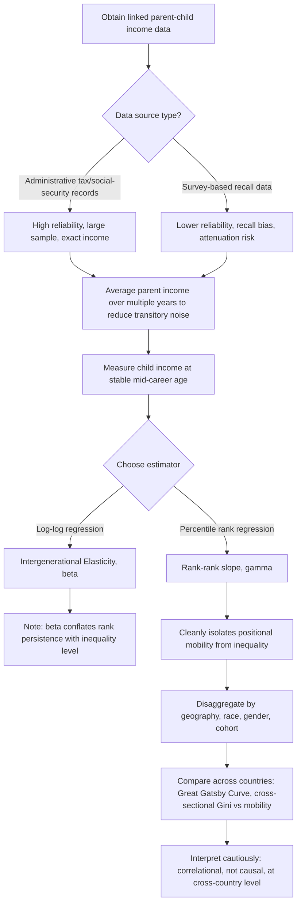

## Intergenerational Mobility

### Overview and Conceptual Framework

Intergenerational mobility measures the extent to which economic outcomes (income, earnings, education, occupational status, wealth) are transmitted from parents to children, as distinct from inequality measurement, which characterizes dispersion **within** a single generation at a point in time. Public economics treats mobility as a complementary lens to inequality: two societies with identical cross-sectional Gini coefficients can differ enormously in the degree to which an individual's economic position is determined by their parents' position rather than by their own effort or talent, and this distinction carries separate normative and policy weight — a "snapshot" of inequality does not reveal whether that inequality reflects a rigid, persistent hierarchy or a fluid one in which relative positions change substantially across generations.

### Absolute versus Relative Mobility

**Key Points**

- **Absolute mobility** measures whether children achieve a higher standard of living (in real, inflation-adjusted terms) than their parents did at a comparable age — typically operationalized as the share of children who earn more than their parents did, holding the measurement age fixed. This concept is tied to overall economic growth: even with zero relative mobility (perfectly rank-preserving transmission), absolute mobility can be high if aggregate growth is strong and broadly shared, since every child's fixed rank still corresponds to a higher real income than their parent's same rank
- **Relative mobility** measures how a child's *rank* or *relative position* in the income distribution compares to their parents' rank — this is the concept typically intended when economists and policymakers discuss "equality of opportunity" or the degree to which economic outcomes are transmitted across generations independent of overall growth
- The distinction matters substantially for policy interpretation: rising inequality (a widening of the distribution) can mechanically reduce absolute mobility even if relative (rank-based) mobility is unchanged, because a larger gap between percentiles means a child needs to climb further in absolute dollar terms to surpass a parent occupying a fixed relative rank — this interaction between the *level of inequality* and the *rate of mobility* is a central theoretical link between the two literatures, distinct from mobility being simply "the opposite of inequality"

### The Intergenerational Elasticity (IGE) Framework

The canonical measure of relative mobility, historically dominant in the labor and public economics literature, is the **Intergenerational Elasticity of Income (IGE)**, estimated via a log-log regression:

$$\ln(y_{child}) = \alpha + \beta \ln(y_{parent}) + \varepsilon$$

where $\beta$, the IGE, measures the percentage change in expected child income associated with a 1% change in parent income.

**Key Points**

- **$\beta = 0$** corresponds to complete mobility (child income entirely independent of parent income); **$\beta = 1$** corresponds to complete immobility (child income fully determined, in relative percentage terms, by parent income) — the IGE is bounded conceptually between these extremes, though estimated values in practice range roughly from 0.2 (high-mobility countries) to above 0.5 (low-mobility countries)
- A companion statistic, **$1-\beta$**, is sometimes reported directly as a "mobility" measure, and $R^2$ from the same regression (rather than $\beta$ itself) captures how much of the *variance* in child income is explained by parent income, a related but conceptually distinct quantity from the elasticity itself (the IGE captures the average relationship's slope; $R^2$ captures its explanatory power, and the two can diverge if parent-child income covariance is driven by a subset of the distribution)
- **Attenuation bias from transitory income**: using a single year of observed parent income (rather than a longer-run average, or "permanent income") biases the estimated IGE toward zero (understating true persistence), because a single year's income includes transitory noise uncorrelated with the child's outcome — this is a well-established econometric caveat, and modern studies address it by averaging parent income over multiple years (typically 5+ years) to approximate permanent income more accurately
- **Life-cycle bias**: measuring child income too early in their career (before earnings have stabilized) similarly biases estimated persistence, since early-career earnings are more compressed across the ability/education distribution than mid-career earnings — best practice in the literature is to measure both parent and child income around mid-career (typically ages 35–45) when feasible

### The Intergenerational Rank-Rank Correlation

More recent work, particularly associated with **Chetty, Hendren, Kline, and Saez** and the broader "Opportunity Insights" research program using U.S. administrative tax data, favors a **rank-based** approach over the log-log IGE:

$$\text{Rank}_{child} = \alpha + \gamma \cdot \text{Rank}_{parent} + \varepsilon$$

where both variables are converted to percentile ranks within their respective generation's distribution before estimating a linear regression, yielding the **rank-rank slope** $\gamma$.

**Key Points**

- The rank-rank approach has several advantages over the log-log IGE: it is **well-defined even with zero or negative incomes** (which break the log transformation), it is **robust to the specific functional form of income growth** across the distribution, and — critically — it **cleanly separates the mobility (rank-persistence) question from the inequality (dispersion) question**, since the rank-rank slope captures purely relative positional persistence without being mechanically affected by how compressed or spread out the underlying income distribution is
- This separation directly enables the **decomposition** of the IGE into a rank-persistence component and an inequality component: the log-log IGE $\beta$ can be approximately expressed as the rank-rank slope multiplied by a term reflecting relative income dispersion in the two generations, meaning **changes in the IGE over time or across countries can reflect changing inequality even absent any change in true positional mobility** — a widely cited methodological insight for interpreting cross-country IGE comparisons cautiously
- U.S. administrative-data-based estimates typically find rank-rank slopes in the range of roughly 0.3–0.4 at the national level, though with substantial heterogeneity across regions, a central finding of the "Opportunity Atlas" style research documenting that mobility is not a single national parameter but varies enormously by commuting zone, neighborhood, and other geographic units [Unverified — precise national rank-rank slope estimates vary somewhat by dataset, cohort, and measurement-age choices across studies]

**Illustration: Rank-Rank Mobility Relationship (svg_diagram)**

<svg xmlns="http://www.w3.org/2000/svg" viewBox="0 0 500 480">
<text x="250" y="25" font-size="16" font-weight="bold" text-anchor="middle" fill="#1a1a1a">Rank-Rank Mobility (svg_diagram)</text>
<line x1="70" y1="420" x2="450" y2="420" stroke="#333" stroke-width="2" />
<line x1="70" y1="420" x2="70" y2="60" stroke="#333" stroke-width="2" />
<text x="260" y="455" font-size="13" text-anchor="middle" fill="#333">Parent Income Rank (percentile)</text>
<text x="35" y="240" font-size="13" text-anchor="middle" fill="#333" transform="rotate(-90 35 240)">Child Income Rank (percentile)</text>
<line x1="70" y1="380" x2="450" y2="130" stroke="#c62828" stroke-width="3" />
<text x="300" y="180" font-size="12" fill="#c62828">Steep slope: low mobility country</text>
<line x1="70" y1="270" x2="450" y2="220" stroke="#1e88e5" stroke-width="3" />
<text x="280" y="300" font-size="12" fill="#1e88e5">Flat slope: high mobility country</text>
<line x1="70" y1="240" x2="450" y2="240" stroke="#666" stroke-width="1.5" stroke-dasharray="4,4" />
<text x="380" y="255" font-size="11" fill="#666">Zero slope: complete mobility</text>
</svg>

### The Great Gatsby Curve

A widely cited cross-country empirical pattern, popularized by Alan Krueger and named the **"Great Gatsby Curve,"** plots the cross-sectional Gini coefficient (inequality) on the horizontal axis against the IGE or a comparable mobility-persistence measure on the vertical axis across countries.

**Key Points**

- The curve shows a **positive relationship**: countries with higher cross-sectional inequality tend also to exhibit lower intergenerational mobility (higher IGE/rank persistence) — countries such as Denmark, Norway, and Finland typically appear in the low-inequality/high-mobility region, while the United States, United Kingdom, and several Latin American countries typically appear in the high-inequality/low-mobility region
- The standard theoretical rationale offered for this relationship centers on **differential parental investment in children**: in more unequal societies, the return to parental investment in children's human capital (education, health, networks, neighborhood quality) is larger in absolute terms, and credit constraints prevent lower-income parents from investing optimally, so higher inequality both raises the incentive for advantaged parents to invest heavily and widens the resulting gap in outcomes, translating cross-sectional inequality into a wider spread in inherited opportunity
- The Great Gatsby Curve is a **cross-sectional, correlational pattern across countries at a point in time**, not a demonstrated causal or within-country dynamic relationship — a country's own increase in inequality does not mechanically imply its own mobility will fall by a predictable amount, and the curve's interpretation has been debated in the literature, including concerns about the small number of country observations underlying it and the sensitivity of country rankings to the specific inequality and mobility measures chosen [Unverified — the causal mechanism linking cross-sectional inequality to reduced mobility is theoretically plausible and supported by some within-country and neighborhood-level evidence, but the aggregate cross-country curve itself does not establish causality]

### Geographic and Neighborhood-Level Mobility Research

**Key Points**

- Using linked administrative tax records covering nearly the full U.S. population, Chetty and coauthors documented substantial **geographic variation in mobility** within a single country: children raised in some U.S. commuting zones and neighborhoods experience dramatically higher rates of upward mobility than children raised in others, even after accounting for differences in parental income — this variation is larger, in some specifications, than the variation in mobility measured across entire countries, indicating that "place" operates as an important unit of analysis distinct from national-level policy or institutions
- Areas associated with **higher upward mobility** in this research tend to share several correlated characteristics: less residential segregation by income and race, lower income inequality within the area itself, better-performing local schools, greater social capital/civic engagement, and greater family stability — these are documented **correlations** from the Opportunity Insights research program rather than a fully established causal ranking of policy levers, and the researchers themselves emphasize that isolating which specific factors are causally responsible for a given area's mobility ranking requires additional identification strategies
- The **"Moving to Opportunity" (MTO)** randomized housing-voucher experiment, and subsequent long-run follow-up work by Chetty, Hendren, and Katz, provided some of the strongest **causal** (rather than merely correlational) evidence in this literature: children who moved to lower-poverty neighborhoods at younger ages experienced improved long-run adult outcomes (higher college attendance, higher earnings), while those who moved as older adolescents did not show the same benefit — establishing that neighborhood effects on mobility appear to operate through a childhood-exposure mechanism with effects concentrated in early exposure years, a finding with direct relevance to the design of place-based and housing-mobility policy

### Multigenerational Persistence and the Limits of the Two-Generation Model

**Key Points**

- Traditional IGE and rank-rank estimates use only a two-generation (parent-child) link, but the broader mobility literature has increasingly examined **multigenerational persistence** (grandparent-to-grandchild, and longer lineages) using historical surname-based and administrative-linkage methods (notably associated with Gregory Clark's surname-based studies)
- A recurring finding in this multigenerational literature is that persistence of status appears to **decay more slowly across generations than the standard two-generation IGE would predict** under a simple first-order Markov (parent-only-matters) model — this suggests that a more complete model of intergenerational transmission may require an underlying, more slowly decaying "latent" status factor (encompassing wealth, social connections, and cultural/human capital broadly) that two-generation income-only IGE estimates do not fully capture, implying standard two-generation mobility estimates may understate the true long-run persistence of advantage and disadvantage across family lines [Unverified — the appropriate model of multigenerational transmission and the degree to which two-generation estimates understate long-run persistence remain actively debated methodological questions]

### Mobility Across Other Outcome Dimensions

**Key Points**

- While income/earnings is the most commonly studied outcome, the mobility framework extends naturally to **educational attainment** (intergenerational correlation in years of schooling or degree completion), **occupational status** (using standardized occupational prestige or socioeconomic-status scales, important in contexts or historical periods where reliable income data is unavailable), and **wealth** (intergenerational wealth elasticities, which are generally estimated to be higher than income elasticities in the countries where comparable data exists, consistent with wealth's role as a more directly inherited and more persistently unequal outcome, as documented in the trends discussion in this chapter)
- **Mobility by race, gender, and other subgroups** is an active area of the recent literature: notably, Chetty and coauthors' work on **intergenerational mobility by race** in the U.S. found that Black Americans experience substantially lower rates of upward mobility than white Americans conditional on parental income, with the gap concentrated particularly among sons rather than daughters — a finding that has directly shaped subsequent research and policy discussion on racial economic gaps as distinct from (though related to) the income-based mobility literature
- **International mobility comparisons** are complicated by differences in available data sources (linked administrative tax/social-security records, as increasingly used in Scandinavian countries and the U.S., versus retrospective survey-based recall data used in countries lacking such linked administrative infrastructure) — administrative-data-based estimates are generally considered more reliable, and cross-country mobility rankings should be interpreted cautiously when comparing countries using different underlying data sources and methodologies

### Policy Relevance in Public Economics

**Key Points**

- Intergenerational mobility connects directly to the **equity rationale for public investment in education, health, and early-childhood programs**: if credit constraints prevent lower-income families from making optimal investments in children (the standard theoretical channel underlying the Great Gatsby Curve), public provision or subsidization of these investments can be justified on both equity and (if underinvestment is inefficient even from a private return perspective) efficiency grounds — this is a distinct rationale from the pure redistribution rationale emphasized in standard optimal-taxation analysis, since it targets the *process* generating future inequality rather than redistributing a given period's realized income
- Mobility measurement provides a complementary criterion for evaluating tax-and-transfer policy beyond static inequality reduction: a policy that reduces measured cross-sectional inequality in a given year without improving (or while worsening) intergenerational mobility achieves a different, and arguably less complete, form of "equality of opportunity" than a policy that simultaneously reduces current inequality and strengthens mobility — this distinction has motivated increased attention to childhood-focused interventions (early education, health access, neighborhood/housing policy) as complements to traditional tax-and-transfer redistribution in the applied public economics literature
- The estate/inheritance taxation literature (often covered separately in optimal-taxation chapters) draws directly on mobility findings: the empirical link between wealth transmission and persistent multigenerational advantage documented above is a standard efficiency-and-equity justification offered for taxing intergenerational wealth transfers, distinct from arguments based on annual income-flow redistribution alone

### Measurement Workflow

**Related Topics**

- Lorenz Curve and Gini Coefficient (this chapter)
- Trends in Income and Wealth Inequality (this chapter)
- Estate and Inheritance Taxation
- Early Childhood Investment and Human Capital Policy
- The Great Gatsby Curve: Cross-Country Evidence and Critiques
- Moving to Opportunity and Neighborhood Effects on Economic Outcomes
- Equality of Opportunity as a Normative Criterion in Public Economics
- Credit Constraints and Underinvestment in Children's Human Capital